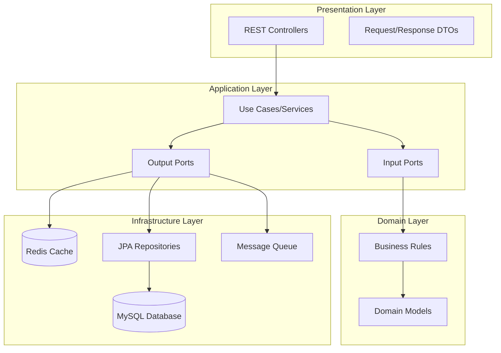
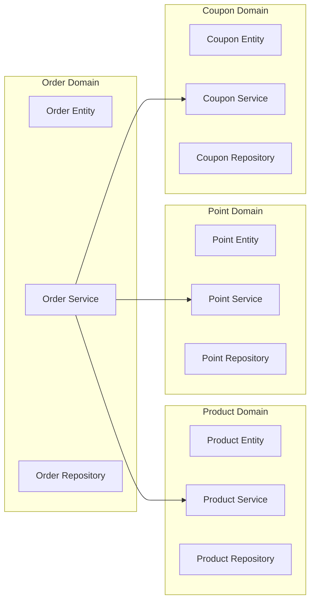

# E-commerce Application

**대용량 트래픽을 고려한 이커머스 플랫폼**

실제 서비스 환경에서 발생할 수 있는 동시성 이슈와 대용량 트래픽을 고려하여 설계된 Spring Boot 기반 이커머스 애플리케이션입니다.

## 핵심 해결 과제

**동시성 제어**  
재고 감소, 포인트 차감, 쿠폰 발급 시 발생하는 race condition 해결

**대용량 트래픽**  
분산 락과 캐싱을 통한 성능 최적화

**데이터 일관성**  
트랜잭션 처리와 격리 수준을 통한 데이터 무결성 보장

**확장 가능한 아키텍처**  
Clean Architecture로 유지보수성과 확장성 확보

## 주요 기능

**상품 관리**  
상품 조회, 재고 관리 → 분산 락으로 재고 감소 처리

**주문 처리**  
주문 생성, 결제 처리 → 트랜잭션 격리로 데이터 일관성

**포인트 시스템**  
충전/사용, 잔액 검증 → 분산 락으로 동시 차감 방지

**쿠폰 발급**  
선착순 쿠폰 발급 → Redis 기반 원자적 처리

## 빠른 시작

### 실행 방법

```bash
# 1. 인프라 구성 (MySQL, Redis)
docker-compose up -d

# 2. 애플리케이션 실행
./gradlew bootRun

# 3. 테스트 실행
./gradlew test
```

### 접속 정보

- 애플리케이션: http://localhost:8080
- API 문서: http://localhost:8080/swagger-ui.html
- 데이터베이스: MySQL (localhost:3306/hhplus)
- 캐시: Redis (localhost:6379)

## 기술 스택

| 구분 | 기술 |
|------|------|
| Framework | Spring Boot 3.4.1, Java 17 |
| Database | MySQL 8.0, Redis 7.4.4 |
| Build | Gradle (Kotlin DSL) |
| ORM | Spring Data JPA, Hibernate |
| Testing | JUnit 5, TestContainers, Mockito |
| Message Queue | Apache Kafka |
| Monitoring | Prometheus, Micrometer |
| API Docs | SpringDoc OpenAPI |

## API 엔드포인트

### 상품 관리
```
GET    /api/products        # 상품 목록 조회
GET    /api/products/{id}   # 상품 상세 조회
POST   /api/products        # 상품 등록
```

### 주문 처리
```
POST   /api/orders          # 주문 생성
POST   /api/orders/pay      # 주문 결제
POST   /api/orders/order-and-pay  # 주문생성+결제
GET    /api/orders/history  # 주문 내역 조회
```

### 포인트 관리
```
POST   /api/points/charge   # 포인트 충전
```

### 쿠폰 관리
```
POST   /api/coupons/issue   # 쿠폰 발급
```

---

## 시스템 아키텍처

### Clean Architecture 구조



### 도메인 구조


## 기술 스택

| 구분 | 기술 |
|------|------|
| **Framework** | Spring Boot 3.4.1, Java 17 |
| **Database** | MySQL 8.0 (Primary), Redis 7.4.4 (Cache/Lock) |
| **Build** | Gradle (Kotlin DSL) |
| **ORM** | Spring Data JPA, Hibernate |
| **Testing** | JUnit 5, TestContainers, Mockito |
| **Message Queue** | Apache Kafka |
| **Monitoring** | Prometheus, Micrometer |
| **API Docs** | SpringDoc OpenAPI |

## 핵심 동시성 제어 기술

### 분산 락 (Distributed Lock)
- **Redisson 기반**: `@DistributedLock` 어노테이션으로 간편한 사용
- **적용 영역**: 재고 감소, 포인트 차감, 쿠폰 발급
- **안전성**: Race condition 방지로 데이터 무결성 보장

### 트랜잭션 격리
- **JPA 트랜잭션**: 데이터 일관성 보장
- **격리 수준 제어**: READ_COMMITTED로 성능과 안전성 균형
- **낙관적 락**: 재고 업데이트 시 버전 관리로 동시성 제어

---

## 기술적 세부 사항

### Clean Architecture 구조
- **Domain**: 핵심 비즈니스 로직과 엔티티
- **Application**: 유스케이스 구현과 포트 정의  
- **Adapter**: 외부 인프라와의 연결 지점
- **Infrastructure**: 데이터베이스, 캐시, 메시지 큐 구현

## 개발 환경 설정

### 필수 요구사항
- Java 17
- Docker & Docker Compose

### 실행 방법

1. **인프라 구성 실행**
```bash
docker-compose up -d
```

2. **애플리케이션 실행**
```bash
./gradlew bootRun
```

3. **테스트 실행**
```bash
# 전체 테스트
./gradlew test

# 도메인별 테스트
./gradlew test --tests "ecommerce.product.*"
./gradlew test --tests "ecommerce.order.*"
```

### 데이터베이스 설정
- **MySQL**: localhost:3306/hhplus
- **Redis**: localhost:6379
- **개발환경**: DDL 자동 업데이트 활성화

## API 엔드포인트

**상품 관리**
- `GET /api/products` - 상품 목록 조회
- `GET /api/products/{id}` - 상품 상세 조회  
- `POST /api/products` - 상품 등록

**주문 처리**
- `POST /api/orders` - 주문 생성
- `POST /api/orders/pay` - 주문 결제
- `POST /api/orders/order-and-pay` - 주문생성+결제
- `GET /api/orders/history` - 주문 내역 조회

**포인트 관리**
- `POST /api/points/charge` - 포인트 충전

**쿠폰 관리**  
- `POST /api/coupons/issue` - 쿠폰 발급

## 핵심 설계 원칙

### 장점
1. **유지보수성**: 도메인별 독립적 구조로 변경 영향 최소화
2. **테스트 용이성**: 의존성 역전을 통한 단위 테스트 최적화
3. **이식성**: 도메인 로직의 인프라 독립성
4. **확장성**: MSA 전환 시 도메인별 분리 용이
5. **유연성**: 인프라 변경 시 도메인 로직 보존

### 트레이드오프
1. **복잡성**: 레이어드 아키텍처 대비 파일 수 증가
2. **학습곡선**: 포트/어댑터 패턴 이해 필요
3. **오버헤드**: 단순 CRUD 작업에도 인터페이스 계층 필요

## 모니터링 및 운영

### 메트릭스
- **Actuator**: `/actuator/health`, `/actuator/metrics`
- **Prometheus**: `/actuator/prometheus`
- **응답시간 분포**: P50, P90, P95, P99

### 로깅
- **구조화 로깅**: JSON 형태 로그 출력
- **분산 락 추적**: 락 획득/해제 상세 로그
- **SQL 로깅**: 개발환경에서 SQL 쿼리 출력

## 성능 최적화

### 동시성 처리
- 분산 락을 통한 임계 섹션 보호
- 트랜잭션 범위 최소화
- 읽기 전용 트랜잭션 분리

### 캐싱 전략
- Redis 기반 분산 캐시
- 쿠폰 발급 시 선착순 처리 최적화

### 데이터베이스 최적화
- HikariCP 커넥션 풀 설정
- 인덱스 기반 쿼리 최적화

---

## 성과 및 특징

### 성능 최적화
- **동시성 처리**: 분산 락으로 임계 섹션 보호
- **캐싱 전략**: Redis 기반 분산 캐시로 응답 속도 향상  
- **트랜잭션 최적화**: 범위 최소화 및 읽기 전용 트랜잭션 분리

### 비즈니스 가치
- **실제 서비스 요구사항**: 대용량 트래픽과 동시성 이슈 해결
- **확장 가능성**: MSA 전환 시 도메인별 분리 용이
- **유지보수성**: Clean Architecture로 변경 영향 최소화

### 개발 품질
- **테스트 전략**: 단위/통합/동시성 테스트 체계 구축
- **모니터링**: Prometheus 메트릭과 구조화된 로깅
- **문서화**: 포괄적인 API 문서와 아키텍처 가이드

이 프로젝트는 대용량 트래픽과 동시성 처리가 중요한 실제 이커머스 환경의 요구사항을 반영하여 설계되었으며, Clean Architecture를 통해 유지보수가 용이하고 확장 가능한 구조를 제공합니다.