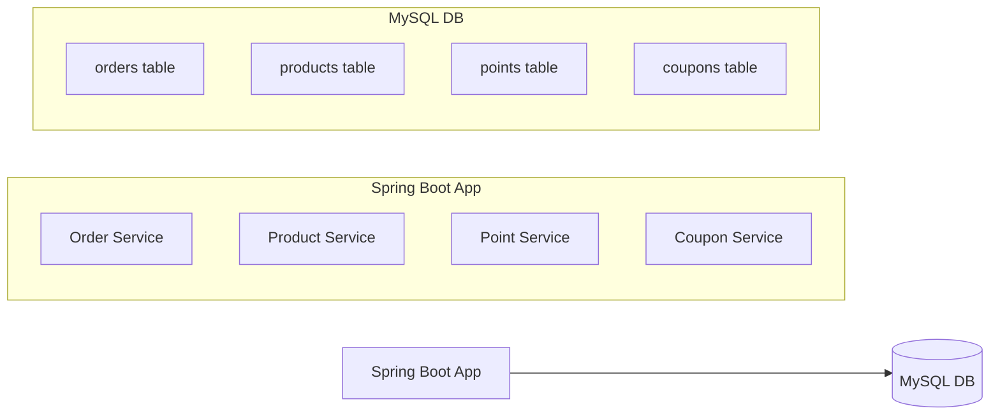
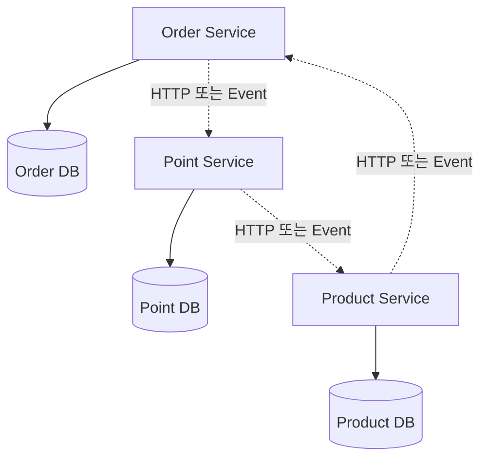
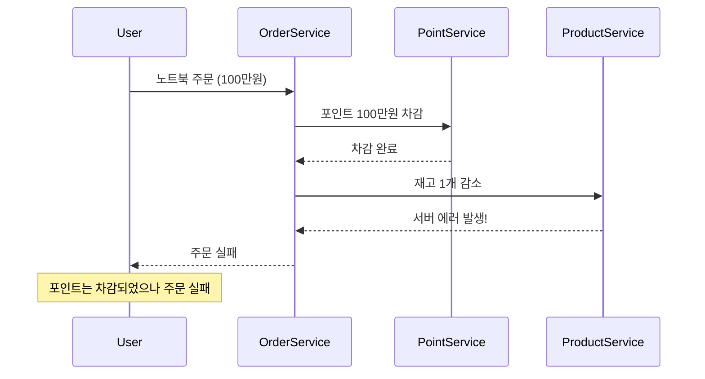
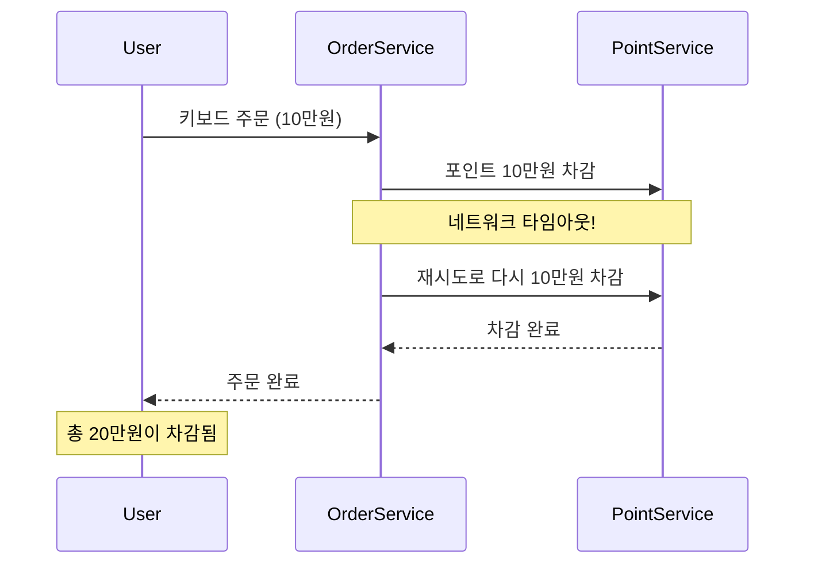
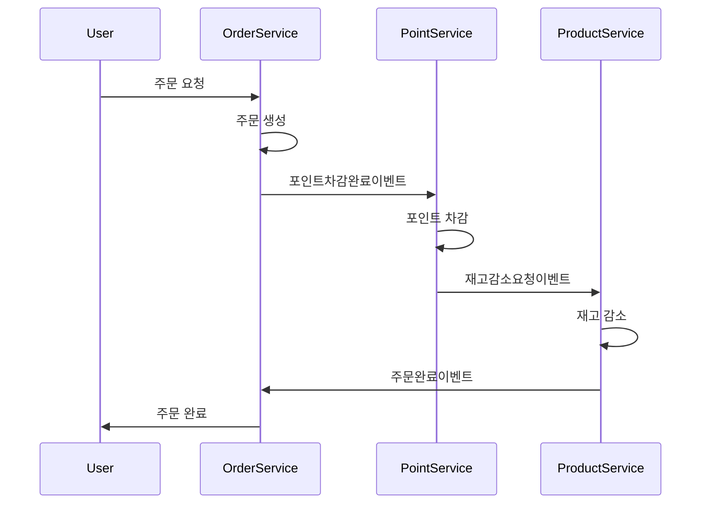
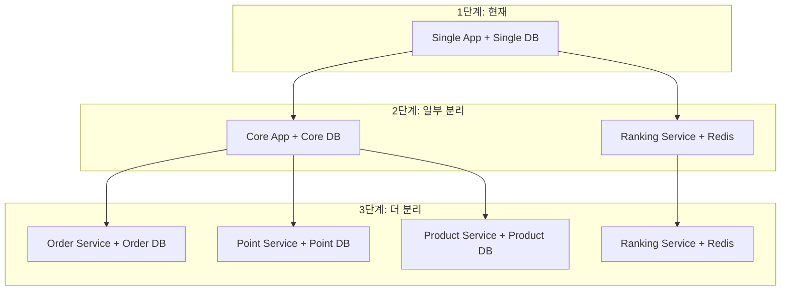

# STEP 16 - Transaction Diagnosis 보고서

## 개요

현재 HangHae Plus E-commerce 프로젝트를 MSA 구조로 확장할 때 발생할 수 있는 트랜잭션 처리 한계와 대응 방안에 대해 분석해보았습니다. 

이번 과제를 통해 도메인별로 트랜잭션을 분리했을 때 어떤 문제가 생기는지 파악하고, 데이터 일관성을 보장할 수 있는 분산 트랜잭션 설계 방안을 정리했습니다.

## 현재 서비스 구조 분석

### 1. 현재 아키텍처

지금 프로젝트는 단일 애플리케이션에서 단일 MySQL DB를 사용하는 구조입니다.



### 2. 주문 프로세스 트랜잭션 분석

현재 주문 처리 과정은 다음과 같습니다:

```java
// PlaceOrderService.placeOrder() - 주문 생성
// PayOrderService.payOrder() - 결제 처리
```

`PayOrderService`의 실제 구현을 보면:

```java
@Transactional
public void payOrder(Long orderId, Long userId) {
    // 1. 주문 조회 - Order Domain
    Order order = loadOrderPort.loadOrder(orderId);
    
    // 2. 포인트 차감 - Point Domain  
    Point point = loadPointPort.loadPoint(userId);
    savePointPort.savePoint(point.use(order.getPrice()), userId);
    
    // 3. 상품 재고 감소 - Product Domain
    Product product = loadProductPort.loadProduct(order.getProductId());
    saveProductPort.saveProduct(product.decreaseStock(order.getQuantity()));
    
    // 4. 주문 상태 변경 - Order Domain
    Order paidOrder = order.pay();
    saveOrderPort.saveOrder(paidOrder);
    
    // 5. 상품 랭킹 증가 - Product Domain (이벤트로 분리됨)
    productRankingUseCase.increaseRanking(order.getProductId());
}
```

여기서 문제점을 발견할 수 있습니다. 하나의 트랜잭션이 Order, Point, Product 세 개 도메인에 걸쳐서 실행되고 있습니다. 어느 하나라도 실패하면 전체가 롤백되는 구조입니다.

## MSA 전환 시 발생할 수 있는 문제들

### 1. 분산 트랜잭션 문제

MSA로 분리하면 다음과 같은 구조가 됩니다:



이렇게 분리하면 여러 문제가 발생합니다.

#### 부분 실패 문제

다음과 같은 상황이 발생할 수 있습니다:

```java
// Order Service에서
public void processPayment(OrderPayRequest request) {
    // 1. 포인트 서비스에 차감 요청 -> 성공!
    pointServiceClient.deductPoints(request.getUserId(), request.getAmount());
    
    // 2. 상품 서비스에 재고 감소 요청 -> 실패!
    try {
        productServiceClient.decreaseStock(request.getProductId(), request.getQuantity());
    } catch (Exception e) {
        // 포인트는 이미 차감되었는데 재고 감소가 실패
        log.error("재고 감소 실패, 포인트 차감은 완료됨", e);
    }
}
```

#### 네트워크 불안정성 문제

```java
// 네트워크 타임아웃 발생 시나리오
try {
    pointServiceClient.deductPoints(userId, amount);
    
    // 네트워크 타임아웃 발생
    // 실제로는 포인트 차감이 성공했을 수 있음
} catch (TimeoutException e) {
    // 재시도하면 중복 차감 위험
    // 재시도하지 않으면 데이터 불일치
}
```

### 2. 구체적인 실패 시나리오

#### 시나리오 1: 부분 실패 케이스

사용자가 100만원 노트북을 주문하는 상황입니다.



#### 시나리오 2: 네트워크 타임아웃으로 인한 중복 처리

네트워크가 불안정한 상황에서의 주문 처리입니다.



## 해결 방안

### 1. SAGA 패턴 적용

SAGA 패턴은 분산 트랜잭션을 처리하는 대표적인 방법입니다. 두 가지 방식이 있습니다.

#### Choreography 방식 (이벤트 기반)

각 서비스가 이벤트를 주고받으며 독립적으로 처리하는 방식입니다:



이 방식의 장점은 각 서비스의 독립성이고, 단점은 전체 플로우 추적의 어려움입니다.

#### Orchestration 방식 (중앙 조정)

중앙의 Orchestrator가 전체 플로우를 관리하는 방식입니다:

```java
@Service
public class OrderSagaOrchestrator {
    
    public void processOrder(OrderRequest request) {
        try {
            // 1단계: 포인트 차감
            pointService.deductPoints(request.getUserId(), request.getAmount());
            
            // 2단계: 재고 감소  
            productService.decreaseStock(request.getProductId(), request.getQuantity());
            
            // 3단계: 주문 완료
            orderService.confirmOrder(request.getOrderId());
            
        } catch (Exception e) {
            // 실패하면 보상 트랜잭션 실행
            compensate(request, getCurrentStep());
        }
    }
}
```

### 2. 보상 트랜잭션 구현

실패 시 이전에 수행된 작업들을 되돌리는 보상 트랜잭션이 필요합니다:

```java
private void compensate(OrderRequest request, int failedStep) {
    log.info("보상 트랜잭션 시작: failedStep={}", failedStep);
    
    try {
        // 역순으로 되돌리기
        if (failedStep >= 3) {
            // 주문 상태를 다시 대기로 변경
            orderService.cancelOrder(request.getOrderId());
        }
        
        if (failedStep >= 2) {
            // 재고를 다시 늘려주기
            productService.increaseStock(request.getProductId(), request.getQuantity()); 
        }
        
        if (failedStep >= 1) {
            // 포인트를 다시 돌려주기
            pointService.refundPoints(request.getUserId(), request.getAmount());
        }
        
        log.info("보상 트랜잭션 완료");
        
    } catch (Exception e) {
        // 보상 트랜잭션 실패 시 수동 처리 필요
        log.error("보상 트랜잭션 실패, 수동 처리 필요", e);
        alertService.sendAlert("보상 트랜잭션 실패 - 주문ID: " + request.getOrderId());
    }
}
```

보상 트랜잭션 자체도 실패할 수 있기 때문에, 최종적으로는 수동 처리나 Dead Letter Queue를 통한 재처리 메커니즘이 필요합니다.

### 3. 기존 이벤트 구조 확장 활용

STEP 15에서 구현한 이벤트 기반 구조를 MSA 환경에서 확장할 수 있습니다:

```java
// 현재 구현된 이벤트 리스너
@TransactionalEventListener(phase = TransactionPhase.AFTER_COMMIT)
public void handleOrderCompleted(OrderCompletedEvent event) {
    sendOrderToDataPlatform(event);
}

// MSA 환경에서 확장 가능한 구조
@TransactionalEventListener(phase = TransactionPhase.AFTER_COMMIT) 
public void handleOrderCompletedForRanking(OrderCompletedEvent event) {
    productRankingService.increaseRanking(event.productId());
}

@TransactionalEventListener(phase = TransactionPhase.AFTER_COMMIT)
public void handleOrderCompletedForNotification(OrderCompletedEvent event) {
    notificationService.sendOrderCompleteMessage(event.userId());
}
```

### 4. 실무 적용 전략

#### 점진적 분리 전략

실제 MSA 전환 시에는 단계적으로 분리하는 것이 안전합니다:



#### 데이터 일관성 수준 정의

모든 데이터가 Strong Consistency를 요구하지는 않습니다:

```java
// Strong Consistency 필요 (즉시 정확성 보장)
- 포인트 잔액 (잘못된 경우 심각한 비즈니스 영향)
- 상품 재고 (재고 부족 시 과도한 주문 발생)
- 주문 상태 (사용자 경험에 직접 영향)

// Eventually Consistent 허용 가능 (지연된 일관성 허용)  
- 상품 랭킹 (실시간성이 중요하지 않음)
- 외부 데이터 플랫폼 전송 (재시도 메커니즘으로 보장)
- 통계 및 분석 데이터 (배치 처리로도 충분)
```

## 결론

MSA 전환 시 트랜잭션 처리의 핵심 문제점과 해결방안을 정리했습니다.

### 핵심 문제점

가장 큰 도전과제는 **분산 트랜잭션 관리**입니다. 단일 DB에서 간단했던 트랜잭션이 여러 서비스로 분리되면서 복잡성이 증가합니다.

### 단기 대응 방안

1. STEP 15에서 구현한 이벤트 기반 구조를 확장하여 활용
2. 실패 시나리오별 대응 방안 및 보상 트랜잭션 로직 구현
3. 모니터링 및 알람 시스템을 통한 장애 상황 조기 감지

### 장기 대응 방안

1. SAGA 패턴을 통한 분산 트랜잭션 관리 체계 구축
2. 이벤트 스토어 또는 메시지 큐를 활용한 이벤트 관리 개선
3. 분산 트레이싱 시스템 도입을 통한 전체 플로우 가시성 확보

## 참고 자료

- [토스 SLASH 24 - 보상 트랜잭션으로 분산 환경에서도 안전하게 환전하기](https://www.youtube.com/watch?v=xpwRTu47fqY)
- MSA 패턴 및 분산 시스템 설계 관련 문서
- Transactional Outbox Pattern 구현 가이드

---
