# 이커머스 ERD

## 목표
1. 변경에 유연한 ERD 작성하기 (고수준으로 작성)
2. 처음부터 너무 엔티티간의 관계를 깊게 정의하지않기 (관계및 인덱스고려 X)
3. 보기쉬운 ERD 작성하기!

## ERD (Entity-Relationship Diagram)

```mermaid
erDiagram
    
    PRODUCT {
        Bigint ID PK
        VARCHAR PRODUCT_NAME
        BIGDECIMAL AMOUNT
    }
    %% TODO : 금액의 정밀도를 얼마나 가져갈것인지? > 정책에서 결정 (10,4) 정도
    
    PRODUCT_INVENTORY{
        Bigint ID PK
        Bigint PRODUCT_ID
        INT PRODUCT_QUANTITY
    }
    %% 수량은 음수가 없기에 0 ~ 4294967295 까지 표현가능 (4바이트)
    
    ORDER {
        Bigint ID PK
        Bigint PRODUCT_ID
        Bigint COUPON_ID
        Bigint USER_ID
        BIGDECIMAL AMOUNT
        CHAR ORDER_STATUS
        
        TIMESTAMP ORDER_TIME
    }
  
    ORDER_ITEMS{
        Bigint ID PK
        Bigint ORDER_ID
        Bigint PRODUCT_ID
        INT QUANTITY
    }
    
    USER {
        Bigint ID PK
        CHAR PASSWORD 
    }
    
    USERS_POINT {
      Bigint ID PK
      Bigint USER_ID
      BIGDECIMAL AMOUNT
      DATETIME LAST_CHARGE_AT
      CHAR STATUS
    }

    COUPON {
      Bigint ID PK
      INT TOTAL_COUPON_QUANTITY
    }
    
    USER_COUPON {
      Bigint ID PK
      Bigint USER_ID
      Bigint COUPON_ID
      DATETIME ISSUED_AT
      DATETIME EXPIRES_AT
      BOOLEAN USED
      CHAR STATUS
    }
    
```

### 고찰및 느낀점
- 추후 구조가 바뀌더라도 프로젝트 초기에 바뀌는것이 이후의 문서나 구현에 임팩트가 적을것으로 판단된다.
- 설계가 바뀌면 바뀌기전의 DDL 또는 DB 스키마 자체를 백업해서 관리하면 추후 롤백하거나 특정시점의 설계로 돌아가고싶을때 유용할것같다.
- 힘을줘서 설계해야할 부분 (중요 도메인: 주문,결제) 에 조금더 집중하는 스스로의 기준을 세웠다.
- 설계의 수준을 어느정도로 할것인지에대한 구체적 기준을 세울 수 있었음.
  - 데이터 타입까지만 정의
  - 엔티티 별 PK 하나씩만 정의
  - 관계 연결은 1:1 , 1:N , N :1 세가지만 연결
  - 제약조건은 표기하지 않기.
- ERD 를 버전이지남에 따라 구체화 하면 좋을듯하다.
- 초기에는 도메인및 데이터타입과 어트리뷰트 정의만하고, 이후에 데이터의 길이및 제약조건, 인덱스를 추가
- 초기 설계와 이후 설계문서를 여러개의 파일로 관리하면 초기설계에서부터 어떻게 진화하고 달라진부분은 무엇인지 파악할수있지않을까
- 테이블의 데이터 길이는 용량을 많이 잡아먹더라도, 넉넉하게 정의하는게 좋지않을까? 영속성 타입이 이후에 변경되면 애플리케이션의 코드를 많이고쳐야 될것같고, 수정포인트가 많아질것으로 예상되는데..

### 질문
- 각 도메인별 pk 의 컬럼명이 id 의 작명이 id 라는그 자체로 괜찮은지? 각 엔티티별 User_id 이런식으로 될 필요는없는지..?
- 그렇다면 이때 pk 가 
- 주문의 상태는 어떻게 관리하는게 좋을지? 예를들면 Order 테이블의 상태 컬럼을만들어야하나? 아니면 따로관리?
- 트랜잭션 격리수준을 조절하거나, SELECT FOR UPDATE 를 사용하면된다고 하지만 > 특정인기상품에 집중적으로 주문이 들어올때 결제가 매우 느려질것으로 예상됨
- 동시성문제로, 임시테이블을 추가하는것은?? > 고려해야함

## 문서정보
작성일 : 2025-07-16  
작성자 : 김준섭(5팀)
문서유형 : 설계서

## 문서 수정 이력
수정일 : 2025-08-03  
수정자 : 김준섭(5팀)  
수정내용 : 포인트 테이블 삭제, 모든테이블 필드 간소화작업 
수정이유 : 초기 설계에서 너무 지차니게 많은것들을 정의하려고 했고, 
그로인해 구현에 대한 부담이 커져서 가장 핵심적인 필드들만 남기고 나머지는 삭제함.

