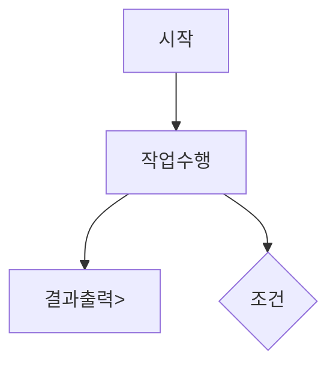
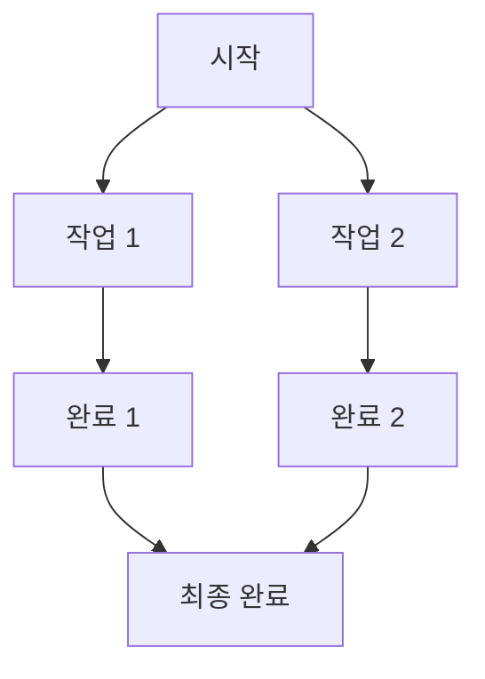

# 이커머스 시스템 플로우차트
## 목표
1. 보기 쉬운문서 (다른 설계문서 공통)
2. 고수준의 추상화된 다이어그램작성
3. 변경이 쉽게 관계를 매우 단순하고, 최대한 한방향으로 흐름을 이어지게 작성


## 플로우차트 



## 주요 문법 예시
### 노드
- 기본 노드: A[텍스트]
-  A는 노드 ID, [텍스트]는 노드에 표시될 내용
-  원형 노드: A((텍스트))
-  사각형 노드: A[텍스트]
-  라운드 사각형 노드: A(텍스트)
-  다이아몬드 노드 (조건문): A{텍스트}
   
### 화살표 연결
- -->: 일반 화살표
-  ---: 점선 화살표 (예: A -.-> B)
-  ==>: 굵은 화살표 (예: A ==> B)
-  -- 텍스트 -->: 화살표에 텍스트 추가 (예: A -- Yes --> B)

### 방향 지정
- flowchart TD: Top-Down (위에서 아래로)
- flowchart LR: Left-Right (왼쪽에서 오른쪽으로)
- flowchart RL: Right-Left (오른쪽에서 왼쪽으로)
- flowchart BT: Bottom-Top (아래에서 위로)

### 조건문 표시 (다이아몬드)
```mermaid
flowchart TD
```

### 반복문 (Loop) 표시

mermaid 코드
````
A[시작] --> B[작업 수행]
B --> C{조건 확인}
C -->|No| B
C -->|Yes| D[완료]
````

### 병렬로 처리될때


mermaid 코드
```
    A[시작] --> B[작업 1]
    A --> C[작업 2]
    B --> D[완료 1]
    C --> E[완료 2]
    D --> F[최종 완료]
    E --> F
```
