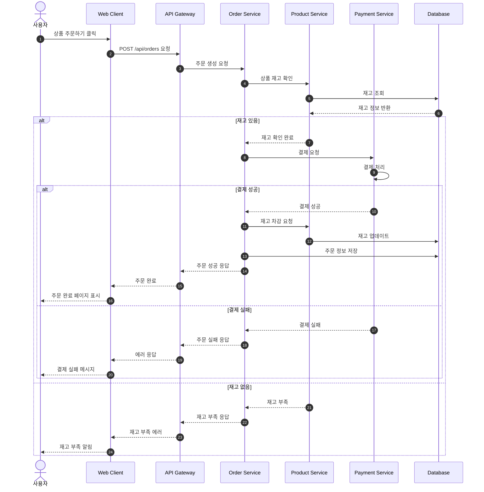
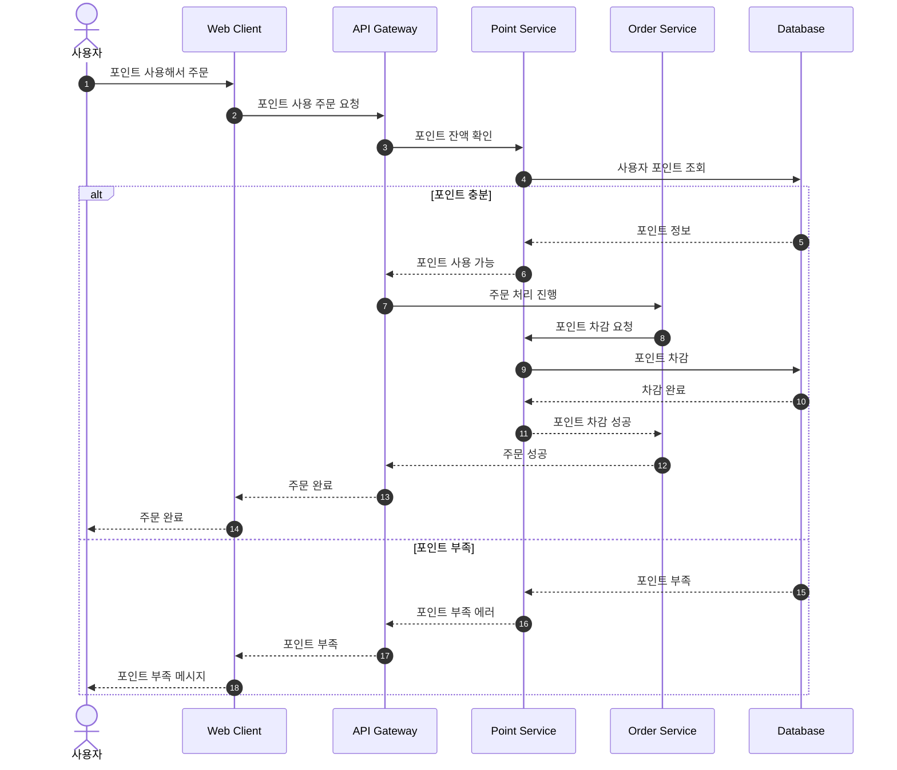

# 이커머스 시퀀스다이어그램

## 목표
1. 주제와 상관없는 플로우는 빼거나 생략하자
2. 보기쉬운 문서를 만들자
3. 보는사람 에 적합한 다이어그램 그리기 현재는 (개발자 , 기획자)
4. 고수준의 각 도메인 모듈 수준에서 그려보려한다.

## 시퀀스 다이어그램

### 사용자 상품 구매 플로우


### 포인트 사용 플로우


## Mermaid 시퀀스 주요문법 및 사용예제

### 기본 문법
- `actor A as 이름` : 액터 정의
- `participant B as 이름` : 참여자 정의  
- `A->>B: 메시지` : 실선 화살표
- `A-->>B: 메시지` : 점선 화살표 (응답)
- `A--)B: 메시지` : 점선 화살표

### 조건문
```
alt 조건
    처리내용
else 다른조건  
    다른처리내용
end
```

### 활성화
```
activate 참여자
deactivate 참여자
```

### 기타
- `autonumber` : 자동 번호 매기기
- 주석은 `%% 내용` 으로 작성

## 주의사항
- 너무 복잡하게 그리지 말고 핵심 플로우만 
- 에러 케이스도 중요한건 포함시키기
- 실제 서비스 구조랑 맞춰서 그리기

## 문서정보
작성일 : 2025-01-17 <br>
작성자 : 김준섭(5팀) <br>
문서유형 : 설계서
