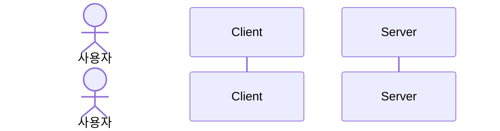

# 이커머스 시퀀스다이어그램

## 목표
1. 주제와 상관없는 플로우는 빼거나 생략하자
2. 보기쉬운 문서를 만들자

## 시퀀스 다이어그램 (싴다)

```mermaid
sequenceDiagram
    actor A as 사용자
    participant B as Client
    participant C as Server

```

## Mermaid 싴다 주요문법 및 사용예제

## 문서정보
작성일 : 2025-07-16  
작성자 : 김준섭(5팀)
문서유형 : 설계서
