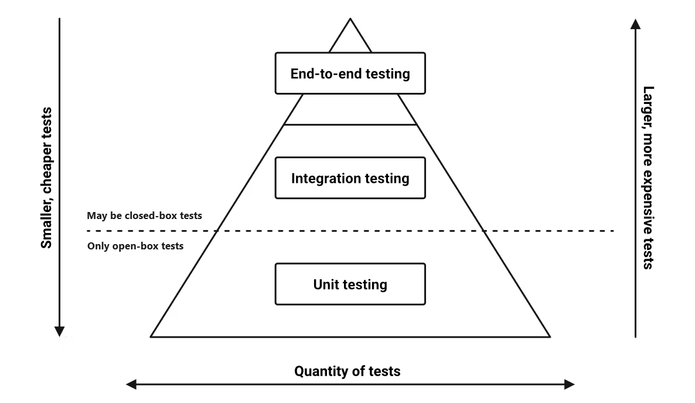
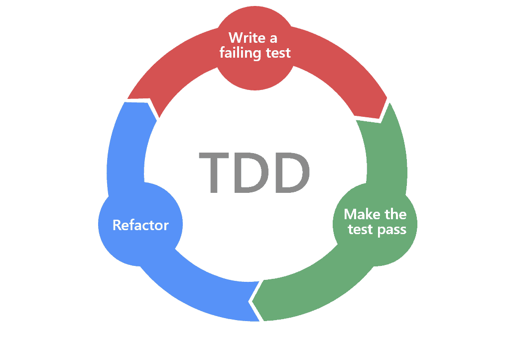

# Chapter. 1-1 TDD

챕터: Chapter 1
과제: [ 1주차 과제 ] TDD 로 개발하기  (https://www.notion.so/1-TDD-2272dc3ef51480e09ee4ff052b672217?pvs=21)

<aside>
🎯 **들어가면서, Why TDD?**

</aside>

- **TDD, 왜 그렇게 많이 언급 되는건지? 왜 중요할까?**
    
    개발해야되는 스코프가 점점 더 많아지고 거대한 규모의 소프트웨어가 많아짐에 따라, **유지보수 및 장애 발생시 대처를 유연하게 할 수 있는 방법론으로 다들 회귀**하기 시작했습니다. 즉, 코드의 규모는 점점 커지고 유저가 많아짐에 따라 **예측하기 힘든 행동 패턴들에 의한 장애가 발생**하기 시작한 거죠. 소위 새로운 기능을 만들기 위해 “요구사항을 찍어낸다” 식의 단순 재래식 개발로는 소프트웨어의 품질을 지속적으로 유지하고 향상시킬 수 없었기에 테스트 자동화에 대한 중요성은 점점 대두되어 왔습니다. 요구사항이 변경되었을 때, 기존의 기능이 영향이 없는가? 등을 검증하기 위한 방법론들이 주목받지 못하고 있다가 **빠른 변화에도 유연하게 새로운 기능을 적용하고 변경할 수 있는 기반을 다질 수 있는 TDD 에 대한 중요성이 더욱 더 중요**해지고 있습니다.
    
- **현업에서의 TDD란?**
    
    사람마다 생각하는 스코프가 조금 천차만별인 경우가 많은 것 같습니다. 이는 현재 본인의 일하는 환경에 따른 영향, 조직의 업무량과 방식 등이 매우 상이하기 때문인데 특히 테스트에 대한 중요성과 작성 여력이겠죠. 그래서 저는 **어떤 조직에 합류하던 최대한 작성하려는 기능을 분석 후 핵심이 되는 테스트 코드부터 작성하고 이를 완성하기 위해 적용된 아키텍처에 맞는 기능 개발을 진행**합니다. 그리고 모든 테스트를 완료하는 순간, 목표한 개발 스코프가 종료되었다는 기준으로 테스트 주도 개발을 진행합니다. 작업 여건 상 짧게 개발하고, 테스트 해보고 실패하면 리팩토링하는 방식을 취하는 대신에 대신 분석/설계 단계에서 테스트 코드를 면밀히 작성해두고 모든 TC 성공 시엔 개발 컨텍스트를 완료하는 방식을 취하고 있습니다.
    
- **여기서 우리가 TDD에 대해 알게되는 것들**
    
    백엔드 개발자로서, **요구사항을 분석하고 기능을 올바르게 완성하기 위한 TC 를 작성하는 방법을 익힙니다.** 특정 문제 상황에 대해 올바른 기능을 제공하기 위해서 어떤 테스트케이스를 단계적으로 작성해나갈 수 있는지, 점진적으로 우리가 작성한 기능을 리팩토링 하며 **올바른 백엔드 서비스를 제공할 수 있는 방법**을 익힙니다. 또한 **테스트 코드를 잘 작성할 수 있는 소프트웨어의 구조 등을 고민**해보고 이를 적용해 요구사항에 맞는 백엔드 서비스를 개발해봅니다. 
    

<aside>
⛵ **이번 챕터 목표**

</aside>

- **테스트 가능한 코드와 테스트 코드 작성에 집중하며, TDD 기반 요구사항 기능 개발**
- TDD,  Testable Code, Test Code 에 대한 학습을 진행합니다.
- 기초 학습자료로 부족한 부분을 학습합니다.
- 주어진 과제를 분석하고 TDD 기반으로 개발을 진행합니다.

<aside>
⚠️ **기초 학습 자료**

</aside>

[TDD 레슨 (1)](https://www.notion.so/TDD-1-2272dc3ef51480afba70f7ea2e4450f2?pvs=21)

[Jest 기초 (1)](https://www.notion.so/Jest-1-2272dc3ef51480ba9164ce8a20d6a7b6?pvs=21)

[JUnit With Kotlin ](https://www.notion.so/JUnit-With-Kotlin-2272dc3ef51480679facccfd4ea2385a?pvs=21)

[**NestJS 단위 테스트: 예제가 포함된 방법 가이드** (1)](https://www.notion.so/NestJS-1-2272dc3ef51480bc9949cb76414d6836?pvs=21)

*(참고자료) 학습 관련 링크*

- [JPA 에 대한 이해 ( 영상 자료 )](https://www.youtube.com/watch?v=WnYPdkNSLy8&themeRefresh=1)
- [JUnit 3일 안에 배우기](https://www.guru99.com/ko/junit-tutorial.html)
- [nestjs + jest 로 unit test 따라하기](https://www.tomray.dev/nestjs-unit-testing)

<aside>
🚩 **학습자료 : 이번 챕터에 해야 할 것. 이것만 집중하세요!**

</aside>

ℹ️ **Test Pyramid**



**`Unit Testing`**

- 대상 : 단일 기능 혹은 작은 단위의 함수/객체 등
- 가벼운 비용으로 새로운 기능 혹은 개선이 기존의 rule 을 위배하지 않는지 점검

**`Integration Testing`**

- 대상 : 서로 다른 module / system 의 상호작용
- 맞물려 돌아가는 기능이 모여 정상적으로 원하는 기능을 제공하는지 점검

**`End-to-End Testing`**

- 대상 : 전체 애플리케이션의 흐름
- 애플리케이션이 제공하는 기능을 사용자 시나리오 기반으로 문제 없는지 점검

ℹ️ **Test Double**

**테스트 더블**은 실제 컴포넌트를 대체할 수 있도록 하는 대역이다.

실제 컴포넌트에 대해 행동을 모방하고, 이를 통해 기존의 강한 결합도를 낮추고 테스트 중 제어 가능하도록 한다.

`Mock`

- 테스트를 위해 특정 기능에 대해 정해진 응답을 제공하는 객체
- 입력과 상관없이 **어떤 행동** 을 할 지에 초점을 맞춘 객체
- **Mock Library** 를 통해 특정 행동에 대한 출력을 정의

(아래는 예시를 돕기 위한 pseudo-code 입니다.)

```jsx
public class PaymentService {

    private final PayClient payClient;
    
    public boolean pay(final Long amount) {
        if(amount >= 10000) {
            payClient.pay(amount);
            return true;
        }
        
        return false;
    }
}

class PaymentServiceTest {

    @Inject
    private PaymentService paymentService ;
    
    @Mock
    private PayClient payClient;
    
    @Test
    void mock() {
        paymentService.pay(1000);
        
        verify(payClient, times(0)).pay(1000);
    }
}
```

**`Stub`**

- 테스트에 필요한 호출에 대해 미리 준비된 응답을 제공하는 객체
- 입력에 대해 **어떤 상태** 를 반영하는 지에 초점을 맞춘 객체
- **Interface** 기반으로 테스트에서 보고자하는 (혹은 필요로 하는) 구현에 집중한 구현체를 정의

(아래는 예시를 돕기 위한 pseudo-code 입니다.)

```jsx
public class MemberService {

    private final MemberRepository memberRepository;
    
    public boolean isRegistered(final String email) {
        return memberRepository.existsByEmail(email);
    }
}

class MemberServiceTest {

    @Inject
    private MemberService memberService;

    @Stub
    private MemberRepository memberRepository;

    @Test
    void stub() {
        String email = "hanghae@gmail.com;
        
        when(memberRepository.existsByEmail(email))
            .thenReturn(true);
        
        boolean result = memberService.isRegistered(email);

        // then
        ç(result).isTrue();
    }
}
```

ℹ️ 고전파(Classicist) vs 런던파(London School 또는 Mockist)

- **`고전파(Classicist)` :** 협력자로서 실제 객체를 사용하고자 하는 집단
- **`런던파(London School 또는 Mockist)` :** 테스트 대역을 사용하고자 하는 집단

```jsx
class Point {
 
    private Member member;  
    private int amount;
   
    public Point(Member member) {
        this.member = member;
        this.amoutn = 0;
    }

    public boolean charge(int amount) {
        if (member.isChild()) {
            return false;
        }
        
        this.amount += amount;
        return true;
    }
}

class PointTest {

    @Test
    void Adult일경우_충전성공() {
        Member member = new Member(age = 29);
        
        Point point = new Point(member);

        point.charge(member) shouldBe true;
    }

    @Test
    void Child일경우_충전실패() {
        // 대상이 child가 아닐 경우
        Member member = mock(Member.class);
        when(member.isChild()).thenReturn(true);

        Point point = new Point(member);

        point.charge(member) shouldBe false;
    }
}
```

ℹ️ FIRST principle

- Fast: 테스트는 빠르게 동작하여 자주 돌릴 수 있어야 한다.
- Independent: 각각의 테스트는 독립적이며 서로 의존해서는 안된다.
- Repeatable: 어느 환경에서도 반복 가능해야 한다.
- Self-Validating: 테스트는 성공 또는 실패로 bool 값으로 결과를 내어 자체적으로 검증되어야 한다.
- Timely: 테스트는 적시에 즉, 테스트하려는 실제 코드를 구현하기 직전에 구현해야 한다.

ℹ️ What is TDD?

- TDD
    - 테스트 코드를 먼저 작성하는 개발 방법론
- TDD의 장점
    - 깔끔한 코드를 작성할 수 있다.
    - 장기적으로 개발 비용을 절감할 수 있다.
    - 개발이 끝나면 테스트 코드를 작성하는 것은 매우 귀찮다. 실패 케이스면 더욱 그렇다.
- TDD 개발 방법 및 순서
    1. 빨강: 실패하는 작은 테스트를 작성한다. 처음에는 컴파일조차 되지 않을 수 있다.
    2. 초록: 빨리 테스트가 통과하게끔 만든다. 이를 위해 어떠한 죄악(함수가 무조건 특정 상수만을 반환하는 등)을 저질러도 좋다.
    3. 리팩토링: 일단 테스트를 통과하게만 하는 와중에 생겨난 모든 중복을 제거한다.



ℹ️ How to TDD By Example

[How to TDD By Example (1)](https://www.notion.so/How-to-TDD-By-Example-1-2272dc3ef514801e8613d30b51804309?pvs=21)

[TDD in real word - 항해.pdf](TDD_in_real_word_-_%E1%84%92%E1%85%A1%E1%86%BC%E1%84%92%E1%85%A2.pdf)

ℹ️ **Testable Code**

- 모든 코드를 테스트 가능하게 구현하는 것을 목표로 진행합니다.
- 모든 테스트 케이스가 성공했다는 것은 목표한 기능이 완성되었다는 것을 의미합니다.
- 테스트 커버리지 100% 가 아니라, 정확히 **기능의 동작을 확인하는 테스트를 작성**해 주세요.
- 주요 기능에서 `private` 접근자, 객체간의 강결합 같이 테스트 불가능한 코드는 가능한 한 지양하는 것이 좋습니다.

```kotlin
#1) 기능 구현을 원하는 요구사항을 검증하는 테스트 추가
#2) 테스트를 만족하도록 기능 구현
>> 이 때, 테스트는 한번에 많은 Scope 를 잡지 않는다. 이는 불필요한 개발 생산성 저하로 이어진다.
>> 이 시점에서 우리가 몇 배의 시간을 더 투자한다고 해서 테스트 커버리지 100% 를 달성할 수는 없다.
#3) 구현된 기능에 대한 리팩토링 ( 인터페이스 구성, 코드클리닝 등 코드 베이스 정리 )
```

- **참고** : [TestPyramid](https://martinfowler.com/bliki/TestPyramid.html)

<aside>
⚠️ **주의 !
단순히 테스트 커버리지 100% 를 목표하기보다 기능에 대해 유의미한 테스트케이스를 고민하고 작성해보세요.**

</aside>

<aside>
🚩 **과제 : 이번 챕터 과제**

</aside>

[[ 1주차 과제 ] TDD 로 개발하기 ](https://www.notion.so/1-TDD-2272dc3ef51480e09ee4ff052b672217?pvs=21)

<aside>
🗓️ **Weekly Schedule Summary: 이번 챕터의 주간 일정 
(각 요일 자정까지 제출)**

</aside>

### `STEP00 - 이것부터 시작해보세요!`

- PR 템플릿 세팅하기!
    - Repo를 생성하고 `.github` 폴더를 생성 후 `pull_request_template.md` 파일을 만들어서 아래 템플릿을 복사/붙여넣기해주세요!
    - PR 템플릿
        
        ```markdown
        ### **커밋 링크**
        <!-- 
        좋은 피드백을 받기 위해 가장 중요한 것은 코드를 작성할 때 커밋을 작업 단위로 잘 쪼개는 것입니다.
        모든 작업을 하나의 커밋에 진행하고 PR을 하면 구조 파악에 많은 시간을 소모하기 때문에 절대로
        좋은 피드백을 받을 수 없습니다.
        
        필수 양식)
        커밋 이름 : 커밋 링크
        
        예시)
        동시성 처리 : c83845
        동시성 테스트 코드 : d93ji3
        -->
        
        ---
        ### **리뷰 포인트(질문)**
        - 리뷰 포인트 1
        - 리뷰 포인트 2
        <!-- - 리뷰어가 특히 확인해야 할 부분이나 신경 써야 할 코드가 있다면 명확히 작성해주세요.(최대 2개)
          
          좋은 예:
          - `ErrorMessage` 컴포넌트의 상태 업데이트 로직이 적절한지 검토 부탁드립니다.
          - 추가한 유닛 테스트(`LoginError.test.js`)의 테스트 케이스가 충분한지 확인 부탁드립니다.
        
          나쁜 예:
          - 개선사항을 알려주세요.
          - 코드 전반적으로 봐주세요.
          - 뭘 질문할지 모르겠어요. -->
        ---
        ### **이번주 KPT 회고**
        
        ### Keep
        <!-- 유지해야 할 좋은 점 -->
        
        ### Problem
        <!--개선이 필요한 점-->
        
        ### Try
        <!-- 새롭게 시도할 점 -->
        ```
        

### `STEP01 - 기능 추가 및 테스트 구현`

- 포인트 충전, 사용에 대한 정책 추가 (잔고 부족, 최대 잔고 등)
- 4가지 기본 기능 (포인트 조회, 포인트 충전/사용 내역 조회, 충전, 사용)에 대한 구현
- 4가지 기본 기능에 대한 테스트 작성
- 단, 이때 `/database` 패키지의 구현체는 수정하지 않고, 이를 활용해 기능을 구현함

### `STEP02- 동시성 학습 및 구현`

- 동일한 사용자에 대한 동시 요청에 대한 테스트를 먼저 작성함
- 이후 해당 테스트가 정상적으로 처리될 수 있도록 개선함
- **선택한 언어에 대한** 동시성 제어 방식 및 각 적용의 장/단점을 기술한 보고서 작성 ( **README.md** )

**위 요구사항을 만족시키고, Github Repository URL 을 제출해주세요**

<aside>
🗓️ **과제 평가 기준과 핵심 역량 Summary**

</aside>

### PASS/FAIL 기준

**[ STEP01 - 기능 추가 및 테스트 구현 ]**

- 정책을 잘 정의하고, 4가지 기능에 대한 구현이 잘 작성되었는지
- 4가지 기본 기능에 대한 테스트가 잘 작성되었는지
- `database` 패키지의 구현체는 수정하지 않았는지

**[ STEP02- 동시성 학습 및 구현 ]**

- 동일한 사용자에 대한 동시 요청 테스트가 작성되었는지
- 동일한 사용자에 대한 테스트가 정상적으로 성공하는지
- 동시성 제어 방식 및 각각의 장/단점을 올바르게 정리했는지

### BP 기준

### **백엔드 STEP1과 STEP2의 공통 평가 항목**

- 객체지향 관점의 코드 작성
- 테스트 코드의 품질과 신뢰성
- 프로덕션 코드의 일관성과 간결성
- 과제에 대한 고민과 학습한 흔적
- 테스트 코드 구조화, 로직 간소화
- 단위테스트, 통합테스트의 적절한 활용

### **백엔드 STEP1 고유 평가 항목**

- 필요 기능의 구현
- 각 기능의 성공 뿐만 아니라 실패 케이스에 대한 단위 테스트 작성

### **백엔드 STEP2의 고유 평가항목**

- 원자적 연산의 구현
- 동시성 문제에 대한 학습 및 각 동시성 문제 해결 방식 간 비교/분석

### 핵심 키워드 및 역량

### **STEP01 - 기본 과제**

### **핵심 기술 키워드**

1. **TDD (Test-Driven Development)**
    - 요구사항을 먼저 정의하고, 이를 테스트할 수 있는 코드를 작성한 뒤, 실제 구현을 추가하는 개발 방식.
2. **Testable Code (테스트 가능한 코드)**
    - 테스트가 용이한 코드를 작성하는 기술로, 함수나 클래스가 독립적으로 동작하고 외부 의존성이 적어야 테스트가 용이함.
3. **최대 잔고, 잔고 부족 처리**
    - 포인트 시스템에서 잔고 부족 시 예외 처리 및 최대 잔고 초과를 방지하는 로직 구현.

### **기술적인 역량**

1. 객체지향적인 코드 작성
    - 각 요구사항을 만족하는 기능을 제공하기 위해 적절한 책임을 준수하는 객체지향적 코드 작성을 학습합니다.
2. **테스트 주도 개발(TDD)**
    - TDD의 **Cycle**(Red-Green-Refactor)을 경험하면서 테스트 기반의 개발 프로세스를 체득할 수 있습니다.
3. **테스트 가능한 코드 작성**
    - 의존성을 최소화하고, 모듈화된 코드를 작성하는 기술을 습득하며, **코드 리팩토링** 능력이 향상됩니다.

---

### **STEP02 - 심화 과제**

### **핵심 기술 키워드**

1. **통합 테스트 (Integration Testing)**
    - 개별 모듈이나 구성 요소들이 잘 연동되는지 확인하는 테스트로, 시스템의 흐름을 검증.
2. **동시성 제어 (Concurrency Control)**
    - 여러 요청이 동시에 들어왔을 때, 이를 안전하게 처리하기 위한 기법. (예: Mutex, Semaphore, Lock)
3. **README.md 보고서 작성**
    - 기술적인 분석 결과를 정리하고, **효율적인 커뮤니케이션**을 위해 보고서를 작성하는 능력.

### **기술적인 역량**

1. **통합 테스트 작성**
    - 개별 모듈을 테스트하는 것에서 벗어나, 실제 시스템 환경에서의 통합 테스트를 작성하여 **전체적인 시스템 안정성**을 확인하는 능력을 배울 수 있습니다.
2. **동시성 문제 해결**
    - 여러 요청이 동시에 들어오는 상황에서 **Race Condition**(경쟁 조건)을 방지하고, 안전하게 처리하는 방법을 배우게 됩니다.
    - 각 동시성 문제 해결 방식의 동작원리를 이해하고, 적절한 활용방법을 배우게 됩니다.
3. **기술 문서 작성**
    - 기술적인 분석과 결정을 명확히 문서화하고, 팀원들과의 **효과적인 정보 공유**를 위한 문서 작성 능력을 키울 수 있습니다.

---

### **요약**

- **STEP01**에서는 **TDD**, **테스트 가능한 코드 작성** 과 같은 기본적인 개발 역량을 다루며, 이를 통해 안정적인 시스템을 만들기 위한 **기술적 기초**를 쌓을 수 있습니다.
- **STEP02**에서는 **통합 테스트 및 동시성 제어방식**에 대해 학습하고, **보고서 작성**을 통해 **기술적 사고**와 **커뮤니케이션 능력**을 기를 수 있습니다.

### FAQ

- TDD 가 아닌 DDD 로 개발하는 것은 안될까요 ?
    
    A : DDD 와 TDD 는 같은 범주로 묶이는 개발론이 아닙니다. DDD 는 기존 DB 테이블 중심적으로 설계하고, 서비스를 구성하는 방식보다 요구사항에 대해 도메인을 명확히 분석하고, 도메인이 주체가 되도록 기능을 개발하는 방식을 의미합니다. 즉, 설계론적인 의미에서 더 많은 이점을 찾고자 하는 개발론이죠. TDD 는 개발하는 방식을 테스트적인 관점에서 바라보는 방법론입니다. 이에 DDD 로 개발할 때는 각 도메인의 컨텍스트를 보다 명확하게 정의하고, 기능을 단순화하고 정확하게 표현할 수 있어야 합니다. 
    
    A : 위에 설명한 바처럼 오히려 DDD 기반의 설계와 구현에 대해 익숙하고 잘 정의되어 있다면 TDD 방법론을 이용해 개발을 진행하기에 오히려 적합한 구조를 갖출 수 있다고 생각해요. TDD 는 각 기능에 대해 작은 단위로 구성하고 Unit Test 부터 잘 작성해나가며 빠른 주기로 개발/테스트/리팩토링을 반복해나가며 기능을 완성해나가는 방식인데, 도메인이 잘 정의되어 있고 기능에 대한 책임이 명확히 나뉘어져 있다면 더 빠른 개발을 진행할 수 있습니다.