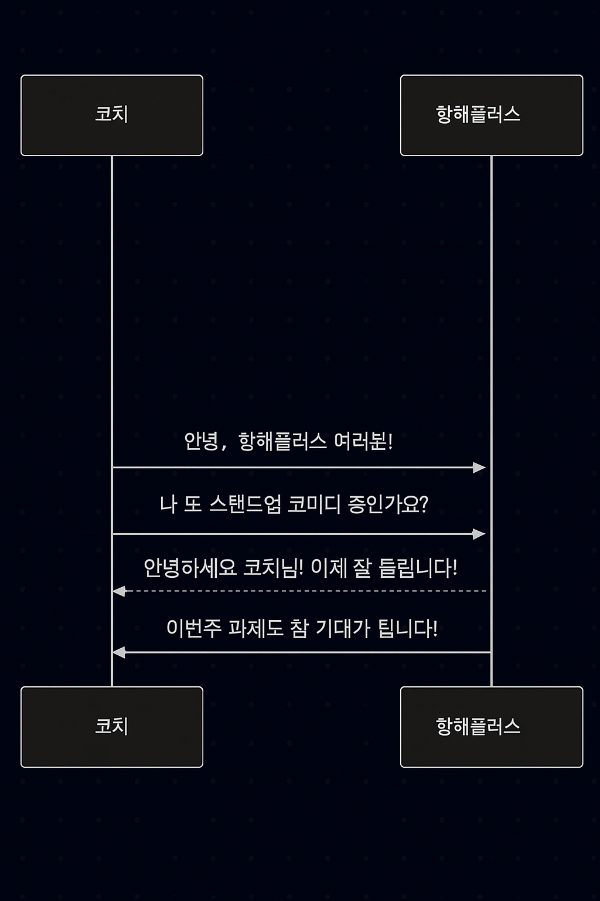
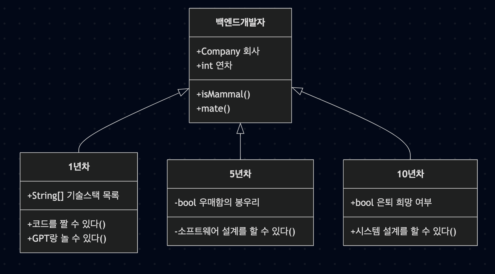
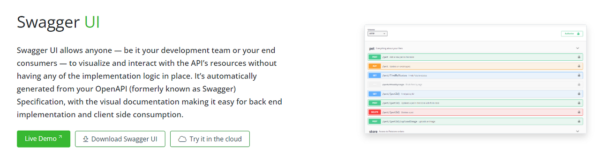

# Chapter. 2-1 서버구축 - 설계

챕터: Chapter 2
과제: 과제 : 이번 챕터 과제 (https://www.notion.so/22e2dc3ef514804e856fc946ff0fc689?pvs=21)

<aside>
**들어가기 이전에….**

</aside>

- 80점이 아닌 100점이 되기를 원하는 코치들
- 어떻게 하면 이직의 확률을 높일 수 있을까? feat. 함께 일하고 싶은 사람

<aside>
👑

**Hall Of Fame**

</aside>

- 안은솔 by 로이 코치님
    - 올바른 인터페이스의 활용 및 객체에게 적당한 역할과 책임 할당
    - 적당한 수준의 통합 테스트와 단위 테스트의 구성 + 가독성을 위한 노력들
    - 경계값 위주의 테스트 범위 설정 및 ParameterizedTest와 Steps를 통한 중복 제거

https://github.com/eunsol-an/spring-boot-TDD/pull/1

- 박서희 by 이석범 코치님
    - 객체지향적인 코드 및 클래스의 책임 검증 탁월
    - 작업단위의 명확한 커밋 분리로 작업 내용을 파악하기 쉬움

https://github.com/Joyseohee/hhplus-tdd/pull/1

- 이세호 by 한상진 코치님
    - 동시성 제어 기법에 대한 분석
    - 깔끔한 요구사항 구현 및 테스트 작성

https://github.com/seho0808/hh-9-be/pull/2/files

- TDD Chapter Summary
    - [ ]  Unit Test, Integration Test, E2E Test
    - [ ]  테스트 대역, Mock과 Stub
    - [ ]  테스트 대역 vs 실제 객체
    - [ ]  FIRST 원칙
    - [ ]  TDD 방식의 개발
    
    ### “좋은” 테스트 코드의 중요성
    
    <aside>
    💡 테스트와 **좋은 테스트**는 다릅니다.
    
    </aside>
    
    - 테스트 코드 작성은 서비스의 안정성을 위해 책임감을 갖고 안전 장치를 준비하는 것
    - “테스트”와 “좋은 테스트”는 다르고, 우리가 추구해야 하는 것은 “좋은 테스트”
    - “좋은 테스트”는 결국 존재 가치가 있어야 함
    - 100%의 테스트보다 50%의 좋은 테스트가 훨씬 가치있음
    - 좋은 테스트가 무엇인지 이해하려면, 일단 많은 테스트 경험이 필요함
    
    ### 현업에서의 TDD는 ?
    
    - TDD를 한다는 것은 테스트 코드에 능숙해야 하고, 테스트 케이스를 잘 알아야 함
    - 이를 위해서는 결국 요구사항 분석이 핵심임
    
    <aside>
    ❌ **우리에게 TDD 가 어려웠던 이유
    1.** **[ 경험 ]** Test Code 를 작성해본 적이 없다.
    **2.** **[ 분석 ]** 요구사항을 분석하고 기능을 작성할 때, 어떤 테스트가 필요한지 모르겠다.
    **3.** **[ 시간 ]** 기능 개발하기에도 바쁜데, 테스트 코드 작성할 시간적 리소스는 더욱이 부족하다.
    **4.** **[ 구조 ]** 내가 작성한 코드를 어떻게 테스트해야할지 모르겠다 ( feat. private method )
    
    </aside>
    

<aside>
**들어가면서, TDD 적용하기**

</aside>

<aside>
⛵ **`이번 챕터 목표**

</aside>

- 시나리오가 요구하는 요구사항을 명확히 분석하기
- 유지보수, 확장 가능한 코드에 대해 끊임없이 고민하기
- 테스트 가능한 구조 및 테스트 코드 작성에 집중하기
- 견고하지만 유연한 서버 애플리케이션을 구축하기

<aside>
🚩 **What to do: 이번 챕터에 해야 할 것. 이것만 집중하세요!**

</aside>

```java
설계가 명확하면, "코드를 치는 행위" 는 목표를 달성하는 "수단" 이 된다.
설계가 명확하지 않으면, "코드를 치는 행위" 는 불필요한 "노동" 이 된다.
```

### 1. Service Scenario 선택

<aside>
💡 우리는 적절한 아키텍처 패턴, 클린 코드, 테스트 등을 준수하며 유지, 성장 가능한 애플리케이션을 만들어야 합니다.

</aside>

- **`베이직` :** 각 시나리오의 기본 요구사항
**`챌린지`** (선택사항) :  각 시나리오의 심화 요구사항
    
    <aside>
    ❓ 아키텍처와 테스트 코드 작성에 집중하며, 견고하고 유연한 서버 개발이 목표인 사람 (챌린지 과제가 포함되어 있습니다)
    
    [콘서트 예약 서비스](https://www.notion.so/22e2dc3ef51480adb371fc31d24c0036?pvs=21)
    
    [맛집 검색 서비스 (번외)](https://www.notion.so/22e2dc3ef51480e1b3d1fe5a9d9f9b1d?pvs=21)
    
    [e-커머스 서비스 ](https://www.notion.so/e-22e2dc3ef51480d7be97f4321c76490e?pvs=21)
    
    </aside>
    

### **2. 개발 환경 준비**

- **DB ORM**
    - **JPA** / MyBatis
    - **TypeORM / Prisma**
- **Test**
    - JUnit + AssertJ
    - Jest / Mocha

**Template ( + testcontainers )**

[server-java.zip](server-java.zip)

[server-kotlin.zip](server-kotlin.zip)

[server-ts.zip](server-ts.zip)

### **3. 시나리오 분석 및 작업 계획**

## 문제 정의 및 요구사항 분석

### 문제 정의

- 해결하고자 하는 것이 무엇인지 명확히 설명할 수 있어야 함
- 문제에 대한 **추상**적인/**구체**적인 접근을 할 수 있어야 함

<aside>
🔥

문제를 뾰족하게 바라보는 연습을 많이 해야 한다.

</aside>

### 요구사항 분석

- **기능적** 요구사항 - 어떤 기능을 제공할 수 있어야 하는가?
- **비기능적** 요구사항 - 성능, 확장성, 보안 관련한 추가적인 고려사항들을 고려할 수 있어야 한다.

<aside>
🔋

범람하는 요구사항을 적절하게 분류, 정리할 수 있어야 한다.

</aside>

## 분석을 설계로 풀어내기

### 시퀀스 다이어그램

- **시스템 내에서 객체(또는 서비스)들이 어떻게 상호 작용하는지를 시간 순서대로 표현**하는 다이어그램
- 주로 **API 호출 흐름, 이벤트 처리 방식, 데이터 흐름을 설명할 때 사용**

<aside>
📝

**Example**

✅ 사용자가 로그인하는 과정

✅ 클라이언트가 API를 호출하고 서버에서 데이터를 반환하는 과정

✅ 비즈니스 프로세스에서 특정 요청이 처리되는 흐름

</aside>



### 클래스 다이어그램

- **시스템에서 사용되는 객체(Class)들의 구조와 관계를 표현하는 다이어그램**
- 주로 **도메인 모델링이나 엔티티 설계**에서 사용

<aside>
📝

**Example**

✅ 도메인 모델링 (예: 주문, 상품, 사용자 관계 정의)

✅ 엔티티 설계 (예: JPA Entity 간 관계 정의)

✅ 클래스 간 상속 및 의존성 표현

</aside>



### ERD ( Entity - Relationship Diagram )

- **데이터베이스의 테이블 간 관계를 표현하는 다이어그램**
- DB 설계 단계에서 **각 테이블(엔티티) 간의 관계를 시각적으로 정리하는 데 사용**

<aside>
📝

**Example**

✅ DB 스키마 설계 (테이블 정의 및 관계 설정)

✅ ORM (JPA, Hibernate) 모델링

✅ SQL JOIN 최적화 분석

</aside>


### 상태 다이어그램

- **객체 또는 프로세스가 특정 이벤트에 따라 상태가 어떻게 변하는지를 표현하는 다이어그램**
- 특정 기능의 **상태 전이(Transitions)를 설명할 때 사용**

<aside>
📝

**Usecase**

✅ 주문(Order) 상태 전이 (결제 대기 → 결제 완료 → 배송 중)

✅ 사용자 로그인 상태 (미인증 → 로그인 → 로그아웃)

✅ 서킷 브레이커 상태 (Closed → Open → Half-Open)

</aside>


[Online FlowChart & Diagrams Editor - Mermaid Live Editor](https://mermaid.live/edit#pako:eNplTz1OwzAUvkr0RuREieM4tgcWuAEbhMFqTFrR2JXrIEqUqQy9QMTAwhlQb0V6B9yGAlWf3vD96flzCxNTKhCwdNKp65msrKzDJ1zowM_dxX0QhpfB8LYdPvpRG_FB9vaZ9vW5GfrX4X09Or_07M6ps-u3u_VmdEZ8fAEQ1MrWclb6lu0-UYCbqloVIDwspX0soNCdz8nGmZuVnoBwtlEIrGmqKYgHOV961izKvy8eIwupb435T0G08AyCcBwlWRLHPKYx45wSBCsQSUqinGKKGWWUUJalHYKXw4U4ylLCSJ745QRTliOo7L72TxulS2WvTKMdCMy7bxn1hRQ)

[Flowchart Maker & Online Diagram Software](https://app.diagrams.net/)

[Excalidraw — Collaborative whiteboarding made easy](https://excalidraw.com/)

- **API 명세**
    - `Endpoint` - API 의 URL 및 기능을 설명할 수 있는 적절한 HTTP Method
    - `Request` - Param, Query, Body 등 API 호출 시 전달되어야 할 매개변수 및 데이터
    - `Response` - API 의 응답 코드, 데이터 등에 대한 명세 및 적절한 예제
    - `Error` - API 호출 중 발생할 수 있는 예외 케이스에 대해 명시
    - `Authorization` -

### 4. API Spec Documentation

<aside>
💡 우리는 적절한 API 명세 문서를 노출하고 MockAPI 를 제공해 생산성을 증대시켜야 합니다.

</aside>

**Mock API 로 생산성 극대화**

- API Spec 을 정했다면, 최대한 빠르게 Mock API 를 작성해 배포해야 함
    - 우리는 혼자 일하는 게 아니다!
    - API Spec 이 정해졌다면, 그 API 를 활용하는 다른 동료 ( 프론트엔드, 다른 백엔드 팀 등 ) 이 Dummy 데이터로 시뮬레이션을 할 수 있어야 함.

<aside>
ℹ️ curl, http (intellij), postman 등으로 API 시뮬레이션을 할 수 있어야 합니다.

</aside>

**API 문서만 보고도 이해할 수 있게!**

- **OAS** (Open API Specification) , **AsyncAPI** (Pub/Sub API Describe) , ..
- API Documentation
    - `Open API Specification`  - json, yaml 기반의 REST API 문서화 표준
    - `Swagger UI` - OAS 를 Web UI 로 표현 가능하도록 지원
        
        
        
        → 라이브러리를 통해 프레임워크의 API 문서 생성 자동화 기능 지원
        
        → API 명세 및 API TEST 제공을 통해 보기 쉬운 문서 제공
        
        → API 버전 관리, 통합 API 문서 제공 등의 문서 관리 기능 제공
        
        ```yaml
        // spring
        implementation("org.springdoc:springdoc-openapi-starter-webmvc-ui:2.0.0")
        
        // nest
        npx nestia swagger
        ```
        

```java
1. 요구사항 분석 및 API Spec 정의 ( 문서, 나열, 정리 )
2. Mock API 개발
3. Swagger-UI 작성
4. 본격적으로 "구체적인" 설계를 들어간다. ( 개발을 위한 )
```

<aside>
🔔

**원활한 프로젝트 진행을 위한 학습 로드맵**

</aside>

### 2주차 학습 로드맵 (개인의 상황에 맞게 참고하여 활용해주세요!)

### 📅 Day 1: TDD & 시나리오 분석

### 🎯 목표

- TDD의 개념과 원칙 이해
- 시나리오를 읽고 기능/도메인 요구사항 분석

### 🛠 학습 키워드

- TDD란?
- Red → Green → Refactor 사이클
- 기능 요구사항 vs 비기능 요구사항

### 📌 해야 할 것

- [ ]  [TDD는 테스트가 중요하다] 인식하고 관련 사례/적용 경험 정리
- [ ]  시나리오 1개 선택 (e-커머스, 맛집, 콘서트 중 택1)
- [ ]  기능/비기능 요구사항 정리

---

### 📅 Day 2: 시나리오 모델링 (다이어그램)

### 🎯 목표

- 도메인 객체/기능 흐름 파악
- 시퀀스 다이어그램, 클래스 다이어그램, ERD 작성

### 🛠 학습 키워드

- UML, 시퀀스 다이어그램
- 도메인 모델링, 클래스 다이어그램
- ERD (데이터 모델링)

### 📌 해야 할 것

- [ ]  주요 기능 흐름에 대한 시퀀스 다이어그램 작성
- [ ]  핵심 도메인에 대한 클래스 다이어그램 작성
- [ ]  데이터 저장을 위한 ERD 설계

---

### 📅 Day 3: 테스트 설계와 아키텍처 기초

### 🎯 목표

- 테스트 코드를 작성하기 위한 설계 감각 익히기
- 레이어드 아키텍처, 클린 아키텍처 구조 이해

### 🛠 학습 키워드

- Unit Test / Integration Test
- 책임 분리 / SOLID 원칙
- Layered vs Hexagonal Architecture

### 📌 해야 할 것

- [ ]  유닛 테스트 대상 기능 선정
- [ ]  테스트 대상 기준: 입력 → 실패 → 성공 → 리팩토링 흐름 연습
- [ ]  간단한 Controller-Service-Repository 구조 설계

---

### 📅 Day 4: Mock API & Swagger 연동

### 🎯 목표

- Swagger(OpenAPI) 문서화
- API 명세 기반 Mock API 테스트

### 🛠 학습 키워드

- OpenAPI (Swagger)
- API 명세 설계
- Mock Server / Dummy 데이터 활용

### 📌 해야 할 것

- [ ]  주요 기능 API 설계 (Request/Response/Status/Authorization)
- [ ]  Swagger UI 적용 (Spring/Nest 등)
- [ ]  Postman or curl로 시뮬레이션

---

### 📅 Day 5: 통합 테스트 & 리팩토링 + 회고

### 🎯 목표

- 전체 흐름 통합 테스트 (Nice-to-Have)
- 리팩토링과 책임 분리 마무리
- PR 템플릿 적용 및 회고 작성

### 🛠 학습 키워드

- E2E Test
- 책임 분리 & 리팩토링
- KPT 회고

### 📌 해야 할 것

- [ ]  Controller-Service-Repository 통합 테스트 시도
- [ ]  반복된 책임 분리 (SRP 적용)
- [ ]  PR 템플릿 작성 → 리드미 업데이트
- [ ]  KPT 기반 회고 작성

<aside>
🚩 **과제 : 이번 챕터 과제**

</aside>

### 시나리오를 선택해 서버 애플리케이션 구축

**`기본과제` :** 각 시나리오의 기본 요구사항
**`심화과제`** : 각 시나리오의 심화 요구사항

<aside>
🗓️ **Weekly Schedule Summary: 이번 챕터의 주간 일정 (각 요일 자정까지 제출)**

</aside>

**`REPO를 새로 생성하셨다면 이것부터 세팅해주세요!`** 

- PR 템플릿 세팅하기!
    - Repo를 생성하고 `.github` 폴더를 생성 후 `pull_request_template.md` 파일을 만들어서 아래 템플릿을 복사/붙여넣기해주세요!
    - PR 템플릿
        
        ```markdown
        ### **체크리스트**
        <!-- 
        스스로 만족스러운 과제를 제출했는지 확인하기 위해 체크하는 항목들입니다. 최소한 다음의 기준을 만족시키지 못한다면, 좋은 피드백을 받을 수 없습니다.
        -->
        - [] 요구사항을 구체화하고 분석하여 작업 가능한 단위로 정리하였는가?
        - [] 비즈니스 요구사항을 충족하는 ERD가 작성되었는가?
        - [] 핵심 기능에 대한 시퀀스 다이어그램이 작성되었는가?
        - [] REST 규칙에 따라서 API를 문서화하였는가?
        - [] 더미데이터를 제공하는 Mock API를 작성하였는가?
        
        ---
        ### **리뷰 포인트(질문)**
        - 리뷰 포인트 1
        - 리뷰 포인트 2
        <!-- - 리뷰어가 특히 확인해야 할 부분이나 신경 써야 할 코드가 있다면 명확히 작성해주세요.(최대 2개)
          
          좋은 예:
          - `ErrorMessage` 컴포넌트의 상태 업데이트 로직이 적절한지 검토 부탁드립니다.
          - 추가한 유닛 테스트(`LoginError.test.js`)의 테스트 케이스가 충분한지 확인 부탁드립니다.
        
          나쁜 예:
          - 개선사항을 알려주세요.
          - 코드 전반적으로 봐주세요.
          - 뭘 질문할지 모르겠어요. -->
        ---
        ### **이번주 KPT 회고**
        
        ### Keep
        <!-- 유지해야 할 좋은 점 -->
        
        ### Problem
        <!--개선이 필요한 점-->
        
        ### Try
        <!-- 새롭게 시도할 점 -->
        ```
        

### **`STEP03 - 분석`**

- 시나리오 요구사항 분석 및 문서 작성 ( e.g. 시퀀스 다이어그램, ERD 등 )

### **`STEP04 - 실행`**

- Mock API 및 Swagger-API 코드 작성
- **(NiceToHave)** API E2E 테스트 작성해보기

<aside>
🗓️ **과제 평가 기준과 핵심 역량 Summary**

</aside>

- 과제 평가 기준
    
    **[ STEP 3 - 분석 ]**
    
    - 시나리오 요구사항을 적절히 분석하고 필요한 다이어그램들을 통해 설계문서를 작성하였는지 ( 시퀀스 다이어그램, ERD 필수 )
        
        > 시퀀스 다이어그램 - **시스템 내/외 의 주요 기능상 흐름**을 포함하고 있어야 함
        ERD - 각 시나리오별 기능을 구성하는 **필수적인 데이터 모델들**은 포함하고 있어야 함
        그 외 - 자율
        > 
    
    **[ STEP 4 - 실행 ]**
    
    - Mock API 및 Swagger API 가 작성되었는지
    - **(NiceToHave)** API E2E 테스트가 작성되었는지
- BestPractice 평가 기준
    
    ## STEP03, STEP04 백엔드 코스 공통 평가 항목
    
    - 명확한 요구사항 분석 및 문서화
    - 도메인 중심 설계 및 책임의 명확한 분리
    - ERD 및 데이터 모델링의 정확성 및 명확성
    
    ---
    
    ## STEP03 서버구축 분석과제 고유 평가 항목
    
    - 시퀀스 다이어그램의 핵심 로직 중심 간결성 유지
    - 시퀀스 다이어그램 내 예외 상황의 명확한 표현과 생략 여부 판단
    - 이벤트 스토밍, 유스케이스, 도메인 모델링 등 다양한 설계 방법의 활용
    - 대기열, 쿠폰 및 결제 도메인의 명확한 역할 정의 및 설계
    
    ---
    
    ## STEP04 서버구축 실행과제 고유 평가 항목
    
    - API Response의 일관된 구조 설계(status 등 포함 여부 명확화)
    - API E2E 테스트 작성 여부
- 핵심 키워드 및 역량
    
    **주제: 아키텍처 기반 시나리오 서버 애플리케이션 설계 및 구현**
    
    ---
    
    ## ✅ 분석 과제 (STEP 03)
    
    **선택한 서비스 시나리오에 대한 요구사항 분석 및 프로젝트 초기 설계**
    
    ### 🎯 과제 목표
    
    선택한 시나리오(e-커머스 / 맛집 검색 / 콘서트 예매 등)를 바탕으로, 서버 애플리케이션 개발 전 기획·분석 역량을 키웁니다.
    
    시퀀스 다이어그램, 플로우 차트 등을 통해 아키텍처 설계의 기초를 다집니다.
    
    ### 🛠️ 핵심 기술 키워드
    
    - 시스템 분석: 시퀀스 다이어그램 / 플로우 차트
    - 도메인 분석: 유스케이스 도출 / 서비스 흐름 정리
    - 협업 준비: 요구사항 명세화
    - 설계 사고력: 구조화된 문서 작성
    - ERD 설계 / 도메인 모델링
    
    ### 🧠 핵심 역량
    
    | 역량 | 설명 |
    | --- | --- |
    | **요구사항 해석 및 정제 능력** | 시나리오를 분석해 구체적인 기능 단위로 정리 |
    | **비즈니스 흐름 모델링** | 시퀀스 다이어그램, 플로우 차트를 통해 데이터 흐름 시각화 |
    | **시스템 사고력** | 전체 흐름을 고려한 구조적 설계의 기반 능력 |
    
    ---
    
    ## 🚀 실행 과제 (STEP 04)
    
    **API 명세 수립, 기본 서버 구조 및 Mock API 구현**
    
    ### 🎯 과제 목표
    
    도출한 요구사항을 바탕으로 ERD 설계, API 명세, 서버 기본 구조를 구현합니다.
    
    Mock API를 통해 실제 팀 협업 환경에서의 생산성과 API 중심 사고력을 강화합니다.
    
    ### 🛠️ 핵심 기술 키워드
    
    - RESTful API 명세 / 오류 설계
    - Mock API 구성 / 테스트 시뮬레이션
    - 서버 기본 패키지 구성 / Configuration
    - GitHub PR 템플릿 / 초기 세팅
    
    ### 🧠 핵심 역량
    
    | 역량 | 설명 |
    | --- | --- |
    | **API 중심 설계력** | API 명세 작성 및 프론트엔드와의 협업을 위한 문서화 |
    | **테스트 기반 개발 습관** | Mock API를 통한 시뮬레이션 기반 개발 경험 |
    | **구현 전 구조 설계 능력** | 서버 구조 및 설정을 직접 구성하며 개발 설계 역량 강화 |
    
    ---
    
    ### 🪜 요약
    
    - **STEP03 (기본과제)**에서는 시나리오 기반으로 시스템 흐름을 분석하고, 시퀀스 다이어그램 및 플로우 차트를 통해 **요구사항 분석 능력**과 **설계적 사고력**을 기를 수 있습니다.
    - **STEP04 (심화과제)**에서는 ERD 및 API 명세, 서버 구조 구현을 통해 **도메인 중심 개발 역량**, **협업 준비도**, **Mock 기반 테스트 설계력**을 강화할 수 있습니다.

---

### FAQ

- TDD 가 아닌 DDD 로 개발하는 것은 안될까요 ?
    
    A : DDD 와 TDD 는 같은 범주로 묶이는 개발론이 아닙니다. DDD 는 기존 DB 테이블 중심적으로 설계하고, 서비스를 구성하는 방식보다 요구사항에 대해 도메인을 명확히 분석하고, 도메인이 주체가 되도록 기능을 개발하는 방식을 의미합니다. 즉, 설계론적인 의미에서 더 많은 이점을 찾고자 하는 개발론이죠. TDD 는 개발하는 방식을 테스트적인 관점에서 바라보는 방법론입니다. 이에 DDD 로 개발할 때는 각 도메인의 컨텍스트를 보다 명확하게 정의하고, 기능을 단순화하고 정확하게 표현할 수 있어야 합니다. 
    
    A : 위에 설명한 바처럼 오히려 DDD 기반의 설계와 구현에 대해 익숙하고 잘 정의되어 있다면 TDD 방법론을 이용해 개발을 진행하기에 오히려 적합한 구조를 갖출 수 있다고 생각해요. TDD 는 각 기능에 대해 작은 단위로 구성하고 Unit Test 부터 잘 작성해나가며 빠른 주기로 개발/테스트/리팩토링을 반복해나가며 기능을 완성해나가는 방식인데, 도메인이 잘 정의되어 있고 기능에 대한 책임이 명확히 나뉘어져 있다면 더 빠른 개발을 진행할 수 있습니다.
    
- 위 서비스 3개를 선정한 기준이 어떻게 되나요?
    
    A : 기존 기수에서는 팀프로젝트에 집중해 규모 있는 시나리오 기반의 큰 프로젝트를 같이 설계하고 테스트 코드, 팀 컨벤션 등 다양한 역량을 기르도록 하는 것이 목표였습니다. 하지만 기능이 다양해지고 많아지다보니 각자가 경험해보고 쌓을 수 있는 역량이 팀원별로 상이해지는 부분들이 있었고, 단순 구현 보다는 이번 챕터에서 백엔드 개발자로서 쌓아야 할 역량에 대한 집중도가 다소 떨어지는 경향을 확인했습니다.
    
    A : 이에 개개인의 역량 집중 뿐만 아니라, 팀 내에서 서로 다른 생각과 접근 등을 공유하고 피드백할 수 있는 환경을 만들어 더 많은 인사이트를 가져갈 수 있는 방향성으로 시나리오를 전면 재설계 하였습니다.