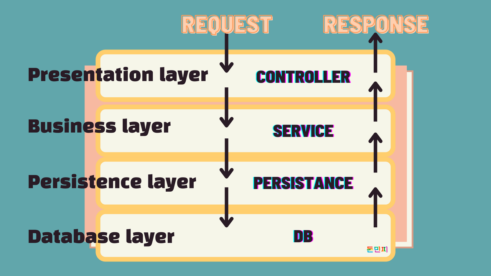
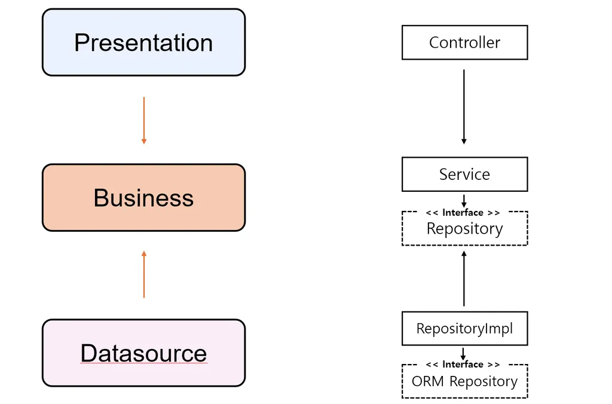

# Chapter. 2-2 서버구축 - 소프트웨어 설계

챕터: Chapter 2
과제: Weekly Schedule Summary: 이번 챕터의 주간 일정 (각 요일 자정까지 제출) (https://www.notion.so/Weekly-Schedule-Summary-2352dc3ef51480f88371f8a45892214e?pvs=21)

<aside>
🔄 Summary : TDD, 설계 돌아보기

</aside>

- Summary 이전 챕터 돌아보기
    
    ### 실제 현업에서 TDD 를 진행한다면 ?
    
    <aside>
    💡 TDD 는 **테스트가 중요하다** 를 인지하는 것부터 시작됩니다.
    
    </aside>
    
    우리가 **TDD** 가 왜 궁금하고, 왜 배우고 싶고, 왜 요즘 업계에서 자주 언급되는 지에 대해서 먼저 생각을 해보면 결국 뿌리는 **테스트가 중요하다** 를 인지 해야 하기 때문입니다. 약 1주간 TDD 챕터를 진행하며 나아가, 10주간 항해플러스를 진행하면서 주어진 시나리오를 기반으로 기능을 구현하고, 테스트 코드를 작성해보면서 어떻게 테스트 코드를 활용해 내 코드를 견고하게 할 지를 배울 겁니다.
    
    <aside>
    ❌ **우리에게 TDD 가 어려웠던 이유
    1.** **[ 경험 ]** Test Code 를 작성해본 적이 없다.
    **2.** **[ 분석 ]** 요구사항을 분석하고 기능을 작성할 때, 어떤 테스트가 필요한지 모르겠다.
    **3.** **[ 시간 ]** 기능 개발하기에도 바쁜데, 테스트 코드 작성할 시간적 리소스는 더욱이 부족하다.
    **4.** **[ 구조 ]** 내가 작성한 코드를 어떻게 테스트해야할지 모르겠다 ( feat. private method )
    
    </aside>
    
    ```java
    < 기존의 우리네 모습 >
    1. 기능 정의 ( 나는 무엇을 만들어야 하는가? )
    2. 내 나름의 우아한 코드를 짠다. ( 하루종일 걸림 )
    	-> 근데 짜다보니 안 우아함 
    	-> 계속 고침
    	-> 마감기한 어? 어ㅓㅓ? 야근. "팀장님 죄송합니다."
    	팀장님 : 후... 커피한잔하실까요? 힘드시죠..
    -------------
    < 우리가 갖춰야 할 모습 >
    1. 기능 정의 ( 나는 무엇을 만들어야 하는가? )
    2. 기능이 동작하는 데에 필요한 요구사항 나열
    3. 요구사항을 그룹핑 ( 요구사항의 동작 순서, 각 작은 기능의 책임 )
    4. 요구사항을 묶어서 작은 기능으로 분류
    5. 각 기능을 "요구사항을 만족하게" 테스트케이스를 작성한다.
    6. 테스트케이스를 만족시키는 기능을 개발
    7. 리팩토링을 한다. ( 테스트 코드 또한 리팩토링이 일어날 수 있다. )
    ```
    
    최소한의 노력으로 우리 코드를 안전하게 보호하기 위해서 테스트가 필요하다는 점, 미연에 문제를 방지하기 위해서 꼭 필요하다는 점은 이제 인지했습니다. 그럼 우리가 TDD 를 현업에서 사용하기 위해선 어떤 규칙을 지켜나가야 할까요 ?
    
    <aside>
    💡 **내가 기능을 개발하는 방법 ( Feat. Unit Test )**
    1. ****요구사항을 분석 ( 어떤 기능을 제공해야하는지 )
    2. 실패하면 안되는 Input 을 정리 ( 실패 TC 에 대해 정의 )
    3. 2번의 TC 를 모두 만족시킬 수 있도록 기능을 구현
    4. 기능의 책임을 분석
        - 너무 다양한 TC 가 필요하지 않았는지
        - 너무 많은 책임이 주어져 있지는 않은지 ( 응집도 )
    5. 리팩토링
        - 적절한 위상의 책임을 가지고 있도록
        - 충분히 원자적으로 테스트가 가능하도록
    
    </aside>
    
    어렵고 도입하기도 쉽지 않았지만, 그래도 TDD를 하면 테스트코드만 잘 작성하는 것이 아닌, 서비스 코드에 대한 설계가 좀 더 나아진 것 같은 느낌이 들지는 않았나요?
    
    <aside>
    💡 **TDD를 하면서 더 나은 클래스 설계가 되었어요.**
    
    - 하나의 클래스에서 너무 많은 로직을 담지 않고 적절히 역할을 분리해야.. 그래야 테스트코드를 쉽게 짤 수 있더라고요..
    - 주구장창 로직부터 작성하지 않고, 어떤 역할을 하는 클래스들이 구조화되어야 하는지 미리 고민하게 되었어요. 테스트 코드를 먼저 작성하려면, 어떤 클래스들이 있어야 하고, 각각의 클래스가 무슨 역할을 해야할지 미리 생각해봐야 테스트코드를 작성할 수 있었어요.
    </aside>
    

<aside>
🎯 **들어가면서, Why 클린아키텍처?**

</aside>

- **클린 아키텍처, 헥사고날 아키텍처 등 다양한 아키텍처 패턴들을 다 알아야 하나요 ?**
    
    우리는 단순히 특정 요구사항을 만족하는 기능을 제공하는 애플리케이션을 작성하고 끝나는 것이 아닌 유지 보수 및 지속적으로 서비스가 성장 가능하도록 하는 구조를 고민해보아야 합니다. 이를 위해서는 **효율적으로 개발하고, 유지보수** 할 수 있도록 다양한 룰을 정해야 합니다.
    
    가독성을 높여 코드를 누구 나 쉽게 파악할 수 있게 한다던지, 쉽게 변경할 수 있도록 다양한 원칙을 도입한다던지 하는 것들이 이에 속합니다. 그리고 이런 것들을 기본적으로 포함하고, 지켜질 수 있도록 하는 룰이 우리가 흔히들 들을 수 있는 클린, 헥사고날, 레이어드 등의 아키텍처 패턴 들입니다. 우리는 이를 학습하고 **좋은 소프트웨어를 만들기 위한 규칙을 만들어 나가야 합니다.**
    
- **클린 코드의 중요성**
    
    우리가 작성하는 코드, 언제든 이해하기 쉬울까요 ? 비즈니스 로직을 표현하다 보면, 코드의 복잡도는 높아지고 이를 이해하는 것은 쉽지 않을 수 있습니다. 이는 다른 개발자들과 함께 일할 때, 혹은 유지보수할 때 코드의 가독성 등에서 매우 중요하며 달성하기 위한 수많은 방법들이 존재합니다. 함수 네이밍, 주석부터 시작해서 응집도/결합도, 수많은 원칙 등 클린코드와 함께 따라오는 저마다의 노하우나 규칙들이 존재합니다.
    
    우리는 무엇보다 **변수, 함수 등이 스스로 내가 무엇인지, 어떤 일을 하는지** 를 설명할 수 있어야 하고 **명확하게 자신의 역할만을 수행하고 있는지** 등에 주의해 코드를 작성하는 습관을 들이는 데에 노력을 기울여야 합니다.
    
- **프로젝트가 커질수록 왜 코드 수정이 무서워질까요?**
    - 어디를 고쳐야 할지 찾기 어렵고
    - 하나를 고치면 다른 곳이 깨지고
    - 테스트하기도 어렵고
    - 새로운 팀원은 코드를 이해하는데 몇 주가 걸립니다
    
    이런 문제들이 바로 아키텍처가 필요한 이유입니다.
    

<aside>
⛵ **이번 챕터 목표**

</aside>

```markdown
1. 계층별로 코드를 나누는 이유를 이해합니다
   - Controller에 모든 로직을 넣으면 생기는 문제 경험
   - 계층을 나누면 테스트와 유지보수가 쉬워짐을 체감
   - "왜 Service가 필요한가?" 스스로 답할 수 있음

2. 의존성 방향을 일관되게 관리할 수 있습니다
   - 상위 계층이 하위 계층을 호출하는 단방향 흐름 구현
   - 순환 참조가 왜 문제인지 이해하고 해결
   - 인터페이스를 활용한 유연한 구조 설계 (선택사항)

3. 테스트 가능한 구조로 코드를 작성합니다
   - Mock을 활용한 단위 테스트 작성
   - 외부 의존성(DB, API)을 격리하여 테스트
   - 각 계층별 책임에 맞는 테스트 전략 수립
```

<aside>
⛵ **🎯 과제와 연계된 목표**

</aside>

```markdown
📋 STEP05
- 선택한 패턴으로 e-commerce/concert 시나리오 구현
- 최소 3개 이상의 계층으로 책임 분리  
- 각 계층별 단위 테스트 작성

📋 STEP06  
- 동시성 문제(재고, 좌석)를 고려한 설계
- 트랜잭션 처리 전략 적용
- 기존 코드의 문제점 찾고 개선
```

<aside>
🚩 **학습자료 : 이번 챕터에서 할 일**

</aside>

### **⚠️ 중요: 그대로 따라하지 마세요!**

여러분의 프로젝트 상황에 맞는 아키텍처를 선택하고, README에 그 이유를 명확히 설명해주세요.

### ℹ️ **Software Architecture Pattern**

<aside>
💡 좋은 아키텍처 패턴이란? 
- 지속적으로 성장 가능한 안정적인 소프트웨어를 잡기 위한 최고의 가이드라인
- 코드를 어디에 넣을지 명확한 기준을 제공하는 것 
- 변경과 확장에 유연한 구조를 만드는 것 
- 테스트하기 쉬운 코드를 작성할 수 있게 하는 것 
- 지켜야 할 기본적인 개발 가이드라인을 잡아주는 틀

</aside>

## **🤔 왜 아키텍처가 필요한가?**

### **실제로 겪게 되는 문제들**

**상황 1: "이 코드 어디에 넣어야 하지?"**

- 상품 조회시 조회수 증가 로직은 Service에? Repository에?
- 포인트 사용 이력 저장은 어느 계층의 책임일까?

**상황 2: "같은 로직을 여러 곳에서 써야 하는데..."**

- 포인트 차감 로직이 주문, 쿠폰 구매, 이벤트 응모에서 모두 필요
- 복사해서 붙여넣기? 공통 클래스? 어떻게 해결할까?

**상황 3: "테스트는 어떻게 하지?"**

- 외부 결제 API를 호출하는 코드를 테스트하려면?
- DB 없이 비즈니스 로직만 테스트할 수 있을까?

이런 문제들을 해결하기 위해 아키텍처 패턴이 필요합니다.

---

### 레이어드 아키텍처

가장 전통적이고 직관적인 아키텍처 패턴으로, 계층별로 역할을 명확히 분리합니다.

- **Presentation Layer**: UI, Controller (Request/Response 처리)
- **Business Layer**: Service (비즈니스 로직)
- **Persistence Layer**: Repository, DAO (데이터 접근)
- **Database Layer**: 실제 데이터베이스



### **🔔 핵심 규칙 (Rules)**

### **1. 엄격한 계층 규칙 (Strict Layering)**

`✅ 허용: Controller → Service → Repository → Database
❌ 금지: Controller → Repository (계층 건너뛰기)
❌ 금지: Repository → Service (역방향 참조)`

### **2. 단방향 의존성 (Unidirectional Dependency)**

- 각 계층은 **직접 아래 계층**에만 의존
- 하위 계층은 상위 계층의 존재를 전혀 모름
- 순환 참조 절대 금지

### **3. 계층별 관심사 (Layer-specific Concerns)**

- **Presentation**: HTTP, 사용자 입력 검증, 응답 포맷팅
- **Business**: 비즈니스 규칙, 계산, 워크플로우
- **Persistence**: SQL, 트랜잭션, 데이터 매핑
- **Database**: 실제 데이터 저장, 인덱싱, 제약조건

### ❌ 단점과 한계

- **비즈니스 로직이 분산될 수 있음**
- 데이터베이스 구조 변경이 전체 계층에 영향
- 테스트 시 실제 DB 연결이 필요한 경우가 많음
- 도메인 모델이 빈약해지기 쉬움 (Anemic Domain Model)

### 필독 아티클

https://martinfowler.com/bliki/PresentationDomainDataLayering.html

### ⭐ **레이어드 + 인터페이스 아키텍처**

"Relaxed Layered Architecture" 또는 "Layered Architecture with Dependency Inversion"으로도 불립니다. 전통적인 레이어드 아키텍처가 진화한 형태로, 헥사고날 아키텍처나 클린 아키텍처로 가기 전 중간 단계로 볼 수 있습니다.많은 개발자들이 자연스럽게 사용하고 있는 패턴이기도 합니다.



- **의존성 역전 원칙(DIP)**: 상위 계층이 하위 계층의 구체적인 구현이 아닌 추상화에 의존
- **인터페이스 분리**: Repository를 인터페이스로 정의하고 구현체를 분리
- **유연한 구조**: 데이터베이스나 외부 시스템 변경에 대한 영향 최소화

### **🔔 Rules**

1. **상위 계층 → 하위 계층 호출의 단방향 흐름을 유지**
    - 하위 계층은 상위 계층을 알지 못함
    - 계층 건너뛰기(Layer Skipping) 금지
2. **Repository를 인터페이스로 추상화하여 유연성 확보**
    - Service는 구체적인 구현이 아닌 인터페이스에 의존
    - DIP(의존성 역전 원칙) 부분적 적용
3. **구현체 교체가 상위 계층에 영향을 주지 않음**
    - JpaRepository → MongoRepository 변경 시 Service 코드 불변
    - Mock 객체를 통한 단위 테스트 가능
4. **데이터 접근 로직만 추상화로 보호**
    - 비즈니스 로직은 여전히 Service에 집중
    - Persistence 계층의 변경으로부터만 격리

### **❌ 단점과 한계**

- **비즈니스 로직이 Service 계층에 집중되어 비대해짐**
- Controller가 Service의 구체적인 메서드에 의존
- 도메인 모델이 빈약해지기 쉬움 (Anemic Domain Model)
- 외부 API나 메시징 시스템 추가 시 Service 계층 수정 필요

### 필독 아티클

https://martinfowler.com/articles/dipInTheWild.html

### ⭐ 헥사고날 아키텍처

헥사고날 아키텍처는 육각형 모양에서 이름을 따왔지만, 실제로는 애플리케이션을 중심에 두고 외부와의 상호작용을 포트와 어댑터로 처리하는 패턴입니다. 마치 전자제품의 포트에 다양한 케이블을 연결하듯이, 애플리케이션도 정의된 포트를 통해 외부 시스템과 연결됩니다.

- **Domain/Business Logic**: 핵심 비즈니스 규칙 (육각형 중앙)
- **Ports**: 비즈니스가 정의한 인터페이스
- **Adapters**: 외부 시스템과의 실제 연결 구현


### 🔔 Rules

1. **애플리케이션의 핵심은 비즈니스 로직**
    - 외부 기술에 의존하지 않는 순수한 도메인
2. **데이터 계층 및 API 계층이 비즈니스 로직을 의존**
    - Adapter가 Port를 구현
    - 의존성 방향: 외부 → 내부
3. **다양한 외부 인터페이스가 동일한 비즈니스 로직을 활용**
    - REST API, GraphQL, gRPC, MessageQueue 등 서로 다른 프로토콜
    - 각 인터페이스는 자신만의 데이터 형식으로 요청을 받음
    - 내부적으로는 동일한 도메인 로직을 호출하여 처리
    - 결과를 각 인터페이스에 맞는 형식으로 변환하여 응답
4. **DIP ✅ OCP ✅**
    - 완벽한 의존성 역전
    - 새로운 어댑터 추가가 기존 코드 변경 없이 가능

### 🔍 **포트(Port)와 어댑터(Adapter)의 역할**

- **포트**: 애플리케이션이 정의한 인터페이스로, 필요한 기능을 추상화
- **어댑터**: 실제 외부 시스템과 포트를 연결하는 구현체

### ❌ 단점과 한계

- 인터페이스와 구현체가 많아짐
- 설계에 많은 시간 필요
- 작은 프로젝트에는 과도할 수 있음

### 🎯 언제 사용하면 좋을까?

- **도메인이 복잡한 애플리케이션**
- **여러 외부 시스템과 통합이 필요한 경우**
- **장기적으로 유지보수가 중요한 프로젝트**
- **테스트 커버리지가 중요한 경우**

```java
📁 src/main/java/com/project/
├── 📁 application/
│   ├── 📁 port/
│   │   ├── 📁 in/
│   │   │   └── CreateUserUseCase.java
│   │   └── 📁 out/
│   │       ├── LoadUserPort.java
│   │       └── SaveUserPort.java
│   └── 📁 service/
│       └── UserService.java
├── 📁 adapter/
│   ├── 📁 in/
│   │   └── 📁 web/
│   │       └── UserController.java
│   └── 📁 out/
│       └── 📁 persistence/
│           └── UserPersistenceAdapter.java
└── 📁 domain/
    └── User.java
```

### 필독 아티클

https://alistair.cockburn.us/hexagonal-architecture

### ⭐ 클린 아키텍처


### 🔔 Rules

- 애플리케이션의 핵심은 비즈니스 로직
- 데이터 계층 및 API 계층이 비즈니스 로직을 의존 ( UseCase & Port 패턴 )
- 도메인 중심적인 고수준의 관심사 분리
- DIP 🆗 OCP 🆗

```java
📁 src/main/java/com/project/
├── 📁 domain/
│   ├── 📁 entity/
│   │   └── User.java
│   └── 📁 usecase/
│       └── CreateUserUseCase.java
├── 📁 application/
│   └── CreateUserService.java
├── 📁 infrastructure/
│   ├── 📁 web/
│   │   └── UserController.java
│   └── 📁 persistence/
│       └── JpaUserRepository.java
└── 📁 interfaces/
    └── UserRepositoryInterface.java
```

### 필독 아티클

https://blog.cleancoder.com/uncle-bob/2012/08/13/the-clean-architecture.html

### 도메인?

<aside>
💡 Domain ? Entity ? 이게 뭐요..

</aside>

용어에서부터 벽이 느껴질 때가 있는데, 바로 위와 같이 여기저기서 쓰이는 용어들입니다. 심지어는 상황에 따라 달라지는 이 용어들로 소통하다보면, 서로 다른 이야기를 하는 경우도 종종 있는 것 같아요. 앞서 우리가 살펴본 소프트웨어 아키텍처 패턴에서 또한 용어의 다른 뜻 때문에 헷갈리는 분들이 많았을 거라고 생각합니다.

### 🤔 도메인(Domain)이란?

- 특정 기능과 관련된 속성, 기능 등을 응집화시킨 개념
- **도메인의 다양한 의미**
    1. **비즈니스 도메인**
        - 특정 비즈니스 영역의 지식과 규칙
        - 예: 이커머스의 '주문', '결제', '배송' 영역
    2. **도메인 모델**
        - 비즈니스 개념을 코드로 표현한 것
        - 속성과 행위를 가진 객체
    3. **도메인 이해도**
        - 해당 비즈니스 영역에 대한 깊은 이해
        - 요구사항을 코드로 정확히 표현하는 능력
- e.g.
    - 도메인 이해도가 높아야 한다. = 해당 기능을 구성하는 하위 도메인에 대한 유기적 흐름 이해가 가능하다.
    - 도메인 모델 = 기능적으로 군집화시켜놓은 개념으로 일반적으로는 그 도메인을 표현하는 객체를 의미하며 POJO 일수도, JPA Entity 를 도메인 모델로 사용할 수도 있다.
    - 도메인 url = 하위 uri를 그루핑할 수 있는 응집화된 url
- **엔티티** ( Entity )
    1. 도메인을 설명할때 말하는 엔티티 : 도메인 모델의 맥락에서 `특정 주제에 대한 속성 기능을 응집화시켜놓은 도메인 모델`
    2. DB 와 연관지어 말하는 엔티티 : DB 테이블이나 그 `테이블에 매핑되는 객체`

그렇다면 도메인 맥락에서 db 엔티티와 분리되어 있다라는 말은 “나는 비즈니스 로직을 표현하기 위한 `“도메인 객체”를 DB 의 엔티티와는 상관없게` 표현할거야“ 라고 설명할수 있고, 그와 반대로 `DB 엔티티 (e.g. JPA Entity) 를 비즈니스의 대상이 되는 도메인 모델`로서 정의할 수도 있겠죠.

만약 `도메인 모델 != 엔티티 라는 설계`를 통해 아예 데이터베이스와 별개로 나는 비즈니스 로직을 강한 응집도를 주고, 외부의존성은 내 비즈니스 룰을 따라야 해! 라는 룰을 가져간다면 도메인영역 (핵심 비즈니스 로직) 은 엔티티를 모를테고, 이 경우 엔티티를 통해 db와 상호작용하는 datasource layer는 도메인 -> 엔티티, 엔티티 -> 도메인 의 작업을 수행하여 “`내가 아는 언어`” 로 변경해야 합니다.

### **Clean Code**에서 추구하는 것

### 📖 읽기 쉽고 단순한 코드

 1.  **함수는 한 가지 일만**

함수의 단일 책임 원칙은 Clean Code의 가장 기본이 되는 철학입니다. 하나의 함수가 여러 가지 작업을 동시에 처리하려고 하면, 그 함수를 이해하기 어려워지고 수정할 때도 예상치 못한 부작용이 발생할 수 있습니다. 경험 많은 개발자들이 자주 하는 말 중 하나가 "함수 이름을 지을 때 'and'나 '그리고'가 들어간다면, 그 함수는 이미 너무 많은 일을 하고 있는 것"라는 것입니다.

실무에서는 처음에 간단해 보이는 함수가 시간이 지나면서 점점 더 많은 기능을 담당하게 되는 경우가 많습니다. 이를 방지하려면 함수를 작성할 때마다 "이 함수가 정확히 무엇을 하는가?"라는 질문을 스스로에게 던져보는 습관을 기르는 것이 중요합니다. 단일 책임을 지키는 함수는 테스트하기 쉽고, 재사용하기 쉬우며, 디버깅할 때도 문제를 빠르게 찾을 수 있게 해줍니다.

**2. 의미 있는 이름 사용**

변수, 함수, 클래스의 이름은 코드에서 가장 많이 읽히는 부분입니다. 좋은 이름은 별도의 설명 없이도 그 역할과 목적을 명확하게 전달해야 합니다. 많은 개발자들이 처음에는 타이핑을 줄이려고 축약된 이름을 사용하지만, 코드를 읽는 시간이 쓰는 시간보다 훨씬 많다는 것을 깨닫게 됩니다.

실제 개발 현장에서는 6개월 전에 자신이 작성한 코드도 기억하지 못하는 경우가 빈번합니다. 이때 의미 있는 이름은 과거의 자신이 남긴 가장 소중한 선물이 됩니다. 또한 팀으로 작업할 때는 다른 개발자가 내 코드를 이해할 수 있어야 하므로, 이름 짓기는 단순한 개인적 선호가 아니라 팀워크의 문제가 됩니다. 좋은 이름을 짓는 데 시간을 투자하는 것은 결국 전체 개발 시간을 단축시키는 투자입니다.

**3. 중복을 제거하라 (DRY - Don't Repeat Yourself)**

같은 로직이 여러 곳에 반복되면, 그 로직을 수정해야 할 때 모든 곳을 찾아서 일일이 바꿔야 합니다. 이 과정에서 실수가 발생하기 쉽고, 놓치는 부분이 생기면 버그의 원인이 됩니다. DRY 원칙은 단순히 코드를 줄이는 것이 아니라, 유지보수성을 높이고 실수를 방지하는 것이 목적입니다.

하지만 경험 있는 개발자들은 무작정 중복을 제거하는 것보다는 "의미 있는 중복"과 "우연한 중복"을 구분하는 것이 중요하다고 조언합니다. 현재는 같아 보이지만 미래에 다르게 변할 가능성이 있는 코드를 성급하게 합치면, 나중에 더 복잡한 문제를 만들 수 있습니다. 따라서 중복을 발견했을 때는 한 번 더 생각해보고, 정말로 같은 개념인지 확인한 후에 제거하는 신중함이 필요합니다.

**4. 주석보다는 명확한 코드**

주석은 코드가 "무엇을" 하는지 설명하는 것이 아니라 "왜" 그렇게 했는지를 설명할 때 가장 가치가 있습니다. 코드 자체가 읽기 어려워서 주석으로 설명해야 한다면, 그것은 코드를 개선해야 한다는 신호입니다. 좋은 코드는 자기 설명적이어야 하며, 함수와 변수의 이름만으로도 무엇을 하는지 이해할 수 있어야 합니다.

실무에서 자주 겪는 문제 중 하나는 주석과 실제 코드가 다른 경우입니다. 코드는 수정되었는데 주석은 그대로 남아있어서 오히려 혼란을 가중시키는 것입니다. 이런 이유로 많은 개발팀에서는 "코드로 표현할 수 있는 것은 주석으로 쓰지 말라"는 규칙을 가지고 있습니다. 주석이 필요하다면 비즈니스 로직의 배경이나 특별한 알고리즘의 이유, 또는 임시방편의 해결책에 대한 경고 등에 한정하는 것이 좋습니다.

**5. 작은 단위로 나누기**

복잡한 문제를 해결하는 가장 확실한 방법은 그것을 작은 문제들로 나누는 것입니다. 이는 함수뿐만 아니라 클래스, 모듈, 패키지 등 모든 코드 구조에 적용되는 원칙입니다. 작은 단위의 코드는 이해하기 쉽고, 테스트하기 쉬우며, 재사용하기도 쉽습니다.

많은 개발자들이 처음에는 "작게 나누면 성능이 떨어지지 않을까?" 걱정하지만, 현대의 컴파일러와 런타임은 충분히 최적화되어 있어서 이런 걱정은 대부분 불필요합니다. 오히려 작은 단위로 나눠진 코드는 필요한 부분만 최적화할 수 있게 해주고, 병렬 처리나 캐싱 등의 성능 개선 기법을 적용하기도 쉽습니다. 실제로 "먼저 작동하게 만들고, 그 다음에 빠르게 만들라"는 것이 경험 많은 개발자들의 공통된 조언입니다.

**6. 일관성 있는 코딩 스타일**

코딩 스타일의 일관성은 기술적 능력보다는 팀워크와 전문성의 문제입니다. 같은 프로젝트 내에서 들여쓰기 방식이 다르거나, 변수 명명 규칙이 제각각이라면, 코드를 읽는 사람은 지속적으로 스타일 변화에 적응해야 하므로 내용에 집중하기 어려워집니다.

많은 개발팀에서는 린터나 포매터 같은 도구를 사용해서 스타일을 자동으로 통일합니다. 이는 개발자들이 스타일에 대한 논쟁에 시간을 쓰는 대신 실제 문제 해결에 집중할 수 있게 해줍니다. 개인적인 선호보다는 팀의 규칙을 따르는 것이 프로페셔널한 태도입니다. 일관성 있는 코드는 새로운 팀원이 합류했을 때도 빠르게 적응할 수 있게 도와주며, 코드 리뷰 과정에서도 스타일이 아닌 로직에 집중할 수 있게 해줍니다.

**7. 인터페이스를 통한 의존성 격리**

소프트웨어는 변화가 불가피합니다. 요구사항이 바뀌고, 외부 시스템이 변경되며, 더 나은 기술이 등장합니다. 이런 변화에 유연하게 대응하려면 코드의 각 부분이 느슨하게 결합되어야 합니다. 인터페이스는 "무엇을" 할지는 정의하지만 "어떻게" 할지는 구현체에 맡기므로, 구현을 바꿔도 다른 부분에 영향을 주지 않습니다.

실제 프로젝트에서는 데이터베이스를 MySQL에서 PostgreSQL로 바꾸거나, 결제 시스템을 다른 업체의 것으로 교체해야 하는 상황이 자주 발생합니다. 이때 인터페이스를 통해 의존성을 격리해두었다면, 해당 인터페이스의 구현체만 교체하면 됩니다. 또한 테스트할 때도 실제 외부 시스템 대신 가짜 구현체를 사용할 수 있어서, 빠르고 안정적인 테스트가 가능해집니다. 이런 설계는 처음에는 복잡해 보일 수 있지만, 프로젝트가 커질수록 그 가치가 명확해집니다.

<aside>
🔔

**원활한 프로젝트 진행을 위한 학습 로드맵**

</aside>

- Java 기반 로드맵
    
    ---
    
    ### 📅 Day 1: 클린 아키텍처 이해 & 시나리오 분석
    
    ### 🎯 목표
    
    - 클린 아키텍처 개념과 레이어드 아키텍처 비교
    - 시나리오 요구사항 분석 및 Milestone 수립
    - 도메인 모델 분리 계획 수립
    
    ### 🛠 학습 키워드
    
    - 클린 아키텍처 vs 레이어드
    - SOLID, DIP, OCP
    - 도메인 모델링
    - 기능 분해, Milestone
    
    ### 📌 해야 할 것
    
    - [ ]  클린 아키텍처의 핵심 개념 정리
    - [ ]  e-커머스/콘서트 중 1개 시나리오 선택
    - [ ]  요구사항 분석 및 기능/비기능 요건 정리
    - [ ]  Milestone 문서화
    
    ---
    
    ### 📅 Day 2: 도메인 & 애플리케이션 계층 설계
    
    ### 🎯 목표
    
    - 비즈니스 로직 중심의 도메인 설계
    - Application 계층(USECASE, Facade) 설계
    - 유즈케이스 단위 책임 분리
    
    ### 🛠 학습 키워드
    
    - 도메인 모델, Entity
    - Application Layer, Facade
    - Input/Output Port, 책임 분리
    
    ### 📌 해야 할 것
    
    - [ ]  주문/결제 도메인 모델 설계
    - [ ]  Product/Order 도메인 구조 설계 및 코드 생성
    - [ ]  Application 계층에 유즈케이스 클래스(Facade) 생성
    - [ ]  DI 기반 Service 설계
    
    ---
    
    ### 📅 Day 3: 데이터 계층 구현 및 외부 의존성 분리
    
    ### 🎯 목표
    
    - Repository 인터페이스 추상화
    - 외부 구현체(JPA)와의 분리 설계
    - DIP 적용으로 유연한 구조 구현
    
    ### 🛠 학습 키워드
    
    - Persistence Layer, Adapter
    - Repository 패턴
    - DIP 적용, Spring Data JPA
    
    ### 📌 해야 할 것
    
    - [ ]  Repository 인터페이스 선언 (e.g., UserPointRepository)
    - [ ]  JPA 기반 구현체 분리 작성
    - [ ]  Application 계층에 외부 의존성 주입 구성
    - [ ]  외부 → 내부 의존 흐름 점검
    
    ---
    
    ### 📅 Day 4: 테스트 가능한 구조 & 단위 테스트
    
    ### 🎯 목표
    
    - 단위 테스트 작성 기준 학습
    - Application / Domain 계층의 Mock 기반 테스트 작성
    - 인터페이스 분리로 테스트 효율 확보
    
    ### 🛠 학습 키워드
    
    - 단위 테스트, Mockito, Stub
    - 테스트 대상 기준 분리
    - Mock Repository, 의존성 주입
    
    ### 📌 해야 할 것
    
    - [ ]  OrderService, OrderFacade 테스트 코드 작성
    - [ ]  Repository 인터페이스 Mocking 연습
    - [ ]  성공/예외 플로우 테스트 케이스 작성
    - [ ]  TDD 사이클로 코드 리팩토링 진행
    
    ---
    
    ### 📅 Day 5: 구조 리팩토링 & 통합 점검
    
    ### 🎯 목표
    
    - 전체 구조 점검 및 리팩토링
    - 명명 규칙, 계층 간 의존성 재정비
    - 학습 정리 및 발표 준비
    
    ### 🛠 학습 키워드
    
    - Clean Code 원칙
    - 네이밍, 응집도/결합도
    - 최종 점검 체크리스트
    
    ### 📌 해야 할 것
    
    - [ ]  전체 구조에서 의존성 흐름 점검
    - [ ]  중복/불필요한 클래스 제거
    - [ ]  코드 정리 및 Git 커밋 정돈
    - [ ]  회고 정리 및 공유 준비
    
- Kotlin 기반 로드맵
    
    ### 📅 Day 1: 클린 아키텍처와 Kotlin 스타일 설계 감각 익히기
    
    ### 🎯 목표
    
    - 클린 아키텍처와 레이어드 아키텍처 이해
    - Kotlin 특유의 DSL/함수형 스타일 이해
    - 시나리오 분석 및 도메인/기능 분리 계획
    
    ### 🛠 학습 키워드
    
    - 클린 아키텍처, 레이어드 구조
    - Kotlin DSL, 데이터 클래스
    - 기능 요구사항 분석, Milestone 설정
    
    ### 📌 해야 할 것
    
    - [ ]  클린 아키텍처 주요 계층 Kotlin 기준으로 정리
    - [ ]  콘서트 or 맛집 시나리오 선택
    - [ ]  기능/비기능 요구사항 리스트업
    - [ ]  Milestone 수립 및 Kotlin DSL 표현 연습
    
    ---
    
    ### 📅 Day 2: 도메인 모델 정의 & UseCase 구조 설계
    
    ### 🎯 목표
    
    - 도메인 중심의 계층 구조 설계
    - UseCase, Facade 설계로 책임 분리
    - Kotlin 언어 특성 반영한 구조화
    
    ### 🛠 학습 키워드
    
    - 도메인 모델, data class
    - Application Layer, UseCase
    - 의존성 주입 (Koin/Hilt)
    
    ### 📌 해야 할 것
    
    - [ ]  Reservation/Order 도메인 모델링
    - [ ]  UseCase 정의 및 책임 분리 구조 구현
    - [ ]  Facade 클래스 설계 및 DI 적용
    - [ ]  sealed class / Result 패턴 적용 고려
    
    ---
    
    ### 📅 Day 3: Adapter 구현 및 Repository 추상화
    
    ### 🎯 목표
    
    - Persistence Layer와 분리된 Repository 설계
    - 외부 구현체(MyBatis/Exposed) 분리
    - 비즈니스 로직과 구현체 의존 분리 연습
    
    ### 🛠 학습 키워드
    
    - Adapter, Port 패턴
    - Repository 인터페이스 정의
    - 외부 의존 분리 설계
    
    ### 📌 해야 할 것
    
    - [ ]  포인트 충전 로직의 Repository 정의
    - [ ]  DB 접근 모듈을 Adapter로 분리
    - [ ]  Interface ↔ 구현체 구조 설계
    - [ ]  도메인 객체 ↔ DB Entity 변환 함수 정리
    
    ---
    
    ### 📅 Day 4: 단위 테스트 & Mock 기반 테스트 작성
    
    ### 🎯 목표
    
    - UseCase 계층 단위 테스트 작성
    - 테스트 가능한 구조로 개선
    - 외부 의존성 Mock 처리 전략 습득
    
    ### 🛠 학습 키워드
    
    - JUnit5, MockK
    - Stub/Mock 개념
    - 의존성 분리와 테스트 전략
    
    ### 📌 해야 할 것
    
    - [ ]  UseCase 테스트 작성 및 테스트 케이스 정리
    - [ ]  Repository 인터페이스 Mock 구성
    - [ ]  핵심 예외 처리 테스트 포함
    - [ ]  불필요한 의존 제거 및 테스트 리팩토링
    
    ---
    
    ### 📅 Day 5: 전반 구조 리팩토링 및 발표 정리
    
    ### 🎯 목표
    
    - 전체 구조를 클린 아키텍처 기준으로 재점검
    - 도메인 모델 명확화 및 패키지 정비
    - Kotlin 스타일 개선 포인트 점검
    
    ### 🛠 학습 키워드
    
    - 응집도/결합도, 리팩토링
    - Kotlin 네이밍 규칙
    - 설계 문서 정리
    
    ### 📌 해야 할 것
    
    - [ ]  각 계층 간 역할 점검 및 중복 제거
    - [ ]  도메인/애플리케이션/인프라 구조 명확화
    - [ ]  코드 정리 및 발표 준비
    - [ ]  로컬 테스트 통합 시나리오 확인
- TypeScript 기반 로드맵
    
    ### 📅 Day 1: Node 아키텍처 구성 및 시나리오 분석
    
    ### 🎯 목표
    
    - Express/Nest 구조에서 클린 아키텍처 도입 방법 이해
    - 기능/도메인 분리 연습
    - 요구사항 기반 Milestone 수립
    
    ### 🛠 학습 키워드
    
    - Express 구조 vs NestJS 모듈 구조
    - Controller/Service/Repository 분리
    - 기능 분해, DTO 설계
    
    ### 📌 해야 할 것
    
    - [ ]  맛집 검색 or 콘서트 예약 시나리오 선택
    - [ ]  Controller → Service → Repository 흐름 설계
    - [ ]  기능/비기능 요구사항 리스트 작성
    - [ ]  프로젝트 구성 및 디렉토리 설계
    
    ---
    
    ### 📅 Day 2: 도메인 로직 분리 및 UseCase 설계
    
    ### 🎯 목표
    
    - UseCase 단위 비즈니스 로직 정리
    - 각 기능 별 책임 단위 구분
    - 외부 입력/출력 구조 정의
    
    ### 🛠 학습 키워드
    
    - UseCase, Service
    - DTO, Entity, Mapper
    - 책임 기반 코드 구조화
    
    ### 📌 해야 할 것
    
    - [ ]  주문/결제 유즈케이스 구현
    - [ ]  DTO → 도메인 모델 변환 로직 정리
    - [ ]  기능 중심 유즈케이스 구조 정리
    - [ ]  NestJS 기준이라면 Module 분리까지 진행
    
    ---
    
    ### 📅 Day 3: 외부 의존성 분리 및 Port/Adapter 설계
    
    ### 🎯 목표
    
    - DB 등 외부 시스템을 Port로 추상화
    - 구현체는 Adapter로 관리
    - 클린 아키텍처의 DIP 원칙 적용
    
    ### 🛠 학습 키워드
    
    - Port, Adapter
    - Interface 기반 추상화
    - 의존성 역전(DIP) 적용
    
    ### 📌 해야 할 것
    
    - [ ]  Repository 인터페이스 정의
    - [ ]  MongoDB/PostgreSQL 연동 모듈 Adapter로 분리
    - [ ]  외부 구현에 대한 의존 제거
    - [ ]  도메인 ↔ Adapter 데이터 매핑 함수 구현
    
    ---
    
    ### 📅 Day 4: 단위 테스트 및 구조 개선
    
    ### 🎯 목표
    
    - Jest 기반 단위 테스트 작성
    - 테스트 가능한 구조로 개선
    - 비즈니스 로직 중심 테스트 설계
    
    ### 🛠 학습 키워드
    
    - Jest, Mock 함수
    - 테스트 가능한 구조, 경계 테스트
    - DI를 통한 유연한 테스트 구조
    
    ### 📌 해야 할 것
    
    - [ ]  주요 유즈케이스 단위 테스트 작성
    - [ ]  DB 접근 로직 Mock 구성
    - [ ]  예외 및 엣지케이스 테스트 포함
    - [ ]  테스트 통과 기준으로 코드 리팩토링
    
    ---
    
    ### 📅 Day 5: 리팩토링 & 아키텍처 리뷰
    
    ### 🎯 목표
    
    - 폴더 구조 및 네이밍 점검
    - Interface / 의존성 연결 점검
    - 전체 흐름 문서화 및 발표 자료 작성
    
    ### 🛠 학습 키워드
    
    - 클린 아키텍처 리뷰 기준
    - 코드 정리 전략
    - 기술 발표 준비
    
    ### 📌 해야 할 것
    
    - [ ]  폴더 구조 및 인터페이스 연결 점검
    - [ ]  중복/불필요한 코드 제거
    - [ ]  Readme/설계 문서 정리
    - [ ]  최종 발표 자료 작성 및 정리

<aside>
🚩 **과제 : 이번 챕터 과제**

</aside>

<aside>
❓ 아키텍처와 테스트 코드 작성에 집중하며, 견고하고 유연한 서버 개발이 목표인 사람 (챌린지 과제가 포함되어 있습니다)

[e-커머스 서비스](https://www.notion.so/e-2352dc3ef51480b0a759db8bd21dec7a?pvs=21)

[콘서트 예약 서비스](https://www.notion.so/2352dc3ef514806a8744cc81df377ffa?pvs=21)

[맛집 검색 서비스 (번외)](https://www.notion.so/2352dc3ef514800a80d3c7fc35c4abb8?pvs=21)

</aside>

<aside>
🗓️ **Weekly Schedule Summary: 이번 챕터의 주간 일정 (각 요일 자정까지 제출)**

</aside>

`REPO를 새로 생성하셨다면 이것부터 세팅해주세요!`

- PR 템플릿 세팅하기!
    - Repo를 생성하고 `.github` 폴더를 생성 후 `pull_request_template.md` 파일을 만들어서 아래 템플릿을 복사/붙여넣기해주세요!
- PR 템플릿
    
    ```java
    ## :pushpin: PR 제목 규칙
    [STEP0X] 이름 - 선택 시나리오 (e-commerce/concert)
    
    ---
    ### **핵심 체크리스트** :white_check_mark:
    
    #### :one: 아키텍처 설계 (3개)
    - [ ] 선택한 아키텍처 패턴이 일관되게 적용되었는가?
    - [ ] 계층 간 의존성이 단방향으로 흐르는가? (순환참조 X)
    - [ ] README에 아키텍처 설명이 있는가?
    
    #### :two: 핵심 구현 (3개)
    - [ ] 비즈니스 로직이 적절한 계층에 위치하는가?
    - [ ] 각 시나리오의 핵심 기능이 동작하는가?
    - [ ] 외부 기술(DB, HTTP)로부터 비즈니스 로직이 분리되었는가?
    
    #### :three: 테스트 (2개)
    - [ ] 핵심 비즈니스 로직에 대한 단위 테스트가 있는가?
    - [ ] 테스트에서 Mock/Stub을 활용하여 의존성을 격리했는가?
    
    ---
    ### **구현 완료 기능** :pencil:
    
    #### STEP05
    - [ ] **E-commerce**: 상품조회 + 주문/결제 + 포인트
    - [ ] **Concert**: 콘서트조회 + 예약/결제 + 포인트
    
    #### STEP06
    - [ ] **E-commerce**: 선착순 쿠폰 + 재고 동시성 + 결제 실패 복구
    - [ ] **Concert**: 대기열 + 좌석 임시배정 + 예약 자동취소
    
    ---
    ### **간단 회고** (3줄 이내)
    - **잘한 점**: 
    - **어려운 점**: 
    - **다음 시도**:
    ```
    

`STEP05`

- 선택한 아키텍처 패턴을 적용하여 **패키지 구조 설계** 및 **핵심 비즈니스 로직** 개발
- 각 시나리오별 필수 기능 구현 및 **단위 테스트** 작성
    - `e-commerce`
        
        상품 조회 (상품 목록, 상세 정보),주문/결제 (재고 확인, 재고 차감, 결제 처리),포인트 충전 및 사용
        
    - `concert`
        
        콘서트 조회 (콘서트 목록, 좌석 정보),예약/결제 (좌석 선택, 예약 생성, 결제 처리),포인트 충전 및 사용
        
- **단위 테스트**는 Mock/Stub을 활용하여 대상 객체/기능에 대한 의존성만 존재해야 함

`STEP06`

- 각 시나리오별 추가 기능 구현 및 단위 테스트 작성
    - `e-commerce` 선착순 쿠폰 기능, 결제 실패 시 재고 복구 처리,
    - `concert` 대기열 기능 , 좌석 임시 배정 (5분간 좌석 홀드), 예약 만료 자동 취소 처리
- 선택한 아키텍처 패턴의 각 레이어별 책임에 대해 README에 정의하고, 책임에 위배되지 않도록 구현

<aside>
🗓️ **과제 평가 기준과 핵심 역량 Summary**

</aside>

- 과제 평가 기준
    
    **[ STEP05 - 아키텍처 설계 및 핵심 기능 구현 ]**
    
    - 선택한 아키텍처 패턴을 일관되게 적용하고, 계층별 책임이 명확히 분리되었는지
    - 의존성이 단방향으로 흐르며, DI를 통한 의존성 주입이 구현되었는지
    - 각 시나리오별 필수 기능이 구현되었는지
        - `e-commerce`
            - 상품 조회, 주문/결제, 포인트 충전
        - `concert`
            - 콘서트 조회, 예약/결제, 포인트 충전
    - 핵심 비즈니스 로직이 Service/Domain 계층에 위치하고, 외부 기술로부터 분리되었는지
    - 단위 테스트가 대상 객체/기능에 대한 의존성만 가지고 Mock/Stub을 활용하여 작성되었는지
    
    **[ STEP06 - 고급 기능 구현 및 리팩토링 ]**
    
    - 시나리오별 추가 기능이 구현되었는지
        - `e-commerce`
            
            선착순 쿠폰 기능 , 결제 실패 시 재고 복구 처리
            
        - `concert`
            
            대기열 기능 , 좌석 임시 배정 (5분간 좌석 홀드), 예약 만료 자동 취소 처리
            
    - 트랜잭션 처리 전략이 명확하고, 실패 시 보상 트랜잭션이 구현되었는지
    - 기존 아키텍처의 문제점을 파악하고 개선했는지
    - 단위 테스트가 대상 객체/기능에 대한 의존성만 가지고 작성되었는지
- BestPractice 평가 기준
    
    **STEP05, STEP06 백엔드 코스 공통 평가 항목**
    
    - 일관된 아키텍처 패턴 적용 및 계층별 책임 분리
    - DI(의존성 주입)를 통한 느슨한 결합 구현
    - 비즈니스 로직의 외부 기술(JPA, HTTP 등)로부터의 독립성
    - 테스트 가능한 구조 설계 및 단위 테스트 작성
    
    **STEP05 아키텍처 기본 구현 고유 평가 항목**
    
    - 도메인 규칙의 도메인 객체 내부 캡슐화
    - 의미 있는 커스텀 예외 정의 및 일관된 처리
    - README를 통한 아키텍처 선택 근거 및 설계 의도 문서화
    - Mock/Stub을 활용한 격리된 단위 테스트 작성
    - 패키지 구조의 일관성 및 명확한 계층 분리
    
    **STEP06 심화 구현 고유 평가 항목**
    
    - 동시성 이슈(재고, 좌석, 쿠폰)에 대한 적절한 해결책 적용
    - 트랜잭션 전략 설계 및 실패 시 보상 처리 구현
    - 기존 코드의 문제점 파악 및 리팩토링을 통한 개선
    - 성능 병목 지점 파악 및 최적화 시도
    - 실무 수준의 예외 처리 및 로깅 전략 적용
- 핵심 키워드 및 역량
    
    **주제: 소프트웨어 아키텍처 설계 및 구현**
    
    ## ✅ 기본 과제 (STEP 05)
    
    **아키텍처 패턴 적용 및 핵심 기능 구현**
    
    ### 🎯 과제 목표
    
    - 선택한 아키텍처 패턴(레이어드, 헥사고날, 클린 등)을 적용하여 구조적 사고력을 기릅니다
    - 각 시나리오의 핵심 비즈니스 기능(조회, 주문/예약, 결제, 포인트)을 구현합니다
    - 계층별 책임을 명확히 분리하고 테스트 가능한 구조를 만듭니다
    
    ### 🛠️ 핵심 기술 키워드
    
    - 아키텍처 패턴: 레이어드 / 헥사고날 / 클린 아키텍처
    - 의존성 관리: DI / IoC / 생성자 주입
    - 도메인 설계: Entity / Value Object / Domain Service
    - 테스트 전략: 단위 테스트 / Mock / Stub
    - 패키지 구조: 계층별 분리 / 모듈화
    
    ### 🧠 핵심 역량
    
    | 역량 | 설명 |
    | --- | --- |
    | 아키텍처 설계 능력 | 비즈니스 요구사항을 구조적으로 설계하는 능력 |
    | 관심사 분리 | 기술적 관심사와 비즈니스 로직을 분리하는 사고력 |
    | 테스트 주도 사고 | Mock/Stub을 활용한 테스트 가능한 구조 설계 |
    | 도메인 모델링 | 비즈니스 규칙을 도메인 객체로 표현하는 능력 |
    
    ---
    
    ## 🚀 심화 과제 (STEP 06)
    
    **고급 기능 구현 및 아키텍처 개선**
    
    ### 🎯 과제 목표
    
    - 동시성 문제(선착순 쿠폰, 대기열, 재고 관리)를 해결하며 실무 역량을 기릅니다
    - 트랜잭션 처리와 보상 로직을 구현하여 안정성을 확보합니다
    - 기존 코드를 리팩토링하며 지속적인 개선 능력을 함양합니다
    
    ### 🛠️ 핵심 기술 키워드
    
    - 동시성 제어: 락 전략 / 트랜잭션 격리 수준
    - 고급 기능: 선착순 처리 / 대기열 / 임시 배정
    - 트랜잭션 관리: 보상 트랜잭션 / 실패 복구
    - 리팩토링: 코드 개선 / 구조 개선
    - 성능 최적화: 캐싱 / 인덱스 / 쿼리 최적화
    
    ### 🧠 핵심 역량
    
    | 역량 | 설명 |
    | --- | --- |
    | 동시성 문제 해결력 | 멀티스레드 환경에서의 정합성 보장 능력 |
    | 트랜잭션 설계력 | 복잡한 비즈니스 프로세스의 원자성 보장 |
    | 리팩토링 능력 | 기존 코드를 개선하며 더 나은 구조로 발전시키는 능력 |
    | 실무 문제 해결력 | 실제 서비스에서 발생하는 복잡한 문제 해결 |
    
    ---
    
    ### 🪜 요약
    
    - **STEP05 (기본과제)**에서는 아키텍처 패턴을 실제 적용하며 **구조적 설계 능력**, **관심사 분리**, **테스트 가능한 코드 작성 능력**을 기를 수 있습니다.
    - **STEP06 (심화과제)**에서는 동시성 제어와 트랜잭션 관리를 통해 **실무 문제 해결 능력**, **안정적인 시스템 설계력**, **지속적 개선 역량**을 강화할 수 있습니다.

### FAQ

- 저는 다른 아키텍처들도 시도해보고 싶은데요 !
    
    Q : 요즘 Clean , Hexagonal , Vertical Slice 등 다양한 아키텍처에 대한 이야기가 들려옵니다. 이런 것들을 이용해볼 수는 없을까요 ?
    
    A : 물론 가능합니다 ! 클린 아키텍처는 DDD 기반으로 도메인 중심의 설계에 효율적이며 헥사고날 아키텍처는 보통 잘게 나눈 도메인에 기반한 MSA 에 효율적인 아키텍처입니다. 이는 실제로 SOLID 원칙을 잘 지킨 하에, 레이어드 아키텍처와 함께 녹여내어 현업에서 사용하는 아키텍처입니다. 그래서 러닝커브로 인한 프로젝트의 지연보다는, 우선적으로 기본에 충실한 구현을 진행하고 차후 리팩토링 등을 통해 고도화된 아키텍처의 도입을 시도해보는 것을 추천드립니다.
    
    A : 물론 가능합니다 ! 클린 아키텍처는 DDD 기반으로 도메인 중심의 설계에 효율적이며 헥사고날 아키텍처는 보통 잘게 나눈 도메인에 기반한 MSA 에 효율적인 아키텍처입니다. 이는 실제로 SOLID 원칙을 잘 지킨 하에, 레이어드 아키텍처와 함께 녹여내어 현업에서 사용하는 아키텍처입니다. 그래서 러닝커브로 인한 프로젝트의 지연보다는, 우선적으로 기본에 충실한 구현을 진행하고 차후 리팩토링 등을 통해 고도화된 아키텍처의 도입을 시도해보는 것을 추천드립니다.
    
- **언제 아키텍처를 고민해야 할까요?**
    
    **Q: 프로젝트 진행 중 어느 시점에 아키텍처를 진지하게 고민해야 하나요?**
    
    **A:** 아키텍처에 대한 고민은 프로젝트의 여러 시점에서 필요하며, 각 시점마다 집중해야 할 부분이 다릅니다.
    
    **1. 프로젝트 시작 전 (기획 단계)** 이때는 큰 그림을 그리는 시기입니다. 시스템의 규모, 예상 사용자 수, 확장 가능성 등을 고려하여 전체적인 아키텍처 방향을 설정합니다. 너무 복잡하게 시작하지 말고, 성장 가능한 구조로 설계하는 것이 중요합니다.
    
    **2. 첫 번째 기능 구현 시** 실제 코드를 작성하면서 패키지 구조, 네이밍 컨벤션, 기본적인 계층 분리를 확립합니다. 이때 만든 구조가 이후 개발의 템플릿이 되므로 신중해야 합니다.
    
    **3.** 다음과 같은 신호들이 나타나면 아키텍처 개선을 고민해야 합니다
    
    - 새 기능 추가가 점점 어려워질 때
    - 버그 수정이 다른 부분에 영향을 미칠 때
    - 테스트 작성이 어려워질 때
    - 같은 코드를 여러 곳에 복사하게 될 때
    - 팀원들이 "이 코드 어디에 넣어야 하죠?"라고 자주 물을 때
    
    **4. 기술 부채 상환 시기** 정기적으로 (예: 분기별) 기술 부채를 점검하고 아키텍처 개선 작업을 계획합니다. 한 번에 모든 것을 바꾸려 하지 말고, 가장 문제가 되는 부분부터 점진적으로 개선합니다.
    
    **5. 새로운 요구사항이 기존 구조와 맞지 않을 때** 예를 들어, 동기식 처리만 하던 시스템에 비동기 처리가 필요하거나, 단일 데이터베이스에서 다중 데이터 소스로 확장해야 할 때입니다.
    
- **🤷 레이어드 아키텍처로도 충분하지 않나요?**
    
    실제로 많은 프로젝트가 레이어드 아키텍처만으로도 성공적으로 운영되고 있습니다.
    
    하지만 다음과 같은 상황에서는 더 발전된 아키텍처가 필요할 수 있습니다.
    
    물류 같은 도메인에서는 비즈니스 규칙이 매우 복잡합니다. 이런 경우 도메인 로직을 보호하는 클린 아키텍처가 유용합니다.
    
    데이터베이스를 MySQL에서 MongoDB로 바꾸거나, REST API를 GraphQL로 전환해야 한다면?
    
    잦은 기술 스택이 변경이된다면 전환을 고려해볼 만 하겠죠.
    

### 팀별토론

### **토론 진행 방식**

각 팀은 아래 네 가지 주제에 대해 순차적으로 논의를 진행합니다. 각 주제당 약 7-8분을 할애하여 총 30분 내외로 토론을 마무리합니다. 팀원들은 자신이 선택한 아키텍처 패턴을 기반으로 의견을 제시하되, 다른 패턴과의 비교를 통해 각 접근법의 장단점을 명확히 파악하는 것을 목표로 합니다.

### **토론 결과 공유**

각 팀은 토론 결과를 간단히 정리하여 전체 Q&A 시간에 공유할 준비를 합니다. 특히 팀 내에서 의견이 갈렸던 부분이나 새롭게 발견한 인사이트를 중심으로 정리하여, 팀별모임이후 Q&A시간에 다른팀과 공유될 수 있도록합니다. 

### **토론 주제 1) 비즈니스 규칙의 구현 위치**

예약 시스템에서 가장 기본적인 고민입니다. 사용자가 예약 버튼을 눌렀을 때, "이 사람이 예약할 수 있는지 확인하는 코드"를 어디에 작성해야 할까요? 예를 들어 '하루 최대 3회 예약 가능', '취소는 24시간 전까지만 가능' 같은 규칙이 있다면, 이 확인 로직을 Controller의 API 진입점에서 처리할지, Service 클래스 안에서 처리할지, 아니면 Domain Entity나 별도의 검증 클래스를 만들어야 할지 논의해보세요.

각 방식을 선택했을 때의 장단점을 검토하며, 특히 테스트 작성의 용이성과 나중에 규칙이 바뀌면 코드를 얼마나 수정해야 하는지 유지보수 관점에서 어떤 차이가 있는지 구체적으로 분석합해봅니다.

### **토론 주제 2) 동시성 문제 해결 전략**

동시에 여러 사용자가 같은 상품을 예약하려 할 때의 문제입니다. A와 B가 동시에 마지막 남은 자리를 예약하려고 하면 어떻게 처리해야 할까요? 데이터베이스에서 제공하는 잠금 기능을 사용할지(Repository 레벨의 비관적 락), 애플리케이션 코드에서 처리할지(Service 레벨의 분산 락), 아니면 충돌 시 재시도하는 방식(Domain 레벨의 낙관적 락)을 사용할지 논의해보세요.

특히 예약 처리 중에 외부 결제 시스템을 호출해야 한다면 이 시간 동안 다른 사용자를 어떻게 대기시킬 것인지도 중요한 고민 포인트입니다. 각 선택이 전체 아키텍처 설계와 성능에 미치는 영향을 분석해봅니다.

### **토론 주제 3) 외부 시스템 통합 설계**

예약 완료 후 알림을 보내는 기능에 관한 것입니다. 예약이 완료되면 결제 시스템을 호출하고 이메일과 카카오톡으로 알림을 보내야 한다고 가정해보세요. 이 알림 발송 코드를 예약 처리 코드와 같은 클래스에 넣을지, 별도로 분리할지 결정해야 합니다.

만약 카카오톡 서버가 일시적으로 응답하지 않는다면 예약 자체를 취소해야 할까요, 아니면 예약은 성공 처리하고 알림은 나중에 재시도해야 할까요? 이런 실제적인 상황을 어떻게 처리할지 논의하면서, 외부 의존성을 관리하기 위한 인터페이스를 어떻게 설계하고 추상화 계층을 어디에 위치시키는 것이 적절한지 검토합니다.

### **토론 주제 4) 확장성을 고려한 아키텍처 진화**

현재 설계하고 있는 예약 시스템이 1년 후 일일 처리량이 100배 증가한다는 가정 하에, 현재 아키텍처에서 가장 먼저 병목이 발생할 부분을 예측합니다. 데이터베이스 연결, API 응답 속도, 동시 처리 능력 중 어느 부분이 먼저 한계에 도달할지 생각해보세요.

이를 해결하기 위해 아키텍처의 어떤 부분을 어떻게 진화시켜야 하는지, 그리고 초기 설계 단계에서 확장성을 위해 미리 고려해야 할 사항은 무엇인지 논의합니다.