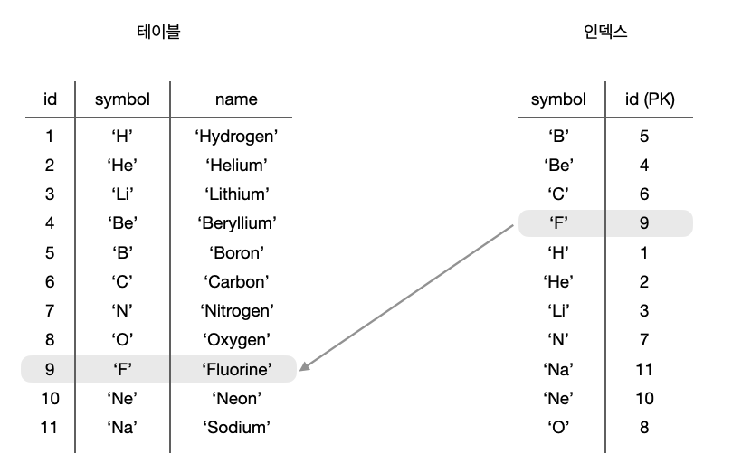
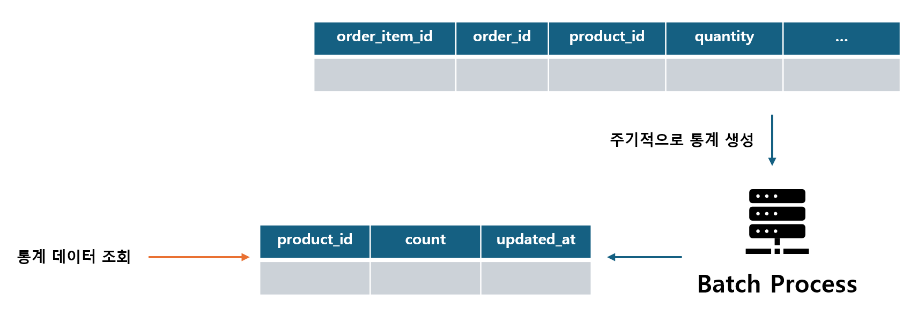

# Chapter. 2-3 서버구축-데이터베이스 기본

챕터: Chapter 2
과제: 과제 : 이번 챕터 과제 (https://www.notion.so/23c2dc3ef514807c9f45d14b8b3a938a?pvs=21)

<aside>
🎯 **들어가면서, TDD와 클린아키텍처 적용하기**

</aside>

- TDD Chapter Summary
    
    ### 실제 현업에서 TDD 를 진행한다면 ?
    
    <aside>
    💡 TDD 는 **테스트가 중요하다** 를 인지하는 것부터 시작됩니다.
    
    </aside>
    
    우리가 **TDD** 가 왜 궁금하고, 왜 배우고 싶고, 왜 요즘 업계에서 자주 언급되는 지에 대해서 먼저 생각을 해보면 결국 뿌리는 **테스트가 중요하다** 를 인지 해야 하기 때문입니다. 약 3주간 TDD 챕터를 진행하며 주어진 시나리오를 기반으로 기능을 구현하고, 테스트 코드를 작성해보면서 어떻게 테스트 코드를 활용해 내 코드를 견고하게 할 지를 배워보았습니다.
    
    <aside>
    ❌ **우리에게 TDD 가 어려웠던 이유
    1.** **[ 경험 ]** Test Code 를 작성해본 적이 없다.
    **2.** **[ 분석 ]** 요구사항을 분석하고 기능을 작성할 때, 어떤 테스트가 필요한지 모르겠다.
    **3.** **[ 시간 ]** 기능 개발하기에도 바쁜데, 테스트 코드 작성할 시간적 리소스는 더욱이 부족하다.
    **4.** **[ 구조 ]** 내가 작성한 코드를 어떻게 테스트해야할지 모르겠다 ( feat. private method )
    
    </aside>
    
    최소한의 노력으로 우리 코드를 안전하게 보호하기 위해서 테스트가 필요하다는 점, 미연에 문제를 방지하기 위해서 꼭 필요하다는 점은 이제 인지했습니다. 그럼 우리가 TDD 를 현업에서 사용하기 위해선 어떤 규칙을 지켜나가야 할까요 ?
    
    <aside>
    💡 **내가 기능을 개발하는 방법 ( Feat. Unit Test )**
    1. ****요구사항을 분석 ( 어떤 기능을 제공해야하는지 )
    2. 실패하면 안되는 Input 을 정리 ( 실패 TC 에 대해 정의 )
    3. 2번의 TC 를 모두 만족시킬 수 있도록 기능을 구현
    4. 기능의 책임을 분석
        - 너무 다양한 TC 가 필요하지 않았는지
        - 너무 많은 책임이 주어져 있지는 않은지 ( 응집도 )
    5. 리팩토링
        - 적절한 위상의 책임을 가지고 있도록
        - 충분히 원자적으로 테스트가 가능하도록
    
    </aside>
    
    어렵고 도입하기도 쉽지 않았지만, 그래도 TDD를 하면 테스트코드만 잘 작성하는 것이 아닌, 서비스 코드에 대한 설계가 좀 더 나아진 것 같은 느낌이 들지는 않았나요?
    
    <aside>
    💡 **TDD를 하면서 더 나은 클래스 설계가 되었어요.**
    
    - 하나의 클래스에서 너무 많은 로직을 담지 않고 적절히 역할을 분리해야.. 그래야 테스트코드를 쉽게 짤 수 있더라고요..
    - 주구장창 로직부터 작성하지 않고, 어떤 역할을 하는 클래스들이 구조화되어야 하는지 미리 고민하게 되었어요. 테스트 코드를 먼저 작성하려면, 어떤 클래스들이 있어야 하고, 각각의 클래스가 무슨 역할을 해야할지 미리 생각해봐야 테스트코드를 작성할 수 있었어요.
    </aside>
    
- 클린아키텍처 잘 적용 했는지 아는 방법
    
    ### 실제 소프트웨어 아키텍처를 적용한다면 ?
    
    <aside>
    💡 Domain ? Entity ? 이게 뭐요..
    
    </aside>
    
    용어에서부터 벽이 느껴질 때가 있는데, 바로 위와 같이 여기저기서 쓰이는 용어들입니다. 심지어는 상황에 따라 달라지는 이 용어들로 소통하다보면, 서로 다른 이야기를 하는 경우도 종종 있는 것 같아요. 앞서 우리가 살펴본 소프트웨어 아키텍처 패턴에서 또한 용어의 다른 뜻 때문에 헷갈리는 분들이 많았을 거라고 생각해요. 그래서 좀 보편적으로 이해해보면 좋을 것 같습니다.
    
    - **도메인** ( Domain )
        - 특정 기능과 관련된 속성, 기능 등을 응집화시킨 개념
        - e.g.
            - 도메인 이해도가 높아야 한다. = 해당 기능을 구성하는 하위 도메인에 대한 유기적 흐름 이해가 가능하다.
            - 도메인 모델 = 기능적으로 군집화시켜놓은 개념으로 일반적으로는 그 도메인을 표현하는 객체를 의미하며 POJO 일수도, JPA Entity 를 도메인 모델로 사용할 수도 있다.
            - 도메인 url = 하위 uri를 그루핑할 수 있는 응집화된 url
    - **엔티티** ( Entity )
        1. 도메인을 설명할때 말하는 엔티티 : 도메인 모델의 맥락에서 `특정 주제에 대한 속성 기능을 응집화시켜놓은 도메인 모델`
        2. DB 와 연관지어 말하는 엔티티 : DB 테이블이나 그 `테이블에 매핑되는 객체`
    
    그렇다면 도메인 맥락에서 db 엔티티와 분리되어 있다라는 말은 “나는 비즈니스 로직을 표현하기 위한 `“도메인 객체”를 DB 의 엔티티와는 상관없게` 표현할거야“ 라고 설명할수 있고, 그와 반대로 `DB 엔티티 (e.g. JPA Entity) 를 비즈니스의 대상이 되는 도메인 모델`로서 정의할 수도 있겠죠.
    
    만약 `도메인 모델 != 엔티티 라는 설계`를 통해 아예 데이터베이스와 별개로 나는 비즈니스 로직을 강한 응집도를 주고, 외부의존성은 내 비즈니스 룰을 따라야 해! 라는 룰을 가져간다면 도메인영역 (핵심 비즈니스 로직) 은 엔티티를 모를테고, 이 경우 엔티티를 통해 db와 상호작용하는 datasource layer는 도메인 -> 엔티티, 엔티티 -> 도메인 의 작업을 수행하여 “`내가 아는 언어`” 로 변경해야 합니다.
    
    <aside>
    💡 시작은 패키지부터. 유연성을 보장하고 확장 가능한 패키지 구조.
    
    </aside>
    
    멘토링하면서 혹은 현업에서 항상 가장 많이 받는 질문 중 하나입니다. 멀티 모듈은 어떻게 구성하는 게 좋을까요 ? 패키지는 어떻게 나누는게 좋을까요 ? 이런 질문들을 항상 받곤 하는 것 같아요. 그래서 저라면 어떤 관점에서 설계할 것인가를 적어보았습니다.
    
    일단 기본은 앞서 발제 때, 코칭 때 설명한 것과 같이 비즈니스 로직을 보호하기 위해 Repository 를 추상화하여 비즈니스 로직이 DB 와 실제 상호작용하는 부분을 모르게 할 거예요. 그 이유는 내 비즈니스는 어떻게 어디에서 무엇을 가져오는지에 관심을 가지기보다 내가 수행해야할 기능에 집중하도록 작성하기 위해서입니다.
    
    위와 같이 나누어 놓고 보니, **도메인** 별로 강한 응집도를 가진 패키지 구조를 가지게 되었습니다. 만약 내가 User 를 개발하면서 Lecture 에 대한 정보를 사용해야 한다면, `lecture` 패키지만 보면 모든 것을 파악할 수 있게 됩니다.
    
    만약 서버를 분리해야 한다 ? 하면 도메인을 뚝 떼서 가져다가 새로운 프로젝트를 구성해도 되겠죠.
    
    ```kotlin
    api/
      도메인/
    	  controller
    	  dto/
    		  (request, response models)
    domain/
    	도메인/ (user, lecture, comment, ...)
    		(Models)
    			- Lecture
    			- ApplicationHistory
    		(Service)
    			- LectureService
    		(Repositories)
    			- LectureReaderRepository (I/F)
    			- LectureStoreRepository (I/F)
    		infrastructure/
    			- LectureCoreReaderRepository (IMPL)
    			- LectureCoreStoreRepository (IMPL)
    			- LectureJpaRepository (JPA)
    			- LectureCustomRepository (QueryDSL)			
    ```
    
    하지만 우리는 일반적으로 API 서버만 작성하는 것이 아니라 관리자 ( Admin ) 애플리케이션도 같이 작성하곤 합니다. 대상은 다르지만 같은 도메인 컨텍스트를 공유하기 때문이죠.
    
    그런 경우, 저는 뷔페식 패키지 구조를 가져가기 위해 서비스를 잘게 나누고 비즈니스 로직의 완성을 Service 가 아닌 각 애플리케이션의 UseCase 단위로 조립할 수 있도록 변경합니다.
    
    <aside>
    💡 뭐 좋아할지 몰라 다 차려놨어. 먹고 싶은 거 가져다가 알아서 먹어.
    
    </aside>
    
    ```kotlin
    admin/
    	도메인/
    		view/
    		usecase/
    			- ModifyLectureUseCase
    			- GetMyApplicationsUseCase
    api/
      도메인/
    	  controller
    	  dto/
    		  (request, response models)
    	  usecase/
    		  (Usecase = 각 비즈니스에 맞춰 component 조립)
    		  - ApplyLectureUseCase
    		  - GetLecturesUseCase  
    domain/
    	도메인/ (user, lecture, comment, ...)
    		(Models)
    			- Lecture
    			- ApplicationHistory
    		(Components)
    			- LectureReader
    			- LectureModifier
    			- ApplicationManager
    		(Repositories)
    			- LectureReaderRepository (I/F)
    			- LectureStoreRepository (I/F)
    		infrastructure/
    			- LectureCoreReaderRepository (IMPL)
    			- LectureCoreStoreRepository (IMPL)
    			- LectureJpaRepository (JPA)
    			- LectureCustomRepository (QueryDSL)
    ```
    

<aside>
⛵ **이번 챕터 목표**

</aside>

- 시나리오가 요구하는 요구사항을 명확히 분석하기
- 유지보수, 확장 가능한 코드에 대해 끊임없이 고민하기
- 테스트 가능한 구조 및 테스트 코드 작성에 집중하기
- 견고하지만 유연한 서버 애플리케이션을 구축하기

<aside>
🚩 **What to do: 이번 챕터에 해야 할 것. 이것만 집중하세요!**

</aside>

# DB Table 설계

## **DB Table 설계 원칙**

- 테이블은 동일한 위상의 데이터 군집으로 구성한다.
    - 상품과 상품 리뷰를 하나의 테이블에 섞지 않는다.
- 명확한 데이터 타입과 제약조건을 설정한다.
    - 전화번호를 저장하기 위해 `VARCHAR(255)`는 필요하지 않다.
    - `NOT NULL`, `UNIQUE`, `DEFAULT`, …
- 조회/검색에 필요한 인덱스를 설계 초기부터 고려한다.
    - `WHERE`, `JOIN`, `GROUP BY`, `ORDER BY` 조건에 자주 사용되는 컬럼을 식별한다.
    - 과도한 인덱스는 쓰기 성능을 저하시키고 디스크 사용량이 증가하므로 주의한다.
- 적절한 정규화, 반정규화를 통해 데이터를 구성한다.
    - **반정규화**: 일부 중복을 허용해 읽기 성능을 높인다. **(읽기 성능 ↑)**
    - **정규화**: 데이터 중복을 줄이고 일관성을 높인다. **(쓰기 성능 ↑)**

- **반정규화된 `상품` 테이블 예시**
    
    ```mermaid
    erDiagram
    PRODUCT {
        int id PK "NOT NULL | 상품 ID"
        string name "NOT NULL | 상품명"
        long price "NOT NULL | 가격"
        string size "NULLABLE | 사이즈"
        string color "NOT NULL | 색상"
        int quantity "NOT NULL | 수량"
    }
    ```
    
    - `PRODUCT` 테이블
        
        
        | id | name | price | size | color | quantity |
        | --- | --- | --- | --- | --- | --- |
        | 1 | 모자 | 10000 | FREE | Green | 200 |
        | 2 | 모자 | 10000 | L | White | 150 |
        | 3 | 셔츠 | 15000 | M | White | 100 |
        | 4 | 셔츠 | 15000 | L | White | 300 |
        | 5 | 셔츠 | 15000 | L | Black | 400 |
    - 읽기 예시
        - `name='셔츠'` 의 가격 조회
            
            ```sql
            SELECT price
            FROM PRODUCT
            WHERE name='셔츠'
            ```
            
            - 상품별 가격은 동일하나 **3개** 행 조회
        - `name='셔츠', size='L', color='White'`의 수량 조회
            
            ```sql
            SELECT quantity
            FROM PRODUCT
            WHERE name = '셔츠' AND size='L' AND color='White';
            ```
            
    - 쓰기 예시
        - `name='셔츠'`의 가격 업데이트
            
            ```sql
            UPDATE PRODUCT
            SET price = 20000
            WHERE name = '셔츠';
            ```
            
            - 하나의 상품 가격 업데이트를 위해 **3개** 행 변경
        - `name='셔츠', size='L', color='White'`의 수량 업데이트
            
            ```sql
            UPDATE PRODUCT
            SET quantity = 7
            WHERE name = '셔츠' AND size='L' AND color='White';
            ```
            
        - 새로운 상품 추가
            
            ```sql
            INSERT INTO PRODUCT (id, name, price, size, color, quantity)
            VALUES (5, '바지', 5000, 'M', 'White', 100);
            INSERT INTO PRODUCT (id, name, price, size, color, quantity)
            VALUES (6, '바지', 5000, 'M', 'Black', 100);
            INSERT INTO PRODUCT (id, name, price, size, color, quantity)
            VALUES (7, '바지', 5000, 'L', 'Red', 100);
            ```
            
    - 하나의 상품 테이블에 서로 다른 식별 단위가 혼재되어 데이터의 중복이 발생한다.
        - 이름이 같은 상품은 사이즈, 색상과 관계 없이 동일한 가격을 갖는다.
            - `name` 은 **상품**의 식별자가 되고,
            - ⇒ `price`는 `name`에 종속된다.
        - 상품은 사이즈, 색상에 따라 재고가 다르다.
            - `name`, `size`, `color`는 **구체적인 상품**의 식별자가 되고,
            - ⇒ `quantity` 는 `name`, `size`, `color`에 종속된다.
    - 기능 확장에 불리한 구조
        - 휴대전화 상품이 추가되었는데, 옵션이 ‘저장소 용량’ 이라면?
            - `PRODUCT` 테이블에 용량 컬럼을 추가한다.
            - ⇒ 휴대전화 상품들은 `size`, `color`가 모두 NULL로 저장된다.
            - ⇒ NOT NULL 등 제약조건 설정이 사실상 불가능하다.
    - 읽기 성능
        - ✅ `PRODUCT`에 모든 속성이 포함되어 있고, 조인 없이 단일 테이블만을 조회하기 때문에 단순 조회 쿼리는 일반적으로 빠르다.
    - 쓰기 성능
        - ⚠️ 옵션(`size`, `color`)이 늘어날수록 데이터 중복이 증가하고, 디스크를 비효율적으로 사용한다.
- **정규화된 `상품` 테이블 예시**
    
    ```mermaid
    erDiagram
        
    PRODUCT ||--o{ PRODUCT_OPTION : "상품 옵션"
    PRODUCT_OPTION ||--|| PRODUCT_STOCK : "재고 관리"
    
    PRODUCT {
        int id PK "NOT NULL | 상품 ID"
        string name "NOT NULL | 상품명"
        long price "NOT NULL | 가격"
    }
    
    PRODUCT_OPTION {
        int id PK "NOT NULL | 옵션 ID"
        int product_id FK "NOT NULL | 상품 ID"
        string size "NULLABLE | 사이즈"
        string color "NULLABLE | 색상"
    }
    
    PRODUCT_STOCK {
        int id PK "NOT NULL | 재고 ID"
        int product_option_id FK "NOT NULL | 옵션 ID"
        int quantity "NOT NULL | 수량"
    }
    ```
    
    - `PRODUCT` 테이블
        
        
        | id | name | price |
        | --- | --- | --- |
        | 1 | 모자 | 10000 |
        | 2 | 셔츠 | 15000 |
    - `PRODUCT_OPTION` 테이블
        
        
        | id | product_id | size | color |
        | --- | --- | --- | --- |
        | 10 | 1 | FREE | Green |
        | 20 | 1 | L | White |
        | 30 | 2 | M | White |
        | 40 | 2 | L | White |
        | 50 | 2 | L | Black |
    - `PRODUCT_STOCK` 테이블
        
        
        | id | product_option_id | quantity |
        | --- | --- | --- |
        | 100 | 10 | 200 |
        | 200 | 20 | 150 |
        | 300 | 30 | 100 |
        | 400 | 40 | 300 |
        | 500 | 50 | 400 |
    - 읽기 예시
        - `name='셔츠'` 의 가격 조회
            
            ```sql
            SELECT price
            FROM PRODUCT
            WHERE name='셔츠'
            ```
            
            - **1개** 행 조회
        - `name='셔츠', size='L', color='White'`의 수량 조회
            
            ```sql
            SELECT stk.quantity
            FROM PRODUCT_STOCK stk
             JOIN PRODUCT_OPTION opt ON stk.product_option_id = opt.id
             JOIN PRODUCT product ON opt.product_id = product.id
            WHERE product.name = '셔츠'
              AND opt.size = 'L'
              AND opt.color = 'White';
            ```
            
            - 만약 `PRODUCT_STOCK`의 식별자(ID)를 알고 있다면?
                
                ```sql
                SELECT quantity
                FROM PRODUCT_STOCK
                WHERE product_option_id = 40;
                ```
                
                ```sql
                SELECT quantity
                FROM PRODUCT_STOCK
                WHERE id = 400;
                ```
                
    - 쓰기 예시
        - `name='셔츠'`의 가격 업데이트
            
            ```sql
            UPDATE PRODUCT
            SET price = 20000
            WHERE name = '셔츠';
            ```
            
            - **1개** 행 수정
        - `name='셔츠', size='L', color='White'`의 수량 업데이트
            
            상품 정보 조회 시 식별자(ID)를 같이 획득하고, 업데이트에 활용하는 것이 일반적이다.
            
            ```sql
            UPDATE PRODUCT_STOCK
            SET quantity = 7
            WHERE product_option_id = 30;
            ```
            
            ```sql
            UPDATE PRODUCT_STOCK
            SET quantity = 7
            WHERE id = 300;
            ```
            
            - ~~식별자(ID)를 모른다면?~~ (권장하지 않음)
                
                ```sql
                UPDATE PRODUCT_STOCK stk
                  JOIN PRODUCT_OPTION opt ON stk.product_option_id = opt.id
                  JOIN PRODUCT product ON opt.product_id = product.id
                SET stk.quantity = 7
                WHERE product.name = '셔츠'
                  AND opt.size = 'L'
                  AND opt.color = 'White';
                ```
                
        - 새로운 상품 추가
            
            ```sql
            INSERT INTO PRODUCT (id, name, price)
            VALUES (3, '바지', 5000);
            
            INSERT INTO PRODUCT_OPTION (id, product_id, size, color) 
            VALUES (50, 3, 'M', 'White'),
                   (60, 3, 'M', 'Black'),
                   (70, 3, 'L', 'Red');
            
            INSERT INTO PRODUCT_STOCK (id, product_option_id, quantity)
            VALUES (1000, 50, 100),
                   (2000, 60, 100),
                   (3000, 70, 100);
            ```
            
    - 정리
        - 정규화를 통해 식별자에 대한 중복을 대부분 제거했다.
        - 기능 확장에 유리한 구조
            - 휴대전화 상품이 추가되었는데, 옵션이 ‘저장소 용량’ 이라면?
                1. `~~PRODUCT_OPTION` 테이블에 용량 컬럼을 추가한다.~~
                2. `PRODUCT_CLOTHING_OPTION` `PRODUCT_PHONE_OPTION` 테이블로 분리한다.
                3. `PRODUCT_OPTION` 테이블을 옵션 키/값 컬럼만 갖도록 구성하고, `PRODUCT_OPTION` : `PRODUCT_STOCK` = N : M 관계로 변경한다.
                4. …
    - 읽기 성능
        - ⚠️ `PRODUCT`, `PRODUCT_OPTION`, `PRODUCT_STOCK` 테이블에 속성이 나뉘어 있으므로, 모든 속성을 조회하기 위해서는 **조인(JOIN)** 쿼리가 필요하다.
    - 쓰기 성능
        - **✅** 옵션이 늘어나더라도 데이터 중복이 적고, 디스크를 효율적으로 사용한다.

- 성능은 쿼리 패턴에 따라 다른 양상을 보이기도 한다. **하나의 절대적인 기준은 없다.**
    - 재고(`quantity`)가 빨리 소진되는 인기 상품의 업데이트
        - 높은 수준의 정합성을 보장하기 위해 LOCK을 사용한다면?
        - ⚠️ 반정규화된 `PRODUCT` 테이블은 해당 상품 행의 **읽기, 쓰기 모두** 대기할 수 있다.
            - **✅** 정규화된 테이블은 `PRODUCT_STOCK` 으로 **락 범위를 줄일 수 있다.**
    - 상품의 등록/삭제가 빈번하게 발생
        - **✅** 반정규화된 `PRODUCT` 테이블은 INSERT나 DELETE 로직이 **비교적 단순**하다.
        - ⚠️ 정규화된 `PRODUCT`, `PRODUCT_OPTION`, `PRODUCT_STOCK` 테이블에 한꺼번에 INSERT, DELETE를 수행하고 트랜잭션으로 묶어야 한다.

**서비스 요구사항과 읽기/쓰기 쿼리의 종류에 따라 정규화 정도를 적절히 조정한다.**

- `size` 또는 `color` 도 중복이지 않을까?
- ‘White’를 ‘흰색’으로 변경하고 싶다면?
- 사이즈와 색상에 따라 가격이 달라진다면?
- https://mangkyu.tistory.com/110

# DB Index, Query Plan, Query Optimization

## **DB Index**

- 검색 속도 향상을 위해 데이터 ( row ) 를 식별 가능하도록 저장하는 객체 ( e.g. 목차 )
- `검색 속도 향상` 를 통해 `DB 부하 감소` 목적
- 특정 컬럼으로 인덱스를 설정하면, 해당 컬럼의 값을 정렬해서 데이터를 적재해둔다.
    
    
    
    - 테이블에서 symbol = ‘F’ 찾기 vs 인덱스에서 symbol = ‘F’ 찾기
- 인덱스는 조회 성능을 높일 수 있지만 아래 사항들을 고려하여 설계해야 한다.
    - **한 번에 찾을 수 있는 값** - 데이터 중복이 적은 컬럼
    - **인덱스 재정렬 최소화** - 데이터 삽입, 수정이 적은 컬럼
    - **인덱스의 목적은 검색** - 조회에 자주 사용되는 컬럼
    - **너무 많지 않은 인덱스** - 인덱스 또한 공간을 차지함

<aside>
⛔ **주의할 점
*** 인덱스는 저장을 위해 별도의 공간이 필요함 ( 너무 많아도 문제 )
* 인덱스 조정을 위해 데이터의 삽입/수정/삭제 연산 성능이 하락

</aside>

<aside>
❔ 그럼 언제 필요할까?
- 데이터가 너무 많아 조건에 맞게 조회하는 데에 속도가 오래 걸리는 경우
- 인덱스만으로 데이터를 찾을 수 있는 경우

</aside>

- 그런데 인덱스는 왜 `실제 데이터`를 저장하지 않고 `PK`를 저장한다고 표현했을까?
    - **(참고) MySQL에서 데이터를 저장하는 방식**
        - 테이블의 데이터는 물리적으로 디스크에 파일 형태로 저장된다.
        - MySQL의 InnoDB 엔진은 데이터를 **B+Tree 구조의 인덱스**로 관리하며, 특히 **기본키(PK)**를 기준으로 데이터를 정렬하여 저장한다.
        - InnoDB는 인덱스를 다음과 같은 방식으로 관리한다.
            - PK를 기준으로 정렬하고, PK와 실제 데이터를 매핑한 인덱스를 **클러스터드 인덱스(Clustered Index)**라 한다.
                
                ```sql
                CREATE TABLE PRODUCT
                (
                   id    INT          NOT NULL PRIMARY KEY COMMENT '상품 ID',
                   name  VARCHAR(100) NOT NULL COMMENT '상품명',
                   price BIGINT       NOT NULL COMMENT '가격'
                )
                ```
                
                ```sql
                INSERT INTO PRODUCT VALUES (20, 'Coat', 10000);
                INSERT INTO PRODUCT VALUES (10, 'Shirt', 8000);
                
                SELECT * FROM PRODUCT;
                # INSERT 순서에 관계없이 **PK** 기준으로 정렬한다!
                ```
                
                | id (PK) | name | price |
                | --- | --- | --- |
                | **10** | Shirt | 8000 |
                | **20** | Coat | 10000 |
            - PK 이외의 컬럼을 대상으로 직접 생성하는 인덱스는 보조 인덱스**(Secondary Index)**라 하고, 지정한 컬럼을 정렬해 PK를 매핑하는 방식으로 구성된다.
                
                ```sql
                CREATE INDEX idx_product_01 ON PRODUCT(name);
                ```
                
                | name | id (PK) |
                | --- | --- |
                | Coat | 20 |
                | Shirt | 10 |
- 인덱스가 없는 테이블에서 symbol = ‘F’ 찾기를 시도한다면 테이블 전체를 순차적으로 탐색한다.
    - ‼ 중복된 데이터가 얼마나 존재하는지 알 수 없으니 **항상** 전체 테이블을 탐색한다!
    - `풀 테이블 스캔`이라 표현하며, 데이터가 많을수록 당연히 느려진다.
- 내가 실행하는 쿼리가 얼마나 효율적인지 어떻게 판단해야 할까?

## **Query Plan**

- 쿼리를 작성했다고 해서 항상 효율적으로 실행되지는 않는다.
- 쿼리 실행계획(Query Plan, 쿼리플랜)을 통해 인덱스를 제대로 활용하는지, 불필요한 작업이 있는지 등을 확인하여 사전에 성능 병목을 파악하고 개선할 수 있다.

### `EXPLAIN` 키워드

- MySQL에서는 `EXPLAIN` 키워드를 사용하면 쿼리에 대한 실행계획을 확인할 수 있다.
    
    ```sql
    EXPLAIN SELECT name FROM elements WHERE symbol = 'F';
    ```
    
    | id | select_type | table | partitions | type | possible_keys | key | key_len | ref | rows | filtered | Extra |
    | --- | --- | --- | --- | --- | --- | --- | --- | --- | --- | --- | --- |
    | 1 | SIMPLE | elements | null | ALL | null | null | null | null | 1 | 100 | Using where |
- 모든 컬럼은 각각의 의미를 가지지만, 우선은 **성능 저하를 직접 유발할 수 있는 주요 지표만** 집중한다.
    - `type`
        - **ALL** ⇒ ⚠️ 풀 테이블 스캔
    - `key`
        - **NULL** ⇒ ⚠️ 인덱스가 사용되지 않음
- `WHERE` 로 단순하게 필터링하는 것이 아닌, `GROUP BY`나 `ORDER BY` 를 사용한다면 다음과 같은 문구도 표시될 수 있다.
    - `Extra`
        - **Using filesort** ⇒ ⚠️ 정렬을 위해 메모리 또는 디스크에서 별도의 정렬 작업을 수행
        - **Using temporary** ⇒ ⚠️ 결과를 위해 메모리나 디스크에 임시 테이블을 생성함
- 쿼리 성능 이슈는 단순히 인덱스 유무뿐 아니라, 데이터 분포, 조건절 작성 방식, 조인 순서 등에 따라 달라질 수 있다.
- `EXPLAIN` 결과를 해석하는 것이 쿼리 최적화의 시작이다.

## Query Optimization

- DB가 쿼리를 더 효율적으로 실행하도록 개선하는 과정
    1. **인덱스 추가를 통해 탐색을 더 빠르게 하도록 유도**
    2. 불필요한 서브쿼리, 조인 등 쿼리의 비효율적인 패턴을 개선하여 쿼리 구조를 재설계

### **꼭 알아야 하는 Index**

- **`단일 Index`** - 1개 컬럼으로 구성된 Index
- **`복합 Index`** - 여러 컬럼으로 구성된 Index
- **`Covering Index`** - 특정 쿼리를 충족시키는 데 필요한 모든 데이터를 포함하는 인덱스
    
    → Table Access 없이 Index Scan 만으로 원하는 데이터를 찾을 수 있음
    
    → Index Scan 만 발생하므로 높은 조회 성능을 가질 수 있음
    
    → But 너무 많은 데이터를 포함하거나 인덱스 종류가 많아지면, 그로 인한 성능 저하
    

### 복합 인덱스

```sql
CREATE TABLE hanghae_members (
  id BIGINT PRIMARY KEY,                -- ID(PK)
  name VARCHAR(5),                      -- 이름
  gender VARCHAR(5),                    -- 성별
  age INT,                              -- 나이
  course VARCHAR(10),                   -- 과정명
  team_number INT,                      -- 팀 번호
  account_number VARCHAR(20)            -- 계좌번호
);
```

| id | name | gender | age | course | team_number | account_number |
| --- | --- | --- | --- | --- | --- | --- |
| 1 | 김민지 | 여 | 29 | BE | 1 | 110-1234-5678 |
| 2 | 이준호 | 남 | 32 | BE | 1 | 100-9876-5432 |
| 3 | 박서연 | 여 | 26 | FE | 3 | 120-1111-2222 |
| 4 | 정우진 | 남 | 28 | FE | 5 | 130-2222-3333 |
| 5 | 최지훈 | 남 | 35 | BE | 4 | 140-3333-4444 |
| 6 | 한예은 | 여 | 31 | BE | 2 | 150-4444-5555 |
| 7 | 송지호 | 남 | 27 | FE | 2 | 160-5555-6666 |
| 8 | 윤다은 | 여 | 30 | AI | 2 | 170-6666-7777 |
| 9 | 조현우 | 남 | 33 | BE | 9 | 180-7777-8888 |
| 10 | 백수진 | 여 | 25 | BE | 5 | 190-8888-9999 |
| 11 | 강하늘 | 남 | 34 | AI | 1 | 200-9999-0000 |
1. **단순 `WHERE` 조건들의 조합**
    - 예시 쿼리
        
        ```sql
        SELECT id FROM hanghae_members
        WHERE gender='남' AND team_number=1;
        ```
        
    - 복합 인덱스
        
        ```sql
        CREATE INDEX hanghae_members_idx_01
        ON hanghae_members(team_number, gender);
        ```
        
    - `WHERE`에 필터링 조건들이 나열되는 경우, 일반적으로 **카디널리티가 높은 순으로 배치**한다. 선행 조건에서 최대한 많은 데이터를 걸러내면 효율적으로 인덱스를 사용할 수 있다.
        1. 팀 번호(team_number)
            - 팀 개수는 9개 이상으로 비교적 카디널리티가 높음
        2. 성별(gender)
            - 50% 의 데이터만 걸러낼 수 있으므로 성별 기준 전체 조회가 아니면 유의미하지 않음.
    - `WHERE` 내 **컬럼 순서와 무관**하게 인덱스가 적용된다.
        - MySQL은 인덱스를 적용할 수 있는 가장 효율적인 순서로 조건들을 평가하므로, 쿼리에 명시된 순서 자체는 인덱스 사용 여부에 영향을 미치지 않는다.
        - (참고: MySQL Optimizer)
    - 위와 같은 인덱스를 구성하고 성별(gender) 조건만으로 쿼리한다면?
        - **첫 번째 컬럼**이 조건에 포함되지 않는 경우 인덱스 활용이 불가능하다.
    - 다른 컬럼들이 필터링 조건이면 인덱스의 선행 컬럼으로 적절할까?
        - 이름, 계좌번호
            - 중복값이 거의 없으므로 검색 조건과 일치하지 않는 데이터 대부분을 걸러낼 수 있다.
        - 나이
            - 연령 차이가 크지 않으므로 많은 데이터를 걸러낼 수 없다.
2. **`WHERE` 내 범위 조건 조합**
    - 예시 쿼리
        
        ```sql
        SELECT id FROM hanghae_members
        WHERE course='BE' AND team_number=1 AND **age>=30**;
        ```
        
    - 복합 인덱스
        
        ```sql
        CREATE INDEX hanghae_members_idx_02
        ON hanghae_members(course, team_number, age);
        ```
        
    - 쿼리에 범위 조건이 포함되어 있는 경우, 일반적으로 **범위 조건 컬럼은 뒤에 배치**한다.
    - 범위 조건 컬럼까지 인덱스를 활용해 효율적으로 조회할 수 있다.
        
        
        | course | team_number | age |
        | --- | --- | --- |
        | BE | 1 | 29 |
        | BE | 1 | **32** |
        | BE | 2 | 31 |
        | FE | 1 | 25 |
        | … | … | … |
    - 만약 중간 컬럼이 범위 조건이라면?
        
        ```sql
        SELECT id FROM hanghae_members
        WHERE course='BE' AND **(team_number BETWEEN 1 AND 3)** AND age=30;
        ```
        
        - 인덱스를 보면 동일한 team_number 내에서 age는 정렬되어 있지만, 여러 team_number가 선택되면 age는 정렬된 상태가 아니다.
        - 인덱스를 제대로 활용하지 못하고, 성능 저하 가능성이 있다.
            
            
            | course | team_number | age |
            | --- | --- | --- |
            | BE | 1 | **29** |
            | BE | 1 | **32** |
            | BE | 2 | **31** |
            | FE | 1 | 25 |
            | … | … | … |
    - (참고) 동등 조건과 범위 조건
        
        
        | 구분 | 의미 | 예시 |
        | --- | --- | --- |
        | 동등 조건 | 값이 정확히 일치 | `=` , `<=>`, `IS NULL`, `IN (...)` |
        | 범위 조건 | 값이 범위 안에 포함 | `>`, `<`, `>=`, `<=`, `BETWEEN`, `!=`, `<>`, `LIKE`, `IS NOT NULL`  |
3. **복합 인덱스를 사용한 `ORDER BY`**
    - 예시 쿼리
        
        ```sql
        SELECT id FROM hanghae_members
        WHERE course='BE' AND team_number=1
        ORDER BY age;
        ```
        
    - 복합 인덱스
        
        ```sql
        CREATE INDEX hanghae_members_idx_02
        ON hanghae_members(course, team_number, age);
        ```
        
    - 복합 인덱스의 선행 컬럼이 모두 **동등 조건**일 때, 마지막 컬럼은 이미 정렬되어 있기 때문에 **추가적인 정렬 없이** 처리가 가능하다.
    - 만약 선행 컬럼이 **범위 조건**이라면?
        
        ```sql
        SELECT id FROM hanghae_members
        WHERE course='BE' AND **(team_number BETWEEN 1 AND 3)**
        ORDER BY age;
        ```
        
        - 인덱스에서 age를 정렬한 상태로 가져올 수 없기 때문에 쿼리플랜에 `Using filesort` 가 발생한다.
4. 복합 인덱스를 사용한 `GROUP BY` 
    - 예시 쿼리
        
        ```sql
        SELECT team_number, gender, count(*) FROM hanghae_members
        WHERE course='BE'
        GROUP BY team_number, gender;
        ```
        
    - 복합 인덱스
        
        ```sql
        CREATE INDEX hanghae_members_idx_03
        ON hanghae_members(course, team_number, gender);
        ```
        
    - **동등 조건** 처리 후 `GROUP BY` 대상 컬럼들이 정렬되어 있다면, 이미 동일한 데이터끼리 군집화할 수 있는 상태가 되므로 **임시 테이블을 통한 집계, 정렬 없이** 처리가 가능하다.
    - 만약 **범위 조건**이 포함되어 있다면?
        
        ```sql
        SELECT team_number, gender, count(*) FROM hanghae_members
        WHERE course='BE' AND **age>=30**
        GROUP BY team_number, gender;
        ```
        
        - 직접 튜닝해 보세요!

### **정리 - Index 주의사항**

1. 인덱스는 컬럼의 **가공되지 않은 원본 값** 기준으로 정렬되어 있으므로, 연산이 필요하면 컬럼이 아니라 리터럴에 적용한다.
    
    ```sql
    ## price 컬럼에 인덱스가 적용된 경우
    
    # 올바른 인덱스 사용
    WHERE price > 10000 / 100; // price 컬럼에 대한 Index Search
    
    ## 잘못된 인덱스 사용
    WHERE price * 100 > 10000; // price * 100 에 대한 Index X
    ```
    
2. 범위 조건의 컬럼도 인덱스를 활용 수 있으나, 그 뒤의 컬럼은 인덱스를 활용하기 어렵다.
3. AND 는 ROW 를 줄이지만 OR 는 비교를 위해 ROW 를 늘리므로 인덱스를 활용하기 어렵다.
4. IN 조건은 개수에 따라 인덱스 활용 여부가 달라진다.
    
    > IN 은 = 연산을 여러번 수행한 것이므로 일반적으로는 인덱스를 활용할 수 있다.
    > 
    
    > 너무 많은 조건을 IN으로 비교하는 경우 인덱스가 더 비효율적이라고 판단할 수 있다.
    > 
    
    (`eq_range_index_dive_limit` 참고)
    
5. 문자열 컬럼에 대한 LIKE 조건은 제한적으로 인덱스 활용이 가능하다.
    
    ```sql
    ## name 컬럼에 인덱스가 적용된 경우
    
    # 올바른 인덱스 사용
    WHERE name LIKE '김%'
    
    # 잘못된 인덱스 사용
    WHERE name LIKE '%민지%'
    ```
    
6. Covering 인덱스를 잘 활용한다.
    
    > 앞서 배운 것처럼 조회하고자 하는 모든 컬럼이 조회 대상, 조회 조건에 포함된다면 데이터를 찾기 위해 ROW 에 접근할 필요가 없으므로 높은 성능의 조회를 달성할 수 있다.
    > 
    
    > `SELECT *` 는 일반적으로 Covering 인덱스를 적용하기 어렵다.
    > 

<aside>
💡 인덱스는 Read 연산의 효율을 높이지만 ! CUD 연산에서는 오버헤드가 발생한다고?!

</aside>

### Sync Schedule Strategy

- 전략적으로 실시간 업데이트나 값을 조회하는 것이 아닌 `통계` 데이터를 활용하는 방법도 있음
- 앞서 말했던 자주 삽입, 수정되는 데이터에 대해 Index 를 적용할 경우 “배보다 배꼽이 커지는” 문제가 발생할 수 있음 ( 인덱스 또한 공간을 차지하므로 )

**Sync Schedule**

실시간성과 정합성의 Trade-Off 를 극복하기 위해 DB I/O 를 줄이고 `언젠가 정합성이 맞아 떨어지는` 환경을 구성하는 전략

- 주기적으로 통계 데이터를 **Batch Process** 를 통해 취합하고 Sync 를 맞추는 테이블을 생성
- 통계 데이터를 조회할 땐 통계용 테이블만을 조회 ( 조회 연산 성능 향상 )

      (유사 패턴 keyword: [materialized view pattern](https://youtu.be/8OFTB57G9IU?t=1294))



---

<aside>
🔔

**원활한 프로젝트 진행을 위한 학습 로드맵**

</aside>

### 10시간 학습 가이드

- Java 기반 학습 로드맵
    
    ---
    
    ### 📅 Day 1: 정규화와 반정규화, DB 설계 전략
    
    **🎯 목표**
    
    정규화와 반정규화 개념을 이해하고, 조회/쓰기 성능을 고려한 DB 설계 전략을 수립할 수 있다.
    
    **🛠 학습 키워드**
    
    - 정규화 vs 반정규화
    - 정규형 (1NF ~ 3NF)
    - 테이블 분리 전략 (정보 / 옵션 / 재고 분리)
    - Write vs Read 성능 Trade-Off
    
    **📌 To-Do List**
    
    - [ ]  상품 정보/옵션/재고를 나눈 설계 예시 그리기
    - [ ]  내가 맡은 서비스에서 테이블 구조 개선안 제시
    - [ ]  쓰기/읽기 중심 서비스에서 각각의 설계 비교
    
    ---
    
    ### 📅 Day 2: 인덱스 기본 개념과 설계 원칙
    
    **🎯 목표**
    
    Index의 동작 원리와 기본 전략을 이해하고, 실무에서 필요한 설계 기준(카디널리티 등)을 적용할 수 있다.
    
    **🛠 학습 키워드**
    
    - Index 개념 및 동작
    - 단일 인덱스 / 복합 인덱스 / Covering Index
    - 카디널리티 (Cardinality)
    - Index 성능 Trade-Off (쓰기 성능 ↓)
    
    **📌 To-Do List**
    
    - [ ]  단일/복합 인덱스 생성 SQL 실습
    - [ ]  조회 쿼리에 대한 적절한 인덱스 설계하기
    - [ ]  카디널리티 기준으로 어떤 컬럼에 인덱스를 걸지 판단해보기
    
    ---
    
    ### 📅 Day 3: Index 최적화 & 통계 테이블 전략
    
    **🎯 목표**
    
    복잡한 조회에서 성능 병목을 진단하고, 인덱스와 배치 전략(Materialized View)으로 해결 방안을 제시할 수 있다.
    
    **🛠 학습 키워드**
    
    - Index Scan vs Table Scan
    - 복합 인덱스 설계 시 주의사항
    - Covering Index 사례
    - Materialized View / Sync Schedule 전략
    
    **📌 To-Do List**
    
    - [ ]  조회 성능 병목 구간 파악 & 해결 전략 문서 작성
    - [ ]  통계성 데이터에 대한 정합성 vs 성능 트레이드오프 실습
    - [ ]  조회 대상/조건 컬럼만으로 구성된 Covering Index 구성
    
    ---
    
    ### 📅 Day 4: Spring Data JPA 기본 개념 & 매핑 설계
    
    **🎯 목표**
    
    JPA의 주요 개념과 엔티티 매핑 방식을 이해하고, 실무에서 자주 사용하는 관계 매핑 전략을 설계할 수 있다.
    
    **🛠 학습 키워드**
    
    - Entity / Repository / Domain 모델
    - 단방향 & 양방향 연관관계
    - 지연 로딩(Lazy) vs 즉시 로딩(Eager)
    - 영속성 컨텍스트 / 변경 감지
    
    **📌 To-Do List**
    
    - [ ]  정규화된 상품/옵션/재고 테이블을 엔티티로 설계하고 매핑하기
    - [ ]  `@OneToMany`, `@ManyToOne` 예제 실습
    - [ ]  `FetchType.LAZY` 기본 전략 실습 및 N+1 문제 확인
    - [ ]  Entity → DTO 변환 전략 고민하기
    
    ---
    
    ### 📅 Day 5: 쿼리 최적화 & 실전 Repository 설계 전략
    
    **🎯 목표**
    
    Spring Data JPA에서 성능을 고려한 Repository 설계 방법을 익히고, JPQL/QueryDSL 등을 통해 유연한 쿼리 작성 능력을 기른다.
    
    **🛠 학습 키워드**
    
    - `@Query` + JPQL
    - `EntityGraph`, `join fetch`
    - Query Method Naming 전략
    - Native Query vs JPA Query
    - 조회 성능 개선 전략 (`fetch join`, `DTO projection`, `페이징`)
    
    **📌 To-Do List**
    
    - [ ]  JPA 쿼리 메서드로 기본 조회 구현해보기
    - [ ]  N+1 이슈를 `@EntityGraph` 또는 `join fetch`로 해결해보기
    - [ ]  복잡한 조회 조건 → `@Query` 또는 QueryDSL 로 대체
    - [ ]  페이징 조회 시 count query 최적화 (e.g. countQuery 분리)
- Kotlin 기반 학습 로드맵
    
    ### 📅 Day 1: 정규화 / 반정규화 & 테이블 설계 전략
    
    **🎯 목표**
    
    Kotlin의 도메인 설계 철학에 맞춰 정규화 원칙과 실무형 테이블 분리를 이해하고 설계할 수 있다.
    
    **🛠 학습 키워드**
    
    - 정규화 단계 (1NF~3NF)
    - 반정규화 목적과 예시
    - Kotlin + JPA Entity 설계
    - 응집도 있는 도메인 모델링
    
    **📌 To-Do List**
    
    - [ ]  상품 / 옵션 / 재고 테이블 분리 실습
    - [ ]  JPA 기반 정규화/반정규화 설계 비교
    - [ ]  Kotlin data class로 도메인 설계
    
    ---
    
    ### 📅 Day 2: Index 기초 개념 및 설계 기준
    
    **🎯 목표**
    
    실무에서 자주 사용하는 인덱스 전략을 익히고, 조회 성능 향상을 위한 기준을 수립한다.
    
    **🛠 학습 키워드**
    
    - Index 기본 구조
    - 단일 / 복합 / Covering Index
    - 카디널리티, 조회 쿼리 분석
    - Kotlin DSL Query 분석 (e.g. Exposed, Jooq)
    
    **📌 To-Do List**
    
    - [ ]  데이터 중복도를 고려한 인덱스 컬럼 선정
    - [ ]  복합 인덱스 생성 및 성능 테스트
    - [ ]  Index 적용 전/후 쿼리 성능 비교
    
    ---
    
    ### 📅 Day 3: 성능 최적화 & 통계 테이블 전략
    
    **🎯 목표**
    
    조회 병목을 해결하기 위한 인덱스 튜닝과 배치 기반 통계 집계 구조를 설계한다.
    
    **🛠 학습 키워드**
    
    - Table vs Index Scan
    - Materialized View / 통계 테이블
    - Kotlin Batch 처리 (e.g. Spring Batch, Coroutine)
    - 조회 전용 View 설계
    
    **📌 To-Do List**
    
    - [ ]  조회 병목 지점 정의 & 개선안 정리
    - [ ]  Spring Batch를 통한 통계 테이블 생성 실습
    - [ ]  배치 통계를 활용한 실시간 쿼리 대체 설계
    
    ---
    
    ### 📅 Day 4: Spring Data JPA 기본 개념 & 매핑 설계
    
    **🎯 목표**
    
    JPA의 주요 개념과 엔티티 매핑 방식을 이해하고, 실무에서 자주 사용하는 관계 매핑 전략을 설계할 수 있다.
    
    **🛠 학습 키워드**
    
    - Entity / Repository / Domain 모델
    - 단방향 & 양방향 연관관계
    - 지연 로딩(Lazy) vs 즉시 로딩(Eager)
    - 영속성 컨텍스트 / 변경 감지
    
    **📌 To-Do List**
    
    - [ ]  정규화된 상품/옵션/재고 테이블을 엔티티로 설계하고 매핑하기
    - [ ]  `@OneToMany`, `@ManyToOne` 예제 실습
    - [ ]  `FetchType.LAZY` 기본 전략 실습 및 N+1 문제 확인
    - [ ]  Entity → DTO 변환 전략 고민하기
    
    ---
    
    ### 📅 Day 5: 쿼리 최적화 & 실전 Repository 설계 전략
    
    **🎯 목표**
    
    Spring Data JPA에서 성능을 고려한 Repository 설계 방법을 익히고, JPQL/QueryDSL 등을 통해 유연한 쿼리 작성 능력을 기른다.
    
    **🛠 학습 키워드**
    
    - `@Query` + JPQL
    - `EntityGraph`, `join fetch`
    - Query Method Naming 전략
    - Native Query vs JPA Query
    - 조회 성능 개선 전략 (`fetch join`, `DTO projection`, `페이징`)
    
    **📌 To-Do List**
    
    - [ ]  JPA 쿼리 메서드로 기본 조회 구현해보기
    - [ ]  N+1 이슈를 `@EntityGraph` 또는 `join fetch`로 해결해보기
    - [ ]  복잡한 조회 조건 → `@Query` 또는 QueryDSL 로 대체
    - [ ]  페이징 조회 시 count query 최적화 (e.g. countQuery 분리)
- TypeScript 기반 학습 로드맵
    
    ### 📅 Day 1: 정규화 / 반정규화 & 테이블 구조 설계
    
    **🎯 목표**
    
    비즈니스 로직에 맞는 효율적인 DB 스키마를 설계할 수 있도록 정규화/반정규화 전략을 이해한다.
    
    **🛠 학습 키워드**
    
    - 정규화 단계
    - 비정규화 조건
    - Entity-Relation 설계 (NestJS 기준)
    - Repository 패턴 적용
    
    **📌 To-Do List**
    
    - [ ]  상품 정보 / 옵션 / 재고 테이블 설계
    - [ ]  Prisma schema 혹은 TypeORM entity 작성
    - [ ]  테이블 정규화 & 반정규화 비교 분석
    
    ---
    
    ### 📅 Day 2: 인덱스 개념과 성능 개선 전략
    
    **🎯 목표**
    
    SQL 인덱스의 작동 방식을 정확히 이해하고 실무에서 성능 개선을 위한 설계를 할 수 있다.
    
    **🛠 학습 키워드**
    
    - Index 종류 (단일, 복합, Covering)
    - 카디널리티 기준 컬럼 선정
    - 인덱스 적용과 쿼리 성능 차이
    
    **📌 To-Do List**
    
    - [ ]  SELECT 성능 테스트 전/후 비교
    - [ ]  복합 인덱스에서 범위 조건 실험
    - [ ]  Index 적용 시 쿼리 계획(Query Plan) 확인
    
    ---
    
    ### 📅 Day 3: 성능 튜닝 & 통계 조회 최적화
    
    **🎯 목표**
    
    실시간성과 정합성의 트레이드오프를 이해하고, Materialized View 전략을 적용할 수 있다.
    
    **🛠 학습 키워드**
    
    - 통계 데이터 관리 전략
    - 통계 테이블 / materialized view
    - Prisma batch query
    - 비동기 작업과 일관성 처리
    
    **📌 To-Do List**
    
    - [ ]  실시간/비실시간 데이터 조회 전략 비교
    - [ ]  통계 테이블 schema 설계
    - [ ]  batch 작업으로 테이블 업데이트 구현
    
    ### 📅 Day 4: ORM 관계 매핑과 엔티티 설계
    
    **🎯 목표**
    
    정규화된 DB 구조를 Entity로 설계하고, 관계 매핑과 로딩 전략을 이해한다.
    
    **🛠 학습 키워드**
    
    - TypeORM
        - `@Entity`, `@Column`, `@PrimaryGeneratedColumn`
        - `@OneToMany`, `@ManyToOne`, `@JoinColumn`
        - Active Record vs Data Mapper
        - 지연 로딩 (`lazy: true`) vs 즉시 로딩
    - Prisma
        - `schema.prisma`, `model`, `@relation`
        - `@id`, `@default`, `@map`, `@@index`
        - Relation field: `product { option: Option[] }`
    
    **📌 To-Do List**
    
    - [ ]  상품/옵션/재고 관계 테이블 → Entity로 매핑해보기
    - [ ]  단방향, 양방향 관계 각각 구성해보기
    - [ ]  (TypeORM) 지연 로딩 설정과 `await relation` 테스트
    - [ ]  (TypeORM) `typeorm migration`으로 DDL 반영해보기
    - [ ]  (Prisma) 관계 방향 (1:N, 1:1) 설정 후 `relationMode` 테스트
    
    ---
    
    ### 📅 Day 5: ORM 쿼리 작성과 최적화 전략
    
    **🎯 목표**
    
    TypeORM의 쿼리 빌더, 조인, projection을 활용하여 성능을 고려한 데이터 접근을 설계한다.
    
    **🛠 학습 키워드**
    
    - TypeORM
        - `find`, `findOne`, `QueryBuilder`
        - `leftJoinAndSelect`, `select`, `where`, `orderBy`
        - `getRawMany`, `getCount`
        - N+1 문제 인식 및 해결
    - Prisma
        - `findMany`, `findUnique`, `where`, `include`, `select`
        - `orderBy`, `take`, `skip` (paging)
        - `$queryRaw`, `$transaction`
        - N+1 해결 전략: `include vs select`
    
    **📌 To-Do List**
    
    - [ ]  복합 조건이 포함된 조회 쿼리 작성 (`course`, `age`, `group by`)
    - [ ]  N+1 문제를 유도하고 `join`으로 해결하기
    - [ ]  DTO용 projection 쿼리 작성 (`select new` 스타일)
    - [ ]  페이지네이션 쿼리 (`take`, `skip`) 적용

### 3시간 학습 가이드

- DB 설계 & 조회 성능 최적화 핵심 로드맵
    
    ## 전체 학습 목표
    
    - 실무에 자주 등장하는 **조회 패턴과 쿼리 병목 원인**을 이해한다.
    - **인덱스의 실질적 활용법**을 익혀, **성능 최적화 관점에서 테이블과 쿼리를 설계**할 수 있는 감각을 기른다.
    
    ---
    
    ## 테이블 설계 전략 & 데이터 구조화 (60분)
    
    **목표**: 정규화/반정규화 기준과 테이블 설계 관점의 성능 영향 이해
    
    **핵심 키워드**: 설계 관점 중심
    
    ### 학습 포인트
    
    - **정규화 vs 반정규화**
        - 정규화: 데이터 중복 제거, 무결성 유지
        - 반정규화: 조인 최소화, 조회 성능 개선
    - **테이블 분리 기준**
        - 자주 변경되는 컬럼 → 별도 테이블 분리
        - 큰 텍스트 / JSON → 비핵심 테이블로 이동
    - **데이터의 크기와 성능**
        - Row 수가 많을수록 정렬/그룹핑 비용 증가
        - BLOB/CLOB 컬럼이 조회 성능에 미치는 영향
    
    ### 검색 키워드
    
    - **정규화/반정규화 예시 비교**
    - **대용량 테이블 분리 전략**
    
    ---
    
    ## 성능 병목 구간 진단법 (60분)
    
    **목표**: 쿼리 성능 저하의 원인을 도출하고 튜닝으로 개선하는 방법 익히기
    
    **핵심 키워드**: 분석 중심
    
    ### 학습 포인트
    
    - **EXPLAIN으로 실행 계획 해석**
        - `type = ALL`: Full Scan → 튜닝 대상
        - `key = NULL`: 인덱스 미사용
        - `rows` 수가 많은 경우 → 병목 가능성 ↑
    - **슬로우 쿼리 로그 분석**
        - 평균 처리 시간이 긴 쿼리 탐색
        - 주기적 통계 수집 및 분석
    - **인덱스 튜닝 사례**
        - 조회 조건과 정렬 조건이 일치하면 효율적
        - `created_at DESC`와 정렬용 인덱스
    
    ### 검색 키워드
    
    - **MySQL Explain 필드별 해석**
    - **실제 서비스 튜닝 사례**
    
    ---
    
    ## 인덱스 설계 전략 & 조회 성능 최적화 (60분)
    
    **목표**: 실무에서 자주 조회하는 패턴을 기반으로 어떤 인덱스가 유효한지 판단
    
    **핵심 키워드**: 설계 감각 중심
    
    ### 학습 포인트
    
    - 인덱스의 목적
        
        → 조회 성능 향상 + DB 부하 감소
        
    - 인덱스 종류 핵심 요약
        - **단일 인덱스**
        - **복합 인덱스**: *카디널리티 높은 순으로 설계*
        - **Covering Index**: 인덱스만으로 데이터 조회
    - 인덱스 설계할 때 유의점
        - 컬럼 그대로 사용하는 연산
        - **범위 조건 이후 컬럼은 인덱스 미적용**
        - **OR → Full Scan 확률 증가 / AND → 성능↑**
        - **IN 연산**은 인덱스 적용 가능
    - 실무 예시
        - 복합 인덱스: `product_id`, `status`, `ordered_at`
        - 통계 조회는 실시간이 아닌 **Batch + Sync Table 전략**
    
    ### 검색 키워드
    
    - **잘못된 인덱스 사용 쿼리 (곱셈 등)**
    - **Covering Index 예시 쿼리**
    - **복합 인덱스 순서 변경에 따른 성능 변화**
    
    ---
    
    ## 보너스: 실전 체크리스트
    
    학습 후 아래 항목을 점검해보세요!
    
    - [ ]  조회 성능이 중요한 기능에서 Full Scan이 발생하지 않는가?
    - [ ]  불필요한 `ORDER BY`, `GROUP BY`로 인한 정렬 비용이 과도하지 않은가?
    - [ ]  느린 쿼리에 적절한 인덱스를 사용하고 있는가?
    - [ ]  복합 인덱스의 순서가 쿼리 조건과 일치하는가?

<aside>
🚩 **과제 : 이번 챕터 과제**

</aside>

<aside>
🗓️ **Weekly Schedule Summary: 이번 주차 과제 요구 사항**

</aside>

`REPO를 새로 생성하셨다면 이것부터 세팅해주세요!`

- PR 템플릿 세팅하기!
    - Repo를 생성하고 `.github` 폴더를 생성 후 `pull_request_template.md` 파일을 만들어서 아래 템플릿을 복사/붙여넣기해주세요!
- PR 템플릿
    
    ```markdown
    ## :pushpin: PR 제목 규칙
    [STEP0X] 이름 - 선택 시나리오 (e-commerce/concert)
    
    ---
    ### **핵심 체크리스트** :white_check_mark:
    
    #### :one: Infrastructure Layer (3개)
    - [ ] 기존 설계된 테이블 구조에 대한 개선점이 반영되었는가? (선택)
    - [ ] Repository 및 데이터 접근 계층이 역할에 맞게 분리되어 있는가?
    - [ ] MySQL 기반으로 연동되고 동작하는가?
    
    #### :two: 통합 테스트 (2개)
    - [ ] infrastructure 레이어를 포함하는 통합 테스트가 작성되었는가?
    - [ ] 핵심 기능에 대한 흐름이 테스트에서 검증되었는가?
    
    #### :three: DB 성능 최적화 (3개)
    - [ ] 조회 성능 저하 가능성이 있는 기능을 식별하였는가?
    - [ ] 쿼리 실행계획(Explain) 기반으로 문제를 분석하였는가?
    - [ ] 인덱스 설계 또는 쿼리 구조 개선 등 해결방안을 도출하였는가?
    
    ---
    #### STEP07
    - [ ] 테이블 구조 개선안 (선택)
    - [ ] Infrastructure Layer 구성
    - [ ] 기능별 통합 테스트
    
    #### STEP08
    - [ ] 조회 성능 저하 기능 식별
    - [ ] 쿼리 실행계획 기반 문제 분석
    - [ ] 인덱스/쿼리 재설계 및 개선안 도출
    
    ### **간단 회고** (3줄 이내)
    - **잘한 점**: 
    - **어려운 점**: 
    - **다음 시도**:
    ```
    

### **`STEP07 - Integration`**

- (선택) 기존 설계된 테이블 구조의 개선이 필요한 점을 식별하고 ERD에 반영
- Infrastructure Layer 작성
- 기능별 통합 테스트 작성

> `Infrastructure` 는 RDBMS ( MySQL ) 기반으로 작성합니다.
> 

### **`STEP08 - DB`**

- 조회 성능 저하가 발생할 수 있는 기능을 식별하고, 해당 원인을 분석하여 쿼리 재설계 / 인덱스 설계 등 최적화 방안을 제안하는 보고서 작성

<aside>
🚥 **과제 평가 기준과 핵심 역량 Summary**

</aside>

### PASS/FAIL 기준

**[ STEP 7 - Integration ]**

- 테이블 설계가 비즈니스 요구사항을 반영하여 개선되었는지
- 단위 기능 기반의 Application Layer ( 응용 계층 - 비즈니스 Usecase ) 가 작성되었는지
- Infrastructure Layer 구현체가 작성되었는지
- 응용 계층, 시스템별 주요 기능의 통합 테스트가 작성되었는지

**[ STEP 8 - DB ]**

- 서비스의 병목 예상 쿼리에 대해 분석하고, 적절한 솔루션을 제시한 보고서를 작성하였는지
- 인덱스 추가 전후 쿼리 실행계획과 성능을 비교하였는지

### BP 기준

## STEP07, STEP08 백엔드 코스 공통 평가 항목

- 명확한 책임 분리 및 계층(Layer) 구조 설계
- 도메인 중심 설계 및 명확한 의존성 관리 (DIP, 의존성 역전 원칙 적용)
- 테스트 코드의 품질 및 당위성 (단위 테스트, 통합 테스트, 동시성 테스트 등)
- 객체의 응집도 및 안정성 향상
- 서비스, 파사드 등 각 레이어의 명확한 역할과 책임 구분

---

## STEP07 서버구축 Integration 과제 고유 평가 항목

- 서비스와 파사드의 명확한 패키지 분리 및 구조화
- 도메인 서비스의 입/출력 구현체 ( **Infrastructure** ) 의 적절한 구현
- 통합 테스트 범위 및 명명의 명확성 및 정확성 (integration test의 역할과 대상 명확화)
- 테스트 DB 환경 분리 (Testcontainers 등 활용 권장, 최소한 DB 분리 적용)

---

## STEP08 서버구축 DB 과제 고유 평가 항목

- 서비스에 내재된 병목 가능성에 대한 타당한 분석
- 개선 방향에 대한 합리적인 의사 도출 및 솔루션 적용

### 핵심 키워드 및 역량

## ✅ Integration 과제 (STEP 07)

- (선택) 기존 설계된 테이블 구조의 개선이 필요한 점을 식별하고 ERD에 반영
- Application Layer 및 Infrastructure Layer 작성
- 기능별 통합 테스트 작성

> `Infrastructure` 는 RDMBS ( MySQL ) 기반으로 작성합니다.
> 

### 🎯 과제 목표

앞서 작성한 도메인 기능과 비즈니스 로직들을 조합하여, 서비스가 제공해야하는 비즈니스 유즈케이스를 작성합니다. 이를 위해 RDBMS 를 애플리케이션과 연동하고, 데이터에 대한 입출력을 잘 정의할 수 있는 방법을 고민합니다.

단순 개발을 넘어 비즈니스 요구사항 별 통합 테스트 작성을 통해 테스트 자동화를 달성하고, 안정적인 서비스를 제공하기 위한 방법을 익히고 강화합니다.

### 🛠️ 핵심 기술 키워드

- Clean Architecture / Usecase 패턴
- 비즈니스 계층 분리 (Presentation → Application → Domain ← Infrastructure)
- 통합 테스트: Testcontainers

### 🧠 핵심 역량

| 역량 | 설명 |
| --- | --- |
| **도메인 기반 설계력** | 핵심 기능을 Usecase 중심으로 모듈화하여 설계 |
| **의존성 분리 및 테스트 설계력** | 외부 요소를 격리하고 핵심 로직만을 검증하는 테스트 구성 |
| **시나리오 기반 검증력** | 협력 객체간의 상호작용을 검증할 수 있는 통합테스트 작성 |
| **아키텍처 정돈 능력** | Business Layer 중심의 구조 설계를 통해 코드 유연성 확보 |

---

## 🚀 DB 과제 (STEP 08)

- **조회 성능 저하가 발생할 수 있는 기능을 식별**하고, 해당 원인을 분석하여 **쿼리** **재설계 또는 인덱스 설계 등 최적화 방안을 제안**하는 보고서 작성

### 🎯 과제 목표

애플리케이션에서 성능 저하를 유발할 수 있는 **DB 조회 패턴**을 식별하고, 그에 대한 해결책을 데이터 모델링 및 인덱스 전략 측면에서 도출합니다.

이를 통해, 실제 서비스 상황에서 발생할 수 있는 병목을 사전에 방지하고 **데이터 중심의 설계와 성능 개선 역량**을 향상시키는 것이 목표입니다.

### 🛠️ 핵심 기술 키워드

- Database 의 특성과 활용
- 비기능적 요구사항 중 조회 성능에 관한 고찰
- 다양한 유형의 쿼리 튜닝 (`JOIN`, `GROUP BY`, `ORDER BY`, `LIKE`, `IN` 등)
- 인덱스 설계 전략 (Covering Index, Composite Index)
- 실행 계획(`EXPLAIN`) 분석

### 🧠 핵심 역량

| 역량 | 설명 |
| --- | --- |
| 데이터 중심 설계 역량 | 비즈니스 요구사항을 반영한 데이터 구조를 설계하고, 성능을 고려하여 테이블과 인덱스를 정의합니다. |
| 성능 병목 구간 예측 | 데이터의 형질에 따라 발생할 수 있는 잠재적 문제사항을 가정하고, 해결방안을 고민해봅니다. |
| 실행 계획 기반 문제 진단 | 느린 쿼리를 `EXPLAIN`으로 분석하고, 병목의 원인을 식별합니다. |

---

### 🪜 요약

- **STEP07** 에서는 단위 기능을 기반으로 명확하고 구체적인 비즈니스 요구사항을 달성하는 기능을 제공하는 역량을 함양하는 데에 집중합니다.
- **STEP08** 에서는 Database 의 특성을 기반으로 데이터를 효율적으로 관리하고 성능 병목을 개선할 방법을 고민하고 학습합니다.

### FAQ

- 트랜잭션을 적용할 필요는 없을까요?
    
    A : 적용하셔도 됩니다. 주문이나 예약 실패 시 DB의 트랜잭션 기능을 사용하면 롤백까지 자연스럽게 처리할 수 있습니다. 다만, 동시성 문제를 해결하기 위해 트랜잭션 격리수준을 조정하는 등 세밀한 설정들을 적용하기 어렵다면, 이번 주차는 동시성 이슈가 발생하는 테스트를 보이는 정도로도 충분합니다.
    
- 저는 다른 아키텍처들도 시도해보고 싶은데요 !
    
    Q : 요즘 Clean , Hexagonal , Vertical Slice 등 다양한 아키텍처에 대한 이야기가 들려옵니다. 이런 것들을 이용해볼 수는 없을까요 ?
    
    A : 물론 가능합니다 ! 클린 아키텍처는 DDD 기반으로 도메인 중심의 설계에 효율적이며 헥사고날 아키텍처는 보통 잘게 나눈 도메인에 기반한 MSA 에 효율적인 아키텍처입니다. 이는 실제로 SOLID 원칙을 잘 지킨 하에, 레이어드 아키텍처와 함께 녹여내어 현업에서 사용하는 아키텍처입니다. 그래서 러닝커브로 인한 프로젝트의 지연보다는, 우선적으로 기본에 충실한 구현을 진행하고 차후 리팩토링 등을 통해 고도화된 아키텍처의 도입을 시도해보는 것을 추천드립니다.
    
- TDD 가 아닌 DDD 로 개발하는 것은 안될까요 ?
    
    A : DDD 와 TDD 는 같은 범주로 묶이는 개발론이 아닙니다. DDD 는 기존 DB 테이블 중심적으로 설계하고, 서비스를 구성하는 방식보다 요구사항에 대해 도메인을 명확히 분석하고, 도메인이 주체가 되도록 기능을 개발하는 방식을 의미합니다. 즉, 설계론적인 의미에서 더 많은 이점을 찾고자 하는 개발론이죠. TDD 는 개발하는 방식을 테스트적인 관점에서 바라보는 방법론입니다. 이에 DDD 로 개발할 때는 각 도메인의 컨텍스트를 보다 명확하게 정의하고, 기능을 단순화하고 정확하게 표현할 수 있어야 합니다. 
    
    A : 위에 설명한 바처럼 오히려 DDD 기반의 설계와 구현에 대해 익숙하고 잘 정의되어 있다면 TDD 방법론을 이용해 개발을 진행하기에 오히려 적합한 구조를 갖출 수 있다고 생각해요. TDD 는 각 기능에 대해 작은 단위로 구성하고 Unit Test 부터 잘 작성해나가며 빠른 주기로 개발/테스트/리팩토링을 반복해나가며 기능을 완성해나가는 방식인데, 도메인이 잘 정의되어 있고 기능에 대한 책임이 명확히 나뉘어져 있다면 더 빠른 개발을 진행할 수 있습니다.
    
- 위 서비스 3개를 선정한 기준이 어떻게 되나요?
    
    A : 기존 기수에서는 팀프로젝트에 집중해 규모 있는 시나리오 기반의 큰 프로젝트를 같이 설계하고 테스트 코드, 팀 컨벤션 등 다양한 역량을 기르도록 하는 것이 목표였습니다. 하지만 기능이 다양해지고 많아지다보니 각자가 경험해보고 쌓을 수 있는 역량이 팀원별로 상이해지는 부분들이 있었고, 단순 구현 보다는 이번 챕터에서 백엔드 개발자로서 쌓아야 할 역량에 대한 집중도가 다소 떨어지는 경향을 확인했습니다.
    
    A : 이에 개개인의 역량 집중 뿐만 아니라, 팀 내에서 서로 다른 생각과 접근 등을 공유하고 피드백할 수 있는 환경을 만들어 더 많은 인사이트를 가져갈 수 있는 방향성으로 시나리오를 전면 재설계 하였습니다.
    

### 팀별토론

### **토론 주제 1) 도메인 모델과 데이터 모델 사이의 불일치 극복**

테이블을 정규화하다 보면 처음 도메인 객체 설계한 갓과 다르게 엔티티 구조가 복잡해지는 경우가 있습니다. 엔티티 간 연관관계가 복잡해져서 조회 시 너무 많은 조인이 필요한 경우, 도메인 객체 설계를 위해 반정규화를 고려할 수 있을까요?

### **토론 주제 2) 운영 중인 DB의 스키마 변경**

현재 요구사항을 기반으로 적절한 수준의 정규화/반정규화, 인덱스 튜닝 등의 작업이 되어 있다고 가정하겠습니다. 하지만 서비스가 발전함에 따라 요구사항이 추가되고 기존 설계의 변경이 발생하는 것도 자연스러운 일입니다. **DB 스키마는 불변하지 않습니다.**
운영 중인 서비스의 DB 스키마를 무중단으로, 안전하게 변경할 수 있을까요? 테이블, 컬럼, 인덱스 등의 변경을 수행하면 DB에 어떤 일이 발생하는지, 서버 애플리케이션의 배포는 어느 시점에 수행할지 등, 서비스 시나리오별 상황을 하나 가정하고 분석해 봅니다.

### **토론 주제 3) PK 선정의 중요성**

PK는 MySQL에서 기본이 되는 인덱스이고, 어떤 컬럼을 PK로 선정하는지에 따라 성능이나 유지보수에 많은 영향을 미칠 수 있습니다. 일반적으로 `BIGINT(AUTO_INCREMENT)` 컬럼을 많이 사용하는데 왜일까요? `UUID` 나, `이메일`과 같이 uniqueness가 어느정도 보장되는 컬럼을 PK로 선정하면 문제가 될까요?

### **토론 주제 4) 외래키(FK) 제약조건**

많은 분들이 ERD에 FK를 명시하셨지만, 많은 회사에서 FK **제약조건**을 사용하는 것은 권장하지 않습니다. FK 제약조건 설정 시 어떤 단점이 있을까요? 설정하지 않으면 애플리케이션에서는 어떤 점이 좋아지고, 추가로 고려해야 할까요?