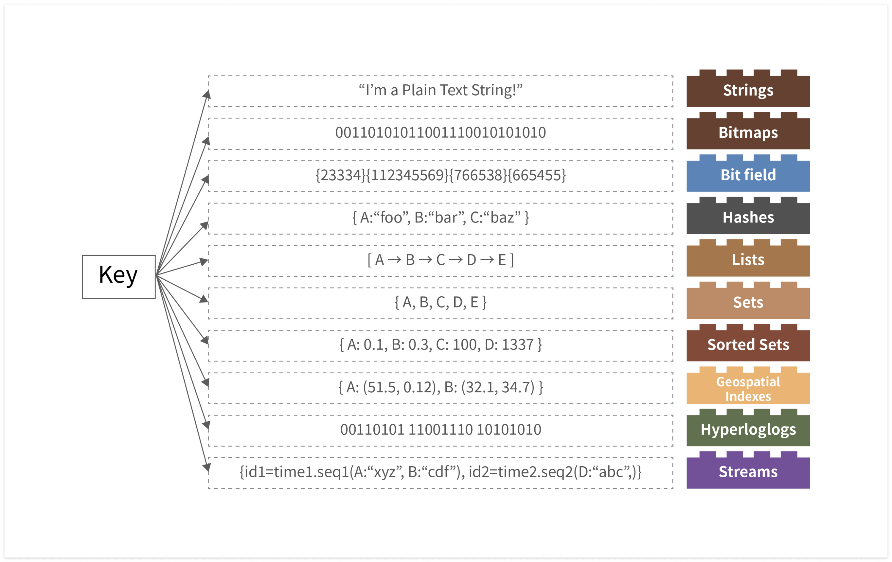
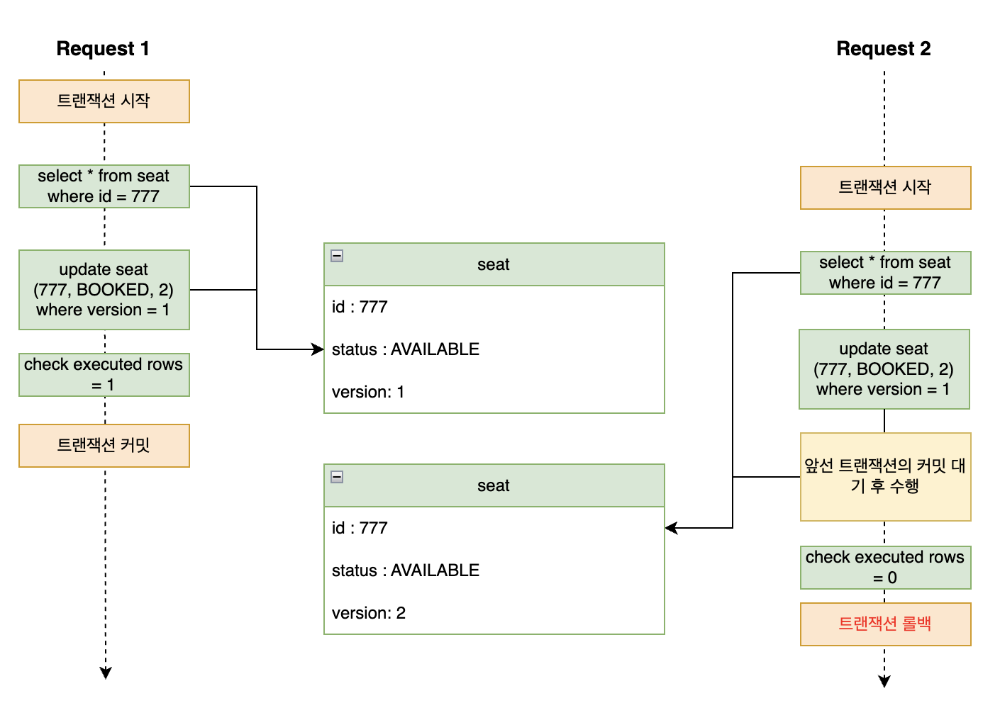

# Chapter. 2-4 서버구축-데이터베이스 심화

챕터: Chapter 2
과제: 과제 : 이번 챕터 과제 (https://www.notion.so/2432dc3ef51480afa58eed08c1342de2?pvs=21)

<aside>
🎯 **들어가면서, TDD와 클린아키텍처 적용하기**

</aside>

- TDD Chapter Summary
    
    ### 실제 현업에서 TDD 를 진행한다면 ?
    
    <aside>
    💡 TDD 는 **테스트가 중요하다** 를 인지하는 것부터 시작됩니다.
    
    </aside>
    
    우리가 **TDD** 가 왜 궁금하고, 왜 배우고 싶고, 왜 요즘 업계에서 자주 언급되는 지에 대해서 먼저 생각을 해보면 결국 뿌리는 **테스트가 중요하다** 를 인지 해야 하기 때문입니다. 약 3주간 TDD 챕터를 진행하며 주어진 시나리오를 기반으로 기능을 구현하고, 테스트 코드를 작성해보면서 어떻게 테스트 코드를 활용해 내 코드를 견고하게 할 지를 배워보았습니다.
    
    <aside>
    ❌ **우리에게 TDD 가 어려웠던 이유
    1.** **[ 경험 ]** Test Code 를 작성해본 적이 없다.
    **2.** **[ 분석 ]** 요구사항을 분석하고 기능을 작성할 때, 어떤 테스트가 필요한지 모르겠다.
    **3.** **[ 시간 ]** 기능 개발하기에도 바쁜데, 테스트 코드 작성할 시간적 리소스는 더욱이 부족하다.
    **4.** **[ 구조 ]** 내가 작성한 코드를 어떻게 테스트해야할지 모르겠다 ( feat. private method )
    
    </aside>
    
    최소한의 노력으로 우리 코드를 안전하게 보호하기 위해서 테스트가 필요하다는 점, 미연에 문제를 방지하기 위해서 꼭 필요하다는 점은 이제 인지했습니다. 그럼 우리가 TDD 를 현업에서 사용하기 위해선 어떤 규칙을 지켜나가야 할까요 ?
    
    <aside>
    💡 **내가 기능을 개발하는 방법 ( Feat. Unit Test )**
    1. ****요구사항을 분석 ( 어떤 기능을 제공해야하는지 )
    2. 실패하면 안되는 Input 을 정리 ( 실패 TC 에 대해 정의 )
    3. 2번의 TC 를 모두 만족시킬 수 있도록 기능을 구현
    4. 기능의 책임을 분석
        - 너무 다양한 TC 가 필요하지 않았는지
        - 너무 많은 책임이 주어져 있지는 않은지 ( 응집도 )
    5. 리팩토링
        - 적절한 위상의 책임을 가지고 있도록
        - 충분히 원자적으로 테스트가 가능하도록
    
    </aside>
    
    어렵고 도입하기도 쉽지 않았지만, 그래도 TDD를 하면 테스트코드만 잘 작성하는 것이 아닌, 서비스 코드에 대한 설계가 좀 더 나아진 것 같은 느낌이 들지는 않았나요?
    
    <aside>
    💡 **TDD를 하면서 더 나은 클래스 설계가 되었어요.**
    
    - 하나의 클래스에서 너무 많은 로직을 담지 않고 적절히 역할을 분리해야.. 그래야 테스트코드를 쉽게 짤 수 있더라고요..
    - 주구장창 로직부터 작성하지 않고, 어떤 역할을 하는 클래스들이 구조화되어야 하는지 미리 고민하게 되었어요. 테스트 코드를 먼저 작성하려면, 어떤 클래스들이 있어야 하고, 각각의 클래스가 무슨 역할을 해야할지 미리 생각해봐야 테스트코드를 작성할 수 있었어요.
    </aside>
    
- 클린아키텍처 잘 적용 했는지 아는 방법
    
    ### 실제 소프트웨어 아키텍처를 적용한다면 ?
    
    <aside>
    💡 Domain ? Entity ? 이게 뭐요..
    
    </aside>
    
    용어에서부터 벽이 느껴질 때가 있는데, 바로 위와 같이 여기저기서 쓰이는 용어들입니다. 심지어는 상황에 따라 달라지는 이 용어들로 소통하다보면, 서로 다른 이야기를 하는 경우도 종종 있는 것 같아요. 앞서 우리가 살펴본 소프트웨어 아키텍처 패턴에서 또한 용어의 다른 뜻 때문에 헷갈리는 분들이 많았을 거라고 생각해요. 그래서 좀 보편적으로 이해해보면 좋을 것 같습니다.
    
    - **도메인** ( Domain )
        - 특정 기능과 관련된 속성, 기능 등을 응집화시킨 개념
        - e.g.
            - 도메인 이해도가 높아야 한다. = 해당 기능을 구성하는 하위 도메인에 대한 유기적 흐름 이해가 가능하다.
            - 도메인 모델 = 기능적으로 군집화시켜놓은 개념으로 일반적으로는 그 도메인을 표현하는 객체를 의미하며 POJO 일수도, JPA Entity 를 도메인 모델로 사용할 수도 있다.
            - 도메인 url = 하위 uri를 그루핑할 수 있는 응집화된 url
    - **엔티티** ( Entity )
        1. 도메인을 설명할때 말하는 엔티티 : 도메인 모델의 맥락에서 `특정 주제에 대한 속성 기능을 응집화시켜놓은 도메인 모델`
        2. DB 와 연관지어 말하는 엔티티 : DB 테이블이나 그 `테이블에 매핑되는 객체`
    
    그렇다면 도메인 맥락에서 db 엔티티와 분리되어 있다라는 말은 “나는 비즈니스 로직을 표현하기 위한 `“도메인 객체”를 DB 의 엔티티와는 상관없게` 표현할거야“ 라고 설명할수 있고, 그와 반대로 `DB 엔티티 (e.g. JPA Entity) 를 비즈니스의 대상이 되는 도메인 모델`로서 정의할 수도 있겠죠.
    
    만약 `도메인 모델 != 엔티티 라는 설계`를 통해 아예 데이터베이스와 별개로 나는 비즈니스 로직을 강한 응집도를 주고, 외부의존성은 내 비즈니스 룰을 따라야 해! 라는 룰을 가져간다면 도메인영역 (핵심 비즈니스 로직) 은 엔티티를 모를테고, 이 경우 엔티티를 통해 db와 상호작용하는 datasource layer는 도메인 -> 엔티티, 엔티티 -> 도메인 의 작업을 수행하여 “`내가 아는 언어`” 로 변경해야 합니다.
    
    <aside>
    💡 시작은 패키지부터. 유연성을 보장하고 확장 가능한 패키지 구조.
    
    </aside>
    
    멘토링하면서 혹은 현업에서 항상 가장 많이 받는 질문 중 하나입니다. 멀티 모듈은 어떻게 구성하는 게 좋을까요 ? 패키지는 어떻게 나누는게 좋을까요 ? 이런 질문들을 항상 받곤 하는 것 같아요. 그래서 저라면 어떤 관점에서 설계할 것인가를 적어보았습니다.
    
    일단 기본은 앞서 발제 때, 코칭 때 설명한 것과 같이 비즈니스 로직을 보호하기 위해 Repository 를 추상화하여 비즈니스 로직이 DB 와 실제 상호작용하는 부분을 모르게 할 거예요. 그 이유는 내 비즈니스는 어떻게 어디에서 무엇을 가져오는지에 관심을 가지기보다 내가 수행해야할 기능에 집중하도록 작성하기 위해서입니다.
    
    ```kotlin
    api/
      도메인/
    	  controller
    	  dto/
    		  (request, response models)
    domain/
    	도메인/ (user, lecture, comment, ...)
    		(Models)
    		- Lecture
    		- ApplicationHistory
    		(Service)
    		- LectureService
    		(Repositories)
    		- LectureReaderRepository (I/F)
    		- LectureStoreRepository (I/F)
    		infrastructure/
    			- LectureCoreReaderRepository (IMPL)
    			- LectureCoreStoreRepository (IMPL)
    			- LectureJpaRepository (JPA)
    			- LectureCustomRepository (QueryDSL)			
    ```
    
    위와 같이 나누어 놓고 보니, **도메인** 별로 강한 응집도를 가진 패키지 구조를 가지게 되었습니다. 만약 내가 User 를 개발하면서 Lecture 에 대한 정보를 사용해야 한다면, `lecture` 패키지만 보면 모든 것을 파악할 수 있게 됩니다.
    
    만약 서버를 분리해야 한다 ? 하면 도메인을 뚝 떼서 가져다가 새로운 프로젝트를 구성해도 되겠죠.
    
    하지만 우리는 일반적으로 API 서버만 작성하는 것이 아니라 관리자 ( Admin ) 애플리케이션도 같이 작성하곤 합니다. 대상은 다르지만 같은 도메인 컨텍스트를 공유하기 때문이죠.
    
    그런 경우, 저는 뷔페식 패키지 구조를 가져가기 위해 서비스를 잘게 나누고 비즈니스 로직의 완성을 Service 가 아닌 각 애플리케이션의 UseCase 단위로 조립할 수 있도록 변경합니다.
    
    <aside>
    💡 뭐 좋아할지 몰라 다 차려놨어. 먹고 싶은 거 가져다가 알아서 먹어. - alen
    
    </aside>
    
    ```kotlin
    admin/
    	도메인/
    		view/
    		usecase/
    			- ModifyLectureUseCase
    			- GetMyApplicationsUseCase
    api/
      도메인/
    	  controller
    	  dto/
    		  (request, response models)
    	  usecase/
    		  (Usecase = 각 비즈니스에 맞춰 component 조립)
    		  - ApplyLectureUseCase
    		  - GetLecturesUseCase  
    domain/
    	도메인/ (user, lecture, comment, ...)
    		(Models)
    		- Lecture
    		- ApplicationHistory
    		(Components)
    		- LectureReader
    		- LectureModifier
    		- ApplicationManager
    		(Repositories)
    		- LectureReaderRepository (I/F)
    		- LectureStoreRepository (I/F)
    		infrastructure/
    			- LectureCoreReaderRepository (IMPL)
    			- LectureCoreStoreRepository (IMPL)
    			- LectureJpaRepository (JPA)
    			- LectureCustomRepository (QueryDSL)
    ```
    

<aside>
⛵ **이번 챕터 목표**

</aside>

- 시나리오가 요구하는 요구사항을 명확히 분석하기
- 유지보수, 확장 가능한 코드에 대해 끊임없이 고민하기
- 테스트 가능한 구조 및 테스트 코드 작성에 집중하기
- 견고하지만 유연한 서버 애플리케이션을 구축하기

<aside>
🚩 **What to do: 이번 챕터에 해야 할 것. 이것만 집중하세요!**

</aside>

### **서버 개발 Summary**

### 설계 문서의 중요성

<aside>
🧑‍💻 나는 코드 짜는 게 더 즐거워요…

</aside>

 서버 구축에서 주요하게 다뤘던 부분은 **`분석`** 과 **`설계`** 의 영역입니다.

실제 현업에서는 분석과 설계를 소홀히 하고 IDE에서 바로 코딩하는 데 집중하는 개발자들을 종종 만나게 됩니다. 하지만 대부분 도메인에 대한 충분한 이해가 없는 상태에서 개발을 시작하면, 요구사항의 핵심 기능이나 유기적인 흐름을 제대로 파악하지 못하게 됩니다. 그 결과, 불필요한 반복 작업과 야근으로 이어지며, 업무량은 많지 않았음에도 프로젝트가 과도하게 어렵다고 느끼게 되는 경우가 많습니다.

소프트웨어 개발에서 설계는 다음과 같은 이유로 매우 중요합니다.

- 사용자 경험과 고객 가치를 효과적으로 전달하기 위한 **소통의 수단**
- 다양한 배경의 협업자들과 **원활한 커뮤니케이션을 가능하게 하는 도구**
- 요구사항 분석과 변화에 대한 **의사 결정의 히스토리를 기록하는 수단**

이러한 내용을 잘 전달하고 공유할 수 있다면, UML, 시퀀스 다이어그램, 플로우차트와 같은 형식은 수단일 뿐이며, 형식 자체보다 **정확한 전달과 지속 가능한 공유**가 더 중요합니다. 다만, 이러한 도구들은 표준화되어 있어 팀 내외 소통을 더 원활하게 할 수 있으므로, 익히고 표현하는 연습은 꼭 해보시길 바랍니다.

### 테스트 코드는 고립될 수 있어야 한다.

테스트 코드의 특징으로 FIRST 라는 것이 있습니다.

 보편적으로 "좋은 테스트 코드" 는 FIRST 규칙을 따른다고 합니다. 여기서 FIRST 란 다음과 같습니다.

- Fast - 단위 테스트는 빨라야 합니다.
- Independent - 단위 테스트는 독립적으로 수행되어야 합니다.
- Repeatable - 단위 테스트는 반복적으로 수행해도 결과가 같아야 합니다.
- Self-Validating - 단위 테스트는 스스로 검증할 수 있어야 합니다.
- Timely - 필요할 때 미루지 말고 적시에 작성되어야 합니다.

이 중 **Independent** 에 대해서 좀더 이야기해보려 합니다. 

여기서 Independent 의미는 `단위 테스트는 독립적으로 수행되어야 합니다.`  입니다.

 과제 리뷰 중 통합 테스트가 매번 깔끔하게 성공하지 않는 문제를 자주 마주했습니다. 이는 테스트 실행 전, DB가 실행 중이어야 하고 테이블도 사전에 생성되어 있어야 하기 때문입니다. 이러한 상태 의존성은 FIRST 원칙을 충족하는 **좋은 테스트**라고 보기 어렵습니다.

이 문제를 해결하기 위한 대표적인 방법은 [Testcontainers](https://testcontainers.com/)입니다. 이 도구는 Docker를 통해 테스트 실행 시점에 DB를 자동으로 띄워주며, 테스트를 **완전히 독립적이고 반복 가능하게** 수행할 수 있도록 도와줍니다.

주로 저는 [https://github.com/zonkyio/embedded-database-spring-test](https://github.com/zonkyio/embedded-database-spring-test) 이 라이브러리를 사용해서 DB에 대한 의존성을 제거합니다.

```jsx
@RunWith(SpringRunner.class)
@AutoConfigureEmbeddedDatabase( 어떤 데이터베이스를 사용할거야? )
@ContextConfiguration("path/to/application-config.xml")
public class EmptyDatabaseIntegrationTest {
    // class body...
}
```

- *고민해볼 부분*
    
    그렇다면, 통합테스트가 많아지면 어떻게 해야될까? FIRST 에서 F 는 단위테스트는 빨라야 한다고 했는데? 
    

### **지난 개발의 시간동안 수백번의 서비스 라는 말을 하고 있는데, 서비스란 무엇일까?**

멘토링을 하다 보면 ‘서비스’ 구현에 대해 자주 이야기하게 됩니다. 그런데 제가 말하는 ‘서비스’와 청중이 이해하는 ‘서비스’가 다르게 받아들여지는 경우가 종종 있었습니다.

‘서비스’라는 개념을 정확히 이해하는 것은 중요합니다. 이는 애플리케이션, 도메인, 인프라스트럭처 등 여러 계층에서 객체 간 관계를 올바르게 파악하는 데 기반이 되기 때문입니다. 특히, 도메인 주도 설계(DDD)에서는 도메인 서비스를 통해 특정 비즈니스 로직을 캡슐화하는데, 이 역시 ‘서비스’ 개념에 대한 명확한 이해가 전제되어야 합니다.

 다시, **서비스** 가 뭘까요? Spring boot에서 말하는 @Service 를 붙으면 다 서비스인걸까요? 


아니면, 위에서 말하는 흔히 MVC 패턴의 Service 가 서비스일까요?

**서비스 추상화**라는 용어가 있는데, 이것은 DIP 에 해당하는 이야기이고, 여기서는 차치하고 좀더 포괄적인 서비스라는 단어에 집중하겠습니다.

 일단 제가 말하고 있는 서비스는 스프링의 @Service 를 말하는 것이 아니라 ***백엔드 개발 전반에서 사용되는 서비스**에 대한 이야기입니다.*

**서비스라는 것은 일반적인 용어**라서 쓰이는 곳에 따라 다른 의미를 가지게 됩니다.

서비스에 대해서 크게 2가지 특징을 가집니다.



서비스는 클라이언트에게 서비스를 제공해주는 오브젝트나 모듈


서비스는 일반적으로 상태를 가지지 않음.

 서비스란 용어는 쓰이는 곳에 따라 다른 의미를 가진다라고 말했는데요.

 **서비스의 종류에는 크게 3가지가 있습니다.**

- **애플리케이션 서비스(Application service)**
    - 흔히 말하는 “서비스 레이어”를 의미하며, 일반적으로 @Service 어노테이션이 붙는 영역입니다.
    - 비즈니스 로직의 진입점이자 종료점으로, 외부 요청과 도메인 로직 사이를 조율합니다.
    - Nest.js에서는 @Injectable() 데코레이터를 사용하는 서비스와 유사한 역할을 합니다.
    - DIP 활용한 애플리케이션 서비스 코드
        
        ```java
        interface MemberUsecase {
        
        		Member find(Long id);
        }
        
        --
        @Service
        class MemberApplicationService implements MemberUsecase {
        
        		Aaaa aService;
        		Baaa bService;
        		Caaa cService;
        		
        		@Override
        		@Transcational
        		Member find(Long id) {
        					aService.get(id)
        					.. bService, 
        				....cService
        		}
        }
        
        ---
        
        class MemberController {
        		
        		MemberUsecase memberUsecase;
        		
        		@GetMapping
        		Member get(Long id) {
        			return memberUsecase.find(id);
        		}
        		...use 
        
        }
        ```
        
- **도메인 서비스 (Domain service)**
    - 도메인 모델 패턴에서는 비즈니스 로직을 엔티티와 같은 도메인 객체에 담는 것이 일반적입니다. 하지만 특정 로직은 하나의 엔티티에만 속하지 않거나, 여러 엔티티에 걸쳐 있는 경우가 있습니다. 이런 경우, 해당 로직을 도메인 서비스라는 별도의 객체로 분리하여 구현할 수 있습니다.
    - 만약 도메인 서비스를 왜 만들어야 하는지 아직도 이해되지 않는다면  [해당 블로그 링크](https://happy-coding-day.tistory.com/267)를 통해 좀더 이해해보자.
    - 흔하게 우리가 하는 코드
        
        ```java
        // Order.java
        public class Order {
            private Long id;
            private List<OrderItem> items = new ArrayList<>();
            private BigDecimal totalAmount;
        
            public Order() {
                this.totalAmount = BigDecimal.ZERO;
            }
        
            public void addItem(OrderItem item) {
                items.add(item);
                totalAmount = totalAmount.add(item.getTotalPrice());
            }
        
            public BigDecimal getTotalAmount() {
                return totalAmount;
            }
        
            public void applyDiscount(BigDecimal discount) {
                this.totalAmount = this.totalAmount.subtract(discount);
            }
        }
        
        // Customer.java
        public class Customer {
            private Long id;
            private String name;
            private boolean isVip;
        
            public Customer(Long id, String name, boolean isVip) {
                this.id = id;
                this.name = name;
                this.isVip = isVip;
            }
        
            public boolean isVip() {
                return isVip;
            }
        }
        
        // OrderApplicationService.java
        public class OrderApplicationService {
            private final OrderRepository orderRepository;
            private final CustomerRepository customerRepository;
        
            public OrderApplicationService(OrderRepository orderRepository,
                                           CustomerRepository customerRepository) {
                this.orderRepository = orderRepository;
                this.customerRepository = customerRepository;
            }
        
        		// 예시 정책: VIP 고객은 10% 할인, 일반 고객은 5% 할인
            @Transactional
            public void applyDiscountToOrder(Long orderId, Long customerId) {
                // 1. 리포지토리를 통해 주문과 고객을 조회
                Order order = orderRepository.findById(orderId);
                Customer customer = customerRepository.findById(customerId);
        
                if (order == null || customer == null) {
                    throw new IllegalArgumentException("Order or Customer not found");
                }
        
                // 2. 할인을 직접 계산
                BigDecimal discount = calculateDiscount(order, customer);
                
                // 3. 주문에 할인을 적용
                order.applyDiscount(discount);
        
                // 4. 변경된 주문을 저장
                orderRepository.save(order);
        
                System.out.println("Discount applied: " + discount);
                System.out.println("Total amount after discount: " + order.getTotalAmount());
            }
        
            // 할인 계산 로직을 애플리케이션 서비스에서 직접 구현
            private BigDecimal calculateDiscount(Order order, Customer customer) {
                BigDecimal discount = BigDecimal.ZERO;
                
                if (customer.isVip()) {
                    discount = order.getTotalAmount().multiply(BigDecimal.valueOf(0.10));
                } else {
                    discount = order.getTotalAmount().multiply(BigDecimal.valueOf(0.05));
                }
        
                return discount;
            }
        }
        ```
        
    - 도메인 서비스를 접목한 코드
        
        ```java
        // DiscountService.java
        // 예시 정책: VIP 고객은 10% 할인, 일반 고객은 5% 할인
        // VipDiscountPolicy.java
        public class DiscountService {
        
            // 할인을 계산하는 메서드
            public BigDecimal calculateDiscount(Order order, Customer customer) {
                BigDecimal discount = BigDecimal.ZERO;
        
                if (customer.isVip()) {
                    discount = order.getTotalAmount().multiply(BigDecimal.valueOf(0.10));
                } else {
                    discount = order.getTotalAmount().multiply(BigDecimal.valueOf(0.05));
                }
        
                return discount;
            }
        }
        
        // OrderApplicationService.java
        public class OrderApplicationService {
            private final OrderRepository orderRepository;
            private final CustomerRepository customerRepository;
            private final DiscountService discountService;
        
            public OrderApplicationService(OrderRepository orderRepository,
                                           CustomerRepository customerRepository,
                                           DiscountService discountService) {
                this.orderRepository = orderRepository;
                this.customerRepository = customerRepository;
                this.discountService = discountService;
            }
        
            @Transactional
            public void applyDiscountToOrder(Long orderId, Long customerId) {
                // 1. 리포지토리를 통해 주문과 고객을 조회
                Order order = orderRepository.findById(orderId);
                Customer customer = customerRepository.findById(customerId);
        
                if (order == null || customer == null) {
                    throw new IllegalArgumentException("Order or Customer not found");
                }
        
                // 2. 도메인 서비스 호출하여 할인 계산
                BigDecimal discount = discountService.calculateDiscount(order, customer);
                
                // 3. 주문에 할인을 적용
                order.applyDiscount(discount);
        
                // 4. 변경된 주문을 저장
                orderRepository.save(order);
        
                System.out.println("Discount applied: " + discount);
                System.out.println("Total amount after discount: " + order.getTotalAmount());
            }
        }
        ```
        

- **인프라 서비스(Infrastrucutre service)**
    - **서비스 추상화의 대상이 되는 것**
    - *도메인/애플리케이션 로직에 참여하지 않는, 기술을 제공하는 서비스*
    - 메일, 캐시, 트랜잭션, 메시징 ... 굉장히 기술적인 부분을 말한다. 여기서 트랜잭션이 주 대상.
    - 우리가 아는 @Transactional > PlatformTransactionManager
        - Next.js 에서는 아래와 같이 사용할 때도 마찬가지인데 sequelize 안에서 Orcle 에서 MySQL 로 변경된다 하더라도 코드의 변화는 없다.
            
            ```java
            async createUserWithTransaction(userData: any): Promise<User> {
                const transaction = await this.sequelize.transaction();
            
                try {
                  const user = await this.userModel.create(userData, { transaction });
            
                  // 트랜잭션 완료 시 커밋
                  await transaction.commit();
                  return user;
                } catch (error) {
                  // 오류 발생 시 롤백
                  await transaction.rollback();
                  throw error;
                }
              }
            ```
            
    
    
    
    출처 - 내 블로그 / 토비의 스프링 인프런 강의
    

### Transaction

- **더 이상 나눌 수 없는 하나의 완결된 작업 단위**
- **모든 과정이 완료되어야 의미가 있는 작업의 최소 단위**
- 일반적으로는 데이터베이스의 트랜잭션을 지칭하지만, CS 전반에서 사용되는 개념

> e.g. 파일 복사 작업, 은행 송금 처리, 온라인 주문 
*일부만 성공하거나 실패하면 안 되고, 전체가 모두 성공하거나 실패해야 의미가 있기 때문*
> 

**특징**

- **트랜잭션이 단순히 "묶음" 이상의 의미를 가지게 하며, 시스템의 신뢰성을 지탱하는 기초**
- **`Atomicity (원자성)` -** 트랜잭션 내 모든 작업은 전부 성공하거나, 전부 실패해야 한다. 일부만 반영된 상태는 허용되지 않는다.
- **`Consistency (일관성)` -** 트랜잭션 수행 전후로 시스템의 상태는 항상 일관성을 유지해야 한다. 예를 들어, 은행 계좌 간 이체에서 한 쪽 계좌는 차감되었는데, 다른 한 쪽은 입금되지 않았다면 일관성이 깨진 것이다.
- **`Isolation (고립성)` -** 동시에 실행되는 여러 트랜잭션이 서로 간섭하지 않아야 한다. 각 트랜잭션은 독립적으로 실행된 것처럼 보여야 한다.
- **`Durability (지속성)` -** 트랜잭션이 성공적으로 완료되었다면, 시스템 장애가 발생하더라도 그 결과는 보존되어야 한다.

### DB Transaction

<aside>
💽

**상품 구매 시에 저장되는 데이터 흐름** 예시를 한번 들어보자.

- 주문 정보 입력
- 재고 차감
- 사용자 포인트 차감
- 배송 정보 저장
</aside>

```sql
START TRANSACTION;
SELECT * FROM product WHERE id=100;
UPDATE product SET stock = stock - 1 WHERE id=100;

SELECT * FROM balance WHERE user_id=1111;
UPDATE balance SET amount=5000 WHERE id=1111;

INSERT INTO order(...) VALUES(...)
COMMIT;
```

### DB Transaction

- 데이터베이스의 **상태를 변화시키기 위한 일련의 작업 단위**
- **특징**
    - **`Atomicity (원자성)`** - 트랜잭션의 모든 쿼리가 DB 에 반영되거나, 모두 반영되지 않아야 한다.
    - **`Consistency (일관성)`** - 트랜잭션의 처리 결과는 항상 일관성 있어야 한다.
    - **`Isolation (고립성)`** - 서로 다른 트랜잭션은 서로의 연산에 개입할 수 없다.
    - **`Durability (지속성)`** - 트랜잭션이 성공적으로 처리되었다면 그 결과는 영구 반영되어야 한다.
- **주요 기능**
    - `Commit` - DB 의 트랜잭션이 성공적으로 수행되었으며 이를 반영하도록 하는 명령
    - `Rollback` - DB 트랜잭션에서 문제가 발생했을 때, 실행 이전 상태로 되돌리는 명령
- **트랜잭션 격리 수준**
    - **Uncommitted Read** ( 커밋되지 않은 읽기 )
        - 다른 트랜잭션에서 커밋되지 않은 데이터에도 접근할 수 있게 해주는 격리 수준
        - `DirtyRead` - 커밋되지 않은 트랜잭션에 접근해 아직 정상 반영되지 않은 데이터를 읽는 현상( 해당 데이터는 롤백되어 없어질 수도 있다 )
    - **Committed Read** ( 커밋된 읽기 )
        - 다른 트랜잭션에서 커밋된 데이터에만 접근할 수 있게 해주는 격리 수준
        - `Non-Repeatable Read` - 하나의 트랜잭션에서 동일한 SELECT 쿼리를 실행했을 때 커밋 전의 데이터, 커밋 된 후의 데이터가 읽히면서 다른 결과가 조회되는 현상
    - **Repeatable Read** ( 반복 가능한 읽기 )
        - 커밋된 데이터만 읽을 수 있으며, 자신보다 빨리 수행된 트랜잭션에서 커밋한 데이터만 읽을 수 있는 격리 수준
        - **MVCC** 를 통해 Undo 로그를 기반으로 동일한 데이터가 조회되도록 보장 ( Non-Repeatable Read 문제 해결 )
        - 이를 지원하지 않는 DB (e.g. OracleDB ) 에서는 배타 락을 이용해 문제를 해결
        - `Phantom Read` - 하나의 트랜잭션 내에서 동일한 SELECT 쿼리의 결과 레코드 수가 달라지는 현상
            
            <aside>
            💡 MySQL 에서는 Phantom Read 가 발생하지 않음
            → InnoDB 엔진에 의해 `select ~ for update` 구문을 지원, Next Key Lock 형태의 배타락을 지원하기 때문
            
            </aside>
            
    - **Serializable**
        - 모든 트랜잭션을 순차적으로 실행된 것처럼 보이도록 하는 격리 수준
        - 트랜잭션이 서로 끼어들 수 있는 상황이 없으므로 데이터의 부정합 문제는 발생하지 않음
        - 위 특성 때문에 트랜잭션이 동기적으로 처리되면서 처리속도 저하가 발생
        - 트랜잭션이 개입하려는 시도 ( e.g. shared Lock 으로 조회 후 Update 하려고 하는 경우 )  대기상태가 되므로 데드락 문제가 발생함

<aside>
💡 **트랜잭션 격리 수준에 따른 Read 문제 정리**
`Dirty Read`
Tx1 이 (x → x’) 로 변경하고 Tx2 가 x’ 로 읽은 상황. 이 때, Tx1 이 문제가 발생해 Rollback 되면 Tx2 는 반영되지 않은 값을 읽어 연산을 처리한다.
`Non-repeatable Read` 
 Tx1 이 실행 중 x 를 여러 번 조회하는 데, 다른 Tx 가 중간 중간 데이터를 변경해서 매번 다른 값이 조회되는 경우
`Phantom Read`
 Tx1 이 데이터를 여러번 조회하는 데, 다른 Tx 들이 데이터를 추가하면서 없었던 데이터가 새로 나타나는 경우

< 각 격리 수준별 문제가 발생하는 케이스 >



</aside>

### 동시성 문제

**Race Condition**

- 여러 작업(프로세스, 스레드, 트랜잭션 등) 이 공유 자원에 대해 동시에 접근할 때 발생하는 문제
- 접근 순서나 타이밍에 따라 결과가 달라져 **의도하지 않은 결과**를 초래하는 현상

**어떤 경우에 동시성 문제가 많이 발생할까?**

**(1)** 데이터의 수정 작업이 “다량의 요청”에 의해 “자주 변경”되는 경우

**(2)** 트랜잭션 크기가 크고 오래 유지되는 경우

<aside>
💡 **동시성 문제를 제어하기 위한 개념들**

`상호 배제(Mutual Exclusion)` 
특정 시점에 하나의 작업만 자원에 접근하도록 제한하여 동시성 문제를 방지하는 방식

- 동시성 문제(Race Condition 등)를 방지하기 위한 가장 기본적인 원칙
- 구현 방법
    - OS 수준: `Mutex`, `Semaphore`, `Spinlock` 등
    - DB 수준: `Lock` (e.g. Row Lock, Table Lock)
    - 애플리케이션 수준: Java의 `synchronized`, `ReentrantLock` 등

`교착 상태(Deadlock, 데드락)` 

- 둘 이상의 작업이 서로 **상대가 점유한 자원을 기다리며 무한 대기**하는 상태
- 상호 배제가 적용된 환경에서는 **데드락 발생 가능성**이 존재
- 4가지 조건이 동시에 성립될 때 발생:
    1. **상호 배제(Mutual Exclusion)** - 자원은 하나의 프로세스만 점유 가능
    2. **점유 대기(Hold and Wait)** - 자원을 점유한 채 다른 자원을 기다림
    3. **비선점(No Preemption)** - 자원을 강제로 뺏을 수 없음
    4. **순환 대기(Circular Wait)** - 프로세스 간 자원을 순환적으로 기다림
- (잔여좌석과 좌석점유를 보면?)

e.g. Process 1와 Process 2 는 모두 Resource1, Resource2 데이터를 사용해야 한다.
(1) Process 1 가 Resource1 에, Process 2 가 Resource2 에 Lock
(2-1) Process 1 는 Process 2 가 잠근 Resource2 가 풀릴 때까지 대기
(2-1) Process 2 는 Process 1 가 잠근 Resource1 이 풀릴 때까지 대기
(3) 둘은 Connection Timeout 까지 Lock 을 해제하지 못함.


📌 운영 환경에서는 **DB**뿐만 아니라 **스레드 동기화**, **분산 락** 환경 등에서도 발생 가능

</aside>

### DB 동시성 문제

**DB에서의 동시성 제어(Concurrency Control)**

- 여러 트랜잭션이 동시에 실행될 수 있도록 허용하면서도 데이터의 일관성, 무결성이 유지될 수 있도록 하여 전반적인 데이터 정합성을 보장할 수 있도록 하는 방법

**해결하고자 하는 문제**

`분실 갱신(Lost Update)` 

- 여러 트랜잭션이 동시에 데이터를 수정하면서 하나의 트랜잭션의 작업 결과가 분실되는 문제


`커밋되지 않은 의존(Uncommitted Dependency)`

- 트랜잭션 실행 중 문제가 발생해 롤백시키면서 결과적으로는 반영되지 않아야 할 데이터를 읽어 생기는 문제(결과적으로 update 전의 data를 읽어야 했던 상황이었음)


`모순 감지(Inconsistency Analysis)`

- 트랜잭션이 실행 중에 다른 트랜잭션이 데이터 수정에 개입해 데이터 일관성이 깨지는 문제


**재고차감 시나리오로 이해하는 동시성 이슈**


### Database Lock

“DB 의 데이터에 대해 동시에 접근하는 것을 제어함”으로서 동시성 문제를 해결

**Lock 의 종류**

- s-lock ( 공유 락, Shared Lock )
    
    
    
    - a.k.a. “읽기 잠금” ( `SELECT .. FROM .. WHERE ... **FOR SHARE**` )
    - s-lock 을 설정한 트랜잭션은 해당 Row 를 읽기 작업만 수행 가능하다.
    - s-lock 이 이미 설정되어 있어도 다른 트랜잭션 또한 해당 Row 에 s-lock 을 설정할 수 있다.
    - 한쪽이 커밋 할 때 까지 쓰기 잠금
    
- x-lock ( 배타 락, Exclusive Lock )
    - a.k.a. “쓰기 잠금” ( `SELECT .. FROM .. WHERE ... **FOR UPDATE**`)
    - x-lock 을 설정한 트랜잭션은 해당 Row 에 대해 읽기/쓰기 작업 모두 수행 가능하다.
    - x-lock 이 설정된 경우, 다른 트랜잭션은 해당 Row 에 대해 s-lock / x-lock 모두 설정할 수 없다. → 대기상태
    
    
    

**Lock 을 이용한 동시성 제어**

<aside>
💡 DB Lock 을 이용해 동시성 제어하는 방식에서 중요한 점은 트랜잭션 간 “충돌” 의 빈도!

</aside>

- Pessimistic Lock ( 비관적 락 )
    
    
    
    - 충돌 빈도가 **많을 경우** 권장
    - 동시 요청에서 순차로 진행될 때 성공할 수 있는 요청이라면 성공시키는 케이스에 적합
    - 특정 자원에 대해 Lock 설정으로 선점해 정합성을 보장하는 방식
    - s-lock 혹은 x-lock 을 걸고 다른 트랜잭션의 접근을 막음
    
    <aside>
    🚧 **(주의)** 트랜잭션에서 Lock 을 이용해 제어하므로 불필요한 Lock 에 의한 성능 저하 혹은 잠금에 대한 경합을 많이 유발하는 문제가 있음. 트래픽이 몰리는 경우나 여러 테이블에 Lock 을 걸면서 작업을 하는 트랜잭션의 경우 데드락을 유발할 수 있음.
    상기 이유로 READ 작업이 잦은 테이블에 대해 적합하지 않음.
    
    </aside>
    
- Optimistic Lock ( 낙관적 락 )
    
    
    
    - 충돌 빈도가 **적을 경우** 권장
    - 동시 요청 중 한건만 성공해야하는 케이스에 적합
    - DB Lock 을 설정해 동시성 문제를 제어하는 것이 아닌 읽은 시점과 수정 시점의 데이터 변경 여부를 확인해 제어하는 방식
    - 트랜잭션, Lock 설정 없이 데이터 정합성을 보장할 수 있으므로 성능적으로 우위에 있음

<aside>
🚧 **(주의)** 충돌이 자주 일어날 경우, rollback 이나 retry 에 대해 고려해야 함
경합이 자주 일어나 계속 실패해 retry 가 많아지면 DB Connection, 요청 스레드 점유 등 다양한 사이드 이펙트가 발생할 수 있음

(만약 request 가 11개 라면? → stock 보다 많은 request 가 들어왔다면?)

</aside>

- 주의사항
    - 락 메커니즘 도입 시 **데드락** 발생 가능성에 노출된다.
    - 2개 이상의 서로 다른 자원에 락을 사용하는 경우 **락 잠금 순서**에 유의한다.
    
    ```sql
    -- 사용자의 좌석 예약 트랜잭션;
    START TRANSACTION;
    -- 1. 좌석 잠금
    SELECT * FROM seat WHERE seat_id = 101 FOR UPDATE;
    -- 2. 좌석 상태를 RESERVED로 변경
    UPDATE seat SET status = 'RESERVED' WHERE seat_id = 101;
    -- 3. 공연 잠금
    SELECT * FROM concert WHERE id = 1 FOR UPDATE;
    -- 4. 잔여 좌석 수 차감
    UPDATE concert SET remaining_seat_count = remaining_seat_count - 1 WHERE id = 1;
    COMMIT;
    ```
    
    ```sql
    -- 관리자의 좌석 상태 변경 트랜잭션;
    START TRANSACTION;
    -- 1. 공연 획득
    SELECT * FROM concert WHERE id = 1 FOR UPDATE;
    -- 2. 잔여 좌석 수 차감
    UPDATE concert SET remaining_seat_count = remaining_seat_count + 1 WHERE id = 1;
    -- 3. 변경 대상 좌석을 잠금
    SELECT * FROM seat WHERE seat_id = 101 FOR UPDATE;
    -- 4. 좌석 상태를 RESERVED로 변경
    UPDATE seat SET status = 'AVAILABLE' WHERE seat_id = 101;
    COMMIT;
    ```
    

### 우리의 시나리오에서 동시성 이슈가 발생할 수 있는 비즈니스 로직은?

### 콘서트 예약 서비스

- 좌석 선점(예약)
- 유저 포인트 잔액

### e-커머스 서비스

- 상품의 재고 차감 및 복원
- 유저의 포인트 잔액
- 선착순 쿠폰!

<aside>
🔔

**원활한 프로젝트 진행을 위한 학습 로드맵**

</aside>

### 10시간 학습 가이드

## 설계 & 테스트 & 동시성 제어 5일 로드맵 (+ 언어별 세팅 가이드)

### 전체 주제

**“유지보수 가능한 설계와 동시성 제어 기반의 견고한 백엔드 구현”**

---

### Day 1: 서비스 계층의 진짜 의미 – Application, Domain, Infrastructure

**목표**

서비스 계층의 명확한 역할을 구분하고 책임 중심의 아키텍처를 코드로 표현할 수 있다.

 **학습 키워드**

- Application / Domain / Infrastructure Service
- SRP, DIP, OCP
- 서비스 추상화

**To-Do**

- 기존 서비스 코드 계층 나누기
- 의존성 역전 적용: Interface → 구현체 주입
- 각 계층 명확히 구분하여 리팩토링

**언어별 세팅**

| 언어 | 세팅 방식 |
| --- | --- |
| Java | `@Service`, Interface → ServiceImpl 분리 |
| Kotlin | interface + class로 나눠 추상화, constructor injection |
| TypeScript | NestJS의 `@Injectable()` + provider token 방식 |

**자가진단**

- 서비스 계층 3단 구분(Application/Domain/Infra)을 설명할 수 있다
- 현재 프로젝트에 어떤 서비스 역할이 부족한지 인지했다
- 의존성 역전(DIP) 적용이 자연스러워졌다
- 비즈니스 로직과 외부 의존성(메일, 트랜잭션 등)을 분리할 수 있다

---

### Day 2: 테스트는 독립적이어야 한다 – FIRST 원칙과 TestContainer

**목표**

테스트는 독립적이며 반복 가능해야 하며, 외부 상태에 의존하지 않는 테스트 환경을 구성할 수 있다.

**학습 키워드**

- FIRST 원칙 (Fast, Independent, Repeatable, Self-validating, Timely)
- 통합 테스트 vs 단위 테스트
- DB 격리를 위한 TestContainer, Embedded DB

**To-Do**

- TestContainer 또는 인메모리 DB 구성
- 독립적인 테스트 환경 구성
- FIRST 원칙 위반 사례 리팩토링

**언어별 세팅**

| 언어 | 세팅 방식 |
| --- | --- |
| Java | JUnit + `@Testcontainers`, PostgreSQL Docker 실행 |
| Kotlin | Kotest + TestContainer, 또는 `EmbeddedDatabaseConfig` 사용 |
| TypeScript | Jest + sqlite3 in-memory, 또는 docker-compose + PostgreSQL 테스트 컨테이너 구성 |

**자가진단**

- FIRST 원칙 각각의 의미를 이해하고 적용할 수 있다
- 테스트 코드가 DB 또는 외부 상태에 의존하지 않는다
- 통합 테스트와 단위 테스트의 차이를 명확히 구분할 수 있다
- 테스트 실행 속도와 신뢰성 모두 만족스럽다

---

### Day 3: 트랜잭션 개념 & ACID 원칙 이해

**목표**

트랜잭션의 정의와 ACID 원칙을 정확히 이해하고, 비즈니스 로직 내에서 트랜잭션의 필요성과 적용 사례를 도출할 수 있다.

**학습 키워드**

- 트랜잭션 개념
- ACID 원칙 (Atomicity, Consistency, Isolation, Durability)
- 커밋 / 롤백의 의미
- 트랜잭션 예시 (주문 처리, 포인트 차감 등)

**To-Do List**

- 트랜잭션을 사용하는 기본 예제 구현
- 주문 처리 시 필요한 트랜잭션 흐름 도식화
- 트랜잭션이 필요한 이유에 대한 짧은 글 작성

| 언어 | 구현 방식 |
| --- | --- |
| Java (Spring) | `@Transactional` 어노테이션으로 트랜잭션 경계 선언 |
| Kotlin | Spring 환경 동일 (`@Transactional`) + 함수 단위 활용 |
| TypeScript | TypeORM의 `@Transaction()` 또는 수동 트랜잭션 객체 관리 방식 사용 |

**자가진단**

- 트랜잭션이 무엇이며, 왜 필요한지 설명할 수 있다
- ACID 원칙의 각 항목이 의미하는 바를 알고, 실무 적용 예시를 말할 수 있다
- Java(Spring) 환경에서 트랜잭션 코드를 직접 작성해봤다
- 트랜잭션이 보장되지 않을 때 발생할 수 있는 문제(Race Condition, 데이터 불일치)를 이해하고 있다

---

### Day 4: 동시성 이슈 이해하기 – Race Condition과 Lock 전략

**목표**

Race Condition과 트랜잭션 충돌 사례를 이해하고, 직접 재현하고 원인을 파악할 수 있다.

**학습 키워드**

- Lost Update, Dirty Read, Phantom Read
- Deadlock 시나리오
- 트랜잭션 충돌 및 재현

**To-Do**

- 재고/포인트/좌석 시나리오에 대해 Race Condition 발생 재현
- 트랜잭션 충돌 로그 분석 및 원인 문서화

**언어별 세팅**

| 언어 | 시뮬레이션 방식 |
| --- | --- |
| Java | Thread + JPA 트랜잭션 + `@Transactional` 동시 요청 실험 |
| Kotlin | Coroutine + `runBlocking` + 트랜잭션 처리 실험 |
| TypeScript | `Promise.all()` + `sequelize.transaction()` 동시 요청 처리 |

**자가진단표**

- Race Condition 발생 시나리오를 설명할 수 있다
- Lost Update, Dirty Read, Phantom Read 사례를 구별할 수 있다
- 실제 코드에서 충돌을 유도하고 해결 실험을 해보았다
- Deadlock이 언제 발생하는지 알 수 있다

---

### Day 5: Lock으로 문제 해결하기 – Pessimistic vs Optimistic

**목표**

낙관적/비관적 락을 이해하고 실제 시스템에 적절히 적용할 수 있다.

**학습 키워드**

- Optimistic Lock vs Pessimistic Lock
- Version 필드 관리, `select ... for update`
- Retry 전략과 DB connection 관리

**To-Do**

- 재고 차감 등에서 낙관적 락/비관적 락 적용 실험
- Lock 충돌, retry 전략 정리

**언어별 세팅**

| 언어 | Lock 구현 방식 |
| --- | --- |
| Java | `@Version` + Optimistic Lock / `@Lock(LockModeType.PESSIMISTIC_WRITE)` |
| Kotlin | 위와 동일 + retry 로직 (RetryTemplate 등) |
| TypeScript | Optimistic: version 필드 수동 관리 / Pessimistic: `SELECT ... FOR UPDATE` 직접 작성 + transaction 설정 |

**자가진단**

- 낙관적/비관적 락의 개념을 명확히 이해하고 있다
- 각각을 언제 선택해야 할지 판단할 수 있다
- Lock을 적용해 데이터 정합성을 유지한 경험이 있다
- retry, timeout, 데드락 회피 전략을 고려할 수 있다

---

### 3시간 학습 가이드

## 3시간 압축 학습 가이드: 설계 · 테스트 · 동시성 핵심

---

### 시간 분배

| 세션 | 주제 | 소요 시간 |
| --- | --- | --- |
| 1 | 트랜잭션과 ACID, 그리고 예외 상황 설계 | 45분 |
| 2 | 테스트의 독립성과 FIRST 원칙 | 45분 |
| 3 | 동시성 문제와 DB Lock 전략 | 90분 |

---

### 세션 1: 트랜잭션과 ACID, 그리고 예외 상황 설계 (45분)

**핵심 메시지**

- 트랜잭션은 **비즈니스 일관성을 보장하는 가장 중요한 설계 단위**다
- 트랜잭션 경계와 예외 상황을 함께 고려하지 않으면 정합성은 무너진다

**빠르게 배우는 포인트**

- 트랜잭션이 필요한 대표 예시: **주문 처리 / 재고 차감 / 포인트 사용** 흐름 도식화
- `@Transactional`은 어디에 붙여야 할까? → 서비스 계층과 트랜잭션 경계 구분
- 롤백이 되지 않는 케이스는? → `checked exception`, `propagation`, `noRollbackFor`
- 실습: 주문 처리 / 좌석 예약에 트랜잭션 적용하고 예외 상황 하나 넣어 보기

---

### 세션 2: 테스트의 독립성과 FIRST 원칙 (45분)

**핵심 메시지**

- 좋은 테스트는 “빠르고, 독립적이며, 반복 가능하다”
- DB 의존성을 제거하는 TestContainer 구조 익히기

**빠르게 배우는 포인트**

- FIRST 원칙 의미 기억하기
- 기존 테스트 코드에서 의존성 문제 찾아보기
- TestContainer 적용 코드 샘플 따라해보기

---

### 세션 3: 동시성 문제와 DB Lock 전략 (90분)

**핵심 메시지**

- 실무 장애의 절반은 동시성 이슈에서 시작된다
- 낙관적 락과 비관적 락은 상황에 맞게 골라 써야 한다

**빠르게 배우는 포인트**

- 재고 차감 시나리오 기반 Race Condition 재현 코드 확인
- 격리 수준별 문제(DR / NRR / PR) 표로 정리
- `@Version` or `select ... for update` 적용 실습

<aside>
🚩 **과제 : 이번 챕터 과제**

</aside>

<aside>
❓ 아키텍처와 테스트 코드 작성에 집중하며, 견고하고 유연한 서버 개발이 목표인 사람 (챌린지 과제가 포함되어 있습니다)

[e-커머스 서비스 ](https://www.notion.so/e-2352dc3ef514807fbed9f7d77d9b2bfb?pvs=21)

[콘서트 예약 서비스 ](https://www.notion.so/2352dc3ef5148039ac4dfd619c5aa1d2?pvs=21)

[맛집 검색 서비스 (번외)](https://www.notion.so/2352dc3ef5148045bfd9def56901457d?pvs=21)

</aside>

<aside>
🗓️ **Weekly Schedule Summary: 이번 주차 과제 요구 사항**

</aside>

`REPO를 새로 생성하셨다면 이것부터 세팅해주세요!`

- PR 템플릿 세팅하기!
    - Repo를 생성하고 `.github` 폴더를 생성 후 `pull_request_template.md` 파일을 만들어서 아래 템플릿을 복사/붙여넣기해주세요!
- PR 템플릿
    
    ```markdown
    ## :pushpin: PR 제목 규칙
    [STEP0X] 이름 - 선택 시나리오 (e-commerce / concert)
    
    ---
    
    ## :clipboard: 핵심 체크리스트 :white_check_mark:
    
    ### STEP09 - Concurrency (2개)
    - [ ] 애플리케이션 내에서 발생 가능한 **동시성 문제를 식별**했는가?
    - [ ] 보고서에 DB를 활용한 **동시성 문제 해결 방안**이 포함되어 있는가?
    
    ---
    
    ### STEP10 - Finalize (1개)
    - [ ] **동시성 문제를 드러낼 수 있는 통합 테스트**를 작성했는가?
    
    ---
    
    ## ✍️ 간단 회고 (3줄 이내)
    - **잘한 점**: 
    - **어려웠던 점**: 
    - **다음 시도**: 
    ```
    

### **`STEP09 - Concurrency`**

- 동시성 문제에 대한 개념, 트랜잭션과 격리수준, DB Lock에 대한 학습을 진행
- 나의 서비스에서 발생하는 동시성 문제의 DB를 활용한 적절한 해결 방법을 선정하고 관련된 내용을 문서로 작성하여 제출

> 보고서는 문제 식별 - 분석 - 해결 등의 항목들을 기재해 주시기 바랍니다.
> 

### **`STEP10 - Finalize`**

- STEP09에서 정리한 동시성 문제 해결 방안을 구현하고 통합테스트로 검증

**참고**

- 다음주부터 Chapter 3(대용량 트래픽&데이터 처리)가 진행됩니다.
- 이번주 과제와 무관하게, 구현이 미비한 기능이나 부족한 테스트가 있다면 보완해주시기 바랍니다.

<aside>
🗓️ **Weekly Schedule Summary: 이번 주차 과제 요구 사항**

</aside>

`REPO를 새로 생성하셨다면 이것부터 세팅해주세요!`

- PR 템플릿 세팅하기!
    - Repo를 생성하고 `.github` 폴더를 생성 후 `pull_request_template.md` 파일을 만들어서 아래 템플릿을 복사/붙여넣기해주세요!
- PR 템플릿
    
    ```markdown
    ## :pushpin: PR 제목 규칙
    [STEP0X] 이름 - 선택 시나리오 (e-commerce / concert)
    
    ---
    
    ## :clipboard: 핵심 체크리스트 :white_check_mark:
    
    ### STEP09 - Concurrency (2개)
    - [ ] 애플리케이션 내에서 발생 가능한 **동시성 문제를 식별**했는가?
    - [ ] 보고서에 DB를 활용한 **동시성 문제 해결 방안**이 포함되어 있는가?
    
    ---
    
    ### STEP10 - Finalize (1개)
    - [ ] **동시성 문제를 드러낼 수 있는 통합 테스트**를 작성했는가?
    
    ---
    
    ## ✍️ 간단 회고 (3줄 이내)
    - **잘한 점**: 
    - **어려웠던 점**: 
    - **다음 시도**: 
    ```
    

### **`STEP09 - Concurrency`**

- 동시성 문제에 대한 개념, 트랜잭션과 격리수준, DB Lock에 대한 학습을 진행
- 나의 서비스에서 발생하는 동시성 문제의 DB를 활용한 적절한 해결 방법을 선정하고 관련된 내용을 문서로 작성하여 제출

> 보고서는 문제 식별 - 분석 - 해결 등의 항목들을 기재해 주시기 바랍니다.
> 

### **`STEP10 - Finalize`**

- STEP09에서 정리한 동시성 문제 해결 방안을 구현하고 통합테스트로 검증

**참고**

- 다음주부터 Chapter 3(대용량 트래픽&데이터 처리)가 진행됩니다.
- 이번주 과제와 무관하게, 구현이 미비한 기능이나 부족한 테스트가 있다면 보완해주시기 바랍니다.

<aside>
🚥 **과제 평가 기준과 핵심 역량 Summary**

</aside>

### P/F 기준

**[ STEP 9 - Concurrency ]**

- 시나리오 별로, DB 구조별로 발생할 수 있는 동시성 이슈에 대해 식별하였는지
- 동시성 이슈를 해결하기 위해 적합한 DB 메커니즘을 선정하였는지
- 동시성 이슈 분석 및 해결에 대한 보고서를 작성하였는지

**[ STEP 10 - Finalize ]**

- 동시성 문제를 드러내는 테스트를 작성해 문제를 해결하였음을 보였는지

### 도전 항목

## 동시성 문제에 대한 인식 및 RDBMS 기반의 동시성 제어

- 동시성 제어를 위한 비관적 락과 낙관적 락의 적절한 조합 및 명확한 설계
- Bottleneck 방지를 위한 트랜잭션 경계 설정
- 트랜잭션 경계를 명확하게 설정하고 propagation 전략의 적절성 판단
- 동시성 이슈(race condition)를 쉽게 이해할 수 있도록 보고서 작성 및 시각화
- 보고서 구조의 명확성과 가독성 개선(배경→문제→해결방법→실험결과→한계점→결론 등)
- 테스트 코드의 명확성 및 애플리케이션 커버리지 관리

---

### 핵심 키워드 및 역량

## ✅ Concurrency 과제 (STEP 09)

**동시성 문제 분석 및 적합한 DB Lock 기반 동시성 제어 로직 구현 및 검증**

### 🎯 과제 목표

자신의 서비스 시나리오에서 발생할 수 있는 **동시성 이슈(Race Condition, Deadlock 등)**를 파악하고,

해결을 위한 RDBMS 기반의 **동시성 제어 방식(DB Lock, Optimistic/Pessimistic Lock)**을 학습합니다.

각 방식의 특징과 장단점을 비교하며, **자신의 비즈니스 로직에 가장 적합한 방식**을 선정하고 설계안을 문서화합니다.

### 🛠️ 핵심 기술 키워드

- DB 동시성 제어 (Transaction Isolation, Lock)
- S-Lock, X-Lock
- Optimistic Lock / Pessimistic Lock
- 동시성 테스트 시나리오 설계

### 🧠 핵심 역량

| 역량 | 설명 |
| --- | --- |
| **동시성 이슈 식별력** | Race Condition, Deadlock 등 발생 상황을 정확히 진단하는 능력 |
| **제어 방식 설계력** | 다양한 락 방식 중 상황에 적합한 제어 방식을 설계 |
| **기술 비교 분석력** | 복잡도, 성능, 효율성 관점에서 제어 방식을 비교하고 의사결정 |
| 보고서 (기술 문서) 작성능력 | README 문서 등을 활용한 명확한 기술 설계 및 기록 능력 |

---

## 🚀 Finalize 과제 (STEP 10)

**통합 테스트 및 예외 상황 기반의 시나리오 테스트 구현**

### 🎯 과제 목표

각 기능을 REST API 로 제공할 수 있도록 누락된 기능, 테스트 등을 보완하고 애플리케이션이 정상적으로 기대하는 기능을 제공할 수 있도록 합니다.

기능이 정상적으로 동작하는 지 등을 검증할 수 있는 통합/E2E 테스트를 작성하고 애플리케이션이 배포가능한 수준을 확보할 수 있도록 합니다.

### 🛠️ 핵심 기술 키워드

- 통합 테스트: JUnit / Jest / Supertest / Spring Test
- Mocking: Mockito / MockK / 테스트용 Stub

### 🧠 핵심 역량

| 역량 | 설명 |
| --- | --- |
| **통합 시나리오 테스트 설계력** | 실사용 환경을 고려한 예외 및 동시 요청 시나리오 테스트 설계 |
| **운영 안정성 검증 능력** | 통합 테스트를 통해 시스템이 예측 가능한 방식으로 동작함을 검증 |
| **Mock 기반 개발 습관** | 외부 의존성을 격리하여 테스트하기 위한 전략 수립 및 구현 |
| **리팩토링 기반 사고력** | 테스트 결과를 바탕으로 안정성과 가독성을 높이는 코드 개선 능력 |

---

### 🪜 요약

- **STEP09 (Concurrency 과제)**에서는 동시성 문제의 원인을 분석하고, DB 락 기반의 동시성 제어 방식 중 하나를 실제 **코드로 구현 및 테스트**하며 **대용량 환경에서도 안정적인 데이터 정합성을 유지할 수 있는 실전 감각**을 키웁니다.
- **STEP10 (Finalize 과제)**에서는 통합 테스트를 통해 **운영 시나리오 대응력**, **Mock 기반 테스트 설계력**, **시스템 안정성 검증 역량 등을** 강화하고 애플리케이션의 안정성을 확보할 수 있는 방향성을 고민할 수 있습니다.

### 팀별토론

### **토론 주제 1) 트랜잭션 크기는 얼마나 작게 가져가야 할까?**

트랜잭션은 원자성을 보장하기 위해 최소한의 작업 단위로 묶어야 하지만, 종종 너무 큰 트랜잭션으로 인해 DB 성능 저하 및 Lock 경합이 발생하기도 합니다. 반면, 지나치게 잘게 나누면 데이터 정합성 관리가 어려워질 수도 있습니다.

### **토론 주제 2) Deadlock(교착 상태) 방지 방안**

서비스 운영 중 여러 트랜잭션이 동시에 여러 리소스(테이블, 행 등)를 점유하면서 교착 상태가 발생하는 경우가 있습니다. 특히 동시성이 높은 예약 기능이나  빈번하게 발생할 수 있습니다. 

### **토론 주제 3) DB 커넥션 풀**(Connection Pool) **고갈**

운영 중인 서비스에 트래픽이 몰리면 커넥션 풀이 고갈되는 상황이 자주 발생합니다.

단순하게 커넥션 풀을 늘리기 전에 왜 커넥션이 부족해졌는지 파악할 필요가 있습니다. 아무런 작업이 되어있지 않다면 트래픽이 몰릴 때 애플리케이션 서버의 자원은 놀고 있고, DB만 바쁠 가능성이 있습니다.
어떤 사항들이 DB 커넥션을 비효율적으로 사용하게 만들까요? 커넥션 풀이 모자라다면 어떤 점들을 확인해야 할까요?
