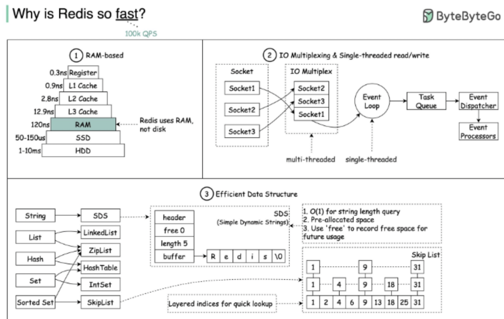
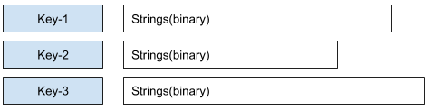

# Chapter. 3-2 대용량 트래픽&데이터 처리

챕터: Chapter 3

<aside>
🔄 Summary : : 지난 동시성 문제 챕터 돌아보기

</aside>

- Summary 지난 챕터 돌아보기
    
    ### 실제 현업에서 동시성 문제를 처리하는 방법 ?
    
     여러분들이 항상 바라고 바라는 `대용량 트래픽` 을 마주하는 데에 있어 가장 중요한 것은 동시에 수많은 요청이 들어오더라도 정확하게 데이터를 관리하고, 처리하는 것입니다. 만약 쿠폰 발급과 같이 수많은 사용자들에게 한정적인 수량의 상품을 제공해야한다 거나 콘서트 시나리오와 같이 동일한 좌석에 대한 중복 예약을 막는다던가 하는 부분은 **서비스의 성패** 로 이어지기 때문입니다. 만약 여러분들이 구현한 비즈니스 로직에서 데이터에 대한 동시성 문제가 발생해, 회사가 막대한 금전적 손해를 입게 된다면 ? 
    
    
    
    > You’re fired
    > 
    
    [https://www.cnbc.com/2019/03/01/former-apple-employee-guy-kawasaki-once-stood-up-to-steve-jobs-here-is-the-amazing-response-he-received.html](https://www.cnbc.com/2019/03/01/former-apple-employee-guy-kawasaki-once-stood-up-to-steve-jobs-here-is-the-amazing-response-he-received.html)
    
    까진 아니더라도 꽤나 심각한 손해로 이어질 수 있겠죠 😭 그만큼 우리는 데이터의 정합성을 잘 지켜주어야 하며 동시에 성능 문제 또한 고려해야 합니다. 그래서 짤막하게 이를 마주할 때 어떤 방식으로 접근하는 지를 가져와 봤어요.
    
    <aside>
    💡 어떤 Lock 을 적용해야 할지 고려하는 기준과 순서
    
    </aside>
    
    1. 낙관적 Lock 으로 해소 가능한지?
        
        ```
        낙관적 Lock 으로 해소 가능한지는 아래와 같은 판단 기준을 둡니다.
        [BEST] 수정에 실패했을 때, 해당 비즈니스 로직의 실패로 이어져도 되는 경우
        [2] 데이터의 수정이 동시에 많은 충돌을 야기하지 않는 경우 ( Retry 로 해소가능 한 요청량인가? )
        ```
        
        
        
    2. 비관적 Lock 으로 해소 가능한지?
        
        ```
        비관적 Lock 은 낙관적 Lock 에 비해 잠금을 위한 범위가 커질 수 있음.
        수정과 조회가 빈번하게 이루어지는 쿼리에서는 Lock 경합이 빈번하게 발생할 수 있다.
        또한 Lock 이 잠그는 범위가 큰 경우, 의도하지 않은 다른 테이블에 대한 조회에서도
        비관적 Lock 에 의한 대기 문제가 발생할 수 있다.
        
        하지만 비관적 Lock 은 `빠르게 처리가능하며` (작은 트랜잭션 범위) `반드시 순서대로
        성공해야 하는` 작업에 대해서 매우 효과적인 해결책이 될 수 있다.
        ```
        
        
        
    3. 분산 Lock 으로 해소 가능한지?
        
        ```
        Redis 등을 활용한 외부 Resource 를 통해 불필요한 DB Connection 까지 차단 가능하다.
        하지만 관리주체가 DB + Redis 와 같이 늘어남에 따라 다양한 문제 파생으로 이어진다.
        또한 Lock 의 관리주체가 다운되면 서비스 전체의 Down 으로 이어질 수 있는 문제가 있다.
        
        하지만 Redis 의 높은 원자성을 활용해 프로세스 처리단위에 대한 동일한 Lock 을
        여러 인스턴스에 대해 적용할 수 있으므로 매우 효과적일 수 있고, DB 의 Conection 이나
        오래 걸리는 I/O 에 대한 접근 자체를 차단할 수 있으므로 DB 에 가해지는 직접적인 부하를
        원천 차단할 수 있으므로 효과적이다.
        ```
        
        
        
        - DB Transaction 과 Lock 의 범위에 따른 처리 고려
            
            
            
        
        **[!] 여기서 잠깐! 분산락을 구현할때 아래와 같이 하면..?**
        
        ```java
        @Transactional
        public void charge(Long userId, BigDecimal point) {
        	RLock lock = redissonClient.getLock("userChargeLock")
        
        	try {
        		if(lock.tryLock() == true) {
        			User user = userRepository.findById(userId)
        			user.charge(point)
        		} else {
        			throw new LockAccruedFailedException();
        		}
        	} finally {
        		lock.unlock();
        	}
        }
        
        @Transactional
        public void pay(Long userId, BigDecimal point) {
        	RLock lock = redissonClient.getLock("userPayLock")
        
        	try {
        		if(lock.tryLock() == true) {
        			User user = userRepository.findById(userId)
        			user.pay(point)
        		} else {
        			throw new LockAccruedFailedException();
        		}
        	} finally {
        		lock.unlock();
        	}
        }
        ```
        
        - 발생 가능 현상 ( 우리의 의도대로 구현이 되었는가? )
            1. 트랜잭션과 락의 순차보장이 실패해요.
                - 트랜잭션이 시작된 후에 락을 획득하므로, 락을 획득하기 전에 데이터 정합성이 깨질 수 있습니다.
                    - @Transactional 어노테이션을 내부 메소드로 이동하여 락 획득 후 트랜잭션이 시작되도록 수정
            2. 충전과 결제가 동시에 수행 가능해요.
                - 각각 다른 락키를 사용하므로 충전과 결제가 동시에 발생할 수 있습니다.
                    
                    동일한 사용자에 대해서는 같은 락키를 사용하도록 수정 (예: "user:{userId}")
                    
            3. 충전과 결제 기능 자체에 걸리는 락.
                - 현재는 모든 사용자의 충전/결제가 하나의 락으로 관리되어 불필요한 병목현상 발생
                    
                    사용자별로 락을 분리하여 관리
                    
        - 코드 예시
            
            ```java
            public void charge(Long userId, BigDecimal point) {
                RLock lock = redissonClient.getLock("user:" + userId);
                try {
                    if (lock.tryLock()) {
                        executeInTransaction(() -> {
                            User user = userRepository.findById(userId);
                            user.charge(point);
                        });
                    } else {
                        throw new LockAcquireFailedException();
                    }
                } finally {
                    lock.unlock();
                }
            }
            
            public void pay(Long userId, BigDecimal point) {
                RLock lock = redissonClient.getLock("user:" + userId);
                try {
                    if (lock.tryLock()) {
                        executeInTransaction(() -> {
                            User user = userRepository.findById(userId);
                            user.pay(point);
                        });
                    } else {
                        throw new LockAcquireFailedException();
                    }
                } finally {
                    lock.unlock();
                }
            }
            
            @Transactional
            private void executeInTransaction(Runnable runnable) {
                runnable.run();
            }
            ```
            
    
      
    
    
    
    https://devbilllab.tistory.com/141
    

<aside>
⛵ **이번 챕터 목표**

</aside>

- Redis 의 특성에 따른 활용 방식을 고민해보고 올바른 설계로 풀어낼 방법을 고민해봅니다.
- 다량의 트래픽을 처리하기 위해 적은 DB 부하로 올바르게 기능을 제공할 방법을 고민해 봅니다.

<aside>
🚩 **What to do: 이번 챕터에 해야 할 것. 이것만 집중하세요!**

</aside>

### 1. Redis 자료구조

<aside>
ℹ️

Redis 는 기본적으로 Key-Value 기반의 데이터 저장소입니다.

Value 로는 단순히 String 뿐 아니라 **다양한 데이터 타입 ( Collections )**를 지원하는데, 이를 활용해 현업에서 단순히 캐시 뿐 아니라 다양한 용도로 활용하고 있어요. 

</aside>


[Understand Redis data types](https://redis.io/docs/latest/develop/data-types/)

### Strings

- 일반 문자열 ( 최대 512MB )
- **단순 증감 연산** 혹은 **문자열로 표현 가능한 모든 자료** 저장하는 목적으로 활용
- 주요 명령어
    - 수정 계열 : set, setnx, ..
    - 조회 계열 : get, mget, ..
    - INCR 계열 ( 단순 증감 )



### Sets

- 저장된 원소의 Unique 함을 보장하는 자료구조
- Set 은 정렬을 보장하지 않음
- Set 자료구조를 위한 연산 지원 ( 교집합 / 합집합 / 차집합 등 )
- 주요 명령어
    - 수정 계열 : sadd, smove
    - 조회 계열 : smembers, scard, ..
    - 제거 계열 : spop, srem
    - 집합 계열 : sunion, sinter, sdif, ..


### Sorted Sets

- set + score 가중치 필드가 추가된 자료구조
- 데이터 저장시, score 기반 오름차순 정렬로 저장됨
- score 값이 같은 경우, 사전순으로 정렬
- 주요 명령어
    - 수정 계열 : ZADD
    - 조회 계열 : ZRANGE, ZRANGEBYSCORE, ZRANK, ZSCORE, ..
    - 제거 계열 : ZPOPMIN, ZPOPMAX, ZREM, ..
    - 증감 계열 : ZINCRBY
    - 집합 계열 : ZUNIONSTORE, ZINTERSTORE


### 2. Redis 기반의 랭킹 시스템

## 🎯 개요

- 실시간 랭킹이 필요한 시스템(게임 점수, 인기 콘텐츠, 상품 조회 등)에 적합
- Redis의 `Sorted Set`을 활용하여 효율적이고 빠른 랭킹 처리 가능

---

## 🧱 핵심 개념: Redis Sorted Set

- 구조: `ZADD key score member`
- 정렬: score 기준 오름차순 (낮은 점수 → 높은 점수)
- 특징:
    - 같은 점수면 사전순 정렬
    - 점수 기반으로 순위 계산이 가능함
    - 조회 및 수정이 매우 빠름 (O(log N))

---

## 🔧 기본 명령어 예시

### 1. 점수 추가 및 갱신

```
ZADD game_ranking 1500 user123
ZADD game_ranking 3000 user456
ZADD game_ranking 2500 user789
```

### 2. 특정 사용자 점수 조회

```
ZSCORE game_ranking user123
```

### 3. 전체 랭킹 조회 (높은 점수가 1등)

```
ZREVRANGE game_ranking 0 9 WITHSCORES  # Top 10
```

### 4. 특정 사용자 순위 조회

```
ZREVRANK game_ranking user123
```

### 5. 점수 증가 (예: 게임 승리 시 점수 부여)

```
ZINCRBY game_ranking 100 user123
```

---

## 📦 응용 예시: 일간 / 주간 랭킹 분리

### 키 구성 전략

- `ranking:daily:20240429`
- `ranking:weekly:2024-W18`

### TTL 설정

- 일간 랭킹은 하루 후 자동 만료
- 주간 랭킹은 일주일 후 만료

```
EXPIRE ranking:daily:20240429 86400
```

---

## ⚠️ 주의할 점

- Sorted Set에 너무 많은 데이터를 넣으면 메모리 부담 ↑
- TTL 없이 데이터 계속 쌓이면 만료 누락 가능성 존재
- 동일 점수 처리 로직(예: 마지막 갱신 시간 기준 정렬 등) 필요 시 보완 로직 필요

---

## 🚀 실전 활용 예시

### 인기 상품 조회 랭킹 (24시간 클릭 수 기준)

- `ZINCRBY product:ranking:clicks:20240429 1 product123`
- 매일 자정 배치로 새로운 키 생성 및 TTL 부여

### 사용자 게임 랭킹

- `ZADD game:ranking:user 5000 userA`
- 클라이언트에게 `ZREVRANK` 결과 전달하여 등수 노출

---

## 📈 시각화 전략

- Redis에서 Top N을 가져와 DB 캐싱 → 사용자에게 제공
- 그래프 구성: 시간대별 랭킹 변동, 내 순위 추이 등 추가 분석 가능

---

## ✅ 요약

| 기능 | Redis 명령어 |
| --- | --- |
| 점수 등록/수정 | ZADD, ZINCRBY |
| 순위 조회 | ZREVRANK, ZREVRANGE |
| 점수 조회 | ZSCORE |
| 데이터 만료 | EXPIRE |

---

## 📚 참고

- Redis 공식 문서: https://redis.io/commands/zadd/
- Redis TTL 관리: https://redis.io/docs/manual/key-expiration/

### 3. Redis 기반의 구조 개선

<aside>
🗡️ 만약 RDBMS 가 주는 제약을 뛰어넘고 더 높은 처리량을 보장하고 싶다면? 
REDIS 를 보조 Datasource 로서 잘 활용해볼 수 있지 않을까 !
- 빠른 연산 속도
- 원자성을 보장
- 다양한 자료구조 및 기능

</aside>

### 선착순 쿠폰 발급

**쿠폰 선착순 요청 (first-come coupon issuance)**

- ___ 자료구조 활용

**쿠폰 중복 발급 방지 (duplicate coupon issuance)**

- ___ 자료구조 활용

### 대기열 토큰 관리

**대기유저 (Waiting Tokens)**

- ___ 자료구조 활용

**활성유저 (Active Tokens)**

- ___ 자료구조 활용

부록

- redis 가 현업에서 어떤식으로 구현되고 안전하게 서비스 할 수 있는가? (자동복구 포함)

      : https://tech.kakaopay.com/post/kakaopaysec-redis-on-kubernetes/

`REPO를 새로 생성하셨다면 이것부터 세팅해주세요!`

- PR 템플릿 세팅하기!
    - Repo를 생성하고 `.github` 폴더를 생성 후 `pull_request_template.md` 파일을 만들어서 아래 템플릿을 복사/붙여넣기해주세요!
- PR 템플릿
    
    ```markdown
    ## :pushpin: PR 제목 규칙
    [STEP0X] 이름 - 선택 시나리오 (e-commerce/concert)
    
    ---
    ### **핵심 체크리스트** :white_check_mark:
    
    #### one: ranking design 
    - [ ] 적절한 설계를 기반으로 랭킹기능이 개발되었는가?
    - [ ] 적절한 자료구조를 선택하였는가?
    
    #### two: Asynchronous Design 
    - [ ] 적절한 설계를 기반으로 쿠폰 발급 or 대기열 기능이 개발되었는가?
    - [ ] 적절한 자료구조를 선택하였는가?
    
    #### three: 통합 테스트 
    - [ ] redis 테스트 컨테이너를 통해 적절하게 통합 테스트가 작성되었는가?(독립적 테스트 환경을 보장하는가?)
    - [ ] 핵심 기능에 대한 흐름이 테스트에서 검증되었는가?
    
    ---
    ### STEP 13 Ranking Design
    - **이커머스 시나리오**
    - [] 가장 많이 주문한 상품 랭킹을 Redis 기반으로 설계
    - [] 설계를 기반으로 개발 및 구현
        
    - **콘서트 예약 시나리오**
    - [] 빠른 매진 랭킹을 Redis 기반으로 설계
    - [] 설계를 기반으로 개발 및 구현
    
    ### STEP 14 Asynchronous Design
    - **이커머스 시나리오**
    - [] 선착순 쿠폰발급 기능에 대해 Redis 기반의 설계
    - [] 적절하게 동작할 수 있도록 쿠폰 발급 로직을 개선해 제출
    - [] **시스템 ( 랭킹, 비동기 ) 디자인 설계 및 개발 후 회고 내용을 담은 보고서 제출
        
    - **콘서트 예약 시나리오**
    - [] 대기열 기능에 대해 Redis 기반의 설계
    - [] 적절하게 동작할 수 있도록 토큰 발급 로직을 개선해 제출
    - [] **시스템 ( 랭킹, 비동기 ) 디자인 설계 및 개발 후 회고 내용을 담은 보고서 제출
    
    ### **간단 회고** (3줄 이내)
    - **잘한 점**: 
    - **어려운 점**: 
    - **다음 시도**:
    ```
    

<aside>
🔔

**원활한 프로젝트 진행을 위한 학습 로드맵**

</aside>

### 10시간 학습 로드맵

## Redis 실전 설계 5일 로드맵 (+ 언어별 세팅 가이드)

### 전체 주제

**“Redis 자료구조의 이해를 바탕으로 랭킹 시스템과 대기열, 쿠폰 발급 기능을 효율적으로 설계한다”**

---

### Day 1: Redis 자료구조 이해하기

**🎯 목표**

- Redis의 기본 개념과 자료구조(String, Set, Sorted Set)를 학습하고 활용법을 익힌다.

**🛠 학습 키워드**

- Key-Value 구조
- Strings / Sets / Sorted Sets
- TTL, Expire

**✅ To-Do**

- 각 자료구조 별 명령어 실습 (`SET`, `SADD`, `ZADD` 등)
- Redis 구조별 특징 및 활용 사례 정리
- TTL 설정과 메모리 누수 방지 전략 학습

**언어별 세팅**

| 언어 | Redis 연동 방식 |
| --- | --- |
| Java | Spring Data Redis + RedisTemplate |
| Kotlin | Spring Redis + DSL 스타일 활용 |
| TypeScript | ioredis 기반 명령어 조합 |

**자가진단표**

- 자료구조 별 차이와 사용 목적을 설명할 수 있다
- TTL이 왜 필요한지 이해하고 있다
- 적절한 자료구조를 과제 상황에 맞게 선택할 수 있다

---

### Day 2: 실시간 랭킹 시스템 설계

**🎯 목표**

- Sorted Set을 활용하여 사용자/상품 기반의 실시간 랭킹 기능을 설계하고 구현한다.

**🛠 학습 키워드**

- ZADD / ZREVRANK / ZINCRBY / EXPIRE
- score 기반 정렬 / TTL 기반 주기 초기화

**✅ To-Do**

- 일간/주간 랭킹을 위한 Key 설계 (`ranking:daily:{date}`)
- 인기 콘텐츠 / 주문 수 기반 랭킹 데이터 입력 실습
- 랭킹 TOP N 추출 및 사용자 순위 확인 API 설계

**언어별 세팅**

| 언어 | 랭킹 시스템 구현 방식 |
| --- | --- |
| Java | ZSet 명령어 + TTL 스케줄링 구성 |
| Kotlin | Coroutine 기반 서비스 설계 |
| TypeScript | ZREVRANGE API + 캐시 결과 반환 |

**자가진단표**

- Sorted Set 구조를 활용한 랭킹 처리가 가능하다
- TTL과 만료 전략을 키 네이밍과 함께 설계할 수 있다
- score 동률 시 정렬 보완 전략을 고민해봤다

---

### Day 3: 대기열 & 사용자 상태 관리 구조 설계

**🎯 목표**

- Redis Set/List를 활용한 대기열/토큰 상태 관리를 설계한다.

**🛠 학습 키워드**

- 대기열: List / Sorted Set
- 사용자 상태 토큰 관리: Set
- TTL을 활용한 자동 소멸

**✅ To-Do**

- Waiting / Active 사용자 분리 저장 구조 설계
- 순차 처리 vs 우선순위 처리 전략 수립
- 실시간 대기 인원 수 추적 기능 구현

**언어별 세팅**

| 언어 | 대기열 구성 방식 |
| --- | --- |
| Java | RedisTemplate + Queue-like 처리 |
| Kotlin | Redis List 연동 + 대기번호 추적 |
| TypeScript | lpush/rpop 기반 토큰 대기열 처리 |

**자가진단표**

- 대기열 설계에서 FIFO or 우선순위 구조를 구분할 수 있다
- 사용자 상태별 데이터 분리를 고려할 수 있다
- TTL을 활용한 자동 만료 전략을 적용할 수 있다

---

### Day 4: 선착순 쿠폰 발급 시스템 설계

**🎯 목표**

- Redis 자료구조를 활용해 중복 없는 선착순 쿠폰 발급 기능을 구현한다.

**🛠 학습 키워드**

- 쿠폰 재고 관리: List or Sorted Set
- 중복 방지: Set
- 락 없이 처리 가능한 구조 설계

**✅ To-Do**

- 쿠폰 수량 제한 및 발급자 기록 구조 설계
- SADD + LPOP 구조 구현 실습
- 동시 요청에 대한 안정성 확보 전략 수립

**언어별 세팅**

| 언어 | 쿠폰 발급 처리 방식 |
| --- | --- |
| Java | SADD + LPOP 구조 구현 |
| Kotlin | RedisCommand 실행 기반 쿠폰 처리 로직 설계 |
| TypeScript | Lua Script 활용해 원자성 확보한 쿠폰 처리 |

**자가진단표**

- 중복 쿠폰 발급 방지 처리를 구현할 수 있다
- 재고 부족 시 처리 흐름을 설계할 수 있다
- 쿠폰 발급자 기록을 TTL과 함께 관리할 수 있다

---

### Day 5: 종합 실습 및 회고 설계

**🎯 목표**

- 랭킹 / 대기열 / 쿠폰 기능을 통합 설계하고 회고를 통해 개선 방향을 도출한다.

**🛠 학습 키워드**

- 기능 통합 설계 / TTL / 실시간 조회 API 설계
- Redis Key Naming 규칙 / 만료 및 초기화 전략
- 개발 결과 회고 (KPT)

**✅ To-Do**

- 이커머스 or 콘서트 예매 시나리오 중 택 1로 통합 설계 진행
- 기능 간 Key 충돌, TTL 격리 전략 수립
- 회고(KPT) 및 개선 아이디어 정리

**언어별 세팅**

| 언어 | 통합 구조 적용 방식 |
| --- | --- |
| Java | 통합 테스트 시나리오 구성 + KPT 작성 |
| Kotlin | 각 기능 테스트 분리 후 통합 설계 |
| TypeScript | 랭킹/대기열/쿠폰 API 통합 설계 및 로그 기반 검증 |

**자가진단표**

- 각 기능을 하나의 서비스 흐름으로 통합할 수 있다
- Redis Key 설계 기준을 명확히 할 수 있다
- 회고를 통해 개선 방향을 도출해봤다

### 3시간 학습 로드맵

## 3시간 압축 학습 가이드: Redis 기반 기능 설계 핵심만 딱!

### 시간 분배

| 세션 | 주제 | 소요 시간 |
| --- | --- | --- |
| 1 | Redis 자료구조 핵심 이해 | 45분 |
| 2 | 실시간 랭킹 시스템 설계 | 45분 |
| 3 | 대기열 & 쿠폰 발급 구조 비교 설계 | 45분 |
| 4 | 종합 설계 & 실습 아이디어 정리 | 45분 |

---

### 세션 1: Redis 자료구조 핵심 이해 (45분)

**핵심 메시지**

- Redis는 단순 캐시가 아닌 다양한 자료구조를 제공하는 고성능 데이터 저장소이다
- 올바른 자료구조 선택이 성능과 동시성 제어의 핵심이다

**빠르게 배우는 포인트**

- Strings, Sets, Sorted Sets의 구조와 차이점 이해
- TTL과 Expire를 통해 자동 만료를 설계하는 이유
- 각 자료구조별 실무 예시 연결 (e.g. Set으로 중복 방지)

**퀴즈**

- Set과 Sorted Set의 가장 큰 차이는?
- TTL이 누락되었을 때 발생할 수 있는 문제는?

---

### 세션 2: 실시간 랭킹 시스템 설계 (45분)

**핵심 메시지**

- Sorted Set은 점수 기반의 실시간 랭킹 구현에 매우 적합하다
- TTL을 함께 사용하여 일간/주간 랭킹 구조를 만들 수 있다

**빠르게 배우는 포인트**

- ZADD / ZREVRANK / ZINCRBY / EXPIRE 명령어 흐름
- `ranking:daily:{date}` 패턴의 키 전략
- 랭킹 점수 동률 시 보완 전략 (예: 타임스탬프 병합)

**퀴즈**

- ZREVRANGE와 ZREVRANK의 차이는?
- 일간 랭킹 TTL을 적용하지 않았을 때 생기는 문제는?

---

### 세션 3: 대기열 & 쿠폰 발급 구조 비교 설계 (45분)

**핵심 메시지**

- 대기열은 순서 보장이 중요하고, 쿠폰은 중복 방지가 중요하다
- 각각에 맞는 자료구조를 선택해 설계해야 한다

**빠르게 배우는 포인트**

- 대기열 구조 → Redis List (`LPUSH`, `RPOP`)
- 쿠폰 발급 구조 → Redis Set + 재고 List 분리 (`SADD`, `LPOP`)
- TTL을 활용한 사용자 상태 만료 처리

**퀴즈**

- 쿠폰 중복 발급을 막기 위해 가장 적절한 자료구조는?
- FIFO 처리가 필요한 상황에 Set을 쓰면 생길 수 있는 문제는?

---

### 세션 4: 종합 설계 & 실습 아이디어 정리 (45분)

**핵심 메시지**

- 기능 간 Key 충돌과 TTL 분리 전략이 설계의 품질을 결정한다
- 단순한 구조라도 설계 기준을 갖고 구현해야 유지보수가 가능하다

**빠르게 배우는 포인트**

- 기능별 키 네이밍 전략 정리 (`ranking:`, `coupon:`, `waiting:` 등)
- 일관된 TTL 관리 전략 수립
- 랭킹 + 쿠폰 발급 + 대기열을 하나의 흐름으로 설계하는 실습 아이디어

**퀴즈**

- 기능 통합 설계에서 가장 주의해야 할 Key 설계 실수는?
- TTL이 짧게 설정될 경우 어떤 문제가 발생할 수 있을까?

<aside>
🗓️ **Weekly Schedule Summary: 이번 챕터의 주간 일정**

</aside>

### **`STEP 13 Ranking Design`**

- **이커머스 시나리오**
    
    가장 많이 주문한 상품 랭킹을 Redis 기반으로 개발하고 설계 및 구현
    
- **콘서트 예약 시나리오**
    
    (인기도) 빠른 매진 랭킹을 Redis 기반으로 개발하고 설계 및 구현
    

### **`STEP 14 Asynchronous Design`**

- **이커머스 시나리오**
    
    선착순 쿠폰발급 기능에 대해 Redis 기반의 설계를 진행하고, 적절하게 동작할 수 있도록 쿠폰 발급 로직을 개선해 제출
    
- **콘서트 시나리오**
    
    대기열 기능에 대해 Redis 기반의 설계를 진행하고, 적절하게 동작할 수 있도록 토큰 발급 로직을 개선해 제출
    

> *각 시스템 ( 랭킹, 비동기 ) 디자인 설계 및 개발 후 회고 내용을 담은 보고서 제출*
> 

<aside>
🚥 **과제 평가 기준과 핵심 역량 Summary**

</aside>

### P/F 기준

<aside>
🚩 **과제 : 이번 챕터 과제 평가 기준에 따라 step의 pass/fail을 정합니다.**

</aside>

### 과제 평가 기준

- Redis 특성 및 자료구조에 대한 이해
- 실시간 랭킹과 같은 비즈니스 설계 역량
- 선착순 쿠폰, 대기열 시스템과 같은 고가용성 시스템 디자인 설계 역량

### **`STEP 13 Ranking System`**

- 부합하는 랭킹을 제공하기 위해 적절한 트랜잭션을 선정하고, 파이프라인을 만들었는지
- Redis SortedSet 기반의 랭킹 제공 로직을 적절하게 구현하였는지

### **`STEP 14 Asynchronous Design`**

- Redis 를 활용해 비동기로 동작하는 시스템으로 개선하였는지
- 기존 RDBMS 기반의 로직들을 Redis 기반의 로직으로 누락없이 마이그레이션하였는지

### 도전 항목

## Redis를 활용한 시스템 디자인 평가 항목 ( 랭킹 , 비동기 )

- Redis 기반으로 전환 시 인터페이스 설계의 일관성과 추상화 적절성
- 인프라 변경(DIP 적용 등)에 따른 비즈니스 로직 보호 및 의존성 관리의 적절성
- RedisTemplate을 활용한 의존성 최소화 및 Repository 구현의 최적화
- Redis 의 자료구조를 이해하고, 적절한 시스템 디자인으로 구상하는 역량
- 기존 시스템 설계에서 적절한 트랜잭션 구성을 통해 부가적인 기능 ( 랭킹 ) 을 제공
- 기존 시스템 설계에서 새로운 인프라 기반으로 리팩토링할 때, 기능 안정성을 확보하는지
- 보고서의 문제 배경 및 흐름(배경, 문제해결, 테스트, 한계점, 결론 등)의 명확한 구성

### 핵심 키워드 및 역량

## 🚀 Ranking Design (STEP 13)

**Redis 기반 랭킹 시스템 설계 및 구현**

### 🎯 과제 목표

- 기존에 시스템에서 제공되는 기능과 맞물린 트랜잭션을 구성하여 랭킹 메트릭을 수집합니다.
- 수집한 랭킹 메트릭 기반의 랭킹 시스템을 만들고, 유저에게 제공합니다.

### 🛠️ 핵심 기술 키워드

- Redis Sorted Set 활용
- 수집하고자 하는 기능적 작업단위 분석
- 실시간 랭킹시스템 구축
- Redis atomicity

### 🧠 핵심 역량

| 역량 | 설명 |
| --- | --- |
| **실시간 분산처리 이해** | Redis 자료구조를 비즈니스 로직에 효율적으로 활용 |
| **실시간 비즈니스 기능 제공** | 실시간 랭킹과 같은 비즈니스 기능을 제공 |
| **Redis CLI 활용 실습** | redis-cli 혹은 코드로 Redis 명령어 체험 및 자료구조 이해 |
| **Redis Atomicity 이해** | Redis 의 Atomicity 를 기반으로 시스템의 구조나 데이터의 흐름을 파악하는 역량 학습 |

---

## 🚀 Asynchronous Design (STEP 14)

**Redis 기반 선착순 / 대기열 시스템 설계 및 구현**

### 🎯 과제 목표

- 실시간성이 요구되는 비즈니스 로직(선착순 쿠폰 발급, 좌석 대기열 등)에 대해 Redis 자료구조 기반으로 로직을 재설계합니다.
- Redis 명령어 기반 구현 또는 스케줄러/큐 기반 설계를 적용합니다.
- 구현된 기능은 실제 동작이 가능한 형태로 통합 테스트 혹은 문서화된 시나리오를 통해 제출합니다.

### 🛠️ 핵심 기술 키워드

- Redis Sorted Set / Set 활용
- 선착순 발급 시스템
- 대기열 시스템 설계
- 스케줄러 기반 배치처리 / 큐 기반 처리

### 🧠 핵심 역량

| 역량 | 설명 |
| --- | --- |
| **실시간 분산처리 이해** | Redis 자료구조를 비즈니스 로직에 효율적으로 활용 |
| **분산환경에서의 안정성 확보** | 쿠폰 중복 방지, 동시 요청 안정성 확보 |
| **스케줄링 기반 처리 설계** | 적절한 시점에 Redis 데이터 → DB 반영 방식 구현 |
| **Redis CLI 활용 실습** | redis-cli 혹은 코드로 Redis 명령어 체험 및 자료구조 이해 |

---

## 🧭 요약 정리

| 구분 | STEP 13 | STEP 14 |
| --- | --- | --- |
| 핵심 주제 | Redis 기반 랭킹 시스템 설계 | Redis 기반 비동기 시스템 설계 |
| 과제 예시 | 인기 상품 및 공연 랭킹 구현 | 쿠폰 선착순 발급, 좌석 대기열 구현 |
| 핵심 자료구조 | Redis Sorted Set | Redis Set / Sorted Set |
| 제출 형태 | 기능 구현 및 테스트 / 설계 및 구현 보고서 | 기능 구현 및 테스트 / 설계 및 구현 보고서 |

### Todo Discussion

1. Redis 의 동작원리
2. 각 step 에 맞는 Redis 의 자료구조는 어떤게 적절한가?
3. DB와 Redis 저장소 분리 시 주의사항
