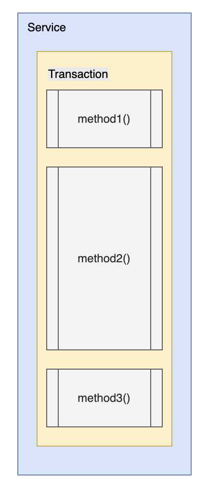

# Chapter. 3-3 대용량 트래픽&데이터 처리

학습자료: PR 템플릿 (https://www.notion.so/PR-2582dc3ef51480fab986c07e78d45773?pvs=21) 
챕터: Chapter 3

<aside>
🔄 Summary : 지난챕터 돌아보기

</aside>

- Summary 지난 챕터 돌아보기
    
    ## 레디스를 활용한 모든 것
    
    ### 캐싱
    
    캐시는 조회 비용이 크거나 자주 변하지 않는 데이터를 빠르게 응답하기 위해 사용하는 전략입니다. 우리는 레디스를 활용해 DB I/O를 줄이고 어플리케이션의 응답속도를 개선해 봤습니다. 
    
    캐시는 대용량 트래픽 상황에서 도입하면 매우 효과적이며, 반드시 비즈니스 로직에 맞는 적절한 캐싱 전략을 적용해야 합니다. 적절하지 않은 캐싱 전략을 사용할 경우 캐싱을 관리하는 비용이 더 많이 발생할 수도 있고, 오염된 데이터를 반환할 수도 있습니다.
    
    ### 분산락
    
    분산락은 다건의 요청이 동시에 특정 데이터를 접근하고 수정할 때 발생할 수 있는 “동시성 이슈”를 해결하기 위한 기술입니다. 우리는 레디스를 활용해 분산락을 적용하여 동시성 이슈를 해결해 봤습니다. 비관적락과 낙관적락은 DB Connection을 필요로 하기 때문에 대용량 트래픽을 그대로 데이터베이스까지 전달하지 않는 좋은 완충장치로도 사용할 수 있고, 특정 데이터(row)에 국한되지 않는 동시성 이슈에도 적용할 수 있었습니다.
    
    ### 레디스 자료구조
    
    String, List, Set, SortedSet, Hash 등 다양한 자료구조를 활용해 데이터를 관리하고 다양한 명령어를 학습해봤습니다. 앞으로 레디스를 활용해 어떤 자료구조와 어떤 명령어를 사용하여 데이터를 관리하는게 좋은지 판단하고 설계하고 구현할 수 있어야 합니다.
    
    ### 레디스를 활용하여 다양한 서비스 구현하기
    
    콘서트 서비스에서는 서비스에 접근하려는 수많은 사용자들을 그대로 허용하지 않고, 일정한 트래픽만을 허용하도록 대기열을 레디스로 구현해 데이터베이스의 트래픽을 최소화 해보았습니다.
    
    이커머스 서비스에서는 동일한 쿠폰을 동시에 발급받기를 원하는 수많은 요청을 데이터베이스의 부하 없이 레디스를 활용해 발급이 가능한 요청만을 발급 시도하여 데이터베이스의 부하를 최소화 해보았습니다.
    
    <aside>
    💡 대용량 트래픽에 관련된 면접에서 가장 많이 질문하는 서비스가 바로 이 레디스입니다. 
    앞으로는 레디스를 단순하게 캐시 정도로만 활용하지 말고, 대용량 트래픽을 처리하는 다양한 방법으로 고도화해서 알차게 활용합시다. 
    난이도가 높은 대용량 트래픽 관련 면접 질문에서도 기똥차게 답변해보아요.
    
    </aside>
    

<aside>
⛵ **이번 챕터 목표**

</aside>

## 이벤트를 활용한 관심사 및 트랜잭션 분리

- 현재 여러분들이 구현한 비즈니스 로직 별 트랜잭션의 범위를 파악하고 사이드 이펙트에 대해 고려해 봅니다.
- 비즈니스를 적절하게 핸들링할 수 있도록 선후관계를 파악하고, 애플리케이션 이벤트를 활용해 관심사를 분리하도록 개선해 봅니다.
- 도메인간 트랜잭션이 분리된다면 발생할 수 있는 문제와 해결하는 방법을 학습해봅시다.

<aside>
🚩 **What to do: 이번 챕터에 해야 할 것. 이것만 집중하세요!**

</aside>

### 1. 비즈니스 로직과 트랜잭션의 범위

앞서 우리는 동시성 제어를 학습하면서 시스템의 부하를 최소화하기 위해 락의 범위를 `무결성이 보장되는 수준에서 가장 최소화`해야한다고 배웠습니다. 이는 트랜잭션을 최소화하기 위함인데요, 락의 범위 뿐만 아니라, 무분별한 비즈니스 로직과 트랜잭션 규모 또한 우리가 예측하지 못한 문제를 발생시킬 수 있습니다.

<aside>
🔥 **문제 상황 1.** 하나의 트랜잭션이 너무 많은 작업 혹은 오래걸리는 작업 등을 처리하는 경우

</aside>



- **어떤 문제로 이어질 수 있을까?**
    - 오랜 시간이 소요되는 `method2` 작업으로 인해 전체 처리에 영향을 줄 수 있음
    - Transaction 범위 내에서 Lock 을 사용하고 있을 경우, 해당 자원에 접근하는 다른 요청의 대기 혹은 데드락 상황을 유발할 수 있음
    - 긴 생명 주기의 Transaction 의 경우, 오랜 시간은 소요되나 후속 작업에 의해 전체 트랜잭션이 실패할 수 있음

<aside>
🔥 **문제 상황 2.** 트랜잭션 범위 내에서 DB 와 무관한 작업을 수행하고 있는 경우

</aside>


- **어떤 문제로 이어질 수 있을까?**
    - API 요청과 같은 DB 외적인 작업이 오래 걸리게 되어 Transaction 이 길어지는 문제
    - DB 외적인 작업의 실패가 Transaction 의 범위로 전파되어 전체 비즈니스 로직이 `rollback` 되는 문제
        - 만약, externalAPI가 실패하더라도 우리의 비즈니스는 정상적으로 성공시켜도 되는 요구사항이라면?
    - externalAPI의 타임아웃으로 트랜잭션을 롤백시켰으나, external 서비스에서는 사실 정상적으로 처리되었을때 무결성을 잃게 되는 문제

### Example

<aside>
❓ 실시간 주문정보 전달 (이커머스 시나리오)
 ****데이터 분석을 위해 결제 성공 시에 실시간으로 주문 정보를 데이터 플랫폼에 전송해야 합니다. 

콘서트 예약에서도 동일한 요구사항을 추가해봅시다. 
데이터 분석을 위해 결제 성공 시에 실시간으로 좌석예약 정보를 데이터 플랫폼에 전송해야 합니다.

</aside>

### 우리의 코드..

```jsx
class OrderPaymentService {
	Transaction {
		fun 주문_결제() {
			유저_포인트_차감();
			결제_정보_저장();
			주문_상태_변경();
			주문_정보_전달();
		}
	}
}
```

주문 결제 메서드에서 핵심 로직과 부가 로직을 나눠본다면 다음과 같습니다.

- 핵심 로직
    - 유저 포인트 차감
    - 결제 정보 저장
    - 주문 상태 변경
- 부가 로직
    - 주문 정보 전달

이 코드에서는 다음과 같은 상황이 발생할 수 있습니다.

- 주문 정보 전달에 **실패**하면 결제의 모든 프로세스가 실패합니다.
- 주문 정보 전달이 **오래걸리면** 결제의 모든 프로세스가 오래 걸립니다.

**부가 로직**은 **핵심 로직**에 영향을 끼치지 않도록 구현하는 것이 좋겠습니다. 

그럼 우리는 어떻게 변경해야 할까요?

### 개선된 우리의 코드 !!

```jsx
class OrderPaymentService {

	fun 주문_결제() {
		execute_main();
		Async {
			try {
				주문_정보_전달();
			} catch(Exception e) {
				log.warn("[!] 부가로직 수행 에러 발생")
			}
		}
	}

	Transaction {
		private fun execute_main() {
			유저_포인트_차감();
			결제_정보_저장();
			주문_상태_변경();
		}
	}
}
```

이제는 **부가 로직**이 **핵심 로직**에 영향을 끼치지 않도록 구현했습니다.

- 주문 정보 전달이 실패하더라도 `warn` 로그와 함께 정상적으로 주문이 완료됩니다.
- 비동기(`Async`)로 처리하여 주문 정보 전달이 오래걸리더라도 결제 프로세스는 먼저 완료됩니다.

자, 어떤가요? 괜찮은가요? 

우리의 코드는 원하는 대로 “정확하게” 동작합니다.

하지만,  “**가독성**” 관점에서 좋은 코드라고 볼 수 없습니다. 왜냐하면, 부가 로직이 핵심 로직에 영향을 주지 않도록 작성한 코드가 더 중요하게 구현되어 핵심 로직을 이해하기 어렵기 때문입니다.

만약, 결제완료 알림톡 등의 부가 로직이 추가된다면..?

오늘 우리가 학습할 “이벤트”라는 친구가 필요한 이유가 여기에 있습니다.

### 2. 애플리케이션 이벤트를 통한 관심사 분리

 단순히 위 문제 뿐만 아니라, 우리의 비즈니스 로직은 과도한 책임이 주어져 있을 수 있습니다. 검증도 하고, 재고도 차감하고, 주문도 만들고, 결제도 하는 등 너무 많은 비즈니스 로직을 하나의 작업으로 처리하고 있기 때문에 위에서 살펴본 문제들이 발생할 수 있는 것이죠.

### Application Event

<aside>
📚 **Library & Keyword
`Spring` : ApplicationEventPublisher & EventListener / TransactionalEventListener
`nest.js` : event-emitter**

</aside>


**Event 기반 흐름 제어**

- `Event` 를 발행 및 구독하는 모델링을 통해 코드의 강한 결합을 분리함
- `Event` 에 의해 본인의 관심사만 수행하도록 하여 비즈니스 로직간의 의존을 느슨하게 함

**활용 방안**

- 비대해진 트랜잭션 내의 각 작업을 작은 단위의 트랜잭션으로 분리할 수 있음
- 특정 작업이 완료되었을 때, 후속 작업이 이벤트에 의해 trigger 되도록 구성함으로써 과도하게 많은 비즈니스 로직을 알고 있을 필요 없음
- 외부 API 호출 및 부가 로직의 실패나 지연이 주요 비즈니스 로직(트랜잭션)에 영향을 주지 않도록 구성할 수 있음

### 진짜 개선된 우리의 코드

```jsx

class OrderPaymentService {
	Transaction {
		fun 주문_결제() {
			유저_포인트_차감();
			결제_정보_저장();
			주문_상태_변경();
			
			결제_완료_이벤트_발행();
		}
	}
}

class OrderPaymentEventListener {

	TransactionEventListener(AFTER_COMMIT) {
		Async {
		  // Notify Service
			fun 주문_정보_전달(결제_완료_이벤트)
		}
	}
	
	TransactionEventListener(AFTER_COMMIT) {
		Async {
			fun 결제_완료_알림톡_발송(결제_완료_이벤트)
		}
	}
}
```

- OrderPaymentService에서 **핵심 로직**의 가독성이 훨씬 좋아졌습니다.
- 결제 완료에 대한 부가 로직에 대한 **관심사를 분리**했습니다.

이로써 우리는 “**이벤트**”를 통해 핵심 로직과 부가 로직을 나누어 트랜잭션을 분리할 뿐만 아니라, 관심사를 분리하여 코드의 가독성도 향상시켰습니다.

### Implementation

이벤트를 활용해서 단순히 **부가 로직**을 분리할 뿐만 아니라, 여러 도메인이 결합하여 구성된 **핵심 로직**을 각 도메인별로 관심사와 트랜잭션을 분리하도록 구성할 수도 있습니다.


**주의할 점**

- 각 작업의 논리적 의존이나 관계를 잘 파악해야 함
    - `Service A` 로직이 수행된 이후에 이벤트를 발행하여 `Service B`와 `Service C`가 각각 로직을 수행함
    - 만약 `Service B` 로직을 수행한 이후에 `Service C` 로직을 수행해야 한다면?
- 만약 이벤트에 의해 파생된 작업이 실패하였을 때, 원본 작업 또한 실패 처리를 해야 한다면 이를 위한 처리가 필요함 ( **keyword : `보상 트랜잭션, SAGA 패턴`** )
- 이벤트에 의해 각 작업이 영향을 주고 있는지, 혹은 이벤트가 발생하면 안되는 상황에서 이벤트가 발행되고 있지는 않은지 등

2023 AWS-SUMMIT

- [12가지 디자인 패턴으로 알아보는 클라우드 네이티브 마이크로서비스 아키텍처](https://www.youtube.com/watch?v=8OFTB57G9IU)
    - 17:21, Database Per Service
    - 18:37, CQRS and Event Sourcing, Materialized View
    - 22:52, Publish-Subscribe
    - 26:23, Service Choreography
    - 29:18, Service Orchestration
    - 30:57, Saga
- [토스ㅣSLASH 24 - 보상 트랜잭션으로 분산 환경에서도 안전하게 환전하기](https://www.youtube.com/watch?v=xpwRTu47fqY)

<aside>
🔔

**원활한 프로젝트 진행을 위한 학습 로드맵**

</aside>

### 10시간 학습 로드맵

## 💡 트랜잭션 분리 & 이벤트 기반 설계 5일 로드맵

**“트랜잭션 진단과 관심사 분리를 통해 안정적이고 유지보수 가능한 서비스 흐름을 설계한다”**

---

### Day 1: 트랜잭션 범위 진단과 사이드 이펙트 이해

**🎯 목표**

- 현재 구현된 트랜잭션의 범위를 점검하고, 부적절한 범위 확장 및 사이드 이펙트를 식별한다.

**🛠 학습 키워드**

- 트랜잭션 생명주기
- Lock 범위 최소화
- 트랜잭션 내 API 호출 문제

**✅ To-Do**

- 문제 상황 1, 2에 대해 팀/개인 서비스의 유사 케이스 점검
- 트랜잭션 내 부가 로직이 포함된 코드 탐색
- 결제 프로세스 내 비효율적 처리 패턴 리팩토링 시나리오 정리

**언어별 세팅**

| 언어 | 트랜잭션 진단 예시 코드 |
| --- | --- |
| Java | `@Transactional` 내 API 호출 구조 분석 |
| Kotlin | 서비스 로직 + 비동기 분리 예제 |
| TypeScript | Nest.js의 트랜잭션 블록 내 사이드 이펙트 분석 |

**자가진단표**

- 내 코드의 트랜잭션 범위는 기능 최소 단위로 유지되고 있는가?
- 외부 작업이 트랜잭션 내에 포함되어 있는가?
- 사이드 이펙트가 핵심 로직에 영향을 주는 구조인가?

---

### Day 2: 비즈니스 로직 분리와 비동기 처리 전략

**🎯 목표**

- 핵심 로직과 부가 로직을 분리하여 성능 및 신뢰도를 개선한다.

**🛠 학습 키워드**

- Async / Future
- 핵심 vs 비핵심 로직 분리
- 트랜잭션 커밋 이후 처리 전략

**✅ To-Do**

- 주문 결제 흐름을 중심으로 부가 로직을 비동기 처리하는 코드 작성
- `Async` 처리 시 예외 처리 및 로깅 전략 수립
- 기존 코드와 개선된 구조 비교

**언어별 세팅**

| 언어 | 비동기 분리 구현 방식 |
| --- | --- |
| Java | `@Async` + try-catch |
| Kotlin | 코루틴 기반 비동기 흐름 |
| TypeScript | `Promise`, `setImmediate` 처리 |

**자가진단표**

- 부가 로직을 비동기로 분리했는가?
- 예외 발생 시 로깅 혹은 보완 처리를 고려했는가?
- 핵심 로직 가독성 개선이 되었는가?

---

### Day 3: Application Event 이해 및 설계 도입

**🎯 목표**

- 이벤트 기반으로 관심사를 분리하고, 이벤트 흐름 설계를 통해 유지보수성을 향상시킨다.

**🛠 학습 키워드**

- Event 발행 / 구독
- `@TransactionalEventListener` / `@OnEventSafe`
- AFTER_COMMIT 타이밍 활용

**✅ To-Do**

- 주문 결제 → 주문 정보 전달 흐름을 Event 기반으로 리팩토링
- 이벤트 기반 로직 흐름도 작성
- 각 언어별 이벤트 발행 및 구독 실습

**언어별 세팅**

| 언어 | 이벤트 적용 방식 |
| --- | --- |
| Java | `ApplicationEventPublisher` + Listener |
| Kotlin | `data class Event` + `@Async` 구독자 |
| TypeScript | `event-emitter2` + `OnEventSafe` |

**자가진단표**

- 이벤트 구독 흐름이 핵심 로직에 영향을 주지 않는가?
- AFTER_COMMIT 시점에서만 실행되도록 설계했는가?
- 새로운 이벤트가 추가되었을 때 코드 변경 최소화를 고려했는가?

---

**🎯 목표**

- 이벤트 발행 후 다중 작업 처리 구조를 설계하고, 복잡한 비즈니스 흐름을 느슨하게 연결한다.

### Day 4: 이벤트 기반 시스템 통합 설계

**🛠 학습 키워드**

- 이벤트 다중 소비자 모델
- 관심사 분리 구조
- 확장 가능한 이벤트 설계

**✅ To-Do**

- 결제 완료 이벤트 → (1) 주문 정보 전달, (2) 알림톡 발송
- 동시 이벤트 소비자 로직 설계 및 분리
- 실패 시 복구 전략 구상 (로그, 리트라이, SAGA 패턴 기초)

**언어별 세팅**

| 언어 | 이벤트 병렬 처리 방식 |
| --- | --- |
| Java | 다중 `@TransactionalEventListener` |
| Kotlin | 이벤트 리스너 함수 분리 |
| TypeScript | 다중 `@OnEventSafe` 처리기 |

**자가진단표**

- 여러 후속 로직이 독립적으로 동작하도록 구현했는가?
- 리스너 하나의 실패가 전체에 영향을 주지 않는가?
- 비즈니스 로직의 강결합이 제거되었는가?

---

### Day 5: MSA 전환 대비 및 트랜잭션 분산 설계

**🎯 목표**

- MSA로 확장 시 발생할 트랜잭션 문제를 진단하고 설계 문서로 정리한다.

**🛠 학습 키워드**

- 도메인별 트랜잭션 경계
- 분산 트랜잭션 / 보상 트랜잭션 / SAGA 패턴
- 도메인 분리 & 메시징 전략

**✅ To-Do**

- 서비스 도메인별 배포 단위 설계
- 트랜잭션 일관성 보장 방안 정리
- 설계 문서 제출 (Diagram 포함)

**언어별 세팅**

| 언어 | 분산 트랜잭션 설계 요소 |
| --- | --- |
| Java | SAGA 설계 패턴 예시 |
| Kotlin | 도메인 간 메시지 전파 구조 |
| TypeScript | 이벤트 기반 MSA 흐름도 |

**자가진단표**

- 도메인 단위로 배포 가능하도록 설계했는가?
- 트랜잭션 경계를 명확히 구분했는가?
- 보상 트랜잭션에 대한 전략이 준비되었는가?

### 3시간 학습 로드맵

## ⚡ 3시간 압축 학습 가이드: 트랜잭션과 관심사 분리, 이벤트 설계 핵심만 딱!

### 시간 분배

| 세션 | 주제 | 소요 시간 |
| --- | --- | --- |
| 1 | 트랜잭션 구조 진단과 부가 로직 분리 | 45분 |
| 2 | Application Event의 구조와 흐름 이해 | 45분 |
| 3 | 이벤트 기반 다중 로직 분리 및 실습 전략 | 45분 |
| 4 | MSA 확장 대비 설계 원칙 & 보완 전략 | 45분 |

---

### 세션 1: 트랜잭션 구조 진단과 부가 로직 분리 (45분)

**핵심 메시지**

- 트랜잭션은 짧고 핵심적인 로직만 포함해야 한다
- 부가 로직이 트랜잭션을 오염시키면 서비스 장애로 이어질 수 있다

**빠르게 배우는 포인트**

- 트랜잭션 내 외부 API 호출 문제 사례
- 핵심 vs 비핵심 로직 구분 기준
- `Async`를 이용한 비동기 처리 구조 도입

**퀴즈**

- DB 외적인 작업이 트랜잭션 내에 있을 경우 발생할 수 있는 문제는?
- 핵심 로직과 부가 로직을 나누는 기준은 무엇인가요?

---

### 세션 2: Application Event의 구조와 흐름 이해 (45분)

**핵심 메시지**

- 이벤트 발행과 구독은 관심사 분리와 트랜잭션 안정성 확보의 핵심이다
- AFTER_COMMIT 시점에서의 이벤트 처리로 핵심 로직은 깔끔하게 유지할 수 있다

**빠르게 배우는 포인트**

- Spring: `ApplicationEventPublisher`, `@TransactionalEventListener`
- Nest.js: `event-emitter2`, `@OnEventSafe`
- 발행자-구독자 간 느슨한 결합 모델

**퀴즈**

- `@TransactionalEventListener`와 `@EventListener`의 차이점은?
- 이벤트 리스너에서 예외가 발생했을 때 시스템에 미치는 영향은?

---

### 세션 3: 이벤트 기반 다중 로직 분리 및 실습 전략 (45분)

**핵심 메시지**

- 하나의 이벤트에서 여러 관심사를 나눠 처리하면 서비스의 확장성과 유지보수성이 향상된다
- 실패한 부가 로직은 메인 로직에 영향을 주지 않아야 한다

**빠르게 배우는 포인트**

- 다중 리스너 구성 전략: 주문 정보 전달 + 알림톡 발송
- 리스너 간 독립성과 장애 허용 설계
- 로깅, 리트라이, 알림 등 후속 실패 처리 전략

**퀴즈**

- 여러 이벤트 리스너가 동일 이벤트를 처리할 때 주의할 점은?
- 부가 로직 실패를 사용자에게 알려야 할지 판단 기준은?

---

### 세션 4: MSA 확장 대비 설계 원칙 & 보완 전략 (45분)

**핵심 메시지**

- 도메인 분리는 트랜잭션 분리와 함께 고려되어야 하며, 보상 트랜잭션 전략이 필수적이다
- 이벤트만으로는 트랜잭션 일관성을 보장할 수 없기에 설계 기준이 필요하다

**빠르게 배우는 포인트**

- 도메인 단위 트랜잭션 분리 시 발생하는 문제
- SAGA 패턴과 보상 트랜잭션의 개념적 이해
- 도메인 분리 → 메시지 기반 연결 → 실패 대응 전략

**퀴즈**

- SAGA 패턴이 필요한 대표적인 상황은?
- 이벤트 발행으로 인한 트랜잭션 오작동을 막기 위한 전략은?

---

## 🧩 마무리 팁

- 각 세션 종료 후 5분씩 “핵심 문장 3줄 요약”을 작성하게 하면 집중도가 올라갑니다.
- 실습 없이 이론 중심 구성이므로, Day 5의 종합 설계 미션과 연결해 후속 과제로 확장 가능합니다.

<aside>
🗓️ **Weekly Schedule Summary: 이번 챕터의 주간 일정**

</aside>

### **`STEP 15** Application Event`

- 실시간 주문정보(이커머스) & 예약정보(콘서트)를 데이터 플랫폼에 전송(mock API 호출)하는 요구사항을 이벤트를 활용하여 트랜잭션과 관심사를 분리하여 서비스를 개선합니다.

### **`STEP 16 Transaction Diagnosis`**

- 서비스의 확장에 따라 어플리케이션 서버와 DB를 도메인별로 분리했을때, 트랜잭션 처리의 한계와 대응 방안에 대한 설계 문서 제출

( Try if you want ) 

보상트랜잭션, Saga 패턴 등 활용하여 우리의 프로젝트를 고도화 해봅시다.

- Facade 활용한다면 트랜잭션을 도메인 단위로 분리하고 발생하는 분산 트랜잭션을 올바르게 구현하기
- Facade 없이 서비스간 의존하는 구조라면 어플리케이션 이벤트를 활용하여 각 서비스 의존을 없애기
- PR 템플릿
    
    ```markdown
    ## :pushpin: PR 제목 규칙
    [STEP0X] 이름 - 선택 시나리오 (e-commerce/concert)
    
    ---
    ### STEP 15 Application Event
    - [] 주문/예약 정보를 원 트랜잭션이 종료된 이후에 전송
    - [] 주문/예약 정보를 전달하는 부가 로직에 대한 관심사를 메인 서비스에서 분리
    
    ### STEP 16 **Transaction Diagnosis**
    - [] 도메인별로 트랜잭션이 분리되었을 때 발생 가능한 문제 파악
    - [] 트랜잭션이 분리되더라도 데이터 일관성을 보장할 수 있는 분산 트랜잭션 설계 
    
    ### **간단 회고** (3줄 이내)
    - **잘한 점**: 
    - **어려운 점**: 
    - **다음 시도**:
    ```
    

<aside>
🚥 **과제 평가 기준과 핵심 역량 Summary**

</aside>

### P/F 기준

<aside>
🚩 **과제 : 이번 챕터 과제 평가 기준에 따라 step의 pass/fail을 정합니다.**

</aside>

### **`STEP 15** Application Event`  ****

- 실시간 정보를 데이터 플랫폼으로 전송하는 부가 로직은 핵심 로직에 영향을 주지 않도록 구현되어 있는지
- 이벤트를 활용하여 핵심 로직과 부가 로직을 적절히 분리하였는지

### **`STEP 16 Transaction Diagnosis`**

- 배포 단위의 도메인이 적절히  분리되어 있는지
- 트랜잭션의 분리에 따라 발생할 수 있는 문제를 명확히 이해하고 설명하고 있는지

### 도전 항목

- 과제를 충분히 이해할 수 있도록 과제의 핵심 커밋을 잘 관리하여 제출해야 합니다.
- 핵심 로직과 부가 로직의 각각의 가독성과 처리방식에 대해 구현 완성도가 높아야 합니다.
- 설계한 서비스 분리에 대해 모든 사람이 쉽게 이해할 수 있도록 그래프 등을 다양하게 활용하면 좋습니다.
- 발생 가능한 분산 트랜잭션 문제를 처리하는 방법이 합리적이고 비즈니스의 무결성을 보장할 수 있어야 합니다.

### 핵심 키워드 및 역량

### ✅ Transaction Diagnosis (STEP 15)

**트랜잭션의 범위에 대한 분석 및 분할 전략 수립**

---

### 🎯 과제 목표

서비스가 MSA 또는 도메인 분리 구조로 확장될 경우 발생할 수 있는 **트랜잭션 처리 한계**를 식별하고, 트랜잭션 처리

---

### 🛠️ 핵심 기술 키워드

- 트랜잭션 범위 관리 / 성능 최적화
- 서비스 간 결합도 제거

---

### 🧠 핵심 역량

| 역량 | 설명 |
| --- | --- |
| 트랜잭션 분석 역량 | Database 트랜잭션 및 API 요청 ~ 응답 구간에 대한 유효성 분석 |
| 분산 시스템 설계 역량 | 분산 시스템 아키텍처 상에 부합하는 트랜잭션 분할 전략 고려  |

---

### 🚀 Application Event (STEP 16)

**트랜잭션 문제 해결 및 이벤트 기반 관심사 분리 설계**

---

### 🎯 과제 목표

 **애플리케이션 이벤트 기반 설계**를 통해 **트랜잭션 범위 축소 및 관심사 분리**를 적용합니다.

또한 실시간 데이터 플랫폼 전송 요구사항(예: 주문, 좌석 예약 정보 전송)을 기존 트랜잭션 외부에서 처리하도록 개선합니다.

---

### 🛠️ 핵심 기술 키워드

- Event-driven Architecture (Spring / NestJS)
- ApplicationEventPublisher / EventEmitter2
- SAGA 패턴 / 보상 트랜잭션

---

### 🧠 핵심 역량

| 역량 | 설명 |
| --- | --- |
| 트랜잭션 분리 전략 수립 | 비즈니스 로직 내 핵심/부가 작업을 분리하여 트랜잭션을 효율적으로 설계 |
| 이벤트 기반 설계 능력 | 이벤트 발행/구독 구조를 통해 느슨한 결합 구조 설계 |
| 장애 방어 및 복원력 확보 | 외부 API 실패에 영향을 받지 않는 구조 설계 |
| 실시간/비동기 처리 경험 | 실시간 주문, 예약정보 전송을 비동기 이벤트로 처리 |

---

### 🧭 요약 정리

| 구분 | STEP 15 | STEP 16 |
| --- | --- | --- |
| 핵심 주제 | 트랜잭션의 범위에 대한 분석 및 분할 전략 수립 | 트랜잭션 분리 및 이벤트 기반 비즈니스 분할 |
| 과제 예시 | 서비스가 MSA 또는 도메인 분리 구조로 확장될 경우 발생할 수 있는 트랜잭션 처리 한계를 식별하고, 트랜잭션 처리 | 결제 완료 시 주문 정보 전송, 좌석 예약 정보 전송 |
| 핵심 전략 | 트랜잭션 범위 관리 / 성능 최적화, 서비스 간 결합도 제거 | 이벤트 기반 아키텍처, 트랜잭션 외부 비즈니스 처리 |
| 제출 형태 | 이벤트를 활용, 트랜잭션과 관심사 분리 + 서비스 개선 | 기능 구현 및 Event Listener 로직 분리 + 구조 설명 |

—

0823 QnA

```
이벤트 구조의 단점 중 하나는 코드의 트래킹이 어려울 수 있다는 점이라고 느낍니다.그렇다면 순환참조가 발생할 가능성은 보통 어떻게 안전하게 방지하는지 궁금합니다. 문서화 말고 구조적(코드 구조 or 린팅 or 컨벤션 등)으로 흔히 강제하는 패턴이 있는지 궁금합니다.

제가 생각해본 해결책은 다음과 같습니다:
  
코드 베이스가 분리된 MSA 구조에서의 해결책 => 이벤트 스키마 관련 코드 있는 쪽에 이벤트 토폴로지 (호출구조) 강제 린팅

하나의 코드 베이스 내에서의 event 이용에서의 해결책 => 이벤트가 어떤 도메인의 최상단 함수에서 발행되고 소비되는지 기록해두어서 순환참조 방지하는 파일 구현

--
단일 소스코드에서 여러 도메인을 관리할때 순환참조가 발생하면, application 실행에 실패하죠. 순환참조에 의해서..

1. MSA 내에서 서비스간 순환 참조는 발생하지 않는 것을 원칙으로 하지만, 필요에 의해서 반복적인 순환 참조가 아니라면 가능할 수도 있다.

**2. 어떤 비즈니스를 신규로 개발할때 관련된 도메인의 팀에서 전체적인 아키텍처를 함께 설계하는 방식

첫 구매 쿠폰?
이 유저에게 첫 구매 쿠폰을 발급해줘! -> 쿠폰의 도메인.
첫구매임을 확인하기 위해서는 이 유저의 주문 히스토리가 필요해요.

쿠폰 -> 주문

주문에서 쿠폰을 사용해줘! (주문 -> 쿠폰)
이때 이 쿠폰이 첫구매쿠폰이라면?
이 첫구매 쿠폰이 사용 가능한지 확인하려면, 주문의 히스토리가 필요해요.
(주문 -> 쿠폰 -> 주문)
쿠폰 사용 가능 여부 판단 API에 주문 히스토리를 함께 전달해줘!

쿠폰팀, 주문팀 모여서 순환참조 발생하지 않고, 가장 심플하고 유지보수 쉬운 설계를 같이 진행해요.

--
도메인에 DB를 각 도메인에 맞게 두 개씩 둔다는 사실을 본 것이 있는데
A 도메인 서비스 -> A DB + B` DB
B 도메인 서비스 -> B DB + A` DB
-> A의 구조 변경이 제약이 많이 생길 수 있어요.
-> 어느 정도 B 도메인에서 A 도메인의 특정 데이터를 비정규화해서 B 도메인의 메인 비즈니스로 관리하는 것은 일반적인 것 같아요. A` 로 두는게 아니라 B 안에 자연스럽게 녹여서 저장하는 구조가 더 일반적입니다.**

```

```
<주문 정보 외부 플랫폼 전송> 이벤트가 실패했을 시에 보상이 필요할까요?

주문 및 결제 트랜잭션 커밋 완료 ➡️ 주문 정보 외부 플랫폼 전송(이벤트)

이벤트를 활용해 핵심 로직과 부가 로직에 대해 관심사 분리의 필요성을 이해했습니다. 그런데, 핵심 로직은 성공했는데, 부가 로직이 실패한 경우에도 원복을 위한 보상 작업이 필요할까요?

외부 플랫폼에서 사용하는 주문 정보가 꼭 정합성이 맞아야 하지 않는다면 필요없을 것 같긴한데, 요구사항에 따라 다를 것 같긴합니다. 부가 로직에 재시도를 구현해 최대한 정합성을 맞춰보려는 구현 정도면 괜찮지 않을까 합니다.

--
당연히 재시도가 필요할 것입니다. 다만, 이번 과제에서는 포함하지 않아도 괜찮습니다.
```

```
이벤트 기반 서비스에서, 실패 또한 이벤트를 발행해 보상로직을 동작시키는 구조가 될 것 같은데, 

그 과정에서 이벤트가 유실된다면?? 실패인지 성공인지 다음 또는 이전 서비스는 알 방법이 없는데 이런 경우에는 어떤 해결방식이 필요한가요?

--
비동기 아키텍처에서 문제가 발생하는 꽤나 빈도가 높은 문제에요.
Transactional Outbox Pattern , Inbox Pattern 등을 활용해요.

```

```
DB를 도메인별로 물리적으로 분리한 상황에서 SAGA 패턴을 적용한다고 가정했을 때, 보상 트랜잭션의 순서 보장 문제에 대해 질문 드립니다.

예를 들어, 주문 → 결제 → 배송 순서로 트랜잭션이 흘러가다가 배송 단계에서 실패한다면, 배송 취소 → 결제 취소 → 주문 취소처럼 원래 실행 순서의 역순으로 보상 트랜잭션이 실행되어야 데이터 정합성이 맞다고 이해했는데요,

제가 고민되는 부분은...

DB가 분리되어 있어 분산 트랜잭션을 쓸 수 없는 상황에서, 보상 트랜잭션을 어떻게 하면 올바른 순서로 실행 보장할 수 있을까요?
이 순서 보장은 이벤트 발행/소비 레벨에서 해결 가능한지, 아니면 중앙에서 관리할.. 어떤 관리자(?)가 있어야만 가능한지 궁금합니다.

**실제 서비스에서는 보상 트랜잭션의 순서를 100% 보장하기보다는, 비즈니스적으로 허용 가능한 불일치를 정의하고 관리하는 방식도 쓰는지 궁금합니다..!**

--
롤백 API를 만들어서 호출하기 보다는, 배송 실패에 대한 이벤트를 정의하고. 상위 도메인에서 이 실패 이벤트를 수집해서 각각의 트랜잭션을 원복하는 프로세스를 개발하는 것이 제게는 조금더 일반적인 설계였다..
```

```
"- **핵심 로직에 비동기 적용 사례가 있으셨는지 궁금합니다.**
    
    위 사례를 통해, 대부분의 핵심 로직은 사용자가 요청과 함께 결과를 즉시 확인해야 하기 때문에 동기적으로 실행되는 것이 적합하다고 생각이 되었습니다. 따라서 대부분의 비동기 처리는 사용자와 직접 관계가 없는 내부 로직이나 통계 데이터 수집과 같은 용도로 활용되는 경우가 많을 것 같습니다. 
    
    하지만, 대규모 트래픽 환경에서 빠른 처리를 위해 핵심 로직임에도 불구하고 비동기 방식으로 구현한 사례가 있는지 궁금합니다."
"처음에는 모든 프로세스를 단순히 이벤트 드리븐으로 처리해야겠다고 생각했지만, **Message Queue를 통한 이벤트 처리 방식은 기본적으로 비동기** 처리라는 점을 고려하면서 생각이 바뀌었습니다.

-> 합리적인 사고가 맞습니다.
다만, 동기방식의 한계가 있어요. API 라고 하면, 응답에 직접적인 영향을 받죠.
API의 응답이 늦거나, 다른 시스템의 일시적인 장애가 발생했을때 고객관점에서는 어짜피 주문 못하는 상황이 됩니다.
하지만, 시스템 관점에서는 조금 다를 수 있어요.

고객입장 -> 주문요청. 서비스에서 주문을 생성하고 주문 생성 중이라는 상태와 함께 응답을 반환한 뒤, 주문완료 이벤트를 발행해서 재고를 차감하고, 포인트를 차감하고, 각각의 프로세스가 완료가 되었을때 주문 상태를 변경해요.

FE관점에서 고객에게 전달하는 내용은
1. 주문 생성 중입니다. 이따가 확인하세요~~
2. 폴링을 통해서 주문 생성이 완료될 때까지 500ms 마다 서버에 주문 상태를 확인하는 요청을 통해 프로세스가 완전히 종료된 이후에 고객에게 결과를 노출한다.

결제 플랫폼은 결국 카드사 / 은행 서비스의 온전한 트랜잭션을 처리한 결과를 반영해야하기 때문에.. 느릴 수 밖에 없어요.
주문서버와 결제서버가 할 일은 크게 없는데 이 결제서버가 PG사를 통해 실제 결제를 진행하는 이 시점에 지연이 매우 빈번하게 발생해요.
이 결제가 지연되는 상황에서 모든 서비스가 줄줄이 소세지로 스레드를 붙잡고 있으면.. 또다른 장애로 이어질 위험이 발생해요.

주문서비스에서 결제에 대한 타임아웃을 5초로 설정했어요.
그런데, 이 과정에서 타임아웃이 발생하면.. 단순히 주문을 실패처리하지 않고, 실 결제가 완료(실패든 성공이든)될 때까지 잠시 보류상태로 대기하도록 구현했어요.

FE에서 이 상태 코드를 받으면, 폴링하도록 구현해뒀어요.

잠시만 기다려주세요... ... => 결제 진행이 최대 2분까지 소요될 수 있습니다.
주문에서는 최대 2분까지 기다렸다가, 2분이 지났는데도 응답이 안오면 주문을 실패처리 해요.

---
**유저는 주문을 하면 즉시 주문 성공 여부를 확인**할 수 있어야 하기 때문에, **주문 등록 → 상품 수량 체크 → 주문 상세 등록 → 결제 등록까지는 동기**적으로 처리하는 것이 적절하지만. 반면, 외부 데이터 플랫폼 전송과 같이 **유저가 성공 여부를 바로 확인할 필요가 없는 작업은 Message Queue를 활용한 비동기 이벤트 처리**로 진행하는 것이 적합하다고 생각합

즉, **1번~4번은 동기** 처리, **5번은 비동기 처리라는 방식으로 Message Queue**를 활용하는 식으로 접근을 하였는데 제가 Message Queue를 활용한 비동기 처리 방식에 대해서 정확하게 이해를 하고 있는게 맞는지 궁금합니다."

---
"예를 들어 외부 API에 요청을 보내는 로직이 있다고 가정할 때, 보상 트랜잭션이 구현되어 있지 않고 API 요청이 한 건이라면 메서드 내에서 가장 먼저 실행하도록 구성하여 해당 로직이 실패하면 메서드 전체가 실패하도록 제어할 수 있어 보상 트랜잭션이 발생하지 않도록 할 수 있을 것 같습니다

하지만, 외부 API 요청이 두 건 이상일 경우에는 이러한 방식으로 실패를 관리하기 어렵기 때문에, 이러한 상황에서 저희가 취할 수 있는 대처 방법이 있는지 궁금합니다."
```

```
"차주까지 해서 OrderFacade를 이벤트 흐름으로 트랜젝션을 분리하여 구현에 도전해보려고 합니다.
트랜젝션이나 복원의 흐름이 기존 로직에서 크게 달라지는 부분들이 있어 Facade에 대한 테스트 코드가 통과하도록 유지하면서 구현을 할 수 있을까 걱정이되었습니다.

테스트 코드를 작성하는 이유는 주요 로직이 지속적으로 성공하는 것을 보장하면서 진행한다고 생각이 되는데, 이런 경우에 테스트 코드를 더 수정을 하면서 개발을 하는 지 아니면 새로운 설계에 맞는 테스트 코드를 새로 작성하고 기존 테스트 코드는 폐기 후에 새로 개발을 해야할 지 궁금합니다."

--
TDD에서의 테스트케이스는 **지금 설계한 각각의 클래스의 책임을 검증하는 목적
그런데, OrderFacade를 더이상 활용하지 않고 다른 클래스들을 활용하도록 아키텍처를 변경한다면,
OrderFacadeTest는 더이상 무의미해지는거죠.**
```

```
"스프링으로 이벤트 기반 처리 시 트랜잭션 증가에 따른 DB 부하는 어떻게 관리해야 하나요?

- @TransactionalEventListener(AFTER_COMMIT)를 활용하면 이벤트마다 새로운 트랜잭션이 열려 DB Connection Pool 점유가 늘어날 수 있다고 생각합니다.
- 실무에서는 이러한 이벤트 기반 트랜잭션 증가로 인한 성능 문제나 커넥션 풀 관리 문제를 어떻게 해결하고 계신지 궁금합니다."

--
우리는 하나의 프로젝트에서 하나의 DB로 운영하고 있기 때문에 하나의 커넥션으로 수행할 수 있지만 분리하는 것처럼 느껴질 수 있어요.
기본적으로, 도메인 단위의 응집도를 높이는 구조를 채택하기 때문에 도메인별 데이터베이스를 별도로 가져가는 케이스가 많았던 것 같아요.

```

```
"ApplicationEvent를 활용한 관심사 분리 방식이 어느 정도까지 확장 가능할까요?
서비스 규모가 커지면 Kafka 같은 이벤트 플랫폼을 쓰게 될 텐데, 그 전환 기준은 보통 어디에서 결정되는지 궁금합니다."

--
설계자가 누구냐에 따라 달라지기도 하고, 같은 상황인데도 누구는 굳이 나누지말자, 누구는 꼭 나눠야한다.
https://product.kyobobook.co.kr/detail/S000061897997
소프트웨어 아키텍처 - The hard parts
```

```
비동기 로직이 너무 오래걸리고, 비동기 로직을 갖고있는 api가 많이 호출된다면 자원 점유가 문제가 될것 같은데, 이미 해당 api들은 응답이 되었을테니 병목 지점을 찾기 힘들것 같다는 생각이 드는데 어떤 방식으로 해결해야하나요?

--
이 api 요청에 대한 응답시간으로는 병목을 확인할 수가 없다. 근데 자원 점유에 대한 문제는 발생할 수 있죠.

주문이 완료된 이후에 slack 메시지를 보내는 요구사항.
slack 메시지를 전송하는 로직을 after_commit 시점으로만 설정했었어요.
datadog 같은 모니터링툴을 확인하면, 각 서비스의 흐름이 가시화되어 어떤 프로세스가 자원을 오래 점유하는지, 얼마나 오래 걸리는지 등을 파악할 수 있어요.

```

```
"통합테스트에서는 전체 흐름을 확인해보는 것으로 이해하고있는데
이벤트 발행/구독에 대한 테스트 코드 작성은 어떻게 해야하는 지 궁금합니다.
실제 이벤트가 발행되고 구독한 이벤트가 정상적으로 실행했는를 한번에 테스트하는 지, 
이벤트 발행과 보상트랜잭션을 따로 테스트하는 지 궁금합니다.
"

--
다른 개발자분들과, 우리 다른 코치님들과 다른 의견일 수 있을 것 같아요.
제 주관인 견해를 말씀드려보자면,

테스트코드를 해당 클래스의 책임을 검증하는 관점에서 작성하는 것을 매우 좋아해요.
전체적인 flow를 단위테스트로 모두 검증할 수는 없어요.
- 서비스에서는 이벤트 발행을 하는 applicationEventPublisher.publish() 가 1번 잘 호출되었는지..
- 이벤트 리스너에서는 이런 이벤트가 인입되었을때 이 클래스가 해야할 일들을 수행을 하는지...

@Transactional 어노테이션이 걸린 메서드가 트랜잭션이 잘 걸리는지 통합테스트로 검증 하나요? -> 아니요.

이벤트 퍼블리셔와 리스너가 정상동작하는지는 굳이 테스트코드를 통해서 검증하지는 않는 편이에요.

```

오케스트레이터 vs 코레오그래피 via 챗지피티

주문을 생성하고, 재고를 차감하고, 포인트를 차감하는 분산트랜잭션을 설계하고 있는데, 오케스트레이터와 코레오그래피 패턴으로 구현하는 샘플을 좀 제시해줘~~


