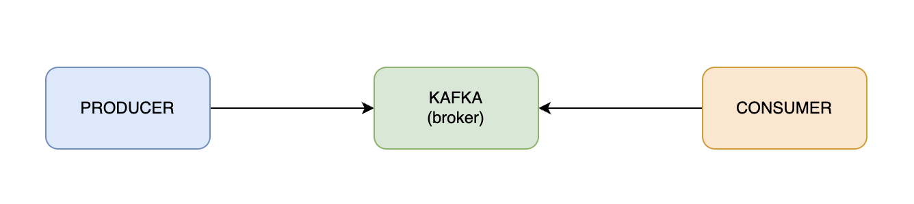
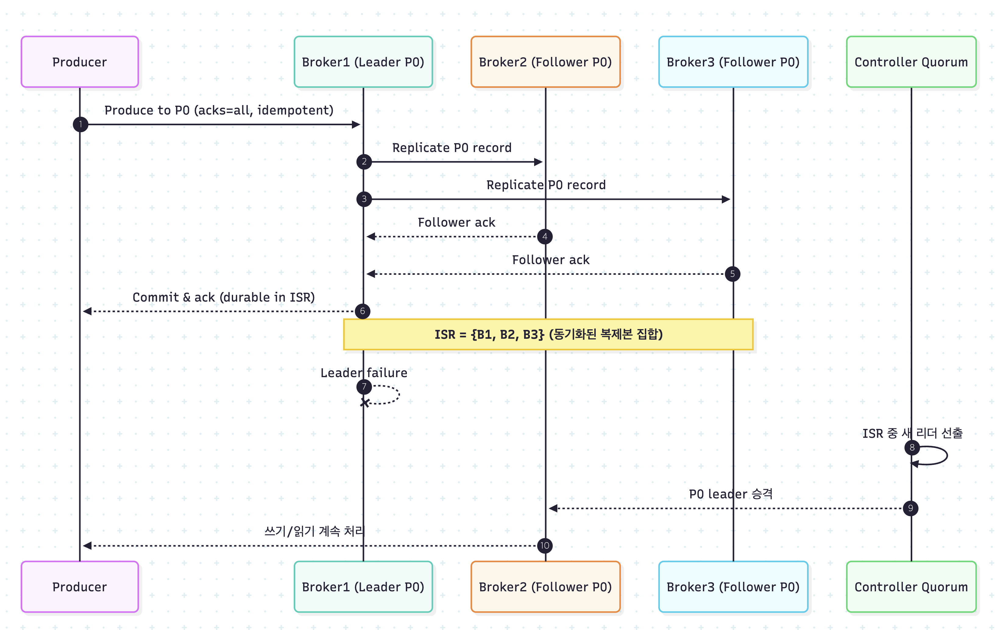

# Chapter. 3-4 대용량 트래픽&데이터 처리

학습자료: 요즘 왜 다들 카프카, 카프카 하는 거지?
- 대규모 실시간 데이터 스트리밍을 위한 분산 메세징 시스템
- 높은 처리량 및 개발 효율을 위한 분산 시스템에서 고가용성과 유연함을 갖춘 연계시스템이 필요 (https://www.notion.so/2252dc3ef514818ab5c1f01672364d46?pvs=21) 
챕터: Chapter 3
과제: Weekly Schedule Summary: 이번 챕터의 주간 일정 (https://www.notion.so/Weekly-Schedule-Summary-2252dc3ef51481d6b404ea7dc79227d6?pvs=21)

<aside>
🔄 Summary : 지난 챕터 돌아보기

</aside>

- Summary 지난 챕터 돌아보기
    
    <aside>
    🚧 트랜잭션과 관심사 분리
    
    </aside>
    
    ```jsx
    class OrderPaymentService {
    	Transaction {
    		fun 주문_결제() {
    			유저_포인트_차감();
    			결제_정보_저장();
    			주문_상태_변경();
    			주문_정보_전달();
    		}
    	}
    }
    ```
    
    - 주문 결제 서비스의 책임은 ****유저 포인트 차감, 결제 정보 저장, 주문 상태 변경**으로 결제 처리를 진행하는 것
    - 주문 정보 전달 **이 어떤 이유에 의해 오래 걸릴 경우 전체 트랜잭션에 영향을 끼침
    - 주문 정보 전달 이 실패할 경우 결제 처리 전체가 실패하게 됨
    
    > 주문 정보의 전달은 **부가 로직** 이므로 **핵심 로직** 인 결제 처리에 영향을 끼치면 안된다.
    > 
    
    ### 진짜 개선된 우리의 코드
    
    ```java
    class OrderPaymentService {
    	Transaction {
    		fun 주문_결제() {
    			유저_포인트_차감();
    			결제_정보_저장();
    			주문_상태_변경();
    			
    			결제_완료_이벤트_발행();			
    		}
    	}
    }
    
    class OrderPaymentEventListener {
    
    	TransactionalEventListener(AFTER_COMMIT) {
    		Async {
    			fun 주문_정보_전달(결제_완료_이벤트)
    		}
    	}
    	
    	TransactionalEventListener(AFTER_COMMIT) {
    		Async {
    			fun 결제_완료_알림톡_발송(결제_완료_이벤트)
    		}
    	}
    }
    ```
    
    - 어플리케이션에서 트랜잭션을 쉽게 분리할 수도 있고, 비즈니스 로직의 코드 결합도가 확 낮춰진게 너무 좋지 않나요? ㅎㅎ
    
    <aside>
    ✂️ 분산 트랜잭션의 한계와 극복
    
    </aside>
    
    관심사 & 책임 분리를 통해 작은 단위의 트랜잭션 & Lock을 설계할 수 있습니다. 다만 이 작업이 어려운 이유는 아래와 같은데요. 
    
    - 분산된 트랜잭션을 동기화하기 어려움
        
        > **[ 고민 포인트 ]** 동시에 수행되어야 할 트랜잭션 중 하나가 실패한 경우 모두를 롤백시킬 방법 ?  ( keyword : 보상 트랜잭션, 2PC, SAGA 패턴 )
        > 
    - 비동기 처리로 인한 요청-응답 불일치 문제
        
        <aside>
        💡
        
        쿠폰 발급 서비스의 부하를 줄이는 목적으로 발급 처리를 별도의 스레드에서 처리할 수 있도록 설계를 해본다면?
        
        </aside>
        
        ```mermaid
        sequenceDiagram
            participant Client
            participant CouponService
            participant Executor as ThreadExecutor
            participant Worker as Coupon Worker
            
            Client->>CouponService: 1. 쿠폰 발급 요청
            
            CouponService->>Executor: 3. 쿠폰 발급 작업 제출 (submit)
            Executor->>Worker: 4. 작업 실행 (스레드 할당)
            
            CouponService-->>Client: 5. 즉시 응답 (요청 ID 반환)
        		
        		Note over Worker: CouponWorker에서 비동기 처리
        		
        		opt 클라이언트가 상태 확인
                Client->>CouponService: 6. 쿠폰 발급 상태 확인 요청
                CouponService-->>Database: 7. 현재 처리 상태 확인
                CouponService-->>Client: 8. 쿠폰 상태 전달
            end
        ```
        
        일반적인 API의 응답과 다른 점은 쿠폰 요청의 응답은 쿠폰의 “**발급 성공 여부”**가 아닌 “**발급 요청 ID**”라는 점입니다. 고객은 쿠폰의 발급 여부를 확인하기 위해 추가적으로 쿠폰 발급 상태를 확인하는 요청을 통해 결과를 확인해야하는 부가적인 작업이 필요합니다.
        
    
    ### 마치며..
    
    트랜잭션이 분리되었을때 고민해야하는 문제들과 해결과정들을 학습해 봤어요. 분산 트랜잭션과 해결과정은 원래도 어려운 주제이니까 모든 내용을 완벽하게 이해하기는 어려워요. 현업에 돌아가서도 다양한 요구사항을 갖는 시스템을 설계하면서 이번주에 학습했던 설계를 적용해보면서 감각과 경험을 함께 키워보는 것이 중요합니다.
    

<aside>
⛵ **이번 챕터 목표**

</aside>

- 카프카란 무엇인지, 왜 대량의 트래픽을 처리하는 서비스에서 사용하고 있는지 알아봅니다.
- 카프카를 활용해서 이벤트를 서비스 단위로 확장하고, 안정적인 이벤트 처리를 위한 방법을 알아봅니다.

<aside>
🚩 **What to do: 이번 주에 해야 할 것. 이것만 집중하세요!**

</aside>

<aside>
💡 요즘 왜 다들 **카프카, 카프카** 하는 거지?
- 대규모 실시간 데이터 스트리밍을 위한 **분산 메세징 시스템**
- 높은 처리량 및 개발 효율을 위한 분산 시스템에서 **고가용성과 유연함**을 갖춘 연계시스템이 필요

</aside>

### 카프카 Overview



1. **Producer & Consumer**
    - `Producer` - 메세지를 카프카 브로커에 적재(발행)하는 서비스
    - `Consumer` - 카프카 브로커에 적재된 메시지를 읽어오는(소비) 서비스
        - 메세지를 읽을 때마다 파티션 별로 offset을 유지해 처리했던 메세지의 위치를 추적
        - `CURRENT-OFFSET`
            
            컨슈머가 어디까지 처리했는지를 나타내는 offset 이며,  동일한 메세지를 재처리하지 않고, 처리하지 않은 메세지를 건너뛰지 않기위해 마지막까지 처리한 offset을 저장(커밋)해야함
            
        - 만약 오류가 발생하거나 문제가 발생할 경우, 컨슈머 그룹 차원에서 `--reset-offsets`  옵션을 통해 특정시점으로 offset을 되돌릴 수 있음
2. **Broker**
    - 카프카 서버 Unit
    - Producer의 메세지를 받아 offset 지정 후 디스크에 저장
    - Consumer의 파티션 Read에 응답해 디스크의 메세지 전송
    - `Cluster` 내에서 각 1개씩 존재하는 Role Broker
        - **Controller**
            
            다른 브로커를 모니터링하고 장애가 발생한 Broker 에 특정 토픽의 Leader 파티션이 존재한다면, 다른 브로커의 파티션 중 Leader 를 재분배하는 역할을 수행
            
        - **Coordinator**
            
            컨슈머 그룹을 모니터링하고 해당 그룹 내의 특정 컨슈머가 장애가 발생해 매칭된 파티션의 메세지를 Consume 할 수 없는 경우, 해당 파티션을 다른 컨슈머에게 매칭해주는 역할 수행 (`Rebalance`)
            
3. **Message**
    - 카프카에서 취급하는 데이터의 단위로 <`Key` , `Message`> 형태로 구성
4. **Topic & Partition**
    
    
    
    - `Topic` 은 메세지를 분류하는 기준이며 N개의 `Partition` 으로 구성
    - `Partition` 에 발행된 순서대로 컨슘함으로써 순차처리를 보장
        - 대용량 트래픽을 **파티션의 개수만큼 병렬로 처리**할 수 있어 빠른 처리 가능
        - 전체 메세지의 발행 순차처리를 보장하지 않지만, **같은 파티션의 메세지에 대해서는 순차처리**를 보장
        - 동시성 제어의 개념을 생각했을때, 동시에 처리되면 안되는 자원의 Id 등을 메세지의 키로 설정하면 순차처리가 보장되어야 하는 케이스는 보장도 되면서 병렬 처리로 높은 처리량을 보장한 하이브리드
            - 포인트 차감
                - 유저1,2,3의 포인트 충전&차감이 동시에 일어나도 되지만
                - 유저1의 포인트 충전&차감은 동시에 일어나면 안되죠.
    - `Producer` 에서 메세지를 발행할 때, 저장될 `Partition` 을 결정하기 위해 메세지의 **키 해시**를 활용하며, 키가 존재하지 않을 경우 균형 제어를 위해 Round-Robin 방식으로 메세지를 기록
        
        ```jsx
        key: "842"
        hash: "55478" // "842".hashCode()
        partitionCnt: "3"
        
        targetPartition: 2 // 55478 % 3
        ```
        
        - **Partitioner**
            
            메세지를 발행할 때, 토픽의 어떤 파티션에 저장될 지 결정하며 Producer 측에서 결정. 특정  메세지에 키가 존재한다면 키의 해시 값에 매칭되는 파티션에 데이터를 전송함으로써 키가 같은 메시지를 다건 발행하더라도, 항상 같은 파티션에 메세지를 적재해 **처리순서를 보장**할 수 있음.
            
    - 한 `Partition` 은 하나의 컨슈머에서만 컨슘할 수 있음
        - 하나의 파티션에 여러개의 컨슈머가 메시지를 컨슘하면 메시지 처리의 순서를 보장할 수 없게 됨
5. **Consumer Group**
    - 하나의 토픽에 발행된 메세지를 여러 서비스가 컨슘하기 위해 그룹을 설정
        - 하나의 주문완료 메세지를 결제서비스에서도, 상품서비스에서도 컨슘
    - 보통 소비 주체인 Application 단위로 Consumer Group 을 생성, 관리함
    - 같은 토픽에 대한 소비주체를 늘리고 싶다면, 별도의 컨슈머 그룹을 만들어 토픽을 구독
        
        
        
    
    > 파티션의 개수가 그룹 내 컨슈머 개수보다 많다면 잉여 파티션의 경우 메세지가 소비될 수 없음을 의미함
    > 
    - **( 참고 )** 토픽의 Partition 개수와 Consumer 개수에 따른 소비
        
        
        
        
        
        
        
6. **Rebalancing**
    - Consmuer Group 의 **가용성과 확장성**을 확보해주는 개념
    - 특정 컨슈머로부터 다른 컨슈머로 파티션의 소유권을 이전시키는 행위
        
        e.g. `Consumer Group` 내에 Consumer 가 추가될 경우, 특정 파티션의 소유권을 이전시키거나 오류가 생긴 Consumer 로부터 소유권을 회수해 다른 Consumer 에 배정함
        
    
    <aside>
    🚫 **( 주의 )** 리밸런싱 중에는 컨슈머가 메세지를 읽을 수 없음.
    
    </aside>
    
    `Rebalancing Case`
    
    1. Consumer Group 내에 새로운 Consumer 추가
    2. Consumer Group 내의 특정 Consumer 장애로 소비 중단
    3. Topic 내에 새로운 Partition 추가
7. **Cluster**
    - 고가용성 (HA) 를 위해 여러 서버를 묶어 특정 서버의 장애를 극복할 수 있도록 구성
    - Broker 가 증가할 수록 메시지 수신, 전달 처리량을 분산시킬 수 있으므로 확장에 유리
        
        > 동작중인 다른 Broker 에 영향 없이 확장이 가능하므로, 트래픽 양의 증가에 따른 브로커 증설이 손쉽게 가능
        > 
8. **Replication**
    - Cluster 의 가용성을 보장하는 개념
    - 각 Partition 의 Replica 를 만들어 백업 및 장애 극복
        - Leader Replica
            
            각 파티션은 1개의 리더 Replica를 가진다. 모든 Producer, Consumer 요청은 리더를 통해 처리되게 하여 일관성을 보장한다.
            
        - Follower Replica
            
            각 파티션의 리더를 제외한 Replica 이며 단순히 리더의 메세지를 복제해 백업한다. 만일, 파티션의 리더가 중단되는 경우 팔로워 중 하나를 새로운 리더로 선출한다.
            
            > Leader 의 메세지가 동기화되지 않은 Replica 는 Leader 로 선출될 수 없다.
            > 
            
    
    **[ Sequence Diagram ]** 파티션 별의 Leader와 Follower 
    
    
    

> **비동기 메세지 통신으로 데이터를 처리할 때 주의할 점**
비즈니스 로직 실행 이후에 이벤트가 발행되지 않을 경우, 해당 이벤트를 바라보는 Consumer 또한 본인의 비즈니스 로직을 수행할 수 없으므로 전체적인 비즈니스 흐름에 Hole 이 생기거나 데이터 정합성에 문제가 생길 수 있다.
> 

### 비동기 메세지 통신을 통한 책임 분리

지난주에 해치웠다고 생각했던 로직을 다시한번 불러와볼까요?

### 진짜 개선된 우리의 코드

```jsx
class OrderPaymentService {
	Transaction {
		fun 주문_결제() {
			유저_포인트_차감();
			결제_정보_저장();
			주문_상태_변경();
			
			결제_완료_이벤트_발행();			
		}
	}
}

class OrderPaymentEventListener {

	TransactionalEventListener(AFTER_COMMIT) {
		Async {
			fun 주문_정보_전달(결제_완료_이벤트)
		}
	}
	
	TransactionalEventListener(AFTER_COMMIT) {
		Async {
			fun 결제_완료_알림톡_발송(결제_완료_이벤트)
		}
	}
}
```

- 서비스 코드도 깔끔해지고, 외부 로직이 어떤것들이 있는지 관심사가 분리됨
- 트랜잭션 커밋 이후에 비동기적으로 수행되기 때문에 외부 api에 영향을 정확하게 제거함
- 와 해치웠나!!??
- 그런데… 데이터 수집 플랫폼이 일시적인 장애가 발생해서 api가 실패했다면?
    - 데이터 수집 플랫폼으로 데이터를 재 전달해줘야하는 책임은 우리한테 있는 억울한 느낌..
    - 재전송 로직은 또 어디다 만들지…

데이터 수집 플랫폼의 메세지의 수신불가 상황의 책임을 우리가 갖지 않으려면?

데이터 수집 플랫폼이 일시적인 장애상황일 때에도 카프카에 주문정보를 정상적으로 적재(저장)해둔다면, 장애상황 해제 이후 적재되었던 주문정보를 “알아서” 컨슘해가면 되지 않을까?

### 진짜 최종 개선된 우리의 코드

```jsx
class OrderPaymentService {
	Transaction {
		fun 주문_결제() {
			유저_포인트_차감();
			결제_정보_저장();
			주문_상태_변경();
			
			결제_완료_이벤트_발행();			
		}
	}
}

class OrderPaymentEventListener {

	TransactionalEventListener(AFTER_COMMIT) {
		**kafkaProducer.publish(**결제_완료_이벤트**);**
	}
}
```

- 주문정보를 카프카로 전달한다면 데이터 수집 플랫폼, 알림 서비스에서 메세지를 잘 받았던 못 받던 내 책임은 끝!!
- 두 서비스는 각각 다른 `Consumer Group` 으로 발행되는 메시지를 알아서 각각 처리할 수 있음
- 주문 서비스에서 이후에 일어나는 부가 로직에 대한 관심사가 아예 제거됨
    - 데이터 수접 플랫폼, 알림 서비스에서 주문의 결제 완료 카프카 이벤트를 받아 처리
- 비동기 처리하지 않나요?
    - 웹서비스의 API는 서버의 자체 로직과 데이터를 적재하는 비용이 함께 포함되어 latency가 안정적이지 않을 수 있으나, 일반적으로 카프카에 메세지를 발행할때는 별도 로직 없이 발행된 메세지를 저장만 하기에 발행에 대한 비용이 더 적다고 판단
    - 비동기로 처리하기 위해 별도의 스레드에서 컨텍스트 스위칭하는 비용이 오히려 더 클 수도 있음

### 대용량 트래픽 프로세스 개선

이번에는 카프카를 활용해 대용량 트래픽을 안정적으로 처리하는 방법을 학습해봅시다.

우리는 이미 대용량 트래픽을 처리하기 위해 레디스로 아래 두 프로세스를 개선해봤어요. 레디스의 장점인 원자성 보장과 빠른 처리속도를 활용해 이미 뛰어난 성능을 제공하도록 개선했지만, 카프카를 활용해서 프로세스를 개선해보면서 카프카는 어떤 강력한 장점을 갖는지 이해해보도록 합시다.

### 선착순 쿠폰 발급 (이커머스)

- **필요한 카프카 관련 컴포넌트**
    - 프로듀서
        - 쿠폰 발급 API 서버
    - 카프카 토픽
        - 쿠폰 발급 요청 (`coupon-publish-request` )
    - 컨슈머
        - 쿠폰 발급 처리 컨슈머
- **토픽의 파티션을 활용한 병렬 처리 및 순서 보장 처리**
    
    
    
    - 메시지의 키를 쿠폰번호로 설정하면 같은 쿠폰번호의 모든 요청이 하나의 파티션에 메시지가 발행(저장)되기 때문에, 순서가 보장되면서 쿠폰이 발급되어 별도의 lock 없이 구현해도 동시성 이슈 및 초과발급 이슈가 발생하지 않음.
    - 메시지의 키가 다르다면 다른 파티션에 메시지가 발행되기 때문에 동시에 처리할 수 있어 처리량을 향상할 수 있음.
    - 동시성 제어를 보장하면서도 처리량도 향상시킬 수 있는 카프카의 위력..ㄷㄷ
    
    Q. 이 상황에서 처리량을 높이기 위해서 가장 효과적인 방법을 **한개**만 고르시오.
    
    1. Producer 수를 늘린다.
    2. Consumer 수를 늘린다.
    3. Partition 수를 늘린다.

### 대기열 (콘서트 예약)

- **필요한 카프카 관련 컴포넌트**
    - 프로듀서
        - 대기열 진입 API 서버
    - 카프카 토픽
        - 대기열 토큰 (`waiting-token` )
    - 컨슈머
        - 대기열 활성화 처리 컨슈머
- N초당 M개의 메시지를 읽도록 컨슈머를 설정하여 토큰 활성화
- 대기열의 특성상 처리량보다는 순차보장에 집중한 설계
    - 파티션의 수는 1개로 고정하여 **전체 콘서트 서비스에 대한 대기열**의 순차처리 가능
        - 전체 서비스에서 하나의 대기열을 활용하여 토큰 활성화
    - 파티션 수를 N개로 확장하여 **콘서트 별 대기열** 토큰 활성화 가능
        - 콘서트의 수 만큼 파티션을 구성하여 콘서트별 대기열 설정 가능
            - 동시에 예약이 진행되는 콘서트의 수 만큼 파티션을 구성하고, 콘서트와 파티션을 동적으로 매핑
        - 예약 가능한 콘서트만큼 파티션의 수가 존재해야 하기 때문에, 카프카의 자체 요소와 비즈니스 로직간의 강결합이 있는 단점이 있음

<aside>
🔔

**원활한 프로젝트 진행을 위한 학습 로드맵**

</aside>

### ✅ **10시간 학습 로드맵** (프로젝트 적용 및 성능 설계까지)

> 🕒 총 시간: 약 10시간
> 
> 
> 🎯 목표: 카프카를 실제 비즈니스 프로세스에 설계하고, 병렬 처리/순차성 전략까지 이해
> 

---

### 1. 기초 개념 학습 & 이론 정리 (1.5시간)

- [ ]  카프카의 핵심 개념 정리
- [ ]  구성요소 간의 데이터 흐름 설명 (Producer → Topic → Partition → Consumer)
- [ ]  Kafka의 장단점 정리

📄 **산출물**: 카프카 구조 및 동작 정리.md

---

### 2. 실습 환경 구축 및 단일 메시지 흐름 구현 (2시간)

- [ ]  Kafka + Zookeeper 도커 환경 구성
- [ ]  CLI로 메시지 송수신 실습
- [ ]  Spring Boot 연동 예제 구현 (주문 이벤트 발행 → 로그 수신)

📄 **산출물**: 실습 코드 + 실행 흐름 요약 노트

📸 **로그 예시**: 메시지 발행 → 수신 결과

---

### 3. 이커머스 시나리오 기반 메시징 설계 (3시간)

- [ ]  "선착순 쿠폰 발급" 시나리오 재현
    
    - [ ] 메시지 키 설정에 따른 파티셔닝 전략 실습
    
    - [ ] Consumer 병렬 확장 실습
    
- [ ]  중복 발급/순서 보장 문제 해결 실습

📄 **산출물**: 설계 문서 (시퀀스 다이어그램 포함)

📸 **실습 로그 및 이슈 정리**

---

### 4. 콘서트 대기열 시나리오 및 파티션 전략 설계 (2시간)

- [ ]  콘서트 별 파티션 구성 전략 설계
- [ ]  파티션 수 증가 시 처리량/순차보장 트레이드오프 정리
- [ ]  비즈니스 로직과 카프카 파티션 강결합 문제 인지

📄 **산출물**: 콘서트 대기열 토큰 처리 설계서

---

### 5. 성능 개선 전략 및 학습 리뷰 (1.5시간)

- [ ]  Producer/Consumer/Partition 확장 시 효과 비교
- [ ]  Kafka 기반 병렬 처리 vs Redis 기반 동시성 제어 비교
- [ ]  학습한 내용을 문서화하고 팀에 공유

📄 **산출물**: 학습 리포트 + 성능 비교 표

📸 **그래프 or 요약표** 포함

### ✅ **3시간 학습 로드맵** (카프카 기초 학습 중심)

> 🕒 총 시간: 약 3시간
> 
> 
> 🎯 목표: 카프카의 기본 개념을 이해하고 로컬에서 메시지를 주고받을 수 있는 수준까지 도달
> 

---

### 1. 개념 학습 (40분)

- [ ]  카프카의 정의 및 특징 정리
    
    예: 메시지 브로커, 고가용성, 비동기 처리, 분산 시스템 등
    
- [ ]  카프카의 구성 요소 이해
    
    - [ ] Broker
    
    - [ ] Topic & Partition
    
    - [ ] Producer / Consumer
    
- [ ]  왜 대용량 시스템에서 카프카를 사용하는가에 대한 이유 서술

📄 **산출물**: “카프카 기본 개념 정리.md” 문서

---

### 2. 로컬 환경에서 Kafka 실행 및 실습 (60분)

- [ ]  Docker-compose로 Kafka + Zookeeper 실행
- [ ]  CLI를 이용한 토픽 생성 및 메시지 전송 실습
    
    예: `kafka-console-producer`, `kafka-console-consumer`
    
- [ ]  Kafka의 메시지 흐름을 직접 확인하며 이해

📄 **산출물**: 실습 로그, Docker 설정 파일, 간단한 요약 기록

---

### 3. Spring Boot 연동 실습 (80분)

- [ ]  Spring Kafka 의존성 추가
- [ ]  간단한 Producer & Consumer 구현
    
    - [ ] 주문 완료 이벤트 발행 (Producer)
    
    - [ ] 주문 수신 후 로그 출력 (Consumer)
    
- [ ]  메시지 발행 → 소비 흐름 확인

📄 **산출물**: 간단한 Kafka 연동 프로젝트 코드

📸 **스크린샷 or 로그 예시**: 메시지 발행 → 수신 로그

---

<aside>
🗓️ **Weekly Schedule Summary: 이번 챕터의 주간 일정**

</aside>

### **`STEP 17 카프카 기초 학습 및 활용`**

- 카프카에 대한 기초 개념을 학습하고 문서로 작성합니다.
    - 로컬에서 카프카를 설치하고 기본적인 기능을 수행해봅니다.
    - 어플리케이션에서 카프카를 연결하여 Producer & Consumer를 동작시켜봅니다.
- 실시간 주문정보(이커머스) & 예약정보(콘서트)를 카프카 메시지로 발행하도록 변경합니다.

### **`STEP 18 카프카를 활용하여 비즈니스 프로세스 개선`**

- 각 프로젝트의 대용량 트래픽 프로세스를 카프카를 활용하도록 변경해봅니다.
- 개선한 내용에 대한 설계 문서(비즈니스 시퀀스 다이어그램, 카프카 구성 등)를 작성합니다.

( Try if you want )

어플리케이션 이벤트 기반으로 확장된 우리 서비스를 배포 모듈을 완전히 분리한다고 가정하고 카프카를 활용하도록 전환해봅시다.

- PR 템플릿
    
    ```markdown
    ## :pushpin: PR 제목 규칙
    [STEP0X] 이름 - 선택 시나리오 (e-commerce/concert)
    
    ---
    ### STEP 17 카프카 기초 학습 및 활용
    - [] 카프카에 대한 기본 개념 학습 문서 작성
    - [] 실시간 주문/예약 정보를 카프카 메시지로 발행
    
    ### STEP 18 **카프카를 활용하여 비즈니스 프로세스 개선**
    - [] 카프카를 특징을 활용하도록 쿠폰/대기열 설계문서 작성
    - [] 설계문서대로 카프카를 활용한 기능 구현
    
    ### **간단 회고** (3줄 이내)
    - **잘한 점**: 
    - **어려운 점**: 
    - **다음 시도**:
    ```
    

<aside>
💡

**과제 평가 기준과 핵심 역량 Summary**

</aside>

### P/F 기준

<aside>
🚩 **과제 : 이번 챕터 과제 평가 기준에 따라 step의 pass/fail을 정합니다.**

</aside>

### **`STEP 17 카프카 기초 학습 및 활용`**

- 카프카의 핵심 개념에 대해 정확히 이해하여 문서를 작성했는지
- 어플리케이션에서 카프카를 활용한 메시지 발행과 소비를 처리할 수 있는지
- 주문 & 예약이 완료(커밋)된 이후에 데이터 플랫폼으로 카프카 메시지를 발행했는지

### **`STEP 18 카프카를 활용하여 비즈니스 프로세스 개선`**

- 비즈니스 프로세스에 카프카를 적절하게 활용하도록 설계를 진행했는지
- 설계문서와 동일한 형태로 구현되어 있는지

### 도전 항목

### **`STEP 17 카프카 기초 학습 및 활용`**

- 카프카의 구성요소 (Broker, Topic, Partition, Producer, Consumer 등)를 정확히 설명하고 문서화
- Producer, Partition, Consumer 수에 따른 카프카의 데이터 흐름 파악

### **`STEP 18 카프카를 활용하여 비즈니스 프로세스 개선`**

- 기존 프로세스의 한계를 설명하고, 카프카를 활용해 어떻게 개선이 가능한지 타당한 근거가 갖춰진 설계
- 병렬성, 순차성, 중복처리 등의 전략을 포함한 설계
- 설계에 대해 쉽게 이해할 수 있도록 시퀀스 다이어그램 등을 활용해 시각화 포함
- 성능 개선 지표 등을 활용하여 시스템 개선 사항 표현

### 핵심 키워드 및 역량

## ✅ STEP 17: Kafka 기초 학습 및 활용

### 🎯 **과제 목표**

Kafka의 구성 요소와 메시지 흐름을 이해하고,

로컬 환경에 Kafka를 구성한 뒤 어플리케이션에서 Producer/Consumer를 활용하여

이벤트 메시지를 송수신하는 실습을 진행합니다.

이커머스 주문/콘서트 예약 완료 후 Kafka 메시지를 발행하는 구조로 전환합니다.

### 🛠️ **핵심 기술 키워드**

• Kafka 설치 (Docker / 로컬)

• Kafka 구성 요소 (Broker, Topic, Partition, Producer, Consumer)

• 메시지 발행 / 소비 흐름

• Kafka CLI 도구 활용

• Spring Kafka 연동 (KafkaTemplate, @KafkaListener)

• After Commit 기반 이벤트 발행 (주문 완료 후 발행)

### 🧠 **핵심 역량**

| 역량 | 설명 |
| --- | --- |
| **Kafka 아키텍처 이해** | Kafka의 구성 요소와 메시지 흐름을 정확하게 설명할 수 있음 |
| **로컬 환경 구성 능력** | Docker 또는 직접 설치를 통해 Kafka 실습 환경 구성 가능 |
| **Kafka 연동 개발 능력** | Spring / nest.js 기반 Kafka 연동 (Producer/Consumer) 구현 가능 |
| **도메인 이벤트 처리 구조 설계력** | 주문/예약 완료 시점 이후 메시지를 발행하는 구조 설계 가능 |
| **문서화 역량** | 학습한 내용을 기반으로 Kafka 구성/흐름에 대해 문서로 정리 가능 |

## ✅ STEP 18: Kafka를 활용한 비즈니스 프로세스 개선

### 🎯 **과제 목표**

기존 Redis 기반 동시성 제어나 순차 처리 구조를

Kafka 기반의 병렬 및 순차 처리 구조로 전환합니다.

선착순 쿠폰 발급과 콘서트 대기열 같은 실제 트래픽 시나리오를 Kafka로 재설계하고

파티션/키 전략 및 소비 처리 전략을 포함한 설계 문서를 작성합니다.

### 🛠️ **핵심 기술 키워드**

• Kafka를 통한 이벤트 처리 구조 설계

• 메시지 키 기반 파티셔닝 전략

• Consumer 병렬 처리 / 순차 처리 전략

• 선착순 쿠폰 발급: 병렬 처리 + 동시성 제어

• 콘서트 대기열 처리: 순차 처리 + 파티션 1개 고정

• 파티션 수 증가 시 처리량 향상

• Kafka와 도메인 로직 간 강결합 이슈

### 🧠 **핵심 역량**

| 역량 | 설명 |
| --- | --- |
| **도메인 맞춤 메시징 설계 역량** | 쿠폰 발급, 대기열 등 시나리오에 맞춰 Kafka 구조를 설계 가능 |
| **Kafka 병렬성/순차성 제어 전략 이해** | 키/파티션 전략을 활용하여 처리량 향상과 순차 보장을 모두 설계 가능 |
| **기존 구조 개선 분석력** | Redis 기반 동시성 처리의 한계를 설명하고 Kafka 구조로 개선 방안 제시 가능 |
| **설계 문서 작성 능력** | 시퀀스 다이어그램 포함, Kafka 구성과 비즈니스 흐름을 설계 문서로 작성 가능 |
| **트레이드오프 분석력** | 파티션 수 ↔ 순차성 ↔ 처리량 ↔ 강결합 이슈 등 아키텍처 결정 요인 분석 가능 |

열정이 식지 않는 너를 위한 선물…☆

### Transactional Outbox Pattern

이벤트 발행을 트랜잭션 외부에서 처리하는 이유는

1. 이벤트 발행 실패시 롤백이 되기 때문에…
2. 카프카의 발행 이후에 트랜잭션의 커밋에 실패하면 존재하지 않는 데이터의 이벤트를 발행한 것이기 때문에.. (주워담을 수 없는 물을 흘린…)

다만, 외부에서 처리를 하면 발생하는 문제는`DB는 성공했지만 Kafka 전송이 실패하는 케이스`  를 만들고 싶지 않은 것입니다. 이를 처리하기 위한 패턴이 Transactional Outbox Pattern 입니다.


- 도메인 로직이 성공적으로 수행되었다면, 이에 해당하는 이벤트 메세지를 `Outbox Table` 이라는 별도의 테이블에 저장하여 함께 Commit
- 동일한 트랜잭션 내에서 이벤트 발행을 위한 Outbox 데이터 적재까지 진행해 이벤트 발행에 대해 보장
- 이벤트 발행 상태 또한 Outbox 데이터에 존재하므로, 배치 프로세스 등을 이용해 미발행된 데이터에 대한 Fallback 처리가 용이

E-commerce 의 주문과 재고 처리에 대해 고려해보자.

상대적으로 Lock 을 이용한 정합성 제어 등 대량의 트래픽이 몰려들었을 때에 제어가 힘든 재고 처리 로직을 주문 로직과 분리해낼 방법을 고려해보고, 본인의 관심사를 온전히 처리할 수 있도록 시스템을 설계해보면 아래와 같이 설계해 볼 수 있다.


이 이벤트가 발행되었을 거라고 보장하는 가장 좋은 방법은?

 ⇒ 발행자가 직접 발행된 카프카를 뒤져서 읽어보면 아 내가 읽었으니까 다른 컨슈머도 읽을 수 있겠네.

```tsx
[주문 서비스]
// 주문 처리
Tx 1 {
	주문 생성 ( Order.Status = INIT(처리중) )
	아웃박스 생성 ( Outbox.Status = INIT )
}
	이벤트 발행 ( Application Event Publish )
	
// 주문 이벤트 발행
Application Event Listener {
	아웃박스 데이터 Kafka 에 전송
}

[Consumer 1 : 아웃박스 서비스]
// 아웃박스 처리
// 성공적으로 Kafka 에 이벤트가 발행되었음을 보장
Tx 1-1 {
	아웃박스 Update ( Outbox.Status = PUBLISHED )
}

[재고 서비스]
// 재고 처리
// Kafka 의 이벤트를 성공적으로 수취해 비즈니스 로직을 수행했음을 보장
	Tx 2 {
	처리정보 생성 ( OrderId 에 대한 Processed 정보 생성 Processed.Status = RECEIVED )
	상품 재고 Update
	완료 이벤트 발행
}

Tx 2-1 {
	처리정보 Update ( Processed.Status = SUCCESS )
}
```

**이벤트 발행 및 처리를 보장하기 위한 설계**

- **Publisher**
    - 비즈니스 로직 수행
    - Outbox 저장
    
    > 비즈니스 로직 수행과 Outbox 저장을 동일한 트랜잭션 내에서 수행함으로써 비즈니스 로직 성공 = 이벤트 발행 을 항상 보장함
    > 
- **Consumer 1**
    - Outbox 변경
    
    > 카프카에 성공적으로 이벤트가 발행되었다면 Consumer 1 은 이를 읽어 Outbox 의 상태를 갱신해줌으로써 이벤트가 성공적으로 발행되었음을 보장
    > 
- **Consumer 2**
    - 비즈니스 로직 수행
    - Processed 저장
    
    > 이벤트를 처리하는 주체가 이벤트를 성공적으로 구독하였고 이벤트에 대한 비즈니스 로직을 처리하였음을 보장
    > 

<aside>
❓ **Kafka 를 이용하는 Transactional Outbox 의 컨셉을 달성하기 위해 Application Level 에서 어떤** **디자인을 시도해 볼 수 있을까?**

</aside>

### 진짜 최종 개선된 우리의 코드 (FINAL)

```java
class OrderPaymentService {
	
	@Transactional
	public void pay() {
		decreaseUserPoint(); // 유저 포인트 차감
		updateOrderStatus(); // 주문 상태 변경
		savePayment(); // 결제 정보 저장

		eventPublisher.publish(new orderPaidEvent());
	}
}

class OrderPaidEventListener {

	@TransactionalEventListener(phase = AFTER_COMMIT)
	public void sendOrderInfo() {
			kafkaPublisher.publishOrderInfo();
	}
	
	@TransactionalEventListener(phase = BEFORE_COMMIT)
	public void saveOutbox() {
		orderCreatedEventRepository.save(orderCreatedEvent) // outbox 저장
	}
}

class KafkaConsumer(orderCreatedMessage) {
	orderCreatedEventRepository.findById(message.id).published() // outbox 수정
}

// 배치프로세스 등으로 처리하면 좋겠죠.
@Scheduler(fixedRate = 5000) 
orderCreatedEventRepository.findAllByStatus(INIT).forEach {
	if(it.createdAt < now() - 5minutes) {
		slackApiClient.sendMessageToDeveloper();
		kafkaPublisher.publishOrderInfo();
	}
}

```