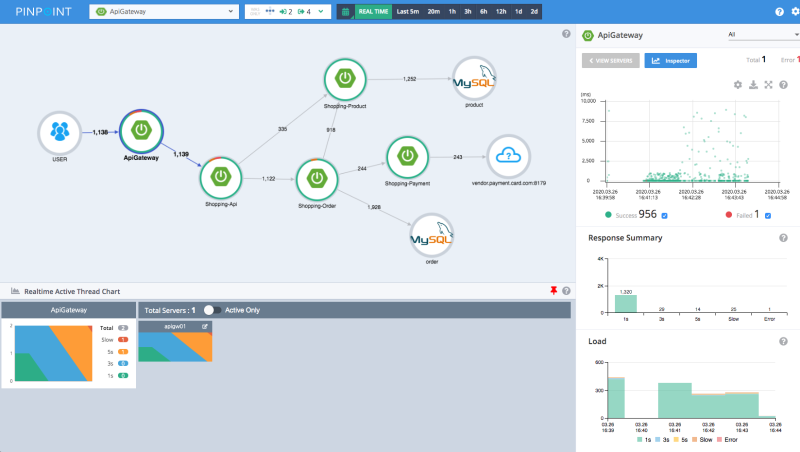
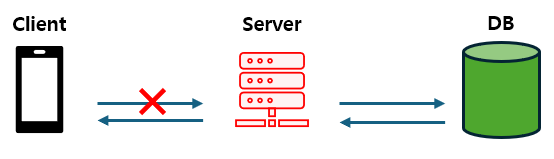

# Chapter. 4 장애대응

학습자료: Weekly Schedule Summary: 이번 챕터의 주간 일정 (https://www.notion.so/Weekly-Schedule-Summary-2662dc3ef51480268d9bf65cd43c14fc?pvs=21) 
챕터: Chapter 4

<aside>
🔄 Summary : 지난 모니터링 챕터 돌아보기

</aside>

- Summary 지난 챕터 돌아보기
    
    `Redis`
    
    - pub/sub 을 통해 MQ 구현 가능
    - publisher 가 채널에 메세지를 게시 → 모든 채널 subscriber 가 메세지를 받아 처리
    - **channel** : 이벤트 저장 x, subscriber 없으면 소실, subscriber 는 여러 channel 구독 가능
    
    `RabbitMQ`
    
    - AMQP 프로토콜의 메세지 큐
    - producer 메세지 전송
        
        → exchange 가 키에 맞게 Queue 에 분배
        
        → consumer 가 Queue 의 메세지 수신
        
    - MQ 서버와 Queue 내용이 생명주기가 같음 → 종료 시 모두 삭제
    
    `Kafka`
    
    - pub-sub 기반의 메세지 발행/구독 시스템
    - 파티션을 여러개 두어서 토픽의 메세지 쓰기 부하를 해소할 수 있음. ( 병렬 처리 )
    - 또한 이 때문에 각 메세지의 처리 순서를 보장하지 못함. ( 고정 key 를 넣어서 동일 파티션에 순서대로 들어가게끔 할 수 있음 )
    - 파티션은 늘린 후에 줄일 수 없음.
    - 이전 메세지를 다시 읽어 올 수 있음. 이 경우, 중복 메세지 처리 등에 대해서도 고민해야함.
    
    ### 실제 현업에서 트랜잭션을 대하는 우리의 자세
    
     대용량 트래픽을 제어하기 위한 3번째 방법, 트랜잭션의 범위를 적절하게 재설계하는 방법 및 전략 등에 대해 알아보았습니다. 결국에 대용량 트래픽을 적절히 제어하기 위해서는 더 많은 요청을 수용할 수 있도록 각 요청에 대한 빠른 처리를 통한 자원 반환 ( API 요청 자원, DB Connection Pool 등 ), 적절한 책임 분리를 통해 예외의 잘못된 전파 등을 방지하는 것이 중요합니다.
    
     더 많은 트래픽을 무리없이 수용할 수 있다는 것은 **각 트래픽을 빠르고 성공적으로 처리할 수 있다**는 전제가 달성되어야 합니다. 이를 위해 우리는 트랜잭션의 범위를 적절히 제어하고, 불필요한 혹은 예측 불가한 오류가 트랜잭션의 전체 실패로까지 이어지는 상황을 최대한 제어할 수 있어야 합니다.
    
    <aside>
    💡 **적절한 트랜잭션 범위란 ?
    (1)** 너무 긴 작업을 수행해 DB Connection 고갈로 이어지지 않아야 함 
    **(2)** 트랜잭션과 연관 없는 작업들에 의해 주요 비즈니스 로직이 영향받지 않아야 함
    
    </aside>
    

<aside>
🎯 **들어가면서, Why 장애대응?**

</aside>

- 장애대응 환경 구축하기
    
    아무리 테스트 코드를 작성하고, 아무리 QA를 진행해도 장애는 피할 수 없다. 
    
    따라서, 가장 중요한 것은 **장애상황에 대한 탐지**이다. 모니터링 시스템 등을 통해 장애 발생을 빠르게 탐지하고, 원인을 분석할 수 있는 환경을 갖추어야 한다.
    
- 장애대응에서 가장 중요한 포인트는!?
    
    핵심은 **빠른 공유 그리고 문제 해결을 통한 장애 시간의 최소화**이다. 개발자는 비즈니스적 가치를 제공하는 사람인데, 장애가 지속되면 고객에게 그 가치를 전달할 수 없다. 문제의 근본적인 원인을 파악하고, 테스트 코드를 추가하고, 재발방지 대책을 세우는 것은, 장애 상황을 해결한 이후에 챙겨도 충분하다. 
    
- 장애대응 프로세스
    
    **1. 예방 가능한 장애를 방지할 것**
    
    **2. 장애가 발생했다면 빠르게 전파하고 해결할 것**
    
    **3. 발생했던 장애는 다시는 발생하지 않도록 할 것**
    
    우리에게 중요한 것은 실패한 근본 원인을 분석하여, 문서로 남기는 것이다. 이를 포스트 모템(postmortem)이라고 한다. 포스트 모템은 쓸모없는 사죄, 변명, 지적이 아닌, 무엇을 배웠는지와 배운 것을 토대로 앞으로 무엇을 바꿀지가 담겨야 한다. 그런 다음 포스트모템을 쉽게 열람할 수 있고, 포스트모템에서 제안한 변화를 팀이 실천하는지 확인해야 한다. 실패를 제대로 기록해두면 다른 이들도 무슨 일이 있었는지 알 수 있고 똑같은 실수를 반복하는 일을 피할 수 있다.
    
    장애발생은 개인의 책임이 아니라 팀 차원의 문제이다. 따라서 …
    
    **Do not Blame(비난하지 마라)**
    
    다음은 당신이 그 주인공일 수 있다.
    

<aside>
⛵ **이번 챕터 목표**

</aside>

- **애플리케이션에서 발생하는 장애를 대응하고 개선합니다.**
- 앞서 고민한 로깅과 Alert 파이프라인을 통해 실제 장애가 발생하기 전에 미리 탐지하고 이를 개선할 수 있도록 고민해봅니다. Error Tolerant 한 애플리케이션 개발 관점을 생각해봅니다.
    - `Testable Code` - 변경에 유연하며 관리포인트의 집중을 통해 테스트 커버리지를 높일 수 있습니다.
    - `Code/Peer Review` - 우리는 모두 사람이기에, 항상 내 코드가 완벽하지 않을 수 있습니다. 동료가 작성한 코드를 함께 고민하고, 더 나은 애플리케이션 개발을 위해 팀 전체가 고민하며 더 좋은 소프트웨어 개발을 향해 나아갑니다.
- 장애가 발생할 수 있는 포인트 들에 대해 고민하고 논의해 봅니다.
- 애플리케이션의 장애 유형과 대응방법을 고민해보고 앞서 개발한 서버를 개선할 방법을 모색해봅니다.

<aside>
🚩 **What to do: 이번 주에 해야 할 것. 이것만 집중하세요!**

</aside>

### 서론 : 현업에서 장애를 감지하기 위해 하는 노력들( 모니터링, 로깅 )

<aside>
💡 현업에서는 다양한 모니터링 툴을 통합하여 사용중입니다.

</aside>

### 모니터링이 필요한 핵심 지표들

- 서버의 요청 관련
    - 서버의 RPS 혹은 TPS, Collecting By API
    - API의 에러 비율
    - API의 처리 시간(Latency)
- 시스템 리소스 관련
    - 메모리 사용량
    - CPU 사용량
- JVM 리소스 관련
    - Heap 메모리 사용량
    - 스레드의 상태에 따른 스레드의 개수
    - Young 영역과 Old 영역의 메모리 사용량
    - GC Pause 횟수와 시간 그리고 CPU 사용량
- DB 관련
    - QPS, Collecting by CRUD
    - 평균적인 트랜잭션 시간
    - 활성/유휴 커넥션 풀의 개수
- 캐시 관련
    - QPS, Collecting by Command
    - Cache Hit Rate
    - 메모리 사용량
    - CPU 사용량

6해당 메트릭들에 대한 모니터링 시스템을 구축하고, 비이상 메트릭 탐지 시에 빠르게 확인 할 수 있는 환경을 구축해야 합니다.

### 이상적인 모니터링 환경 구성

- APM (Application performance monitoring)
    - 애플리케이션이 어떻게 동작하고 있는지 성능을 실시간으로 관찰하고, 문제를 조기에 발견·분석하는 도구
    - 사용자가 요청한 트랜잭션이 애플리케이션 내부에서 어떻게 처리되는지 추적하고, 응답 시간이 얼마나 걸리는지, 어느 구간에서 지연이 발생하는지 확인할 수 있음
    - 상용 버전으로는 Datadog, 오픈소스로는 Pinpoint(네이버)이 주로 활용됨



- 로그 모니터링(Log Monitoring)
    - 로그 모니터링은 애플리케이션, 서버 등에서 발생하는 로그를 수집·저장·검색·분석하여 장애를 탐지하고 원인을 파악하기 위한 시스템
    - 로그는 시스템이 발생시키는 가장 기본적이고 상세한 진단 정보라서, 장애 분석과 보안 이벤트 추적에 필수적임
    - 예를 들어 요청 정보와 응답 정보(에러 코드, 예외 메시지)를 포함하여, 시스템의 로그를 통해 부가적인 정보를 획득하여, 빠르게 원인을 파악하고 수정할 수 있도록 도와줌
    - 상용 버전으로 OpenSearch(AWS가 ElasticSearch를 포크해 만든 오픈소스), 무료 버전으로 ELK 스택 (Elasticsearch + Logstash + Kibana)이 주로 활용됨


- 메트릭 모니터링(Metric Monitoring)
    - 은 시스템이나 애플리케이션이 노출하는 CPU 사용률, 메모리 사용량 등과 같은 메트릭을 모니터링하여 시스템의 건강 상태와 성능을 추적하는 시스템
    - 메트릭은 수치를 기반으로 하며, 시간에 따라 변하는 시계열 데이터(Time-series)라는 특징이 있음 ex) CPU 75%, 에러율 1.2%, 응답시간 120ms
    - 일반적으로 Prometheus(오픈소스 메트릭 수집 및 저장 시스템) + Grafana(오픈소스 메트릭 시각화 도구)로 구성함
    
    
    

제대로 된 모니터링 시스템이 없다면, 빠르게 장애 상황을 탐지하고, 원인을 분석하고, 문제를 해결하기 까다롭다. 중요한 것은 모니터링 환경의 구축을 통한 장애 상황에 대한 탐지, 그리고 빠른 원인 분석을 통한 해결이다.

### STEP 01 부하 테스트

이런 궁금증들을 많이 가지고 계실 것이라 생각합니다. 

**“서버 배포 스펙은 어떤 기준으로 정하는 걸까?”** 

**“이번 기능/이벤트 나갈 때, 이만한 목표치인데 잘 버틸 수 있겠지?”**

 현업에서 기능을 배포하기 전에 우리의 설계 및 프로덕션 환경에서의 동작을 검증하고 적절한 운영 스펙을 유추하기 위해 우리는 부하테스트를 진행하고 문제를 분석, 코드 및 인프라를 개선해 언제든 안정적으로 서비스가 운영될 수 있는 상태로 배포될 수 있도록 노력합니다.

<aside>
⚠️ **부하 테스트의 목적은 최소 이 3가지는 살펴보도록 합니다.**
장애를 유발할 수 있는 테스트 시나리오를 작성, 수행합니다.
미리 서버의 성능에 대해 목표를 정하고 다음과 같은 사항들에 대해 점검해 봅니다.
(1) 예상 **TPS** (Transaction Per Second)
(2) 평균/중간/최대 **응답시간**
(3) 다량의 트래픽 유입 시 동시성 이슈 발생 여부

위 사항들을 점검하고 목표치를 달성하지 못 하거나 기대치에 못 미치는 경우, 원인을 분석하고 성능 개선을 진행합니다.
실제 기능을 배포하기 전에 일어날 수 있는 문제 상황을 테스트로 작성하고, 장애가 발생하지 않도록 미리 방지하기 위해 꼭 필요합니다.

</aside>

- **고가용성 ( High Availability )**
    - 서버나 네트워크 등이 **오랜 기간 동안 지속적으로 정상 운영 가능**하도록 하는 성질
    - **SPOF** ( **S**ingle **P**oint **O**f **F**ailure ) 가 될 수 있는 우리 APP 의 취약점을 미리 찾아보고 해결방안에 대해 고민해보아야 합니다.
    - 99%의 가용성: 100일중에 1일은 장애가 난다, 1년기준: 3.5일
        - 99.9%의 가용성 : 1년기준 4시간
        - 99.999999% ([aws의 SLA](https://aws.amazon.com/ko/legal/service-level-agreements/))
            
            
            
    
    <aside>
    💡 **SPOF**
    시스템 구성 요소 중, 정상 동작하지 않았을 때 전체 시스템 중단으로 이어지는 단일장애지점 요소. 일반적으로 **시스템 이중화 ( 서버, DB 등 )** 혹은 서킷브레이커 도입 등을 통해 달성
    
    하지만 다음과 같은 문제 또한 SPOF 로서 작용할 수 있다.
    
    - 잘못된 비즈니스 로직으로 인한 반복적 API 실패
    - 과도하게 넓은 범위의 트랜잭션과 잘못된 Lock 사용으로 인한 DB 리소스 부족
    
    1. 특정 API 가 오래 걸리거나 계속 실패해 서버 리소스가 부족한 경우
    
    
    
    1. DB 리소스 부족 문제로 인해 DB 서버에 연결이 불가능한 경우
    
    
    
    </aside>
    

### **부하 테스트**


부하 테스트는 진행 시간과 트래픽 양에 따라 약 4가지 포맷으로 분류합니다. 일반적으로는 짧은 시간단위의 **Load Test** 및 폭발적인 트래픽에 대한 내성을 점검할 **Peak Test** 에 우선순위를 가져갑니다.

- **Load Test ( 부하 테스트 )**
    - 시스템이 예상되는 부하를 정상적으로 처리할 수 있는지 평가
    - 특정한 부하를 제한된 시간 동안 제공해 이상이 없는지 파악
    - 목표치를 설정해 적정한 Application 배포 Spec 또한 고려해 볼 수 있음
- **Endurance Test ( 내구성 테스트 )**
    - 시스템이 장기간 동안 안정적으로 운영될 수 있는지 평가
    - 특정한 부하를 장기간 동안 제공했을 때, 발생하는 문제가 있는지 파악
    - 장기적으로 Application 을 운영할 때 발생할 수 있는 숨겨진 문제를 파악해 볼 수 있음 ( feat. Memory Leak, Slow Query 등 )
- **Stress Test ( 스트레스 테스트 )**
    - 시스템이 지속적으로 증가하는 부하를 얼마나 잘 처리할 수 있는지 평가
    - 점진적으로 부하를 증가시켰을 때, 발생하는 문제가 있는지 파악
    - 장기적으로 Application 을 운영하기 위한 Spec 및 확장성과 장기적인 운영 계획을 파악해 볼 수 있음
- **Peak Test ( 최고 부하 테스트 )**
    - 시스템에 일시적으로 많은 부하가 가해졌을 때, 잘 처리하는지 평가
    - 목표치로 설정한 임계 부하를 일순간에 제공했을 때, 정상적으로 처리해내는지 파악
    - 선착순 이벤트 등을 준비하면서 정상적으로 서비스를 제공할 수 있을지 파악해 볼 수 있음

<aside>
💡 **부하 테스트 대상**
우리 서비스에서 제공하는 전체 API를 나열해보고, 각각의 목표 TPS를 대략적으로 작성해봅니다. 목표 TPS를 활용하여 User, Response time 등을 설정해서 시나리오를 만들어봅니다.

****특수한 트래픽을 처리하기 위한 기능, 동시성 이슈를 고려한 기능 등 어떤 유형의 부하가 주어졌을 때, 기능이 예측과 같이 동작하는지 혹은 너무 낮은 성능을 보이고 있지는 않은지 등을 점검합니다.

**우리 시나리오에서는 ?**
공통 - 포인트 충전/사용 기능
이커머스 - 상품 주문 및 결제 ( 재고처리 )
대기열 - 대기열 제어 로직 / 좌석 예약

</aside>

- 아래 사항들을 중심으로 **테스트 시나리오** 를 설계합니다.
    - 예상 **병목지점** ( feat. DeadLock ) 에 대해 고려하고 시나리오를 설계해 봅니다.
    - DB 조회 등 연산이 무거운 API 에 대해 **Slow Query** 를 확인하는 시나리오를 생각해봅니다.

우리는 적절한 범위의 락을 활용해 동시성 제어 처리를 구현해두었고, Slow Query를 개선하도록 인덱스와 캐싱을 적절하게 사용했기에, 성능테스트시에 문제 발생이 있으면 안되겠죠? ㅎㅎ

- 다음 도구를 이용해 위 설계를 기반으로 부하 테스트를 작성하고 실행해봅니다.
    - `k6` - 오픈소스, JS 를 이용해 스크립트를 손쉽게 작성할 수 있는 경량 고성능 툴
    - `JMeter` - Apache 의 성능 테스팅 툴
    - `nGrinder` - 네이버 의 성능 테스팅 툴
    - `Artillery` - 오픈소스, 클라우드 환경의 로드 테스팅 툴
    
    <aside>
    ℹ️ **참고 자료**
    [JMeter 를 이용한 부하 테스트 작성하기](https://creampuffy.tistory.com/209)
    [nGrinder 와 Spring 으로 부하 테스트 시나리오 작성하기](https://leezzangmin.tistory.com/42)
    [Artillery 를 이용한 부하테스트](https://techblog.tabling.co.kr/artillery%EB%A5%BC-%EC%9D%B4%EC%9A%A9%ED%95%9C-%EB%B6%80%ED%95%98-%ED%85%8C%EC%8A%A4%ED%8A%B8-9d1f6bb2c2f5)
    
    </aside>
    

**해당 시나리오를 통한 장애 유발 및 개선에 대한 회고를 진행합니다.**

- 테스트 케이스 시나리오 설계부터 검증까지의 과정을 문서로 작성합니다.
- 휴먼 에러 발견 및 개선 과정을 문서로 작성합니다.
- 애플리케이션 에러 발생 통계 및 개선 과정을 문서로 정리합니다.
- 발생한 문제에 대해 어떤 개선을 통해 문제를 해결했는지 문서로 정리합니다.
    
    

### STEP 02 장애 발생과 대응 시나리오

<aside>
💡 본 과정에서는 APP 레벨의 장애 및 대응에 집중합니다.

</aside>

- **장애**란 특정 상황이 발생해 현재 운영 중인 서버가 정상 작동이 불가능한 상태입니다.
    - `Lack of Resource` - 메모리 누수 및 OOM(Out Of Memory Error)으로 인한 APP 비정상 종료
    - `Unhandled Exception` - 처리되지 않은 Exception 으로 인한 APP Crash
    - `Slow Query, I/O` - 응답 지연으로 이어지는 최적화되지 않은 작업

<aside>
⚠️

장애는 언제나 발생할 수 있으므로 대응 프로세스의 정립이 필요합니다.

</aside>

- **장애 대응 프로세스** ( feat. 현업 )
    - **장애 탐지**
        - 모니터링 시스템에 의해 비정상적인 오류나 트래픽의 탐지
        - 이를 통지 시스템 혹은 발견자에 의해 담당자에게 신속히 전파
    - **장애 분류 및 전파**
        - 담당자에 의해 장애 영향도에 따른 등급을 분류 ( 원활한 소통을 위함 )
        - 장애 등급에 따른 심각도에 따라 관련 채널을 통해 장애를 전파
        - 각 담당자의 대응 작업 산정 및 고객 선제 응대
    - **장애 복구 및 보고**
        - 장애 원인의 파악 및 대응 진행
        - 장애 복구 진행 상황에 대한 신속한 공유 및 업데이트
        - 장애 상황 요약 및 분석, 개선 내용 보고
    - **장애 상황 해소 통지**
        - 장애 복구가 완료되어 장애 상황이 해소되었다면 유관 부서 및 사내에 전파
        - 장애 해소 및 서비스 정상화에 대해 고객에게 공지
    - **장애 회고**
        - 장애 상황 피드백 및 추가 개선점 분석
        
        ```yaml
        장애리뷰 필수 항목
        
        현상
        - 타임라인
        - 영향범위
        - 고객영향도 ( 비즈니스 임팩트 )
        
        조치 내용
        - 장애 원인
        - 해소 타임라인
        - 실제 단기 대응책
        - 후속 대응 계획
        
        분석
        - 5-whys
        
        대응 방안
        액션 아이템
        - short-term
        - mid-term
        - long-term
        ```
        

### 자연재해는 누가 막을 수 있을까?

장애는 자연재해와 같습니다. 아무리 예방해도, 예상치를 뛰어넘으면 문제가 생기죠.


결국 사람은 자연재해를 완벽하게 막을 수 없습니다. 다만 예방에 더 힘을 쓸 수 있습니다.

- p.s. [자연재해 감지기](https://downdetector.com/)

이때 중요한건 `심리적 안전감` 입니다.

로켓 발사는 수없는 실패를 겪습니다. 만약 그럴때마다 실패한 엔지니어를 자른다면? 누가 로켓을 우주로 보낼 수 있을까요? 사람은 실패를 통해 배워요.

실패했을 때 원인을 분석하여 다시 같은 문제가 벌어졌을 때를 대비해야합니다.

문제를 일으킨 코드를 만든 사람을 색출하고, 그에게 책임을 지우면? → 아무도 도전적인 업무를 하지 않습니다. 커뮤니케이션이 완전히 경색됩니다.

이런 조직은 백날 장애대응 훈련을 해도 무용지물입니다.

그러니 여러분이 만약 어디선가 장애 대응을 해야한다면! 프로세스를 점검하기보다 조직내에 심리적인 안정감을 끌어올리는게 가장 중요합니다.

<aside>
🔔

**원활한 프로젝트 진행을 위한 학습 로드맵**

</aside>

### ✅ **10시간 학습 로드맵**

## 🔧 **장애 대응 & 성능 테스트 Phase 로드맵**

### 🧭 **Phase 1. 장애는 왜 대응해야 하는가?**

- **🎯 목표**: 장애 대응의 중요성과 현실적인 관점을 이해한다.
- **🛠 키워드**: 장애 예방, 탐지, 복구, 회고, 조직 문화
- **✅ To-Do**
    - "Why 장애대응?" 문단 정독
    - 실제 장애 사례와 링크된 기업 사례 탐색 및 정리
    - 심리적 안정감이 장애 대응에 왜 중요한지 토의
- **📝 퀴즈**
    - 장애와 오류의 차이?
    - 장애 발생 시 가장 먼저 해야 할 것은?

---

### 🧭 **Phase 2. 모니터링과 로깅의 체계 정립**

- **🎯 목표**: 장애 탐지 체계를 구축하는 요소를 학습하고 적용한다.
- **🛠 키워드**: Datadog, OpenSearch, Slack Alert, Grafana, Health Check
- **✅ To-Do**
    - 회사의 현재 모니터링 도구 정리
    - Slack 알람 구조 및 설정 방식 탐색
    - OpenSearch와 Datadog 차이점 및 도입 고려사항 정리
- **💻 실습**
    - 간단한 API 서버에 Health Check 및 로깅 기능 붙이기
- **📝 자가진단**
    - 우리 시스템에서 가장 먼저 모니터링해야 할 지표는?

---

### 🧭 **Phase 3. 부하 테스트 설계 및 수행**

- **🎯 목표**: 성능 병목을 탐색하고 사전 대응할 수 있는 부하 테스트를 설계한다.
- **🛠 키워드**: Load/Stress/Peak/Endurance Test, TPS, Response Time, Deadlock
- **✅ To-Do**
    - 각 테스트의 개념 및 목적 정리
    - 서비스 내 API별 TPS 설정 및 병목 포인트 예측
    - `k6`, `JMeter`, `nGrinder`, `Artillery` 중 하나를 선택해 테스트 스크립트 작성
- **📝 퀴즈**
    - Stress Test와 Load Test의 차이?
    - TPS가 높으면 무조건 좋은가?

---

### 🧭 **Phase 4. 장애 시나리오 대응 훈련**

- **🎯 목표**: 장애 발생 시 즉각적인 대응 프로세스를 이해하고 문서화한다.
- **🛠 키워드**: 장애 분류, 전파, 복구, 회고, Unhandled Exception, OOM
- **✅ To-Do**
    - 장애 대응 프로세스를 도식화해 보기
    - 장애 시 발생 가능한 상황별 응답 전략 문서화
    - 회고 문서 양식 샘플 정리
- **💻 실습**
    - 테스트 중 실제 장애를 가정해 회고 문서 작성
    - 장애 책임자의 역할을 분담하고 실습하기
- **📝 자가진단**
    - 최근 우리 팀 장애 중 가장 개선 효과가 컸던 사례는?

---

### 🧭 **Phase 5. 심리적 안정감과 조직 문화**

- **🎯 목표**: 장애 대응을 실질적으로 성공시키는 조직 문화를 고민한다.
- **🛠 키워드**: 책임 회피 방지, 팀 신뢰, 도전 장려
- **✅ To-Do**
    - ✅ `Why 장애대응?` 읽고 마인드맵 그리기
    - 조직 내 장애에 대한 심리적 장벽이 존재하는가? 인터뷰 진행
    - 장애 발생 시 책임보다 개선을 중심으로 한 회고 방법 고민
    - 우아한형제들, 카카오 등 조직 문화 사례 분석

### ✅ **3시간 학습 로드맵**

## 🚀 장애 대응 & 성능 테스트

### 🧠 3시간 압축 학습 가이드

---

### ⏱️ Session 1: 장애 대응의 본질과 모니터링 체계 (1시간)

### 🎯 목표

- 장애란 무엇이고, 왜 발생하며, 어떤 방식으로 탐지 및 대응해야 하는가를 개념적으로 이해합니다.

### 🛠 키워드

- 장애 정의, 장애 발생 유형, MTTD/MTTR, 모니터링, 로깅, SPOF, Datadog, OpenSearch, Slack Alert

### ✅ 학습 액션

- ✅ 아래 중 2개 툴 살펴보기:
    - Datadog: APM / 로그 / 알림 기능
    - OpenSearch: 로그 검색
    - Grafana: 시각화
- ✅ 모니터링 지표 체크리스트 만들어 보기
    - 서버 리소스, Latency, Disk, API 응답 오류율, 에러 빈도

### 💡 자가진단 체크

- 우리 서비스에서 가장 먼저 감지되어야 할 장애 시그널은 무엇인가?
- 내 서비스에서 SPOF는 어디에 있는가?

---

### ⏱️ Session 2: 부하 테스트 실습 및 병목 탐색 (1시간)

### 🎯 목표

- 실제 부하 테스트 도구를 사용해 장애 가능성을 사전에 탐색하는 방법을 실습합니다.

### 🛠 키워드

- Load Test, Stress Test, TPS, Response Time, Deadlock, Slow Query, k6

### ✅ 실습 액션

1. 테스트 대상 API 선정 (ex. 포인트 결제, 주문 API)
2. [k6](https://k6.io/) 설치 후 샘플 스크립트 작성
3. TPS 50, 100, 300 목표로 스크립트 수정 및 실행
4. Latency 및 실패율 그래프 분석
5. 결과 분석 후 개선사항 간단 정리

### 💡 실습 결과 점검

- 병목 포인트는 어디에서 발생했는가?
- 예상 TPS와 실제 결과의 차이는 무엇이었나?

---

### ⏱️ Session 3: 장애 대응 프로세스 설계 & 문화적 회고 (1시간)

### 🎯 목표

- 장애가 실제로 발생했을 때 어떤 순서로, 누구와 함께 대응해야 하는지 체계적으로 정리합니다.
- 기술 외적 관점, 심리적 안정감과 회고의 중요성을 함께 고민합니다.

### 🛠 키워드

- 장애 탐지 → 전파 → 분류 → 복구 → 회고
- 책임 전가 vs 문제 해결 중심
- 조직 내 심리적 안정감

### ✅ 실습 액션

- 시나리오 작성: "서비스 포인트 결제 API가 500 에러를 반복적으로 뱉는 상황"
    - 📌 누구에게 알람이 갈까?
    - 📌 어떤 Slack 채널에서 공유되고, 누가 우선 확인?
    - 📌 복구 전 고객에게 공지할 내용은?
- 장애 회고 문서 작성 템플릿 작성
- 아래 링크 중 1개 이상 읽고 짧게 느낀 점 작성
    - [우아한 장애 대응](https://techblog.woowahan.com/4886/)
    - [LINE 장애 대응 문화](https://engineering.linecorp.com/ko/blog/line-platform-server-outage-process-and-dev-culture)

### 💬 토론 주제

- 실수한 사람을 색출하는 문화는 왜 조직에 해로운가?
- 회고를 생산적으로 만드는 방법은?

---

## 📌 요약 체크리스트 (전체 복습용)

| 항목 | 핵심 질문 |
| --- | --- |
| 장애 탐지 | 어떤 지표로 장애를 가장 먼저 감지할 수 있는가? |
| 테스트 설계 | 예상 TPS는 얼마이고, 병목 포인트는 어디인가? |
| 대응 절차 | 장애 발생 시 조직은 어떤 순서로 대응하는가? |
| 조직 문화 | 회고가 안전한 조직에서만 잘 되는 이유는? |

<aside>
🗓️ **Weekly Schedule Summary: 이번 챕터의 주간 일정**

</aside>

### **`STEP 19`**

- 부하 테스트 대상 선정 및 목적, 시나리오 등의 계획을 세우고 이를 문서로 작성
- 적합한 테스트 스크립트를 작성하고 수행

> `NiceToHave` Docker 의 실행 옵션 (cpu, memory) 등을 조정하면서 애플리케이션을 실행하여 성능 테스트를 진행해보면서 적절한 배포 스펙 고려도 한번 진행해보세요!
> 

### **`STEP 20`**

- 위 테스트를 진행하며 획득한 다양한 성능 지표를 분석 및 시스템 내의 병목을 탐색 및 개선해보고 **(가상)** 장애 대응 문서를 작성하고 제출
- 최종 발표 자료 작성 및 제출

- PR 템플릿
    
    ```markdown
    ## :pushpin: PR 제목 규칙
    [STEP0X] 이름 - 선택 시나리오 (e-commerce/concert)
    
    ---
    ### STEP 19 부하 테스트 스크립트 작성 및 진행
    - [] 부하 테스트 대상 선정 및 목적, 시나리오 등의 계획을 세우고 이를 문서로 작성
    - [] 적합한 테스트 스크립트를 작성하고 수행
    
    ### STEP 20 부하 테스트로 인한 문제 개선 및 보고서 작성
    - [] 테스트를 진행하며 획득한 다양한 성능 지표를 분석 및 시스템 내의 병목을 탐색 및 개선함
    - [] 가상의 장애 대응 문서를 작성하고 제출함
    
    ### **간단 회고** (3줄 이내)
    - **잘한 점**: 
    - **어려운 점**: 
    - **다음 시도**:
    ```
    

<aside>
🚥 **과제 평가 기준과 핵심 역량 Summary**

</aside>

### P/F 기준

<aside>
🚩 **과제 : 이번 챕터 과제 평가 기준에 따라 step의 pass/fail을 정합니다.**

</aside>

### 과제 평가 기준

- 부하 테스트 실행 계획 및 성능 파악을 위한 적절한 시나리오를 설계하였는지 여부
- 부하 테스트를 통해 장애 시뮬레이션을 진행, 문제 분석 및 개선까지 진행하고 문서화하였는지 여부
    
    

**[ Step 19 ]**

- 적합한 부하 테스트 및 API 대상을 선정하였는지
- 시나리오 작성 및 실행 계획 수립과 적합한 스크립트를 작성하고 수행하였는지

**[ Step 20 ]**

- 시나리오에 따른 부하 테스트 수행 및 문제 분석을 진행하고 이에 대한 개선안에 대해 연구 및 기능 개선을 진행하였는지
- 기능 개선을 통한 벤치마크 등 분석을 통해 장애 극복안을 적절히 마련하였는지
- 위 진행 사항들을 문서화하여 정립하고 ( 장애 분석 및 대응 문서 ) 회고 하였는지

### 도전항목

## STEP20 장애대응 심화과제 평가 항목

- 보고서 작성 시 목적, 배경, 문제 정의, 테스트 설계, 결과 분석, 후속 조치 등 명확한 흐름 유지 및 구성의 우수성
- 성능 테스트(k6) 시나리오 설정의 적절성 및 사용자 부하(vUser) 관리 전략의 효율성
- 테스트 대상 API 선정 기준 및 현실적이고 구체적인 시나리오 구성 능력
- 성능 테스트 결과 해석 시 p95, p99, TPS 등 핵심 지표와 서버 리소스 메트릭의 적절한 활용 및 분석 능력
- 부하 테스트 진행 시 sleep 등의 인위적 대기 없이 실제 사용 패턴과 유사하게 시나리오를 구성하는 능력
- 장애 대응 시나리오 작성 시 즉시 대응(Short-term), 중기 대응(Mid-term), 장기 대응(Long-term)의 기간 설정 및 현실성 있는 전략 구성
- 장애 발생 시 장애 레벨과 비즈니스 임팩트 분석 및 MTTD, MTTR 등 지표 활용 능력과 적절한 후속 조치 방안 수립
- k6 스크립트 작성 시 랜덤한 사용자 데이터 생성(fixture)을 통한 현실적인 부하 테스트 구현 능력
- 보고서 전반에서 실제 R&D 기반의 심도 있는 분석과 통찰력 제공 여부
- 장애대응 전략 및 부하 테스트 결과에서 인사이트 도출 능력과 명확한 액션 아이템 제시 여부

### 핵심 키워드 및 역량

### ✅ 기본 과제 (STEP 19)

부하 테스트 시나리오 설계 및 성능 진단 실행

### 🎯 과제 목표

예상 트래픽과 병목 구간을 기준으로 부하 테스트 시나리오를 작성하고, 적합한 부하 테스트 도구를 통해 서버의 성능을 진단합니다.

테스트 결과를 기반으로 TPS, 응답시간, 병목 지점 등을 분석합니다.

### 🛠️ 핵심 기술 키워드

- 부하 테스트 / TPS / 응답시간
- k6 / JMeter / Artillery / nGrinder
- Load Test / Stress Test / Peak Test
- SPOF 분석 / 병목 시나리오 설계

### 🧠 핵심 역량

| 역량 | 설명 |
| --- | --- |
| 테스트 시나리오 설계력 | 주요 기능과 예상 병목 지점을 고려한 테스트 설계 |
| 부하 테스트 도구 사용 경험 | k6, Artillery, JMeter 등 도구 활용해 부하 테스트 진행 |
| 시스템 성능 분석력 | 응답시간, 에러율, TPS 등 지표 기반 병목 분석 |
| 고가용성 설계 감각 | 장애 가능성을 예측하고 SPOF를 사전에 분석 |

---

### 🚀 심화 과제 (STEP 20)

장애 발생 시나리오 대응 및 개선 방안 정리

### 🎯 과제 목표

부하 테스트 결과를 바탕으로 실제 장애 발생 상황을 가정하고, 장애 감지 → 분류 → 대응 → 회고에 이르는 일련의 장애 대응 프로세스를 문서화합니다.

로그, 모니터링 지표, 알림 시스템의 역할을 분석하고 장애 회복과 예방 방안을 도출합니다.

### 🛠️ 핵심 기술 키워드

- 장애 유형 분석 (OOM, Unhandled Exception, Slow Query 등)
- Datadog / OpenSearch / Grafana / Slack Alert
- SLO / SLA / MTTR / MTTD
- 애플리케이션 레벨 고가용성 / 장애 대응 프로세스

### 🧠 핵심 역량

| 역량 | 설명 |
| --- | --- |
| 장애 감지 및 대응력 | 성능 지표와 로깅 기반으로 장애를 탐지하고 대응 방안 수립 |
| 장애 대응 문서화 능력 | 장애 발생 경로, 대응 프로세스, 회고 정리를 통한 문서화 |
| 관찰 가능성 설계 역량 | Alert 및 대시보드 구성으로 문제 탐지 가능성을 높이는 설계 |
| 안정성 중심의 사고력 | 장애에 유연한 코드/인프라 구성과 심리적 안정 기반 협업 인식 |

---

### 🧭 요약 정리

| 구분 | STEP 19 | STEP 20 |
| --- | --- | --- |
| 핵심 주제 | 부하 테스트 설계 및 실행 | 장애 발생 시나리오 대응 및 회고 |
| 과제 예시 | 트래픽 폭주 시 대기열 API 테스트 | DB 연결 제한 상황에서 앱 안정성 확보 |
| 핵심 도구 | k6, Artillery, JMeter, nGrinder | Datadog, Slack Alert, Grafana |
| 제출 형태 | 테스트 시나리오 및 로그 정리 문서 | 장애 대응 문서 및 회고 보고서 |